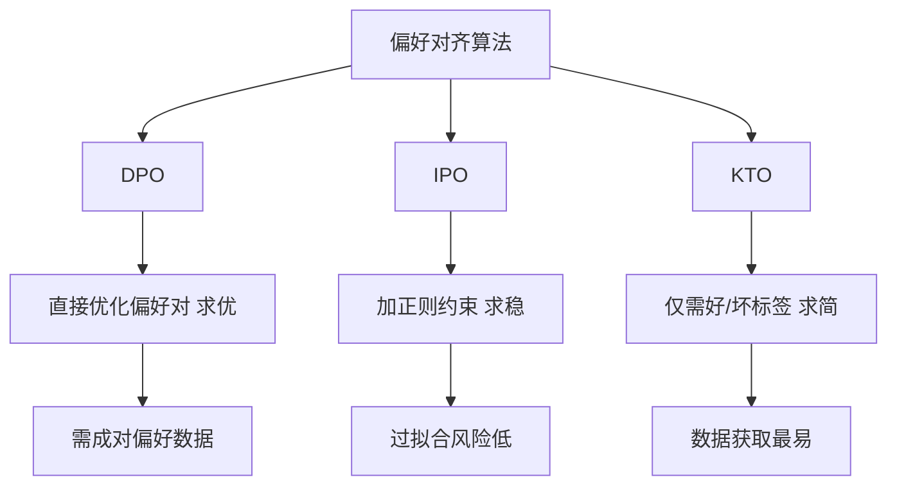

# 对比 DPO、IPO 和 KTO 三种对齐算法的核心思想与适用场景。

DPO（Direct Preference Optimization）直接在偏好数据上优化策略，无需显式建模奖励模型，数学上将 RL 问题转化为分类问题，计算高效，是目前的主流基线。IPO（Identity Preference Optimization）则针对 DPO 可能在非偏好数据上过度优化的问题进行了改进，它在损失函数中增加了一项保持策略与参考模型距离的约束，更关注非偏好对的正确拒绝，通常能获得更好的 Calibration（校准性），即模型对于不确定问题的回答更审慎。KTO（Kahneman-Tversky Optimization）不依赖成对的偏好数据，而是基于前景理论，将输出分为“好”和“坏”两类进行二元分类，并引入损失规避的心理学机制。**适用场景**：DPO 适用于拥有高质量成对数据的标准场景；IPO 适用于需要防止模型过度自信、追求更安全输出的场景；KTO 则适用于只有单轮反馈（如点赞/点踩）或难以构建成对数据的场景。

## 技术原理

三种算法都源于「绕开显式奖励模型（RM）」的共同目标，但采用的数学工具截然不同：

- **DPO 的最大似然重写**：RLHF 的目标是 $\max_\pi \mathbb{E}[r(x,y)] - \beta \text{KL}(\pi \| \pi_{\text{ref}})$。DPO 利用最优策略闭式解 $\pi^*(y|x) \propto \pi_{\text{ref}}(y|x) \exp(r(x,y)/\beta)$，反解出 $r$ 并代入，得到纯分类损失：
  $$\mathcal{L}_{\text{DPO}} = -\log\sigma\left(\beta\log\frac{\pi(y_w|x)}{\pi_{\text{ref}}(y_w|x)} - \beta\log\frac{\pi(y_l|x)}{\pi_{\text{ref}}(y_l|x)}\right)$$
  其中 $y_w, y_l$ 分别是被偏好/被拒绝的回答。无 RM、无 RL，训练像 SFT 一样简单。
- **IPO 的 KL 约束**：DPO 在偏好差距大时会让 $\pi$ 严重偏离 $\pi_{\text{ref}}$。IPO 把 DPO 损失中的 logit 差替换为 $(\cdot)^2$ 约束项：$\mathcal{L}_{\text{IPO}} = (\log\frac{\pi(y_w|x)}{\pi_{\text{ref}}(y_w|x)} - \log\frac{\pi(y_l|x)}{\pi_{\text{ref}}(y_l|x)} - \frac{1}{2\beta})^2$，本质是对「偏好概率差」做回归而非最大化，避免过度自信。
- **KTO 的前景理论**：Kahneman-Tversky 指出人类对损失的敏感度约为收益的 2.25 倍。KTO 直接建模「这个输出是好还是坏」，损失中给「坏」样本加权 $\lambda_w$，给「好」样本加权 $\lambda_l$，并加入 KL 正则：完全不需要成对数据，单条样本即可训练。

## 代码示例

```python
# 三种损失对比（PyTorch 伪代码）
import torch
import torch.nn.functional as F

def dpo_loss(policy_chosen, policy_rejected, ref_chosen, ref_rejected, beta=0.1):
    """成对数据：拉大 chosen 与 rejected 的 logit 差"""
    pi_logratios = policy_chosen - policy_rejected
    ref_logratios = ref_chosen - ref_rejected
    logits = beta * (pi_logratios - ref_logratios)
    return -F.logsigmoid(logits).mean()

def kto_loss(policy_good, policy_bad, ref_good, ref_bad, beta=0.1, lambda_w=1.0, lambda_l=0.5):
    """单点数据：前景理论，损失权重高于收益"""
    # 好样本：尽量提升其似然
    good_logits = beta * (policy_good - ref_good)
    good_loss = -lambda_w * F.logsigmoid(good_logits).mean()
    # 坏样本：额外 KL 惩罚，加权更高
    bad_logits = beta * (policy_bad - ref_bad)
    bad_loss = -lambda_l * F.logsigmoid(-bad_logits).mean()
    return good_loss + bad_loss
```

## 注意事项

- **数据质量决定上限**：DPO 对标注噪声极敏感，单条错标会同时污染 chosen 和 rejected，比 SFT 更脆弱。建议用多人标注取一致子集。
- **DPO 容易「遗忘」**：训练步数过多会导致 $\pi$ 偏离 $\pi_{\text{ref}}$ 太远，通用能力下降。生产中常用早停 + KL 监控（KL > 阈值即停）。
- **KTO 的标签获取**：点赞/点踩数据天然稀疏且偏置（用户只在极端情况打分），需配合采样平衡或伪标签。
- **选型速查**：有高质量成对数据 → DPO；追求安全/校准 → IPO；只有二值反馈 → KTO；三者之上可叠加 RLHF 进一步精修。
- **$\beta$ 的调节是核心超参**：$\beta$ 控制 KL 正则强度，值太小（如 0.01）策略快速偏离参考模型，对齐见效快但通用能力崩坏；值太大（如 1.0）几乎不更新，对齐失败。DPO 常用 0.1，IPO 可放宽到 0.2-0.5。一定要在验证集上观察 reward margin 和通用 benchmark 的折线找拐点。
- **参考模型必须冻结**：DPO/IPO/KTO 都依赖 $\pi_{\text{ref}}$ 计算 log-ratio，参考模型必须冻结并用 SFT 后的 checkpoint，不能和策略一起更新。生产环境常把参考模型部署在单独 GPU 或用动态加载省显存。
- **SimPO/CPO 等无参考变体**：近年出现 SimPO（无需参考模型，用长度归一化的 logit 作为隐式奖励）和 CPO（条件偏好优化）。它们省去 ref forward，训练更快但稳定性和可解释性弱于 DPO，数据量小时慎用。
- **长度偏置的陷阱**：DPO 的 reward 与回答长度正相关，模型会学到「越长越好」的捷径，生成冗长啰嗦的回答。缓解办法：在 loss 中加入长度惩罚项，或构造数据集时让 chosen 和 rejected 长度相近。SimPO 内置了长度归一化，是它优于 DPO 的设计点之一。
- **DPO 数据的多样性**：偏好数据如果集中在某一类任务（如翻译），模型会在该任务过拟合、其他任务退化。应保证数据覆盖代码、数学、创意、安全等多领域，比例尽量均衡。业界经验是至少 10 万对多样化数据才能稳定收敛。

## 流程图



## 核心知识点图


## 记忆要点

- DPO(主流基线)：无需显式RM，RL转分类，适合标准成对偏好数据场景
- IPO(防过拟合)：加约束防过度优化，校准性更好，适合追求模型谨慎与安全的场景
- KTO(单点反馈)：基于前景理论二元分类，无需成对数据，适合仅有点赞点踩场景


## 结构化回答


**30 秒电梯演讲：** 教学生答题：DPO像拿着标准答案强行纠正错题，见效快但容易死记硬背；IPO像要求学生答题时不能偏离课本原意太远，防止学生胡乱发挥，强调稳扎稳打；KTO像老师只给作业打“优”或“良”，不提供详细解析，适合改卷子没时间的场景。

**展开框架：**
1. **DPO** — 直接优化成对偏好数据，无需奖励模型，计算高效。
2. **IPO** — 在DPO基础上增加约束防止过度优化，侧重校准性和安全性。
3. **KTO** — 基于前景理论，仅需单轮好/坏标签，利用损失规避机制，数据门槛低。

**收尾：** 这是我实战中的理解，您想深入哪一段？


## 视频脚本

> 预计时长：2 分钟 | 由浅入深

| 时间 | 画面/字幕 | 口播台词 | 讲解要点 |
|------|----------|----------|----------|
| 0:00 | 标题卡 | "对比 DPO、IPO 和 KTO 三种对齐算法的核心思想与适用场景，30 秒讲清楚。" | 开场钩子 |
| 0:30 | 概念定义动画 | "一句话：DPO求优，IPO求稳，KTO求简。" | 核心定义 |
| 1:00 | DPO(主流基线)图解 | "无需显式RM，RL转分类，适合标准成对偏好数据场景" | DPO(主流基线) |
| 1:30 | 总结卡 | "记好这几条，面试不慌。下期见。" | 收尾 |
