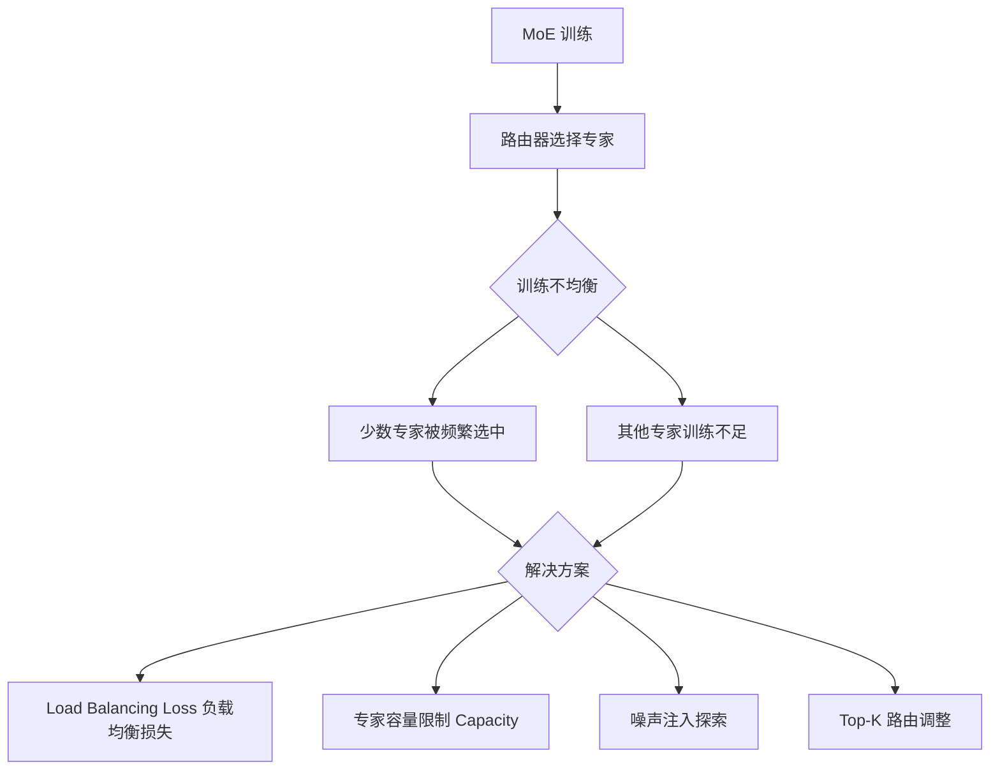

# MoE（混合专家）模型在训练时常见的“训练不均衡”问题是什么？有哪些解决方案？

MoE 模型在训练时，Router（路由器）往往会倾向于频繁选择少数几个表现较好的 Expert，导致其他 Expert 得到训练的机会很少，甚至“退化”。这不仅浪费了计算资源，还会导致模型泛化能力下降。为了解决这个问题，常见方案包括：1. **Auxiliary Loss（辅助损失）**：如 Switch Transformer 提出的方法，在总 Loss 中加入一项，用于均衡不同 Expert 被选中的频率或负载，惩罚路由器的偏见。2. **Expert Capacity Balancing**：限制每个 Expert 处理的 Token 数量上限，超过部分被丢弃或通过辅助路由转发，虽然简单但可能损失精度。3. **噪声注入**：在路由计算中加入高斯噪声，增加路由的随机性，帮助发现被忽略的 Expert。4. **Load Balancing Loss**：类似 GShard 的设计，直接优化各 Expert 负载的方差。

## 技术原理

「训练不均衡」是 MoE 训练的典型病态现象，其根源是路由器与专家的耦合优化形成了正反馈循环：

- **崩溃机制**：初始化时若 Expert $e_a$ 对某类 token 偶发性表现略好，Router 学到的 logits $g_a$ 就会偏高；token 更多流向 $e_a$ → $e_a$ 梯度更新更充分 → 表现更好 → $g_a$ 进一步升高。少数 Expert 被冷落，参数长期不更新，最终退化为「死专家」，有效参数量从 $N$ 缩水到 $k$。
- **辅助损失（Auxiliary Loss）**：Switch Transformer 引入 $\mathcal{L}_{\text{aux}} = \alpha \cdot N \sum_{i=1}^{N} f_i \cdot P_i$，其中 $f_i$ 是 token 实际分配给 Expert $i$ 的比例，$P_i$ 是 Router 给 Expert $i$ 的平均概率。两者都均匀时损失最小，从而把「均匀分配」作为优化目标。
- **Expert Capacity + Token Dropping**：给每个 Expert 设容量上限 $C = \text{tokens} / N \times \text{capacity\_factor}$，超限的 token 被丢弃或走残差。这是工程层面的硬性均流，简单但会损失少量信息。
- **噪声注入（Noisy Top-K Gating）**：路由 logits 加 $\epsilon \cdot \text{Softplus}(\text{Linear}(x))$，让原本不被选中的 Expert 有概率被采样到，从而获得梯度信号，打破正反馈。

## 代码示例

```python
# Switch Transformer 辅助损失（PyTorch 伪代码）
import torch
import torch.nn.functional as F

def switch_load_balancing_loss(router_logits, expert_mask, num_experts):
    """
    router_logits: (tokens, num_experts) 路由器原始输出
    expert_mask:   (tokens, num_experts) one-hot，标记实际被选中的 expert
    """
    # 1. 每个 expert 的平均路由概率 P_i
    router_probs = F.softmax(router_logits, dim=-1)        # (tokens, experts)
    P = router_probs.mean(dim=0)                           # (experts,)
    # 2. 每个 expert 实际接收的 token 比例 f_i
    f = expert_mask.float().mean(dim=0)                    # (experts,)
    # 3. 辅助损失：两者点积，均匀分布时最小
    aux_loss = num_experts * torch.sum(f * P)
    return aux_loss

def noisy_top_k_gating(x, weight, num_experts, k=2, noise_eps=1e-2):
    """带噪声的 Top-K 路由，防止 expert 死亡"""
    clean_logits = x @ weight                              # (tokens, experts)
    if self.training:
        noise = torch.randn_like(clean_logits) * noise_eps
        clean_logits = clean_logits + noise               # 注入高斯噪声
    topk_vals, topk_idx = clean_logits.topk(k, dim=-1)
    return topk_idx, F.softmax(topk_vals, dim=-1)
```

## 注意事项

- **辅助损失权重 $\alpha$ 调参**：$\alpha$ 过小起不到均衡作用，过大反而让 Router 忽略任务本身去追求均匀，损害精度。Switch Transformer 推荐 $\alpha = 0.01$，DeepSeek-V3 等用更精细的 bias 调整机制。
- **Token Dropping 的推理一致性**：训练丢弃 token 但推理不丢弃，会导致 train/eval 分布不一致。常用做法是推理阶段放宽 capacity_factor 或不设限。
- **专家数量与粒度**：专家数过多（如 64+）会加剧冷启动不均衡，需配合更长 warmup 或专家分组（Grouped MoE）。
- **DeepSeekMoE 的精细化方案**：细粒度专家（每个专家更小、数量更多）+ 共享专家（不参与路由，强制处理通用知识），从结构上缓解路由偏见，比单纯加 loss 更有效。

## 流程图



## 记忆要点

- 痛点：因Router偏爱少数好专家，导致其他专家退化且模型泛化变差
- 方案一(辅Loss)：加Auxiliary Loss惩罚路由器偏见，强制均衡专家被选频率
- 方案二(限流)：限制单专家处理Token上限，超限丢弃，但可能损精度
- 方案三(加噪)：路由计算注入高斯噪声，增加随机性以激活被忽略的专家


## 结构化回答


**30 秒电梯演讲：** 就像全班同学总只举手让前几名学霸回答，导致其他同学没机会进步。解决办法是规定每个学生必须回答几次，或者在评分规则里强行惩罚只叫学霸的行为。

**展开框架：**
1. **现象** — Router 偏向少数专家，导致其他专家退化
2. **辅助损失** — 在 Loss 中加入惩罚项，均衡专家被选中的频率
3. **负载均衡** — 限制单个专家处理的 Token 数量上限

**收尾：** 这是我实战中的理解，您想深入哪一段？


## 视频脚本

> 预计时长：2 分钟 | 由浅入深

| 时间 | 画面/字幕 | 口播台词 | 讲解要点 |
|------|----------|----------|----------|
| 0:00 | 标题卡 | "MoE（混合专家）模型在训练时常见的“训练不均衡”问题是什么，30 秒讲清楚。" | 开场钩子 |
| 0:30 | 概念定义动画 | "一句话：路由器偏爱少数专家，通过限制负载或损失函数强制分流。" | 核心定义 |
| 1:00 | 痛点图解 | "因Router偏爱少数好专家，导致其他专家退化且模型泛化变差" | 痛点 |
| 1:30 | 总结卡 | "记好这几条，面试不慌。下期见。" | 收尾 |
