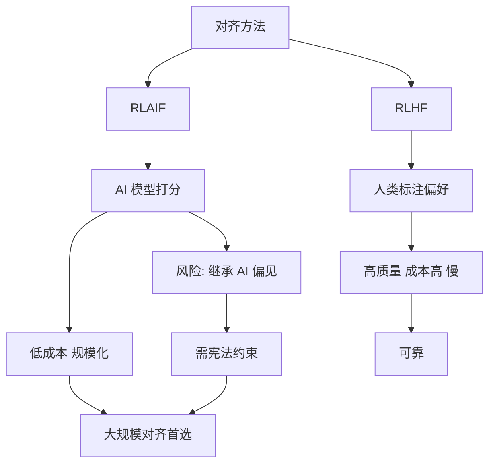

# RLAIF（AI 反馈强化学习）与 RLHF（人类反馈强化学习）在流程上有何区别？RLAIF 的优势与潜在风险是什么？

RLAIF 用一个强大的、经过 Constitutional AI 或其他对齐方法微调的“监督模型”来生成偏好反馈，替代了昂贵的真人标注员。流程上，RLHF 需要人工标注 SFT 模型的输出对比，训练 Reward Model（RM）；而 RLAIF 直接让监督模型对 Prompt 的不同输出进行打分或排序，利用这些分数训练策略。**优势**：数据获取成本低，速度极快，且易于扩展到大规模数据集。**潜在风险**：如果监督模型存在偏见或价值观错误，这些错误会被放大并反馈到策略模型中，形成“回声室”效应。此外，AI 可能难以理解人类细微的偏好差异，导致对齐方向出现偏移。

## 技术原理

RLHF 与 RLAIF 共享同一优化框架（RM + PPO/DPO），区别仅在「偏好数据从哪来」：

- **RLHF 数据流**：Prompt $x$ → SFT 模型生成 $y_1, y_2$ → 人工标注 $y_w \succ y_l$ → 训练 Reward Model $r_\phi(x,y)$ → PPO 优化策略 $\pi_\theta$。瓶颈在于人工标注：成本 $0.5\sim 5$ 美元/条，且标注一致性通常只有 70~80%。
- **RLAIF 数据流**：Prompt $x$ → 候选输出 $y_1, y_2$ → 监督模型 $M$ 用「constitutional principle」打分（如「哪个更无害？哪个更诚实？」） → 输出偏好对 $(y_w, y_l)$ → 后续与 RLHF 完全相同。成本约 $0.001$ 美元/条，且可 7×24 自动跑。
- **Constitutional AI 的核心**：给监督模型一组「宪法原则」（如「不要鼓励自残」「优先给出可验证事实」），让它在评价输出时显式引用原则，相当于把人类价值观编码成可解释的规则集，而非依赖隐式偏好。
- **从 RLAIF 到 DPO**：RLAIF 也可以跳过 RM，直接把 AI 标注的成对数据喂给 DPO，进一步简化流程（Anthropic、Google 的实践路径）。

## 代码示例

```python
# RLAIF 用监督模型生成偏好数据（伪代码）
def rlaif_label(prompt, response_a, response_b, judge_model, principle):
    """
    让监督模型按原则给两个回答排序
    """
    judge_prompt = f"""
你在评价两个 AI 助手的回答。请依据以下原则判断哪个更好：
原则：{principle}
问题：{prompt}
回答A：{response_a}
回答B：{response_b}
请只输出 'A' 或 'B'。
"""
    verdict = judge_model.generate(judge_prompt)  # 例如 GPT-4 / Claude
    winner = response_a if 'A' in verdict else response_b
    loser = response_b if winner == response_a else response_a
    return {"chosen": winner, "rejected": loser}  # 直接喂给 DPO

# 批量生成
preferences = [
    rlaif_label(p, r1, r2, judge, "回答应当无害且诚实")
    for p, r1, r2 in candidate_pool
]
# 然后用 DPO/IPO 训练策略模型
```

## 注意事项

- **回声室效应**：监督模型的偏见会被原样复制到策略模型，再被下一代监督模型学习，形成「偏见放大螺旋」。缓解办法是混合少量人类标注（RLHF + RLAIF 混合训练）做校准锚点。
- **Judge 模型的位置偏置**：让 LLM 比较 A/B 时，它倾向于偏好「第一个」或「最后一个」位置。务必做位置交换（A/B 互换）取一致性子集。
- **原则覆盖度**：Constitution 必须覆盖安全性、有用性、诚实性等多维度，漏掉某个维度（如隐私）会让模型在该维度表现失控。
- **成本-质量曲线**：在小规模（<1万条）RLAIF 不一定比 RLHF 便宜（启动 judge 模型有固定开销），规模化到百万级时成本优势才显著。
- **Judge 模型的尺度门槛**：研究表明 judge 模型至少要 70B 级别（如 GPT-4、Claude 3 Opus）才能稳定区分细微偏好差异。用 13B 以下模型做 judge 一致性低于 65%，等价于引入大量噪声标签，反而损害策略训练。LLM-as-Judge 不是「任意 LLM」都能胜任。
- **生成式 vs 评分式 RLAIF**：两种实现——(1) 生成式：让 judge 模型直接输出 "A" 或 "B"；(2) 评分式：让 judge 输出 1-10 分，按分数排序。生成式快但只给偏好信号，评分式信息量更大但 LLM 的数值校准差（分数分布不均），实践中常结合使用。
- **多 judge 投票降低噪声**：用多个不同厂商/不同提示词的 judge 对同一对样本打分，取多数票。这样能抵消单一 judge 的位置偏置和意识形态偏置。Anthropic 的实践表明 3-5 个 judge 投票可将标注一致性从 73% 提升到 89%。

## 流程图




## 记忆要点

- 流程差异：RLHF靠真人标数据训RM，RLAIF直接用大监督模型给输出打分排序
- 核心优势：用AI替代真人，数据获取成本极低、速度极快、易于海量扩展
- 最大风险：AI偏见易被放大产生“回声室”效应，难懂细微人类偏好导致偏移


## 结构化回答

**30 秒电梯演讲：** 用AI代替人类给模型打分，低成本但可能继承偏见。——打个比方，就像把老师批改作业的活儿交给优等生，省了老师时间，但如果优等生概念错了，大家都会跟着错。

**展开框架：**
1. **流程差异** — RLHF靠真人标数据训RM，RLAIF直接用大监督模型给输出打分排序
2. **核心优势** — 用AI替代真人，数据获取成本极低、速度极快、易于海量扩展
3. **最大风险** — AI偏见易被放大产生“回声室”效应，难懂细微人类偏好导致偏移

**收尾：** 以上三点都能配合实战聊。您想深入聊哪一块？

## 视频脚本

> 预计时长：2 分钟 | 由浅入深

| 时间 | 画面/字幕 | 口播台词 | 讲解要点 |
|------|----------|----------|----------|
| 0:00 | 标题卡 | "RLAIF（AI 反馈强化学习）与 RLHF（人类反馈强化学习）在流程上有何区别，30 秒讲清楚。" | 开场钩子 |
| 0:30 | 概念定义动画 | "一句话：用AI代替人类给模型打分，低成本但可能继承偏见。" | 核心定义 |
| 1:00 | 流程差异图解 | "RLHF靠真人标数据训RM，RLAIF直接用大监督模型给输出打分排序" | 流程差异 |
| 1:30 | 总结卡 | "记好这几条，面试不慌。下期见。" | 收尾 |
