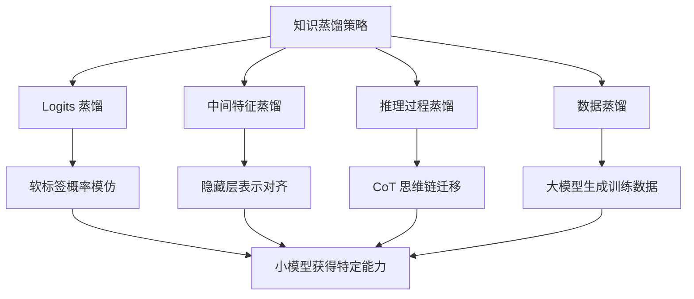

# 大模型知识蒸馏到小模型时，除了 Logits 蒸馏，还有哪些针对特定能力的蒸馏策略？

除了传统的软标签 Logits 蒸馏，针对 LLM 的特点还有以下策略：1. **Chain-of-Thought Distillation**：强迫小模型学习大模型的推理过程（思维链），而不仅仅是最终答案。2. **Feature-based Distillation**：提取大模型中间层的隐藏状态，要求小模型特征层与大模型对齐，迁移结构化知识。3. **Black-box distillation**：在无法获取大模型参数时，利用其 API 生成高质量合成数据进行训练。4. **Task-specific Distillation**：针对数学、代码等特定领域，利用大模型生成的专项数据集进行微调。这些策略能在极小参数量下保留大模型的大部分推理能力。

## 技术原理

不同蒸馏策略的差别在于「迁移什么」以及「能否访问教师内部状态」：

- **Logits 蒸馏（KL 软标签）**：让学生输出分布 $p_s$ 贴近教师 $p_t$，损失 $\mathcal{L} = T^2 \cdot \text{KL}(p_t^T \| p_s^T)$。温度 $T$ 软化分布，让学生学到「教师对错误答案的相对置信度」。但只迁移最终决策，不迁移推理路径。
- **CoT 蒸馏**：让教师对训练题生成 step-by-step 推理（含中间错误与自我纠正），学生用 SFT 学这些推理轨迹。本质是把「隐式推理能力」转成「显式 token 序列」让学生模仿，对小模型涌现推理能力至关重要（如 Orca、WizardMath 的做法）。
- **Feature 蒸馏**：对齐教师和学生中间层隐藏状态 $h_t^{(l)} \leftrightarrow h_s^{(l)}$，常用 MSE 或余弦相似度。因为小模型层数少，需要做层映射（如教师第 $2l$ 层对应学生第 $l$ 层）。迁移的是「表示空间结构」，对结构化任务（如句法、语义）收益大。
- **黑盒/API 蒸馏**：教师是闭源 API（如 GPT-4），无法拿 logits 和 hidden states。只能让教师生成大量高质量 (prompt, response) 数据，学生做 SFT。Evol-Instruct、Self-Instruct 都属此类——把教师的「输出分布」采样成数据集。

## 代码示例

```python
# 四种蒸馏损失（PyTorch 伪代码）
import torch
import torch.nn.functional as F

def logits_distill(student_logits, teacher_logits, temperature=2.0):
    """1. 经典软标签蒸馏"""
    p_t = F.log_softmax(teacher_logits / temperature, dim=-1)
    p_s = F.log_softmax(student_logits / temperature, dim=-1)
    return temperature ** 2 * F.kl_div(p_s, p_t.exp(), reduction="batchmean")

def feature_distill(student_hidden, teacher_hidden, layer_map):
    """2. 中间层隐藏状态对齐，layer_map[i] = 教师第 i 层对应学生的层"""
    loss = 0.0
    for s_layer, t_layer in layer_map.items():
        # 用线性投影对齐维度（小模型 hidden_size 可能更小）
        proj = F.normalize(student_hidden[s_layer], dim=-1)
        target = F.normalize(teacher_hidden[t_layer], dim=-1)
        loss = loss + (proj - target).pow(2).mean()
    return loss

# 3. CoT 蒸馏：让教师生成带推理的轨迹，学生做标准 SFT
#     teacher.generate(prompt, cot=True)  →  {"prompt":..., "reasoning":"...", "answer":"..."}
#     student.fine_tune(data)  # 普通交叉熵，关键是数据里包含推理过程

# 4. 黑盒蒸馏：调用 API 批量合成数据
#     responses = [openai.ChatCompletion.create(prompt=p, model="gpt-4") for p in seed_prompts]
#     student.fine_tune(responses)
```

## 注意事项

- **CoT 蒸馏的分布漂移**：学生推理时若 prompt 分布与训练时不一致，会生成错误推理链。需在合成数据时做分布扩增（多风格、多长度 prompt）。
- **Feature 蒸馏的层映射**：盲目一对一映射会让小模型过拟合教师某一层的特征。建议从教师多层采样（如随机层匹配），让学生学到更鲁棒的表示。
- **黑盒蒸馏的合规风险**：调用闭源 API 生成训练数据可能违反服务条款（如 OpenAI 禁止用其输出训练竞品模型），商用前需核查 ToS。
- **复合策略效果最佳**：实际项目常组合 Logits + CoT + 任务专项数据（如 MiniGPT、Alpaca），单一策略难以兼顾推理能力与领域精度。

## 流程图




## 记忆要点

- 四大蒸馏策略：CoT（学推理过程）、Feature（隐藏层对齐）、黑盒（API合成数据）、特定任务（专项数据微调）。
- Logits只学最终答案的软标签，而CoT蒸馏强迫小模型学习大模型的「中间推理过程」。
- Feature蒸馏对齐「中间层隐藏状态」，黑盒蒸馏仅依赖API输出生成「合成数据」进行训练。


## 结构化回答

**30 秒电梯演讲：** 不只抄答案，而是学过程、学特征、用API生成数据教小模型。——打个比方，像教徒弟，不仅要给他标准答案，还要把解题思路（思维链）、思维习惯（特征对齐）教给他，或者请名师（API）写好教材让他自学。

**展开框架：**
1. **四大蒸馏策略** — CoT（学推理过程）、Feature（隐藏层对齐）、黑盒（API合成数据）、特定任务（专项数据微调）。
2. **Logits只学** — Logits只学最终答案的软标签，而CoT蒸馏强迫小模型学习大模型的「中间推理过程」。
3. **Feature蒸** — Feature蒸馏对齐「中间层隐藏状态」，黑盒蒸馏仅依赖API输出生成「合成数据」进行训练。

**收尾：** 以上三点都能配合实战聊。您想深入聊哪一块？

## 视频脚本

> 预计时长：2 分钟 | 由浅入深

| 时间 | 画面/字幕 | 口播台词 | 讲解要点 |
|------|----------|----------|----------|
| 0:00 | 标题卡 | "大模型知识蒸馏到小模型时，除了 Logits 蒸馏，30 秒讲清楚。" | 开场钩子 |
| 0:30 | 概念定义动画 | "一句话：不只抄答案，而是学过程、学特征、用API生成数据教小模型。" | 核心定义 |
| 1:00 | 四大蒸馏策略图解 | "CoT（学推理过程）、Feature（隐藏层对齐）、黑盒（API合成数据）、特定任务（专项数据微调）。" | 四大蒸馏策略 |
| 1:30 | 总结卡 | "记好这几条，面试不慌。下期见。" | 收尾 |
