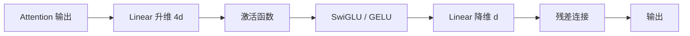

# Transformer前馈神经网络用什么激活函数

Transformer中的前馈神经网络（FFN）通常使用ReLU或GELU激活函数。

**1. 原始Transformer：ReLU**
原始论文使用了ReLU（Rectified Linear Unit），公式为 $\max(0, x)$。它计算简单，能缓解梯度消失，非常适合深层网络的非线性变换。

**2. 现代变体（如BERT）：GELU**
后续模型常采用GELU（Gaussian Error Linear Unit）。它在零点附近平滑过渡，期望性能更好，公式为 $x \cdot \Phi(x)$（其中 $\Phi$ 是标准正态分布的累积分布函数）。

### 实战案例
在训练深层BERT模型时，若使用ReLU激活函数，模型在经历较大梯度更新时容易出现“死神经元”现象（即神经元输出恒为0且无法恢复），导致模型容量下降。切换至GELU后，由于其非零概率的平滑特性，死神经元问题显著减少，模型收敛速度和最终精度均有提升。

### 代码示例 (GELU 实现)
```python
import torch
import torch.nn.functional as F

def gelu(x):
    # PyTorch 自带的高精度 GELU 实现
    return F.gelu(x)

def gelu_manual(x):
    # Tanh 近似实现 (常用于推理加速，精度略有损失但速度快)
    return 0.5 * x * (1.0 + torch.tanh(math.sqrt(2 / math.pi) * (x + 0.044715 * torch.pow(x, 3))))

# FFN 层示例
class FeedForward(nn.Module):
    def __init__(self, d_model, d_ff, dropout):
        super().__init__()
        self.linear1 = nn.Linear(d_model, d_ff)
        self.activation = nn.GELU() # 关键点：使用GELU
        self.linear2 = nn.Linear(d_ff, d_model)
```

### 对比表格：Transformer 激活函数选型
| 激活函数 | 数学特征 | 计算复杂度 | 表现特性 | 适用模型 |
| :--- | :--- | :--- | :--- | :--- |
| **ReLU** | 硬阈值，非零处导数为1 | 低 (仅比较和乘法) | 易导致死神经元，稀疏性强 | 原始 Transformer, ViT |
| **GELU** | 平滑单调，期望门控 | 中 (包含Tanh/Exp计算) | 梯度平滑，泛化能力强 | BERT, GPT-3, LLaMA |
| **SwiGLU** | 门控线性单元 (Swish变体) | 高 (多一次线性变换) | 性能SOTA，参数量增加33% | LLaMA 2/3, PaLM |
| **GeGLU** | GLU与GELU结合 | 高 | 适合超大规模模型训练 | T5, mT5 |

## 常见考点
- **SwiGLU vs GELU**：现代LLM（如LLaMA）多采用SwiGLU，虽然增加了参数量（因为将FFN拆分为门控和值两部分），但通常能带来更好的收敛效果和更低的Loss。
- **数值稳定性**：在混合精度训练（FP16）下，Exp类激活函数容易出现上溢，GELU的Tanh近似实现通常比标准正态CDF计算更稳定。

## 流程图



## 核心知识点图


## 记忆要点

- 三大激活函数演变：原始Transformer用ReLU，现代主流（BERT/GPT）用GELU，最新LLM（LLaMA）用SwiGLU。
- ReLU易致死神经元，而GELU在零点平滑过渡，泛化能力更强。
- 现代LLM多采用SwiGLU：虽增加参数量，但收敛更好、Loss更低，是当前SOTA。


## 结构化回答

**30 秒电梯演讲：** 通过引入非线性，增强模型捕捉复杂特征的能力。——打个比方，像给大脑增加突触的“开关”灵活性，ReLU是硬开关，GELU是软开关。

**展开框架：**
1. **三大激活函数演变** — 原始Transformer用ReLU，现代主流（BERT/GPT）用GELU，最新LLM（LLaMA）用SwiGLU。
2. **ReLU易致死神** — ReLU易致死神经元，而GELU在零点平滑过渡，泛化能力更强。
3. **现代LLM多采用** — 现代LLM多采用SwiGLU：虽增加参数量，但收敛更好、Loss更低，是当前SOTA。

**收尾：** 以上三点都能配合实战聊。您想深入聊哪一块？

## 视频脚本

> 预计时长：4 分钟 | 由浅入深

| 时间 | 画面/字幕 | 口播台词 | 讲解要点 |
|------|----------|----------|----------|
| 0:00 | 标题卡 | "Transformer前馈神经网络用什么激活函数，30 秒讲清楚。" | 开场钩子 |
| 0:40 | 概念定义动画 | "一句话：通过引入非线性，增强模型捕捉复杂特征的能力。" | 核心定义 |
| 1:20 | 三大激活函数演变图解 | "原始Transformer用ReLU，现代主流（BERT/GPT）用GELU，最新LLM（LLaMA）用SwiGLU。" | 三大激活函数演变 |
| 2:00 | 要点图解 | "ReLU易致死神经元，而GELU在零点平滑过渡，泛化能力更强。" | 要点 |
| 2:40 | 要点图解 | "现代LLM多采用SwiGLU：虽增加参数量，但收敛更好、Loss更低，是当前SOTA。" | 要点 |
| 3:20 | 总结卡 | "记好这几条，面试不慌。下期见。" | 收尾 |
