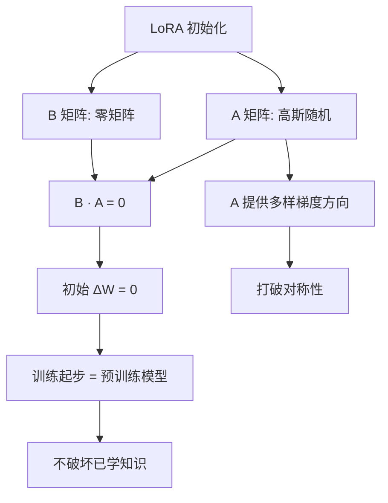

# LoRA是怎样进行初始化矩阵的

LoRA通过低秩分解进行高效微调，其初始化策略至关重要：

1. **A矩阵**：使用随机高斯分布初始化，提供模型更新所需的随机性和方向。
2. **B矩阵**：初始化为零矩阵。

**原理**：初始时 $\Delta W = A \times B = 0$，确保微调开始时模型行为与预训练模型完全一致，避免初始阶段对模型造成剧烈扰动，保证训练的稳定性。

### 实战案例
在微调Llama 3-8B处理垂直领域问答时，若A矩阵初始化方差过大，会导致训练初期Loss剧烈震荡且收敛缓慢；标准高斯初始化配合B=0能确保平滑接入原模型能力，通常前100步Loss几乎不变，随后才逐渐下降。

### 代码示例
```python
import torch
import torch.nn as nn

class LoRALayer(nn.Module):
    def __init__(self, in_features, out_features, rank=8):
        super().__init__()
        # A: 随机高斯初始化
        self.lora_A = nn.Parameter(torch.randn(in_features, rank))
        # B: 零初始化，确保初始扰动为0
        self.lora_B = nn.Parameter(torch.zeros(rank, out_features))
        self.scaling = 1.0 / rank

    def forward(self, x):
        # 初始阶段 lora_B @ x 恒为0，不影响原始权重
        return (x @ self.lora_A @ self.lora_B) * self.scaling
```

## 技术原理

为什么是「A 随机 + B 置零」而不是反过来？这背后有严谨的梯度流分析：

- **零扰动的必要性**：微调的起点是「预训练模型已经是一个好的解」。如果初始 $\Delta W \neq 0$，相当于在第一步就给模型注入随机噪声，破坏已学好的表示，导致 Loss 突然跳升、训练发散。让 $\Delta W = A \times B = 0$ 是保证「训练第 0 步模型输出 == 预训练模型输出」的唯一方法。
- **为何选 B 置零而非 A**：理论上 A=0 或 B=0 都能让 $\Delta W = 0$。但梯度更新时 $\nabla_A L = B^T \nabla_{\Delta W} L$，$\nabla_B L = (\nabla_{\Delta W} L)^T A$。如果 A=0、B 随机，则 $\nabla_B L = 0$（B 永远不更新，训练失败）。反之 B=0、A 随机，$\nabla_A L = 0$ 但 $\nabla_B L \neq 0$（B 能正常更新，A 在第一步后也获得梯度）。所以「A 随机 + B 置零」是唯一可行的单向配置。
- **A 的高斯初始化方差**：原论文用 $\mathcal{N}(0, \sigma^2)$，$\sigma$ 通常设为 $1/\sqrt{r}$ 或 $1/r$。方差过大会让 $A$ 的奇异值过大，B 一旦获得梯度，$\Delta W$ 的尺度立刻失控；过小则更新信号太弱，收敛慢。
- **与缩放因子 $\alpha/r$ 的协同**：B 置零保证初始无扰动，$\alpha/r$ 保证训练过程中更新幅度可控。两者共同构成 LoRA 训练稳定性的「双保险」。

## 注意事项

- **A 的初始化方式影响收敛速度**：除了高斯，Kaiming 初始化（针对 ReLU 网络）或正交初始化在某些场景收敛更快。如果训练初期 Loss 长时间不下降，可尝试调整 A 的初始化方差。
- **不要同时置零 A 和 B**：两者都为零会导致梯度恒为零（$\nabla_A \propto B, \nabla_B \propto A$），训练永远不开始。这是初学者常犯的错误。
- **QLoRA 的特殊处理**：QLoRA 中基座权重量化为 4-bit，但 LoRA 的 A/B 仍用高精度（BF16）训练。B 置零的逻辑不变，但要确保量化误差不会通过 A 的高斯初始化被放大。
- **多 LoRA 适配器的初始化**：同时挂载多个 LoRA 时，每个适配器独立初始化（各自的 B=0），互不干扰。叠加时初始扰动仍为零。
- **LoRA+ 的非对称学习率**：2024 年的 LoRA+ 研究发现 A 和 B 的有效学习率应不同——B 的更新幅度应比 A 大 10-100 倍。因为 B 直接乘到 A 的输出上，梯度路径短，需要更大学习率才能跟上 A 的更新节奏。实践中给 B 单独设 10x 学习率能提升收敛质量。
- **PiSSA 等主成分初始化**：传统 LoRA 用随机高斯初始化 A，PiSSA 改用预训练权重 $W$ 的奇异值分解主成分初始化 A 和 B。初始扰动虽非零（偏离 B=0），但把学习预算集中在重要方向，少量 step 即可超越传统 LoRA，但冷启动需更仔细的 warmup。
- **DoRA 的解耦**：DoRA 把权重分解为「方向」和「幅度」，LoRA 只更新方向分量，幅度用单独标量。这种解耦让初始化更灵活（B=0 仍保证零扰动），且收敛后表达力接近全量微调，是 LoRA 家族中效果最好的变体之一。
- **LoRA 应用于哪些模块**：原论文只在 $W_q, W_v$ 上加 LoRA（节省显存），后续研究发现扩展到 $W_q, W_k, W_v, W_o$ 全部投影 + MLP 的 $W_{\text{gate}}, W_{\text{up}}, W_{\text{down}}$ 效果更好但显存翻几倍。初始化逻辑不变（每个旁路都 A 高斯、B 零），但要权衡「哪些层加 LoRA」和「rank 多大」的组合成本。

## 流程图




## 记忆要点

- 核心口诀：A矩阵用高斯随机，B矩阵全初始化为0。
- 原因：因为初始时 B=0 使得 ΔW=A×B=0，所以微调初始无扰动，保证训练稳定性。
- 若A初始化方差过大，会导致模型接入不平滑，引发训练初期Loss剧烈震荡且收敛极慢。


## 结构化回答

**30 秒电梯演讲：** 初始权重更新置零，让模型从预训练状态平稳过渡。——打个比方，就像给汽车装改装件，先确保零件松动度为零，避免一启动就失控。

**展开框架：**
1. **核心口诀** — A矩阵用高斯随机，B矩阵全初始化为0。
2. **原因** — 因为初始时 B=0 使得 ΔW=A×B=0，所以微调初始无扰动，保证训练稳定性。
3. **若A初始化方差过** — 若A初始化方差过大，会导致模型接入不平滑，引发训练初期Loss剧烈震荡且收敛极慢。

**收尾：** 以上三点都能配合实战聊。您想深入聊哪一块？

## 视频脚本

> 预计时长：4 分钟 | 由浅入深

| 时间 | 画面/字幕 | 口播台词 | 讲解要点 |
|------|----------|----------|----------|
| 0:00 | 标题卡 | "LoRA是怎样进行初始化矩阵的，30 秒讲清楚。" | 开场钩子 |
| 0:40 | 概念定义动画 | "一句话：初始权重更新置零，让模型从预训练状态平稳过渡。" | 核心定义 |
| 1:20 | 核心口诀图解 | "A矩阵用高斯随机，B矩阵全初始化为0。" | 核心口诀 |
| 2:00 | 原因图解 | "因为初始时 B=0 使得 ΔW=A×B=0，所以微调初始无扰动，保证训练稳定性。" | 原因 |
| 2:40 | 要点图解 | "若A初始化方差过大，会导致模型接入不平滑，引发训练初期Loss剧烈震荡且收敛极慢。" | 要点 |
| 3:20 | 总结卡 | "记好这几条，面试不慌。下期见。" | 收尾 |
