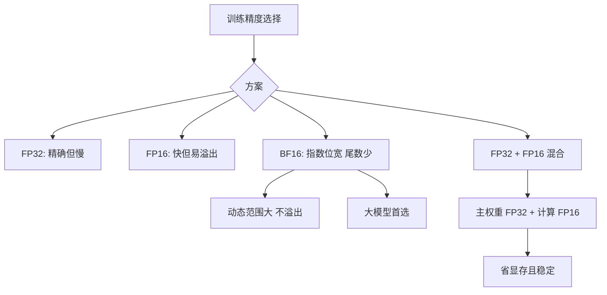

# 训练时用float16、bfloat16还是float32

训练大模型时通常优先选择 **bfloat16 (BF16)** 或 **混合精度训练**，而非纯 float32 或 float16。

**1. Float32 (FP32)**
- **优点**：精度高（23位尾数），数值最稳定。
- **缺点**：显存占用大，计算慢。
- **应用**：一般用于权重备份或极度敏感的计算。

**2. Float16 (FP16)**
- **优点**：显存减半，计算快（支持Tensor Core）。
- **缺点**：数值范围窄（5位指数），容易溢出或下溢。

**3. Bfloat16 (BF16)**
- **特点**：截断FP32的尾数，保留8位指数。
- **优点**：拥有FP32的数值范围，不易溢出；同时具备FP16的速度和内存优势。
- **应用**：大模型训练的首选（特别是TPU或较新的NVIDIA GPU）。

### 实战案例
在使用PyTorch微调ChatGLM-6B时，若仅开启FP16，Loss在训练中会频繁变为NaN；而切换到BF16（需显卡支持Ampere架构及以上）后，无需复杂的Loss Scaler即可稳定收敛，显著减少了调试超参的时间。

### 对比表格

| 特性 | Float32 (FP32) | Float16 (FP16) | Bfloat16 (BF16) |
| :--- | :--- | :--- | :--- |
| **位宽** | 32 bit | 16 bit | 16 bit |
| **指数位** | 8 bits | 5 bits | 8 bits (同FP32) |
| **尾数位** | 23 bits | 10 bits | 7 bits |
| **数值范围** | $\approx 3.4 \times 10^{38}$ | $\approx 6.5 \times 10^{4}$ | $\approx 3.4 \times 10^{38}$ |
| **精度** | 高 | 中 | 低 (但训练够用) |
| **溢出风险** | 极低 | **高** (需Loss Scaling) | 低 |
| **显存占用** | 100% | 50% | 50% |
| **推荐场景** | 梯度累加Master Weights | 推理/老显卡训练 | 现代大模型训练/推理 |

### 代码示例
```python
import torch

# 设置使用 bfloat16 进行混合精度训练
# 这种方式在现代GPU (A100, RTX 3090/4090) 上效果最佳
model = AutoModelForCausalLM.from_pretrained("...", torch_dtype=torch.bfloat16)

# 若必须使用FP16，需配合 GradScaler
scaler = torch.cuda.amp.GradScaler()
with torch.cuda.amp.autocast(enabled=True, dtype=torch.float16):
    outputs = model(input_ids)
    loss = criterion(outputs, labels)
scaler.scale(loss).backward()
```

## 流程图



## 核心知识点图


## 记忆要点

- 选型结论：大模型训练首选 BF16，推理或老显卡多用 FP16，FP32仅用于权重备份等敏感计算。
- BF16截尾保指数：拥有和FP32一样的8位指数，所以不易溢出，通常无需Loss Scaler。
- FP16易溢出：因指数位仅5位，数值范围极窄，训练时极易出现梯度下溢和NaN。


## 结构化回答

**30 秒电梯演讲：** 在数值范围和计算效率之间权衡，BF16是大模型的最佳平衡点。——打个比方，FP32是全精度尺子，FP16是短尺子（量程小），BF16是截断的尺子（量程大但刻度少）。

**展开框架：**
1. **选型结论** — 大模型训练首选 BF16，推理或老显卡多用 FP16，FP32仅用于权重备份等敏感计算。
2. **BF16截尾保指** — BF16截尾保指数：拥有和FP32一样的8位指数，所以不易溢出，通常无需Loss Scaler。
3. **FP16易溢出** — 因指数位仅5位，数值范围极窄，训练时极易出现梯度下溢和NaN。

**收尾：** 以上三点都能配合实战聊。您想深入聊哪一块？

## 视频脚本

> 预计时长：3 分钟 | 由浅入深

| 时间 | 画面/字幕 | 口播台词 | 讲解要点 |
|------|----------|----------|----------|
| 0:00 | 标题卡 | "训练时用float16、bfloat16还是float32，30 秒讲清楚。" | 开场钩子 |
| 0:36 | 概念定义动画 | "一句话：在数值范围和计算效率之间权衡，BF16是大模型的最佳平衡点。" | 核心定义 |
| 1:12 | 选型结论图解 | "大模型训练首选 BF16，推理或老显卡多用 FP16，FP32仅用于权重备份等敏感计算。" | 选型结论 |
| 1:48 | BF16截尾保指数图解 | "拥有和FP32一样的8位指数，所以不易溢出，通常无需Loss Scaler。" | BF16截尾保指数 |
| 2:24 | 总结卡 | "记好这几条，面试不慌。下期见。" | 收尾 |
