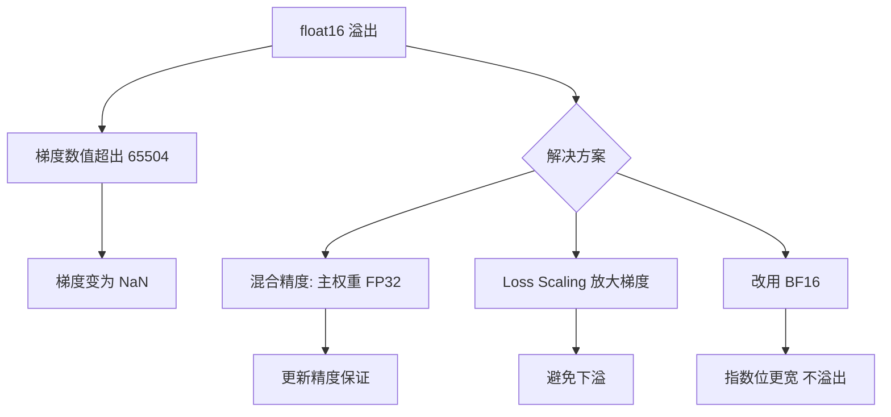
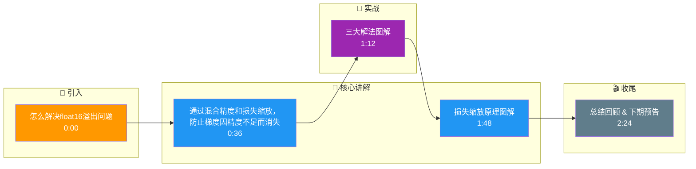

# 怎么解决float16溢出问题

解决 float16 训练溢出问题主要有以下几种方法：

**1. 混合精度训练**
- **方法**：前向传播和反向传播使用 FP16，但权重更新和梯度累加使用 FP32（Master Weights）。
- **作用**：利用 FP16 的速度优势，同时利用 FP32 的精度保持数值稳定。

**2. 损失缩放**
- **原理**：在计算反向传播前，将 Loss 乘以一个较大的系数（如 $2^{16}$），将梯度放大到 FP16 的有效范围内；在更新权重前再缩小回去。
- **作用**：防止梯度值小于 FP16 的最小分辨率而导致下溢为 0。

**3. 使用 bfloat16 代替 float16**
- **原理**：bfloat16 的数据范围与 FP32 相同（8位指数），不容易溢出，通常无需损失缩放。

### 实战案例
在训练ResNet-50进行图像分类时，若不开启Loss Scaling，梯度会在倒数第一层卷积处下溢为0导致权重不更新；开启PyTorch的`torch.cuda.amp.GradScaler`后，训练自动恢复，吞吐量提升约2倍。

### 代码示例
```python
from torch.cuda.amp import autocast, GradScaler

scaler = GradScaler()  # 初始化梯度缩放器
optimizer = torch.optim.Adam(model.parameters(), lr=1e-3)

for data, target in dataloader:
    optimizer.zero_grad()
    
    with autocast():  # 自动混合精度上下文
        output = model(data)
        loss = F.nll_loss(output, target)
    
    # 1. Scale Loss: 放大Loss防止梯度下溢
    # 2. Backward: 计算缩放后的梯度
    scaler.scale(loss).backward()
    
    # 3. Unscale: 梯度还原回FP32范围
    # 4. Step: 更新权重，若梯度无穷大则跳过
    scaler.step(optimizer)
    scaler.update()  # 动态调整缩放因子
```

## 技术原理

**混合精度：FP16 计算，FP32 存储权重**
混合精度训练（Mixed Precision）的核心是"分工"：前向传播和反向传播用 FP16（快、省显存），但权重的主副本（Master Weights）和梯度累加用 FP32（精度高）。因为 FP16 的有效位只有 10 位（1 位符号 + 5 位指数 + 10 位尾数），微小的权重更新（如 0.0001）加上去后会被舍入消失（rounding to zero），所以必须用 FP32 存储权重并在更新时转回 FP16。

**损失缩放：放大梯度防止下溢为 0**
FP16 能表示的最小正数约为 6e-8，小于这个值的梯度会下溢为 0，导致对应权重永不更新。损失缩放（Loss Scaling）的解法：反向传播前把 Loss 乘以一个大的缩放因子 S（如 2^16），梯度随之放大 S 倍落入 FP16 有效范围；权重更新前再把梯度除以 S 还原。这样既保留了微小梯度信息，又不影响最终更新方向。

**换用 BF16：直接扩大数值范围，从根本上减少溢出**
bfloat16（BF16）与 FP16 的位数相同（16 位），但重新分配了位数：1 位符号 + 8 位指数 + 7 位尾数。8 位指数意味着 BF16 的数值范围与 FP32 相同（最大约 3e38），从根本上避免了溢出问题，通常无需损失缩放。代价是尾数只有 7 位（精度略低于 FP16 的 10 位），但对深度学习训练足够。A100/H100 等 Ampere+ 架构原生支持 BF16，是当前推荐方案。

## 代码示例

```python
# PyTorch 自动混合精度（AMP）：autocast + GradScaler 配合使用
from torch.cuda.amp import autocast, GradScaler

scaler = GradScaler()   # 动态调整缩放因子
optimizer = torch.optim.Adam(model.parameters(), lr=1e-3)

for data, target in dataloader:
    optimizer.zero_grad()

    with autocast():              # 自动混合精度上下文
        output = model(data)      # 前向用 FP16
        loss = F.nll_loss(output, target)

    scaler.scale(loss).backward() # 1. 放大 Loss 反向传播，防梯度下溢
    scaler.step(optimizer)        # 2. 还原梯度并更新；若梯度无穷大则跳过
    scaler.update()               # 3. 动态调整缩放因子（溢出则减半）
```

```python
# 直接使用 BF16（推荐，A100+ 显卡）：无需损失缩放
model = model.to(torch.bfloat16)
optimizer = torch.optim.AdamW(model.parameters(), lr=1e-4)

for data, target in dataloader:
    optimizer.zero_grad()
    with autocast(dtype=torch.bfloat16):   # BF16 数值范围大，不溢出
        output = model(data)
        loss = F.cross_entropy(output, target)
    loss.backward()                        # 无需 GradScaler
    optimizer.step()
```

## 注意事项

- 三大解法：混合精度（权重更新用 FP32）、损失缩放（Loss Scaling）、直接换用 BF16。
- 损失缩放原理：反向求导前放大 Loss 防梯度下溢为 0，权重更新前再缩放还原。
- PyTorch 神器：必须配合使用 torch.cuda.amp 中的 autocast 和 GradScaler。
- BF16 是当前首选（A100+ 原生支持），范围与 FP32 相同，通常无需损失缩放。
- 混合精度的收益主要在显存（省一半）和速度（Tensor Core 加速），约 1.5~2 倍吞吐提升。

## 流程图



## 记忆要点

- 三大解法：混合精度（权重更新用FP32）、损失缩放（Loss Scaling）、直接换用BF16。
- 损失缩放原理：反向求导前放大Loss防梯度下溢为0，权重更新前再缩放还原。
- PyTorch神器：必须配合使用 torch.cuda.amp 中的 autocast 和 GradScaler。

## 结构化回答

**30 秒电梯演讲：** 通过混合精度和损失缩放，防止梯度因精度不足而消失。——打个比方，像把微小的声音（梯度）先放大录音，播放时再还原，避免被底噪淹没。

**展开框架：**
1. **三大解法** — 混合精度（权重更新用FP32）、损失缩放（Loss Scaling）、直接换用BF16。
2. **损失缩放原理** — 反向求导前放大Loss防梯度下溢为0，权重更新前再缩放还原。
3. **PyTorch神** — PyTorch神器：必须配合使用 torch.cuda.amp 中的 autocast 和 GradScaler。

**收尾：** 以上三点都能配合实战聊。您想深入聊哪一块？

## 视频脚本

> 预计时长：3 分钟 | 由浅入深

| 时间 | 画面/字幕 | 口播台词 | 讲解要点 |
|------|----------|----------|----------|
| 0:00 | 标题卡 | "怎么解决float16溢出问题，30 秒讲清楚。" | 开场钩子 |
| 0:36 | 概念定义动画 | "一句话：通过混合精度和损失缩放，防止梯度因精度不足而消失。" | 核心定义 |
| 1:12 | 三大解法图解 | "混合精度（权重更新用FP32）、损失缩放（Loss Scaling）、直接换用BF16。" | 三大解法 |
| 1:48 | 损失缩放原理图解 | "反向求导前放大Loss防梯度下溢为0，权重更新前再缩放还原。" | 损失缩放原理 |
| 2:24 | 总结卡 | "记好这几条，面试不慌。下期见。" | 收尾 |

### 视频流程图




