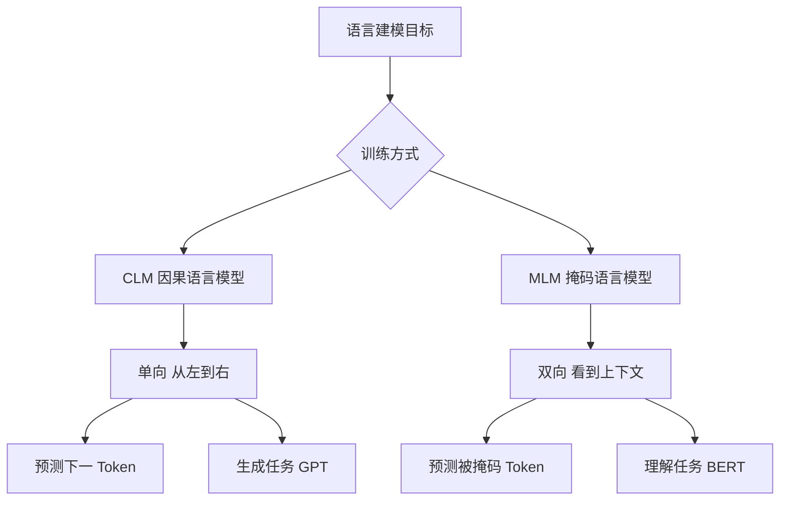

# CLM和MLM分别是什么

CLM 和 MLM 是两种不同的预训练语言建模目标：

**1. CLM (Causal Language Modeling)**
- **定义**：因果语言建模，即从左到右的自回归预测下一个词。
- **机制**：每个词只能看到它之前的上下文。
- **代表模型**：GPT 系列。
- **适用任务**：文本生成、创意写作。

**2. MLM (Masked Language Modeling)**
- **定义**：掩码语言建模，随机掩盖句子中的词，让模型根据上下文预测被掩盖的词。
- **机制**：利用双向上下文（前文和后文）。
- **代表模型**：BERT、RoBERTa。
- **适用任务**：文本分类、命名实体识别等自然语言理解任务。

### 实战案例
在构建智能客服系统时，直接使用BERT（MLM）进行多轮对话生成交替出现重复或逻辑断层，因为BERT无法建模“未来”信息；而使用GPT-2（CLM）微调后，生成的回复流畅度显著提升，虽然意图识别准确率略低于BERT，但更适合对话生成场景。

### 对比表格

| 维度 | CLM (Causal LM) | MLM (Masked LM) |
| :--- | :--- | :--- |
| **代表模型** | GPT, LLaMA, Claude | BERT, RoBERTa | 
| **注意力机制** | 单向 (Uni-directional) | 双向 (Bi-directional) |
| **训练目标** | $P(x_t \mid x_{<t})$ | $P(x_{masked} \mid x_{context})$ |
| **上下文视野** | 仅看上文 | 看上文和下文 |
| **擅长任务** | 文本生成、翻译、代码补全 | 文本分类、实体识别、语义相似度 |
| **推理方式** | 自回归生成 | 一次性输出 (或独立Mask预测) |
| **工程实现** | KV Cache优化 | 无需KV Cache，Padding处理需注意 |

### 代码示例
```python
# CLM (GPT风格) 模拟：只能看到前面的token
def causal_forward(logits):
    # 创建一个下三角矩阵，mask掉对角线以上的未来信息
    mask = torch.tril(torch.ones((seq_len, seq_len)))
    masked_logits = logits.masked_fill(mask == 0, float('-inf'))
    return masked_logits

# MLM (BERT风格) 模拟：随机覆盖15%的token
def prepare_mlm_inputs(input_ids, tokenizer, mask_prob=0.15):
    labels = input_ids.clone()
    # 生成随机掩码矩阵
    probability_matrix = torch.full(labels.shape, mask_prob)
    masked_indices = torch.bernoulli(probability_matrix).bool()
    
    # 将选中位置替换为 [MASK] token (通常ID为103)
    input_ids[masked_indices] = tokenizer.convert_tokens_to_ids('[MASK]')
    return input_ids, labels
```

## 流程图




## 记忆要点

- 机制对比：CLM单向只看上文，MLM双向看上下文。
- 模型代表：CLM对应GPT专精生成，MLM对应BERT擅长理解。
- 数学目标：CLM预测下一词，MLM预测掩码词。
- 考点口诀：单向生成选GPT，双向理解选BERT。


## 结构化回答

**30 秒电梯演讲：** CLM单向预测用于生成，MLM双向预测用于理解。——打个比方，CLM像“成语接龙”只能往后猜；MLM像“完形填空”可以看整句。

**展开框架：**
1. **机制对比** — CLM单向只看上文，MLM双向看上下文。
2. **模型代表** — CLM对应GPT专精生成，MLM对应BERT擅长理解。
3. **数学目标** — CLM预测下一词，MLM预测掩码词。

**收尾：** 以上三点都能配合实战聊。您想深入聊哪一块？

## 视频脚本

> 预计时长：2 分钟 | 由浅入深

| 时间 | 画面/字幕 | 口播台词 | 讲解要点 |
|------|----------|----------|----------|
| 0:00 | 标题卡 | "CLM和MLM分别是什么，30 秒讲清楚。" | 开场钩子 |
| 0:30 | 概念定义动画 | "一句话：CLM单向预测用于生成，MLM双向预测用于理解。" | 核心定义 |
| 1:00 | 机制对比图解 | "CLM单向只看上文，MLM双向看上下文。" | 机制对比 |
| 1:30 | 总结卡 | "记好这几条，面试不慌。下期见。" | 收尾 |
