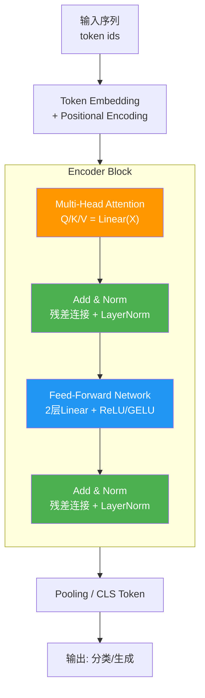
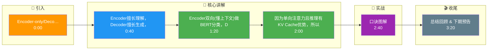

# Encoder-only/Decoder-only/Encoder-Decoder

Transformer 的三种架构变体各有侧重：

**1. Encoder-only (仅编码器)**
- **结构**：只有 Encoder 堆叠。
- **特点**：利用双向注意力，能看到整个序列。
- **典型模型**：BERT, RoBERTa。
- **运用**：自然语言理解（NLU）任务，如文本分类、情感分析、命名实体识别（NER）。

**2. Decoder-only (仅解码器)**
- **结构**：只有 Decoder 堆叠（带 Mask）。
- **特点**：单向自回归，只能看到上文。
- **典型模型**：GPT 系列, LLaMA。
- **运用**：自然语言生成（NLG）任务，如对话、写作、代码生成。目前大模型的主流选择。

**3. Encoder-Decoder (编码器-解码器)**
- **结构**：Encoder 处理输入，Decoder 生成输出。
- **特点**：Encoder 双向理解输入，Decoder 自回归生成输出，中间有 Cross-Attention。
- **典型模型**：T5, BART, 原始 Transformer。
- **运用**：序列到序列任务，如机器翻译、文本摘要。

**4. 架构对比与原理细节**
- **Masking 机制**：
    - **Encoder**：无 Mask，每个 Token 可以关注到序列中的所有其他 Token（Full Attention）。
    - **Decoder**：使用 Causal Mask（因果掩码），第 $t$ 个 Token 只能关注 $1$ 到 $t$ 的 Token，防止信息泄露。
- **注意力类型**：
    - **Encoder-Decoder 架构**：Decoder 中包含 **Cross-Attention** 层，Query 来自 Decoder 的上一时刻输出，Key 和 Value 来自 Encoder 的最终输出，实现了生成过程对输入的理解。
- **推理效率**：
    - **Decoder-only** 在推理时具有 KV Cache 优势，且结构单一，便于堆叠层数扩展到千亿级参数，因此成为 LLM 主流。

**5. 实战案例与代码**
- **实战案例**：在做机器翻译时使用 Encoder-Decoder 架构（如 T5），发现 Encoder 端的输入长度限制导致长文本截断；改用 Encoder-only（如 BERT）做特征提取时，又必须设计复杂的生成头。最终对于长文本生成任务，Decoder-only 架构配合 FlashAttention 推理效率更高。
- **代码示例 (HuggingFace 掩码配置)**：
```python
from transformers import AutoModelForCausalLM
# Decoder-only: 关键是 attention_mask 中的 causal mask
model = AutoModelForCausalLM.from_pretrained("gpt2")
# 内部自动生成下三角矩阵 ( causal_mask )，防止当前词关注未来词
# Encoder-only (BERT) 则通常只需 padding_mask (屏蔽填充位)
```

**6. 选型对比表**

| 特性维度 | Encoder-only (e.g., BERT) | Decoder-only (e.g., GPT) | Encoder-Decoder (e.g., T5) |
| :--- | :--- | :--- | :--- |
| **注意力机制** | 双向 | 单向 | Enc: 双向, Dec: 单向 + 交叉注意力 |
| **典型任务** | 分类、NER、抽取式QA | 通用生成、对话、代码 | 翻译、摘要、复述 |
| **训练策略** | Masked LM (MLM) | Causal LM (CLM) | Span Corruption (去噪) |
| **推理延迟** | 低 (一次前向传播) | 高 (自回归串行生成) | 高 (自回归串行生成) |
| **全序列理解** | 优 (利用上下文) | 弱 (仅上文) | 输入端优，输出端弱 |

**7. 架构示意图**
```text
┌───────────────────────────────────────────────────────────────────────┐
│                      Transformer 架构变体对比                          │
├───────────────────────────────────────────────────────────────────────┤
│                                                                       │
│  1. Encoder-only (BERT)           2. Decoder-only (GPT)              │
│  ┌─────────────────────┐           ┌─────────────────────┐            │
│  │   Input Embedding   │           │   Input Embedding   │            │
│  └──────────┬──────────┘           └──────────┬──────────┘            │
│             ▼                                 ▼                      │
│  ┌─────────────────────┐           ┌─────────────────────┐            │
│  │ Encoder Block (x N) │           │ Decoder Block (x N) │            │
│  │ [Self-Attention     │           │ [Masked Self-Attn   │            │
│  │  (Bi-directional)]  │           │  (Uni-directional)] │            │
│  │ [FFN]               │           │ [FFN]               │            │

## 核心流程图



## 记忆要点

- Encoder双向(懂上下文)做BERT分类，Decoder单向(带Mask)做GPT生成，Enc-Dec靠交叉注意力做T5翻译。
- 因为单向注意力且推理有KV Cache优势，所以Decoder-only成为大模型(LLM)主流架构。
- 口诀：BERT懂全貌，GPT续下文，T5做翻译。

## 结构化回答

**30 秒电梯演讲：** Encoder擅长理解，Decoder擅长生成，Encoder-Decoder擅长映射。——打个比方，Encoder是阅读理解，Decoder是看图写作，Encoder-Decoder是同声传译。

**展开框架：**
1. **Encoder双** — Encoder双向(懂上下文)做BERT分类，Decoder单向(带Mask)做GPT生成，Enc-Dec靠交叉注意力做T5翻译。
2. **因为单向注意力且** — 因为单向注意力且推理有KV Cache优势，所以Decoder-only成为大模型(LLM)主流架构。
3. **口诀** — BERT懂全貌，GPT续下文，T5做翻译。

**收尾：** 以上三点都能配合实战聊。您想深入聊哪一块？

## 视频脚本

> 预计时长：4 分钟 | 由浅入深

| 时间 | 画面/字幕 | 口播台词 | 讲解要点 |
|------|----------|----------|----------|
| 0:00 | 标题卡 | "Encoder-only/Decoder-only/Encoder-Decode，30 秒讲清楚。" | 开场钩子 |
| 0:40 | 概念定义动画 | "一句话：Encoder擅长理解，Decoder擅长生成，Encoder-Decoder擅长映射。" | 核心定义 |
| 1:20 | 要点图解 | "Encoder双向(懂上下文)做BERT分类，Decoder单向(带Mask)做GPT生成" | 要点 |
| 2:00 | 要点图解 | "因为单向注意力且推理有KV Cache优势，所以Decoder-only成为大模型(LLM)主流架构。" | 要点 |
| 2:40 | 口诀图解 | "BERT懂全貌，GPT续下文，T5做翻译。" | 口诀 |
| 3:20 | 总结卡 | "记好这几条，面试不慌。下期见。" | 收尾 |

### 视频流程图




