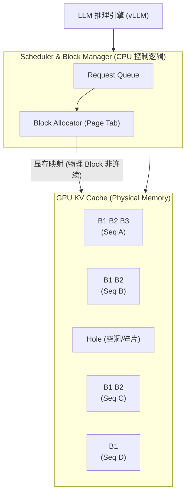

# VLLM的加速方法

vLLM 主要通过 **PagedAttention** 和 **Continuous Batching** 两项核心技术来加速大模型推理。

**1. PagedAttention (核心显存优化)**
*   **问题**：在推理过程中，KV Cache（键值缓存）随着序列生成线性增长，且需要连续的显存空间。这导致严重的显存浪费和碎片化，限制了 Batch Size。
*   **解决**：受操作系统虚拟内存启发，vLLM 将 KV Cache 切分成固定的“块”，不再要求物理内存连续。
*   **细节**：每个 Block 包含固定数量的 Token 的 KV 向量。通过 Block 表管理逻辑块到物理块的映射。这不仅解决了内部碎片，还能跨请求共享物理 Block（例如对于 Prompt 共享的 Prefix Sharing，如 System Prompt）。
*   **效果**：允许在显存不连续的情况下存储 KV Cache，极大减少了内存碎片，实现了类似内存页面的高效管理，从而在有限显存下支持更大的 Batch Size 和更长的序列。

**2. Continuous Batching (又称 Iterative Batching)**
*   **问题**：传统静态 Batching 要求同一个 Batch 内的所有序列必须同时生成结束。短序列生成完毕后必须等待长序列，导致 GPU 算力闲置。
*   **解决**：vLLM 采用动态调度。当 Batch 中的某个请求生成结束时，立即插入新的请求进入 Batch。
*   **细节**：调度器以迭代为单位，每次只处理 Batch 中当前活跃的 Token。系统会根据显存水位（Watermark）和计算资源，动态决定是否接收新请求（Preemption 机制可能会挂起低优先级长任务以腾出空间）。
*   **效果**：始终保持 GPU 满载运行，显著提高了系统的吞吐量。

**3. 其他优化**
包括高效的 CUDA 算子优化（如 Fusion Kernel）以及张量并行支持。

**架构示意图**：

## 常见考点
1.  **预分配与按需分配**：vLLM 的 Block 是预先分配好物理内存池，还是在计算过程中动态申请？（通常是初始化时预留 90% 显存作为 Block Cache）。
2.  **Prefix Sharing**：vLLM 如何利用 PagedAttention 实现多请求之间的 Prompt 共享？（通过 COW 机制或只读引用相同的物理 Block）。
3.  **Beam Search 支持**：在 Beam Search 场景下，同一个请求的多个候选序列如何共享 KV Cache？（它们可以共享生成路径相同的父节点的 Block）。

## 核心知识点图

## 记忆要点

- 显存优化(核心)：受OS虚拟内存启发，用PagedAttention将KV Cache分块，解决显存碎片并支持大Batch。
- 算力优化：用Continuous Batching动态调度，短序列结束即插入新请求，不让GPU闲置等待。
- 附加提效：支持Beam Search的物理块共享(只读引用)，以及底层CUDA算子融合。

## 结构化回答

**30 秒电梯演讲：** 像电脑内存管理一样切分显存（Paged）；像餐厅翻台一样有人走就立即接客（Continuous）。

**展开框架：**
1. **PagedAttention** — PagedAttention将KV Cache分块存储，减少碎片
2. **Continuous** — Continuous Batching动态调整批次，消灭等待时间
3. **两者协同提升** — 两者协同提升吞吐量和显存利用率

**收尾：** 这是我实战中的理解，您想深入哪一段？

## 视频脚本

> 预计时长：4 分钟 | 由浅入深

| 时间 | 画面/字幕 | 口播台词 | 讲解要点 |
|------|----------|----------|----------|
| 0:00 | 标题卡 | "VLLM的加速方法，30 秒讲清楚。" | 开场钩子 |
| 0:40 | 概念定义动画 | "一句话：PagedAttention解决显存碎片，Continuous Batching解决GPU空转。" | 核心定义 |
| 1:20 | 显存优化(核心)图解 | "受OS虚拟内存启发，用PagedAttention将KV Cache分块，解决显存碎片并支持大Batch。" | 显存优化(核心) |
| 2:00 | 算力优化图解 | "用Continuous Batching动态调度，短序列结束即插入新请求，不让GPU闲置等待。" | 算力优化 |
| 2:40 | 附加提效图解 | "支持Beam Search的物理块共享(只读引用)，以及底层CUDA算子融合。" | 附加提效 |
| 3:20 | 总结卡 | "记好这几条，面试不慌。下期见。" | 收尾 |
