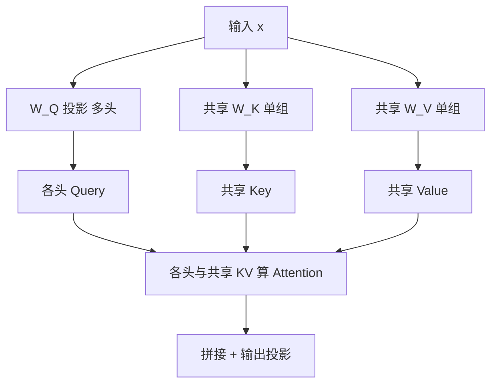

# 手撕MQA

# 手撕 MQA (Multi-Query Attention)

## 核心原理
MQA（Multi-Query Attention）是 GQA（Grouped-Query Attention）的极端特例。标准 MHA 中，每个 Head 都有独立的 Q、K、V；而在 MQA 中，所有 Head 共享同一份 K 和 V，只有 Q 是分头的。这种机制极大地减少了显存占用（尤其是 KV Cache）并提升了推理速度。

## 实现代码

```python
import torch
import torch.nn as nn
import math

class MultiQueryAttention(nn.Module):
    def __init__(self, d_model, num_heads):
        super().__init__()
        self.d_model = d_model
        self.num_heads = num_heads
        self.head_dim = d_model // num_heads

        # MQA 关键：
        # Q: [d_model, d_model] -> 输出拆分为 num_heads
        # K, V: [d_model, head_dim] -> 所有 heads 共享
        self.q_linear = nn.Linear(d_model, d_model) 
        self.k_linear = nn.Linear(d_model, self.head_dim)
        self.v_linear = nn.Linear(d_model, self.head_dim)
        
        self.out_linear = nn.Linear(d_model, d_model)

    def forward(self, x, mask=None):
        batch_size, seq_len, _ = x.size()

        # 1. 线性变换
        # Q: [Batch, SeqLen, d_model] -> [Batch, SeqLen, num_heads * head_dim]
        q = self.q_linear(x)
        # K, V: [Batch, SeqLen, head_dim] (注意这里没有 heads 维度)
        k = self.k_linear(x)
        v = self.v_linear(x)

        # 2. reshape Q 以便多头计算
        # [Batch, SeqLen, num_heads, head_dim]
        q = q.view(batch_size, seq_len, self.num_heads, self.head_dim)
        # [Batch, num_heads, SeqLen, head_dim] (转置适配矩阵乘法)
        q = q.transpose(1, 2)

        # 3. 扩展 K 和 V 以匹配 Q 的 head 数量
        # [Batch, 1, SeqLen, head_dim] -> [Batch, num_heads, SeqLen, head_dim]
        # 使用 expand 实现内存共享，不增加数据拷贝
        k = k.unsqueeze(1).expand(-1, self.num_heads, -1, -1)
        v = v.unsqueeze(1).expand(-1, self.num_heads, -1, -1)

        # 4. Scaled Dot-Product Attention
        # Score = Q * K^T / sqrt(d_k)
        scores = torch.matmul(q, k.transpose(-2, -1)) / math.sqrt(self.head_dim)

        if mask is not None:
            scores = scores.masked_fill(mask == 0, -1e9)

        attn = torch.softmax(scores, dim=-1)

        # 5. 加

## 流程图



## 核心知识点图


## 记忆要点

- 核心定义：MQA是多头的极端特例，所有Head共享同一份K和V，只有Q保留多头。
- 显存优势：因KV序列无需按头存储，所以极大地压缩了推理时的KV Cache显存占用。
- 实现关键：K和V线性层输出降维至head_dim，计算时用expand广播匹配Q的多个头。


## 结构化回答

**30 秒电梯演讲：** 多头共享KV以显存加速推理。——打个比方，多位专家共用同一套参考书库。

**展开框架：**
1. **核心定义** — MQA是多头的极端特例，所有Head共享同一份K和V，只有Q保留多头。
2. **显存优势** — 因KV序列无需按头存储，所以极大地压缩了推理时的KV Cache显存占用。
3. **实现关键** — K和V线性层输出降维至head_dim，计算时用expand广播匹配Q的多个头。

**收尾：** 以上三点都能配合实战聊。您想深入聊哪一块？

## 视频脚本

> 预计时长：4 分钟 | 由浅入深

| 时间 | 画面/字幕 | 口播台词 | 讲解要点 |
|------|----------|----------|----------|
| 0:00 | 标题卡 | "手撕MQA，30 秒讲清楚。" | 开场钩子 |
| 0:40 | 概念定义动画 | "一句话：多头共享KV以显存加速推理。" | 核心定义 |
| 1:20 | 核心定义图解 | "MQA是多头的极端特例，所有Head共享同一份K和V，只有Q保留多头。" | 核心定义 |
| 2:00 | 显存优势图解 | "因KV序列无需按头存储，所以极大地压缩了推理时的KV Cache显存占用。" | 显存优势 |
| 2:40 | 实现关键图解 | "K和V线性层输出降维至head_dim，计算时用expand广播匹配Q的多个头。" | 实现关键 |
| 3:20 | 总结卡 | "记好这几条，面试不慌。下期见。" | 收尾 |
