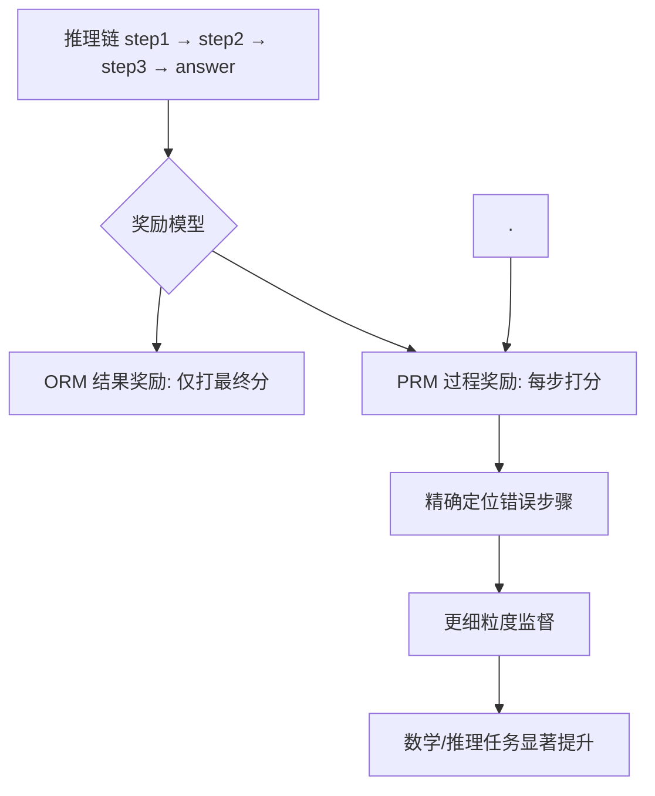

# 什么是PRM过程监督奖励

# 什么是 PRM (Process Reward Model) 过程监督奖励

## 背景与定义
在强化学习（RLHF）中，传统方法使用 **ORM (Outcome Reward Model)**，即只在模型生成**最终结果**后才给出一个奖励分数（如：答案对=+1，错=-1）。

**PRM (Process Reward Model)** 则是在模型生成的**每一个推理步骤**都提供反馈奖励。

*   **ORM**：`Input -> [Step 1 -> Step 2 -> ... -> Final Answer] -> Reward (1 Score)`
*   **PRM**：`Input -> Step 1 -> Reward(1) -> Step 2 -> Reward(2) -> ... -> Reward(N)`

## 为什么需要 PRM？
对于数学题、逻辑推理等复杂任务，最终结果错误并不代表过程一无是处。ORM 会“全盘否定”一个虽有中间步骤错误但思路正确的路径，导致模型难以学习到正确的推理逻辑。PRM 能引导模型在每一步都走“正确的路”，即使偶尔走错，也能及时纠正。

## PRM 与 Q-Learning 的关系
PRM 本质上是在估计状态的价值。

```text
强化学习视角:

状态 (State, s)    : 当前已生成的推理步骤
动作 (Action, a)   : 下一步生成的思路或算式
奖励 (Reward, r)   : PRM 针对当前步骤给出的分数

ORM 近似于 Monte Carlo Update (只在终点结算)
PRM 近似于 Temporal Difference (TD) Learning (每步估计)

PRM 输出 ≈ Q(s, a) 的估计值
```

## 数据构建流程 (Math-Shepherd 风格)
人工对每一步打标成本极高，通常采用“结果验证倒推”的自动化方案：

```text
1. 采样路径
   Question: "1+1=?"
   Model 生成: "Step A: 1+1=2. Step B: 2+2=4. Ans: 4"
   
2. 结果验证 (使用代码或外部工具)
   检查 Ans=4 -> 错误。
   回溯检查: 
   - 如果包含 Step B，Ans 可能正确吗？是。
   - 如果包含 Step A，Ans 可能正确吗？是。
   
3. 分配奖励 (PRM Label)
   Step A: Good (+1)
   Step B: Good (+1)  <-- 虽然最终结果错，但这步推理逻辑本身是对的，或者取决于上下文
   
   另一条路径:
   "Step X: 1+1=3. Ans: 3"
   Step X: Bad (-1)   <-- 这一步逻辑直接错误，导致后续无法挽救
```
更精确的方法是：在每一步展开多个后续采样，计算“从该步骤出发最终能得出正确答案的概率”作为该步骤的 PRM 值。

**实战案例**：在代码生成任务中，模型生成了一个最终运行报错的代码片段。ORM 会直接惩罚，导致模型无法学会其中正确的变量定义逻辑。使用 PRM 后，模型因为变量定义步骤（Step 1）获得高分，仅因逻辑语法错误（Step 2）获低分，从而保留了有效能力的训练信号。

**对比表格**：
| 维度 | ORM (Outcome Reward Model) | PRM (Process Reward Model) |
| :--- | :--- | :--- |
| **反馈粒度** | 仅针对最终结果 | 针对每一步推理/代码 |
| **稀疏性** | 极度稀疏 (Reward Delay) | 密集反馈 (即时 Reward) |
| **适用任务** | 简单分类、短文本生成 | 数学证明、复杂逻辑推理、代码生成 |
| **训练数据** | 较易构建 (仅需问答对) | 构建困难 (需步骤级标注或自动验证) |
| **推理开销** | 低 (生成完算一次) | 高 (生成过程需多次调用打分) |

## 常见考点
1.  **PRM vs ORM**：哪个效果更好？PRM 在复杂推理任务（数学、代码）上显著优于 ORM，但训练成本更高（需要更细粒度的标注）。
2.  **PRM 的训练数据**：怎么来的？主要是利用现有的强模型（如 GPT-4）生成步骤，然后通过结果验证或模型自我评估来打标。
3.  **推理时的使用**：PRM 在推理时怎么用？可以使用 **Best-of-N** 或 **Beam Search**，在每一步选择 PRM 分数最高的分支继续生成（Search-based Inference）。

## 流程图



## 核心知识点图


## 记忆要点

- 对比ORM：ORM只对最终结果打分（稀疏）；PRM对每步推理打分（密集反馈）。
- 训练优势：因为能精确定位中间步骤错误，所以PRM在数学和代码逻辑推理上效果显著优于ORM。
- 推理应用：推理时结合Beam Search，每步都依赖PRM打分来挑选最优路径分支。


## 结构化回答

**30 秒电梯演讲：** 对推理链的每一步进行打分，而非只看最终结果。——打个比方，老师不仅批改最终答案，还检查每一步解题过程是否正确。

**展开框架：**
1. **对比ORM** — ORM只对最终结果打分（稀疏）；PRM对每步推理打分（密集反馈）。
2. **训练优势** — 因为能精确定位中间步骤错误，所以PRM在数学和代码逻辑推理上效果显著优于ORM。
3. **推理应用** — 推理时结合Beam Search，每步都依赖PRM打分来挑选最优路径分支。

**收尾：** 以上三点都能配合实战聊。您想深入聊哪一块？

## 视频脚本

> 预计时长：4 分钟 | 由浅入深

| 时间 | 画面/字幕 | 口播台词 | 讲解要点 |
|------|----------|----------|----------|
| 0:00 | 标题卡 | "PRM过程监督奖励，30 秒讲清楚。" | 开场钩子 |
| 0:40 | 概念定义动画 | "一句话：对推理链的每一步进行打分，而非只看最终结果。" | 核心定义 |
| 1:20 | 对比ORM图解 | "ORM只对最终结果打分（稀疏）；PRM对每步推理打分（密集反馈）。" | 对比ORM |
| 2:00 | 训练优势图解 | "因为能精确定位中间步骤错误，所以PRM在数学和代码逻辑推理上效果显著优于ORM。" | 训练优势 |
| 2:40 | 推理应用图解 | "推理时结合Beam Search，每步都依赖PRM打分来挑选最优路径分支。" | 推理应用 |
| 3:20 | 总结卡 | "记好这几条，面试不慌。下期见。" | 收尾 |

---

## 延伸：什么是PRM 过程监督奖励?OpenAI的秘密武器

> 合并自 `llm-067`（相似度 77%）

### 1. 什么是 PRM?
**过程监督奖励** 是一种用于复杂推理任务的强化学习方法。与传统**结果监督奖励（ORM）** 仅在最终答案正确时给予奖励不同，PRM 聚焦于推理的每一个中间步骤，为每个步骤提供细粒度的奖励反馈。

**核心优势：**
*   **细粒度监督：** 对每一步推理进行评价，直接纠正逻辑错误，而非仅看结果。
*   **过程优化：** 引导模型找到更优的推理路径，减少逻辑跳跃或幻觉。

根据 OpenAI 的《Let's verify step by step》论文，PRM 在数学推理等复杂任务上表现显著优于 ORM。

### 2. 如何构建 PRM 数据?
由于人工标注每一步骤的成本极高，目前主流采用自动化方法（如 DeepSeek 的 Math-Shepherd，OpenAI 的方案）：
1.  **基础路径采样：** 利用 SFT 模型针对问题生成多条推理路径（包含正确和错误的路径）。
2.  **结果标注：** 仅需标注最终结果是否正确（成本远低于标注每一步）。
3.  **奖励分配：
    *   如果最终结果正确，通常假设路径上的所有步骤（或大部分步骤）是正确的，赋予正奖励。
    *   如果最终结果错误，则回溯路径，找出导致错误的“关键错误步骤”，该步骤赋予负奖励，其前的步骤赋予正奖励（如果是正确的推导过程）。

**技术增强：** 为了更精准，可以引入 Outcome-supervised Reward Model (ORM) 辅助标注，或者使用 Monte Carlo Tree Search (MCTS) 来探索更多中间状态。

### 3. PRM 与 Q-Learning 的关联
PRM 可视为一种适配于大模型推理的 Q-Learning 变体。
*   **Q-Learning：** 学习状态-动作价值函数 $Q(s, a)$，表示在状态 $s$ 采取动作 $a$ 并遵循最优策略的期望回报。
*   **PRM：** 将每一步推理视为一个状态 $s$，下一步生成的内容视为动作 $a$。PRM 输出的分数即为 $Q(s, a)$ 的近似值，表示“当前推理步骤最终能导向正确答案”的概率。

### 4. 为什么被称为“秘密武器”？
*   **解决长链路遗忘：** 在数学和代码推理中，中间一步错会导致步步错。ORM 只有到最后才知道错了，难以纠正；PRM 能在错误发生的当下就给予惩罚，防止模型在错误路径上越走越远。
*   **Search 效率：** 配合 Best-of-N 或 Beam Search 时，PRM 可以在推理过程中提前剪枝，剔除低质量的分支，大幅降低推理成本同时提高准确率。

### 5. 流程对比图

```text
ORM (结果监督):
Step 1 -> Step 2 -> Step 3 -> Step 4 -> [Final Answer]
   |         |         |         |              |
   +---------+---------+---------+---------------> [Reward: 1 or 0] (仅在结尾判断)

PRM (过程监督):
Step 1 -> Step 2 -> Step 3 -> Step 4 -> [Final Answer]
   |         |         |         |              |
[R: 0.9]   [R: 0.8]   [R: -0.5]  [R: -0.8]      [R: 0.0]
 (好)      (好)      (错!惩罚)   (因前序错)      (错误)
```

### 六、实战案例与对比

**实战案例**：在构建 Code LLM 的调试能力时，模型常能给出正确的前半段逻辑，但在结尾因为一个变量名拼写错误导致运行失败。使用 ORM 训练时，模型被判定为全错，导致它不敢尝试复杂逻辑。**踩坑经验**：切换到 PRM 策略后，模型学会在每一步“自检”，虽然仍偶尔犯错，但逻辑链条的正确性提升了 40%，且能够配合外部解释器在错误步骤停止并重试，大幅降低了推理成本。

**策略对比表**
| 维度 | ORM (结果监督) | PRM (过程监督) |
| :--- | :--- | :--- |
| **奖励时机** | 仅在序列结束时 | 每个推理步骤均提供奖励 |
| **反馈颗粒度** | 粗糙（二元的对/错） | 细粒度（步骤级评分） |
| **长链路推理** | 效果差（错误无法定位） | 强（可及时止损纠偏） |
| **数据成本** | 低（仅需标注结果） | 高（通常需辅助方法生成步骤标注） |
| **适用场景** | 简单分类、单轮问答 | 数学证明、代码生成、复杂逻辑推理 |

## 记忆要点

- PRM 对推理过程每一步提供奖励，ORM 仅对最终结果判断，PRM 颗粒度更细。
- PRM 可在错误发生时即时纠偏，解决长链路推理中“一步错步步错”的问题。
- PRM 配合 Best-of-N 可提前剪枝，降低推理成本并提升复杂任务准确率。
- 构建 PRM 数据常利用结果标注反推步骤奖励，或用 ORM 辅助生成步骤级标签。


## 结构化回答

**30 秒电梯演讲：** 对推理的每一步进行打分反馈，而非只看最终结果。——打个比方，像老师检查数学题，不仅看答案对错，还一步步批改解题过程。

**展开框架：**
1. **PRM 对推理过** — PRM 对推理过程每一步提供奖励，ORM 仅对最终结果判断，PRM 颗粒度更细。
2. **PRM 可在错误** — PRM 可在错误发生时即时纠偏，解决长链路推理中“一步错步步错”的问题。
3. **PRM 配合 B** — PRM 配合 Best-of-N 可提前剪枝，降低推理成本并提升复杂任务准确率。

**收尾：** 以上三点都能配合实战聊。我可以展开任一要点，比如「有什么实际应用场景」这类追问您感兴趣吗？

## 视频脚本

> 预计时长：2 分钟 | 由浅入深

| 时间 | 画面/字幕 | 口播台词 | 讲解要点 |
|------|----------|----------|----------|
| 0:00 | 标题卡 | "PRM 过程监督奖励，30 秒讲清楚。" | 开场钩子 |
| 0:30 | 概念定义动画 | "一句话：对推理的每一步进行打分反馈，而非只看最终结果。" | 核心定义 |
| 1:00 | 要点图解 | "PRM 对推理过程每一步提供奖励，ORM 仅对最终结果判断，PRM 颗粒度更细。" | 要点 |
| 1:30 | 总结卡 | "记好这几条，面试不慌。下期见。" | 收尾 |
