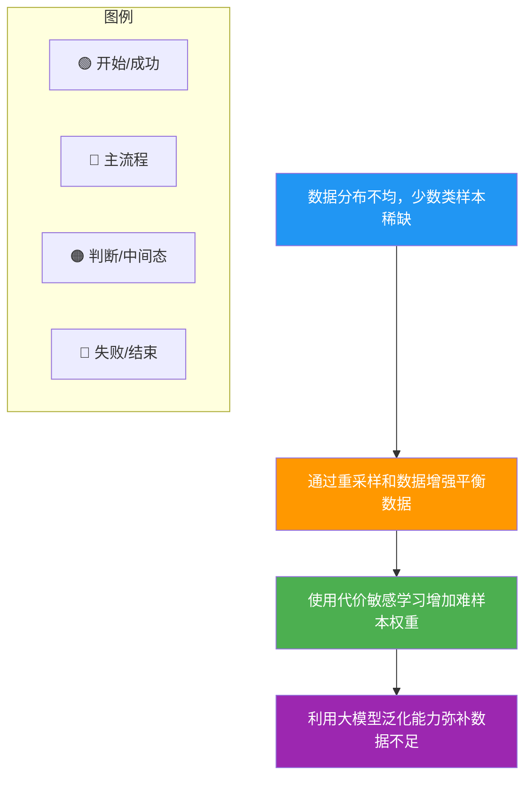

# 长尾问题和解决方法

### 长尾问题及解决方法

#### 1. 什么是长尾问题
在机器学习和数据分布中，长尾问题是指数据类别分布极不均衡的现象。
*   **头部**：少数类别拥有大量的样本，模型容易学习这些类别。
*   **尾部**：绝大多数类别只有极少的样本，模型很难在这些类别上取得良好性能。
这种现象在现实世界中非常普遍，如电商商品销量、自然语言中的词频分布等。

#### 2. 数据分布示意图
```
样本数量
  ↑
  │█
  │██
  │████          ← 头部
  │██████
  │████████
  │████████__________________________ ← 尾部
  └──────────────────────────────────→ 类别ID
``` 

#### 3. 常见解决方法

**数据层面**：
*   **重采样**：
    *   **过采样**：对少数类样本进行复制或生成（如 SMOTE 算法），增加其数量。
    *   **欠采样**：随机丢弃多数类样本，平衡各类比例，但可能丢失信息。
*   **数据增强**：针对尾部类数据通过旋转、裁剪、噪声注入等方式生成新样本。

**算法层面**：
*   **代价敏感学习 / Loss 修正**：
    *   **Class-balanced Loss**：根据样本频率的倒数调整权重，如 $w_j = \frac{1}{n_j}$。
    *   **Focal Loss**：在标准交叉熵基础上降低易分类样本的权重，迫使模型关注难分类样本（通常也是尾部样本）。公式：$FL(p_t) = -\alpha_t (1-p_t)^\gamma \log(p_t)$。
*   **难度感知学习**：根据样本的难易程度动态调整模型关注点，专注于学习难样本。

**模型架构层面**：
*   **集成学习**：训练多个模型或使用 Bagging/Boosting 策略，专门提升对少数类的识别能力。
*   **两阶段架构**：第一阶段判断样本是否属于“头部”常见类；若不属于，则进入第二阶段（专门为“尾部”设计的分类器或检索模型）。

**大模型微调策略**：
*   **指令微调**：通过构造包含长尾场景的指令数据，增强模型对低频场景的理解能力。
*   **上下文学习**：在 Inference 阶段通过提供少量示例来激发模型对长尾知识的回忆。
*   **RAG (检索增强生成)**：对于长尾知识，大模型内部参数可能记忆不足，通过外挂知识库检索相关信息来辅助回答。

## 实战深化

### 实战案例
**风控反欺诈**：在交易风控中，正常交易（头部）占 99.9%，欺诈交易（尾部）极少。如果使用普通的过采样，会导致模型对少数样本过拟合（死记硬背）。实战中常采用 **两阶段策略**：第一阶段规则引擎过滤明显正常交易；第二阶段针对“可疑交易”使用集成学习模型（如 BalanceRandomForest）进行精细判别。

### 关键代码 (Focal Loss 实现)
```python
import torch
import torch.nn as nn
import torch.nn.functional as F

class FocalLoss(nn.Module):
    def __init__(self, alpha=0.25, gamma=2.0):
        super().__init__()
        self.alpha = alpha # 平衡因子
        self.gamma = gamma # 聚焦因子

    def forward(self, inputs, targets):
        bce_loss = F.binary_cross_entropy_with_logits(inputs, targets, reduction='none')
        pt = torch.exp(-bce_loss) # 概率预测
        focal_loss = self.alpha * (1 - pt) ** self.gamma * bce_loss
        return focal_loss.mean()
```

### Loss 选型对比

| Loss 类型 | 适用场景 | 优点 | 缺点 |
| :--- | :--- | :--- | :--- |
| **Cross Entropy** | 数据分布相对均衡 | 训练稳定，收敛快 | 易被多数类主导，忽略尾部类 |
| **Weighted CE** | 已知明确类别权重 | 实现简单，直接平衡样本数 | 权重难以精确设定，易导致震荡 |
| **Focal Loss** | 极度不平衡（如检测） | 自动关注难样本，抑制易样本 | 超参敏感，需调节 $\gamma$ |
| **Class-Balanced Loss** | 样本数量差异巨大 | 基于有效样本数计算权重，理论扎实 | 计算稍复杂，需预先统计样本数 |

## 核心流程图



## 记忆要点

- 定义：数据分布极不均衡，头部样本多易学，尾部样本少难学。
- 数据层：过采样（SMOTE）增尾部，欠采样减头部，数据增强造样本。
- 算法层：Focal Loss 降易样本权重，Class-balanced Loss 调整频率倒数。
- 架构层：两阶段模型先判常见类，集成学习提升少数类识别。
- 大模型：RAG 外挂知识库补长尾，指令微调增强低频场景理解。

## 结构化回答

**30 秒电梯演讲：** 解决数据分布极不均衡导致的模型偏差问题。——打个比方，像考试，学霸（头部）题目简单分高，学渣（尾部）题目太难得分低。

**展开框架：**
1. **定义** — 数据分布极不均衡，头部样本多易学，尾部样本少难学。
2. **数据层** — 过采样（SMOTE）增尾部，欠采样减头部，数据增强造样本。
3. **算法层** — Focal Loss 降易样本权重，Class-balanced Loss 调整频率倒数。

**收尾：** 以上三点都能配合实战聊。您想深入聊哪一块？

## 视频脚本

> 预计时长：4 分钟 | 由浅入深

| 时间 | 画面/字幕 | 口播台词 | 讲解要点 |
|------|----------|----------|----------|
| 0:00 | 标题卡 | "长尾问题和解决方法，30 秒讲清楚。" | 开场钩子 |
| 0:40 | 概念定义动画 | "一句话：解决数据分布极不均衡导致的模型偏差问题。" | 核心定义 |
| 1:20 | 定义图解 | "数据分布极不均衡，头部样本多易学，尾部样本少难学。" | 定义 |
| 2:00 | 数据层图解 | "过采样（SMOTE）增尾部，欠采样减头部，数据增强造样本。" | 数据层 |
| 2:40 | 算法层图解 | "Focal Loss 降易样本权重，Class-balanced Loss 调整频率倒数。" | 算法层 |
| 3:20 | 总结卡 | "记好这几条，面试不慌。下期见。" | 收尾 |

### 视频流程图


