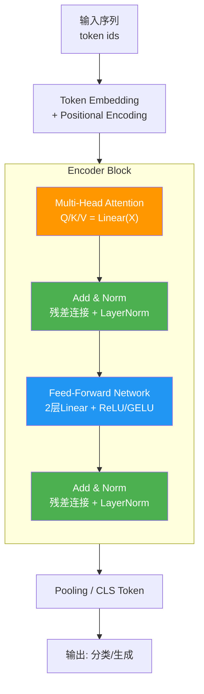

# Transformer中MLP层参数分析

### Transformer 中 MLP 层参数分析

#### 1. MLP 层结构
在 Transformer 的 Block 结构中，MLP（也称为 FFN，Feed-Forward Network）通常由两个线性层组成，中间夹着一个非线性激活函数（如 GELU 或 ReLU）。

公式为：
$$ \text{FFN}(x) = \text{Activation}(xW_1 + b_1)W_2 + b_2 $$

**结构示意图**：
```
Input (x) [d_model]
   ↓
┌──────────────┐
│ Linear (W1)  │  Project up: d_model → d_ff (通常4倍)
└──────┬───────┘
       ↓
┌──────────────┐
│  Activation  │  GELU / ReLU
└──────┬───────┘
       ↓
┌──────────────┐
│ Linear (W2)  │  Project down: d_ff → d_model
└──────┬───────┘
       ↓
Output [d_model]
```

#### 2. 维度设定
假设模型的隐藏层维度为 $d_{model}$，MLP 中间层的维度通常会扩大 4 倍，即 $d_{ff} = 4 \times d_{model}$。

#### 3. 参数量计算
*   **第一层线性层 ($W_1, b_1$)**：
    *   权重 $W_1$ 形状为 $[d_{model}, d_{ff}]$，参数量为 $d_{model} \times d_{ff} = d_{model} \times 4d_{model} = 4d_{model}^2$。
    *   偏置 $b_1$ 参数量为 $d_{ff} = 4d_{model}$。
*   **第二层线性层 ($W_2, b_2$)**：
    *   权重 $W_2$ 形状为 $[d_{ff}, d_{model}]$，参数量为 $d_{ff} \times d_{model} = 4d_{model} \times d_{model} = 4d_{model}^2$。
    *   偏置 $b_2$ 参数量为 $d_{model}$。

#### 4. 总参数量
将上述部分相加：
$$ \text{Total Params} \approx 4d_{model}^2 + 4d_{model} + 4d_{model}^2 + d_{model} = 8d_{model}^2 + 5d_{model} $$

由于 $d_{model}$ 通常很大（例如 768, 1024, 4096），偏置项（$5d_{model}$）可以忽略不计。

**结论**：Transformer 中 MLP 层的参数量约为 **$8d_{model}^2$**。

#### 5. 与 Attention 层对比
Attention 层的参数量约为 $4d_{model}^2$（Q, K, V 投影各 $d_{model}^2$，输出投影 $d_{model}^2$）。因此，MLP 层的参数量通常是 Attention 层的 **2倍**。

## 实战深化

### 实战案例
**显存瓶颈与 LoRA 微调**：在微调 GPT-3 (175B) 时，全参数微调需要存储所有梯度和优化器状态。由于 MLP 占据了 2/3 的参数，我们常在 MLP 的两个线性层上应用 **LoRA (Low-Rank Adaptation)**。通过只训练低秩矩阵 $A, B$ (rank=8)，冻结原始 W1, W2，可将可训练参数量从 175B 降至几百万，显著降低显存占用。

### 关键代码 (PyTorch 参数量计算)
```python
import torch
import torch.nn as nn

d_model = 768
d_ff = 4 * d_model # 3072

# 定义 MLP 层
mlp = nn.Sequential(
    nn.Linear(d_model, d_ff),
    nn.GELU(),
    nn.Linear(d_ff, d_model)
)

# 计算参数量验证公式
total_params = sum(p.numel() for p in mlp.parameters())
print(f"Actual Params: {total_params}")
print(f"Theory Params (8*d^2): {8 * d_model**2}")
# Actual: 4719616 (包含 bias) vs Theory: 4718592 (不含 bias)
```

### Transformer 模块参数对比

| 组件 | 参数量公式 | 占比 (以 BERT-Base 为例) | 计算复杂度 (FLOPs) |
| :--- | :--- | :--- | :--- |
| **Multi-Head Attention** | $4 \cdot d_{model}^2$ | ~33% | $O(n^2 \cdot d_{model})$ (主要在注意力矩阵) |
| **MLP (FFN)** | $2 \cdot d_{model} \cdot d_{ff} \approx 8 \cdot d_{model}^2$ | ~67% | $O(n \cdot d_{model}^2)$ |
| **LayerNorm** | $2 \cdot d_{model}$ | <1% | $O(n \cdot d_{model})$ |

*注：BERT-Base 中 $d_{model}=768$，$d_{ff}=3072$，单层 Block 总参数约 10M，MLP 约占 6.7M。*


## 核心流程图



## 记忆要点

- 结构：两线性层夹激活，维度先升后降，通常 d_ff = 4 * d_model。
- 参数量：约 8 * d_model^2，偏置项可忽略不计。
- 对比：MLP 参数量是 Attention 层（4 * d_model^2）的 2 倍。
- 实战：LoRA 微调常应用在 MLP 层，因其占据模型总参数约 2/3。
- 计算：第一层升维 4 倍，第二层降维回去，权重矩阵参数各占一半。


## 结构化回答

**30 秒电梯演讲：** MLP层参数量约为隐藏层维度平方的8倍。——打个比方，像大脑的联想区，负责把特征深层混合扩维。

**展开框架：**
1. **结构** — 两线性层夹激活，维度先升后降，通常 d_ff = 4 * d_model。
2. **参数量** — 约 8 * d_model^2，偏置项可忽略不计。
3. **对比** — MLP 参数量是 Attention 层（4 * d_model^2）的 2 倍。

**收尾：** 以上三点都能配合实战聊。您想深入聊哪一块？

## 视频脚本

> 预计时长：4 分钟 | 由浅入深

| 时间 | 画面/字幕 | 口播台词 | 讲解要点 |
|------|----------|----------|----------|
| 0:00 | 标题卡 | "Transformer中MLP层参数分析，30 秒讲清楚。" | 开场钩子 |
| 0:40 | 概念定义动画 | "一句话：MLP层参数量约为隐藏层维度平方的8倍。" | 核心定义 |
| 1:20 | 结构图解 | "两线性层夹激活，维度先升后降，通常 d_ff = 4 * d_model。" | 结构 |
| 2:00 | 参数量图解 | "约 8 * d_model^2，偏置项可忽略不计。" | 参数量 |
| 2:40 | 对比图解 | "MLP 参数量是 Attention 层（4 * d_model^2）的 2 倍。" | 对比 |
| 3:20 | 总结卡 | "记好这几条，面试不慌。下期见。" | 收尾 |
