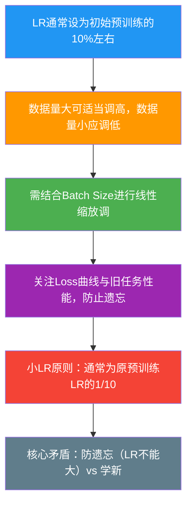

# 增量预训练中如何设置学习率

### 增量预训练中如何设置学习率

#### 1. 核心原则
增量预训练是在已有大模型基础上进行“微调”。目标是**在保留旧知识的同时，平稳地融入新知识**。因此，学习率通常要比从头预训练时**更小**，以避免剧烈的参数更新导致“灾难性遗忘”。

#### 2. 具体设置策略

- **参考初始预训练 LR**：
  - 建议从初始预训练最大学习率的 **1/10** 左右开始尝试。
  - 例如：若初始预训练 LR 为 $3 \times 10^{-4}$，增量预训练可尝试 $3 \times 10^{-5}$。

- **根据数据规模调整**：
  - **数据规模大**（与原训练数据同量级）：新知识丰富，可适度提高 LR，但仍需谨慎。
  - **数据规模小**（几十 GB）：数据量少容易过拟合，应使用更小的 LR。

- **Batch Size 缩放**：
  - 遵循线性缩放原则的经验值。若 Batch Size 扩大 $k$ 倍，LR 可相应增加，但通常不是 1:1。例如 Batch Size 增加 4 倍，LR 可增加约 2 倍。

- **动态调整**：
  - 使用 Warmup 策略防止初期震荡。
  - 配合 Cosine Decay 或线性衰减。
  - 观察训练曲线：若 Loss 震荡剧烈或旧任务性能下降，应及时降低 LR。

#### 3. 进阶策略：分层学习率
在增量预训练中，并非所有参数都需要相同的学习率。为了避免破坏底层的通用语言能力，通常采用**分层学习率**：

- **顶层**：靠近输出的层（如最后几层 Transformer Block），包含更多任务特定知识，可以使用较大学习率。
- **底层**：靠近输入的层，包含更多基础语言学特征，应使用极小学习率（例如顶层 LR 的 1/10 甚至 0）。

```text
Input Embeddings
┌─────────────────┐
│  Layer 1 (Base) │  LR: very small (e.g., 1e-6)
│    ...          │  LR: gradual increase
│ Layer N-1       │  LR: medium
│ Layer N (Top)   │  LR: larger (e.g., 5e-5)
│  LM Head        │  LR: same as Top or larger
└─────────────────┘
Output
```

#### 4. 实战补充

**实战案例**：在垂直领域（如医疗）增量预训练 7B 模型时，若数据中含有大量特定术语但比例较低，若学习率过高（如 $2e-4$），模型容易“忘掉”通用指令格式，导致下游 SFT 阶段无法遵循指令；若数据量少（<1B tokens），建议降至 $5e-6$ 级别，并配合梯度裁剪。

**代码示例 (DeepSpeed/Transformers)**：
```python
# PyTorch 参数组设置实现分层学习率
optimizer_grouped_parameters = [
    {
        "params": [p for n, p in model.named_parameters() if "layer.31" in n or "lm_head" in n],
        "lr": 5e-5,  # 顶层学习率
    },
    {
        "params": [p for n, p in model.named_parameters() if "layer.0" in n or "embed" in n],
        "lr": 1e-6,  # 底层学习率，保护通用能力
    },
]
```

## 常见考点
1.  **增量预训练和 SFT（有监督微调）的学习率设置有何不同？**
    *   **回答思路**：增量预训练通常是为了注入领域知识，数据量相对较大（GB 级），学习率设置可以参考预训练的 1/10，且通常需要较长的训练步数；SFT 数据量较小（MB 级），为了快速对齐指令格式，通常学习率会更小（如 1e-6 到 2e-5），且更严格地监控过拟合。
2.  **如果不使用 Warmup，直接设定较小的学习率可以吗？**
    *   **回答思路**：**不建议**。即使 LR 较小，模型从旧的稳态进入新数据分布的初期，梯度方向可能与旧特征方向尖锐对立，缺乏 Warmup 容易导致 Loss 瞬间爆炸或模型进入恶劣的局部极小值。
3.  **如何判断当前学习率设置过大？**
    *   **回答思路**：观察 Loss 曲线，如果出现剧烈的锯齿状震荡且不下降，或者指标出现断崖式下跌，通常意味着 LR 过大。


## 核心流程图



## 记忆要点

- 原则：比从头预训练小，通常取初始 LR 的 1/10，防止灾难性遗忘。
- 策略：数据量大适度调高，数据量小（几十 GB）用极小 LR。
- 分层：底层（Embedding）用极小 LR 保护通用能力，顶层用较大 LR 学新知。
- 调整：配合 Warmup 和 Cosine Decay，Loss 震荡或旧任务下降应及时降低 LR。
- 对比：增量预训练 LR 高于 SFT，SFT 数据量小需更小 LR 防过拟合。


## 结构化回答

**30 秒电梯演讲：** 使用比从头训练更小的学习率，在保留旧参数记忆的同时微调以适应新数据。——打个比方，在一幅已经画好的精美油画上进行修改，只能用极细的笔触（小学习率）慢慢润色，不能大笔刷（大学习率）乱涂。

**展开框架：**
1. **原则** — 比从头预训练小，通常取初始 LR 的 1/10，防止灾难性遗忘。
2. **策略** — 数据量大适度调高，数据量小（几十 GB）用极小 LR。
3. **分层** — 底层（Embedding）用极小 LR 保护通用能力，顶层用较大 LR 学新知。

**收尾：** 以上三点都能配合实战聊。您想深入聊哪一块？

## 视频脚本

> 预计时长：4 分钟 | 由浅入深

| 时间 | 画面/字幕 | 口播台词 | 讲解要点 |
|------|----------|----------|----------|
| 0:00 | 标题卡 | "增量预训练中如何设置学习率，30 秒讲清楚。" | 开场钩子 |
| 0:40 | 概念定义动画 | "一句话：使用比从头训练更小的学习率，在保留旧参数记忆的同时微调以适应新数据。" | 核心定义 |
| 1:20 | 原则图解 | "比从头预训练小，通常取初始 LR 的 1/10，防止灾难性遗忘。" | 原则 |
| 2:00 | 策略图解 | "数据量大适度调高，数据量小（几十 GB）用极小 LR。" | 策略 |
| 2:40 | 分层图解 | "底层（Embedding）用极小 LR 保护通用能力，顶层用较大 LR 学新知。" | 分层 |
| 3:20 | 总结卡 | "记好这几条，面试不慌。下期见。" | 收尾 |

---

## 延伸：在增量预训练过程中如何设置学习率(learning rate, LR)

> 合并自 `llm-076`（相似度 69%）

### 1. 增量预训练中学习率 (LR) 的核心矛盾
增量预训练是在已有参数基础上继续训练。LR 的核心矛盾是：**学习新知识** vs **保留旧知识**。
*   **LR 过大：** 模型剧烈更新，容易破坏原有的通用能力，导致“灾难性遗忘”。
*   **LR 过小：** 模型无法有效吸收新数据的分布，学习效率低下。

### 2. 设置原则
通常建议使用比初始预训练**更小**的学习率。
*   **参考值：** 一般取初始预训练最大 LR 的 **1/10** 或更低。
*   **举例：** 若预训练 LR 为 $3e-4$，增量预训练可尝试 $3e-5$ 甚至更低。

### 3. 具体调整因素
*   **数据规模：** 如果新数据量巨大（接近原预训练数据量），可适当提高 LR；若数据量较小（几十 GB），LR 应调小以防过拟合。
*   **Batch Size：** 若 Batch Size 增大，可线性或亚线性地增加 LR。
*   **数据差异：** 新数据与原数据分布差异越大，越需要谨慎调整，通常建议从小 LR 开始尝试。

### 4. 实践建议
*   使用 **Warmup** 策略，初期平稳过渡。
*   使用 **Cosine Decay** 进行衰减。
*   监控 Loss 曲线及在旧任务上的表现，防止遗忘。

### 5. 实战案例：垂直领域注入遗忘
在一次医疗垂类增量预训练中，工程师直接使用了预训练的 LR ($2e-4$)，导致模型 Loss 快速下降但在通用推理评测集上分数暴跌 30%（模型“变傻”了）。将 LR 降至 $2e-5$ 并采用冻结 Embedding 层后，模型才在保持通用能力的同时习得医学知识。

### 6. 关键代码
```python
# 使用 Transformers 的 Cosine 学习率调度器示例
from transformers import get_cosine_schedule_with_warmup

# 增量预训练通常使用极小的 LR
optimizer = torch.optim.AdamW(model.parameters(), lr=2e-5)

# 设置 Warmup 和 总步数
scheduler = get_cosine_schedule_with_warmup(
    optimizer,
    num_warmup_steps=int(0.01 * total_steps), # Warmup 占比 1%
    num_training_steps=total_steps
)
```

### 7. 学习率策略图示

```text
Learning Rate Schedule in Continued Pre-training

LR
│
│     (Target LR: 3e-5)
│     ┌───────────\ 
│    /             \ 
│   / (Warmup)     \  (Cosine Decay)
│  /                \
│ /                  \_________
└───────────────────────────── Step
```

### 8. 常见考点
1.  **重训策略**：如果新数据量特别大（比如数倍于原数据），学习率应该如何设置？（此时更像是一次全新的预训练，可以恢复到接近初始预训练的 LR）。
2.  **参数冻结**：除了降低 LR，还有哪些方法防止遗忘？（冻结部分层（如冻结 Embedding 或浅层网络），只训练深层网络；使用正则化损失如 KL 散度约束输出分布与原模型接近）。
3.  **Loss 波动**：增量预训练 Loss 不下降通常是什么原因？（通常是 LR 太大导致模型崩坏，或者新数据分布与旧数据差异过大导致梯度冲突）。


## 核心流程图


## 记忆要点

- 增量预训练 LR 核心矛盾是学习新知识 vs 保留旧知识，通常设为原预训练的 1/10。
- LR 过大导致灾难性遗忘（通用能力暴跌），过小导致新知识无法吸收。
- 数据量越大 LR 可适当提高，数据差异越大 LR 越需谨慎，常配合 Cosine Decay。
- 实战中常冻结 Embedding 层或使用正则化损失来辅助防止遗忘。


## 结构化回答

**30 秒电梯演讲：** 使用比预训练更小的学习率，在更新知识和保留旧能力间找平衡。——打个比方，就像给已经装修好的房子（预训练模型）进行局部翻新，动作幅度（学习率）太大容易砸坏承重墙。

**展开框架：**
1. **增量预训练 LR** — 增量预训练 LR 核心矛盾是学习新知识 vs 保留旧知识，通常设为原预训练的 1/10。
2. **LR 过大导致灾** — LR 过大导致灾难性遗忘（通用能力暴跌），过小导致新知识无法吸收。
3. **数据量越大 LR** — 数据量越大 LR 可适当提高，数据差异越大 LR 越需谨慎，常配合 Cosine Decay。

**收尾：** 以上三点都能配合实战聊。您想深入聊哪一块？

## 视频脚本

> 预计时长：2 分钟 | 由浅入深

| 时间 | 画面/字幕 | 口播台词 | 讲解要点 |
|------|----------|----------|----------|
| 0:00 | 标题卡 | "在增量预训练过程中如何设置学习率(learning rate, LR)，30 秒讲清楚。" | 开场钩子 |
| 0:30 | 概念定义动画 | "一句话：使用比预训练更小的学习率，在更新知识和保留旧能力间找平衡。" | 核心定义 |
| 1:00 | 要点图解 | "增量预训练 LR 核心矛盾是学习新知识 vs 保留旧知识，通常设为原预训练的 1/10。" | 要点 |
| 1:30 | 总结卡 | "记好这几条，面试不慌。下期见。" | 收尾 |
