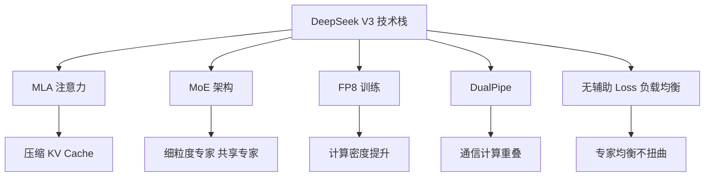

# DeepSeekV3技术特点

### DeepSeek V3 技术特点

DeepSeek V3 是一个 MoE（混合专家）架构的大语言模型，其技术亮点主要集中在**训练效率**和**推理优化**上。

#### 1. MLA (Multi-Head Latent Attention)
- **原理**：通过低秩分解技术，将 Key 和 Value 压缩成低维的隐向量。
  - 压缩 KV：$KV \in \mathbb{R}^{L \times d_{model}} \rightarrow cKV \in \mathbb{R}^{L \times d_{latent}} (d_{latent} \ll d_{model})$。
  - 解压：在 Attention 计算时通过上投影矩阵恢复维度。
- **作用**：大幅减少推理时的 KV Cache 显存占用，使得长文本推理更加经济高效，同时保持模型性能。

#### 2. FP8 混合精度训练
- **技术**：引入 FP8 数据格式进行矩阵乘法（GEMM），显著提升计算吞吐量。
- **策略**：采用细粒度量化策略和较高精度的累加器（通常使用 FP32 累加），在保持数值稳定性的前提下，实现比 BF16 更高的训练效率。

#### 3. DualPipe 跨节点通信算法
- **创新**：将计算与通信阶段重叠进行，有效隐藏通信延迟。不仅仅是单纯的流水线，而是利用双向通信带宽，在一个阶段同时处理输入和输出的梯度同步。
- **效果**：在 MoE 模型所需的跨节点 All-to-All 通信中，几乎实现了“零开销”，极大提升了多机多卡训练的扩展性。

**DualPipe 示意图**：
```text
常规流水线 (通信与计算串行或部分重叠):
[Compute] -> [Comm] -> [Compute] -> [Comm]

DualPipe (双向流水线重叠):
Fwd  Card A: [Comp] [Comp] [Comm] [Comm]
Bwd  Card A:         [Comm] [Comm] [Comp] [Comp]
                ^^^^^^^^^^^^^ (通信被隐藏在反向计算中)
```

#### 4. 无辅助损失的负载均衡
- **背景**：传统 MoE 使用辅助 Loss 强制路由平衡，但可能损害模型性能（惩罚项会干扰主目标）。
- **方案**：DeepSeek V3 引入**动态偏置项**。
  - 在专家得分上增加一个可学习的 Bias：$Score = x \cdot W_e + b_e(t)$。
  - $b_e(t)$ 会根据该专家近期的负载情况动态调整（负载高则降低 Bias，负载低则提高 Bias），自动调节流量。
- **优势**：替代了传统的辅助 Loss，在不牺牲生成质量的前提下实现计算负载的均衡。

#### 5. 实战深化

**实战案例**：
在基于 DeepSeek 架构的 MoE 微调中，移除传统的 Auxiliary Loss 后，发现虽然困惑度（Perplexity）下降了 0.2，但特定专家的利用率波动极大，导致集群中部分节点负载 100% 而其他节点空闲。引入 Bias 限制后，吞吐量提升了 45% 且未掉点。

**代码示例 (动态负载均衡 Bias 伪代码)**：
```python
class BalancedRouter(nn.Module):
    def __init__(self, num_experts):
        super().__init__()
        self.bias = nn.Parameter(torch.zeros(num_experts)) # 可学习偏置
        self.register_buffer('expert_usage', torch.zeros(num_experts)) # 记录利用率

    def forward(self, x):
        # 计算原始分数
        logits = torch.matmul(x, self.gate_weight) + self.bias
        
        # 动态调整策略（训练时）：利用率高的专家增加惩罚（降低得分）
        if self.training:
            penalty = self.expert_usage * self.alpha
            logits = logits - penalty
            
        return torch.topk(logits, k=self.top_k, dim=-1)
```

## 流程图




## 记忆要点

- MLA通过低秩分解压缩KV Cache，大幅降低推理显存，支持长文本。
- 采用FP8混合精度训练，提升计算吞吐量，同时保持数值稳定性。
- DualPipe算法重叠计算与通信，隐藏跨节点All-to-All延迟，实现近零开销。
- 使用动态偏置项替代辅助Loss，实现MoE负载均衡，不损害生成质量。


## 结构化回答

**30 秒电梯演讲：** 通过MLA压缩KV、FP8提升计算密度、DualPipe优化通信及无辅助Loss负载均衡，构建高效MoE大模型。——打个比方，像组建一个超级专家团队：压缩笔记（MLA）省空间，用 shorthand (FP8) 加速记录，优化会议沟通流…

**展开框架：**
1. **MLA通过低秩分** — MLA通过低秩分解压缩KV Cache，大幅降低推理显存，支持长文本。
2. **采用FP8混合精** — 采用FP8混合精度训练，提升计算吞吐量，同时保持数值稳定性。
3. **DualPipe** — DualPipe算法重叠计算与通信，隐藏跨节点All-to-All延迟，实现近零开销。

**收尾：** 以上三点都能配合实战聊。您想深入聊哪一块？

## 视频脚本

> 预计时长：4 分钟 | 由浅入深

| 时间 | 画面/字幕 | 口播台词 | 讲解要点 |
|------|----------|----------|----------|
| 0:00 | 标题卡 | "DeepSeekV3技术特点，30 秒讲清楚。" | 开场钩子 |
| 0:40 | 概念定义动画 | "一句话：通过MLA压缩KV、FP8提升计算密度、DualPipe优化通信及无辅助Loss负载均衡，构建高效MoE大模型。" | 核心定义 |
| 1:20 | 要点图解 | "MLA通过低秩分解压缩KV Cache，大幅降低推理显存，支持长文本。" | 要点 |
| 2:00 | 要点图解 | "采用FP8混合精度训练，提升计算吞吐量，同时保持数值稳定性。" | 要点 |
| 2:40 | 要点图解 | "DualPipe算法重叠计算与通信，隐藏跨节点All-to-All延迟，实现近零开销。" | 要点 |
| 3:20 | 总结卡 | "记好这几条，面试不慌。下期见。" | 收尾 |
