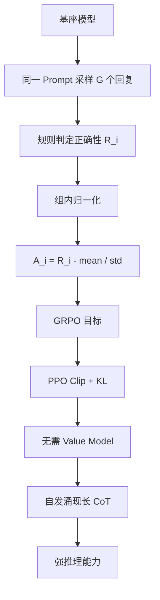

# DeepSeek-R1-Zero中RL的原理

### DeepSeek-R1-Zero 中 RL 的原理

#### 1. 核心机制：Group Relative Policy Optimization (GRPO)
DeepSeek-R1-Zero 采用了一种基于强化学习的优化策略，核心特点是不训练显式的价值模型，而是通过**组内相对优势**来进行策略优化。这避免了传统 PPO 算法中训练 Critic 模型带来的高昂计算成本和内存占用。

#### 2. 关键步骤

**2.1 采样与分组**
对于同一个输入提示，模型采样生成 $G$ 个不同的输出序列。

**2.2 奖励计算**
利用基于规则的奖励系统对每个输出进行打分。主要包含两类奖励：
- **准确率奖励**：检查最终答案是否正确（如数学题结果匹配）。
- **格式奖励**：检查推理过程是否包含在指定的标签（如 `think` 块）之间。

**2.3 优势估计**
计算每个输出相对于组内平均水平的优势：
$$A_i = \frac{r_i - \text{mean}(r)}{\text{std}(r)}$$
其中 $r_i$ 是第 $i$ 个输出的奖励，通过减去均值并除以标准差，实现奖励的归一化，消除不同任务奖励量纲的影响。

**2.4 策略更新 (GRPO)**
使用类似 PPO 的目标函数进行优化，但利用组内其他输出来替代基准策略。优化目标包含两部分：
1. **最大化期望奖励**：利用计算出的优势 $A_i$ 更新策略，使高分输出的生成概率增加。
2. **KL 散度约束**：引入 KL 散度惩罚项 $D_{KL}(\pi_\theta || \pi_{ref})$，防止模型在训练过程中偏离原始模型太远，避免语言模式崩塌。通常会有一个 KL 系数来平衡奖励最大化与模型稳定性。

**GRPO 工作流程图**：
```text
输入提示 
   |
   +---> 采样 G 个输出 [y1, y2, ..., yG]
            |
            V
       计算奖励 [r1, r2, ..., rG] (规则/验证器)
            |
            V
       计算优势 (归一化): A = (r - mean) / std
            |
            +----> [更新策略] <---+
                   |   |          |
                   |   +----------+--- KL 散度惩罚 (锚定旧策略)
                   |
            最大化 (优势 * Log Ratio)
```

#### 3. 行为涌现
在上述 RL 机制的驱动下，为了最大化奖励（即获得正确答案），模型逐渐学会了生成更长的推理链，并自发地出现了**自省**和**重新评估**的行为。这表明强化学习能够驱动模型自主发展出有效的解决问题的策略。

#### 4. 实战拓展

**实战案例**：
在数学推理任务的 GRPO 实验中，若组大小 $G$ 设置过小（如 $G=4$），均值方差估计不稳定，导致训练震荡，模型容易陷入只生成简单数字凑概率的捷径；当 $G$ 增大到 64 时，奖励归一化平稳，模型才真正学会逐步推理。

**代码示例 (GRPO 优势计算)**：
```python
import torch

def compute_grpo_advantages(rewards):
    """
    rewards: Tensor [batch_size, G]
    """
    # 计算组内均值和标准差
    mean = rewards.mean(dim=-1, keepdim=True)
    std = rewards.std(dim=-1, keepdim=True) + 1e-8 # 防止除零
    
    # 归一化优势
    advantages = (rewards - mean) / std
    return advantages
```

| 特性 | PPO (Proximal Policy Optimization) | GRPO (Group Relative Policy Optimization) |
| :--- | :--- | :--- |
| **Value 网络** | 需要训练一个 Critic 模型估计 $V(s)$ | 不需要 Critic，利用组内均值作为基线 |
| **显存占用** | 高 (Actor + Critic + Gradient) | 低 (仅 Actor，组采样换算力) |
| **优势估计** | $A(s,a) = Q(s,a) - V(s)$ | $A_i = (r_i - \text{mean}(r)) / \text{std}(r)$ |
| **适用场景** | 通用 RL，单样本或小批次 | 大规模生成任务，易于并行采样 |

## 常见考点
1. **GRPO 与 PPO 的区别**：GRPO 不需要训练 Critic (Value) 网络，通过组内采样估计基线，计算效率更高，更适合长文本生成。
2. **为什么要归一化奖励**：不同任务的奖励数值范围差异很大（如数学题是 0/1，代码是测试通过数），归一化能保证训练梯度的稳定性。
3. **KL 散度的作用**：防止模型为了骗取奖励而生成乱码或极度偏离原始语言分布的内容。

## 流程图




## 记忆要点

- 采用GRPO算法，无需训练Critic网络，通过组内采样计算相对优势。
- 对同一Prompt采样G个输出，利用规则打分，通过归一化奖励计算优势。
- 优化目标包含最大化期望奖励和KL散度约束，防止策略偏离过远。


## 结构化回答

**30 秒电梯演讲：** 利用强化学习通过组内相对优势估计优化策略，无需价值模型，驱动模型自发探索推理路径。——打个比方，老师不教具体解法，只公布全班作业的平均分和方差，让学生根据自己相对于平均分的表现自我调整解题思路。

**展开框架：**
1. **采用GRPO算法** — 采用GRPO算法，无需训练Critic网络，通过组内采样计算相对优势。
2. **对同一Promp** — 对同一Prompt采样G个输出，利用规则打分，通过归一化奖励计算优势。
3. **优化目标包含最大** — 优化目标包含最大化期望奖励和KL散度约束，防止策略偏离过远。

**收尾：** 以上三点都能配合实战聊。您想深入聊哪一块？

## 视频脚本

> 预计时长：4 分钟 | 由浅入深

| 时间 | 画面/字幕 | 口播台词 | 讲解要点 |
|------|----------|----------|----------|
| 0:00 | 标题卡 | "DeepSeek-R1-Zero中RL的原理，30 秒讲清楚。" | 开场钩子 |
| 0:40 | 概念定义动画 | "一句话：利用强化学习通过组内相对优势估计优化策略，无需价值模型，驱动模型自发探索推理路径。" | 核心定义 |
| 1:20 | 要点图解 | "采用GRPO算法，无需训练Critic网络，通过组内采样计算相对优势。" | 要点 |
| 2:00 | 要点图解 | "对同一Prompt采样G个输出，利用规则打分，通过归一化奖励计算优势。" | 要点 |
| 2:40 | 要点图解 | "优化目标包含最大化期望奖励和KL散度约束，防止策略偏离过远。" | 要点 |
| 3:20 | 总结卡 | "记好这几条，面试不慌。下期见。" | 收尾 |
