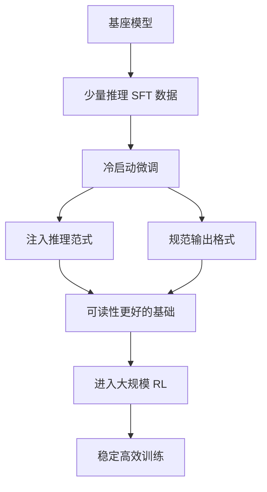

# 什么是冷启动

### 什么是冷启动

#### 1. 定义
在 DeepSeek-R1 的训练流程中，**冷启动** 指在进行大规模强化学习（RL）之前，先使用少量的高质量数据进行一轮**监督微调（SFT）**。这是从 R1-Zero（完全无 SFT）演进到 R1 的关键改进。

#### 2. 为什么要冷启动？
- **提升可读性**：纯 RL 训练（如 R1-Zero）虽然推理能力强，但容易产生语言混杂、重复和格式混乱的问题。冷启动数据通常包含人类编写的高质量思维链，能教模型如何清晰地“说话”。
- **稳定训练过程**：直接对基础模型进行 RL 可能导致训练初期波动剧烈，难以收敛。冷启动为模型提供了一个较好的初始状态（具备基本的推理范式），使后续的 RL 训练更加稳定高效。
- **注入先验知识**：通过人工精选的 Long-CoT 数据，将人类有效的推理模式注入模型，加速 RL 的收敛，避免模型在巨大的搜索空间中盲目探索。

#### 3. 具体做法
收集数千条包含详细推理过程、反思和总结的高质量样本，对基础模型进行微调。这就像在让模型“自学”之前，先给它一本优秀的“参考书”。

**R1 训练流程图（含冷启动）**：
```text
[基础模型]
    |
    +---> [冷启动 SFT] <---(数千条高质量CoT数据)
    |          |
    |          V
    |      [推理模型 v1] (具备基础推理格式)
    |          |
    |          +-----> [大规模 RL] (基于GRPO)
    |          |              |
    |          |              V
    |          |--------> [DeepSeek-R1]
    |
    +---> [拒绝采样] <---(利用R1生成更多数据)
                 |
                 V
            [SFT 蒸馏] (迭代优化)
```

#### 4. 实战拓展

**实战案例**：
在构建逻辑推理 Agent 时，尝试直接 RL 导致模型生成的 JSON 格式完全错误，无法被下游解析。加入少量包含“思考 -> 输出 JSON”格式的冷启动数据后，模型不仅学会了格式，还将推理时的回溯行为稳定在了 `` 标签内，而不是生成在 JSON 字段中。

**代码示例 (构造训练数据)**：
```python
# 构造冷启动 SFT 数据示例
cold_start_data = [
    {
        "prompt": "如何证明根号2是无理数？",
        # 必须包含思考过程和最终答案的清晰结构
        "response": "```
首先假设根号2是有理数...
经过推导发现矛盾...
```

因此，根号2是无理数。"
    }
]
# 此时训练只关注模仿这个结构，而非单纯追求 Reward
```

| 阶段 | R1-Zero (无冷启动) | R1 (含冷启动) |
| :--- | :--- | :--- |
| **初始状态** | Base Model (仅预训练) | SFT Model (学会基本 CoT 格式) |
| **探索效率** | 低 (盲目尝试) | 高 (沿袭人类有效范式) |
| **输出质量** | 难以阅读，语言混杂 | 可读性强，格式规范 |
| **训练稳定性** | 震荡较大 | 收敛平滑 |

## 常见考点
1. **冷启动数据量的规模**：通常非常少（几千条），相比后续 RL 阶段的数据量微乎其微，但对对齐效果至关重要。
2. **冷启动与 SFT 的区别**：这里的冷启动 SFT 专注于“推理模式”的教学，而不是通用知识的灌输。
3. **如果不做冷启动会怎样**：模型可能学会推理，但输出格式难以控制，包含大量乱码或混合语言，难以商用。

## 流程图



## 记忆要点

- 冷启动指在大规模RL前，先用少量高质量CoT数据进行一轮SFT。
- 作用是提升输出可读性、稳定训练过程、注入人类推理范式。
- 解决了R1-Zero纯RL导致的语言混杂和格式混乱问题，加速收敛。

## 结构化回答

**30 秒电梯演讲：** 在强化学习前先进行少量监督微调，为模型注入基本的推理范式和规范。——打个比方，像学游泳，直接下水（纯RL）可能会乱扑腾，先让教练教几个标准动作（SFT冷启动）再练习效果更好。

**展开框架：**
1. **冷启动指在大规模** — 冷启动指在大规模RL前，先用少量高质量CoT数据进行一轮SFT。
2. **作用是提升输出可** — 作用是提升输出可读性、稳定训练过程、注入人类推理范式。
3. **解决了R1-Ze** — 解决了R1-Zero纯RL导致的语言混杂和格式混乱问题，加速收敛。

**收尾：** 以上三点都能配合实战聊。您想深入聊哪一块？

## 视频脚本

> 预计时长：3 分钟 | 由浅入深

| 时间 | 画面/字幕 | 口播台词 | 讲解要点 |
|------|----------|----------|----------|
| 0:00 | 标题卡 | "冷启动，30 秒讲清楚。" | 开场钩子 |
| 0:36 | 概念定义动画 | "一句话：在强化学习前先进行少量监督微调，为模型注入基本的推理范式和规范。" | 核心定义 |
| 1:12 | 要点图解 | "冷启动指在大规模RL前，先用少量高质量CoT数据进行一轮SFT。" | 要点 |
| 1:48 | 要点图解 | "作用是提升输出可读性、稳定训练过程、注入人类推理范式。" | 要点 |
| 2:24 | 总结卡 | "记好这几条，面试不慌。下期见。" | 收尾 |

### 视频流程图


