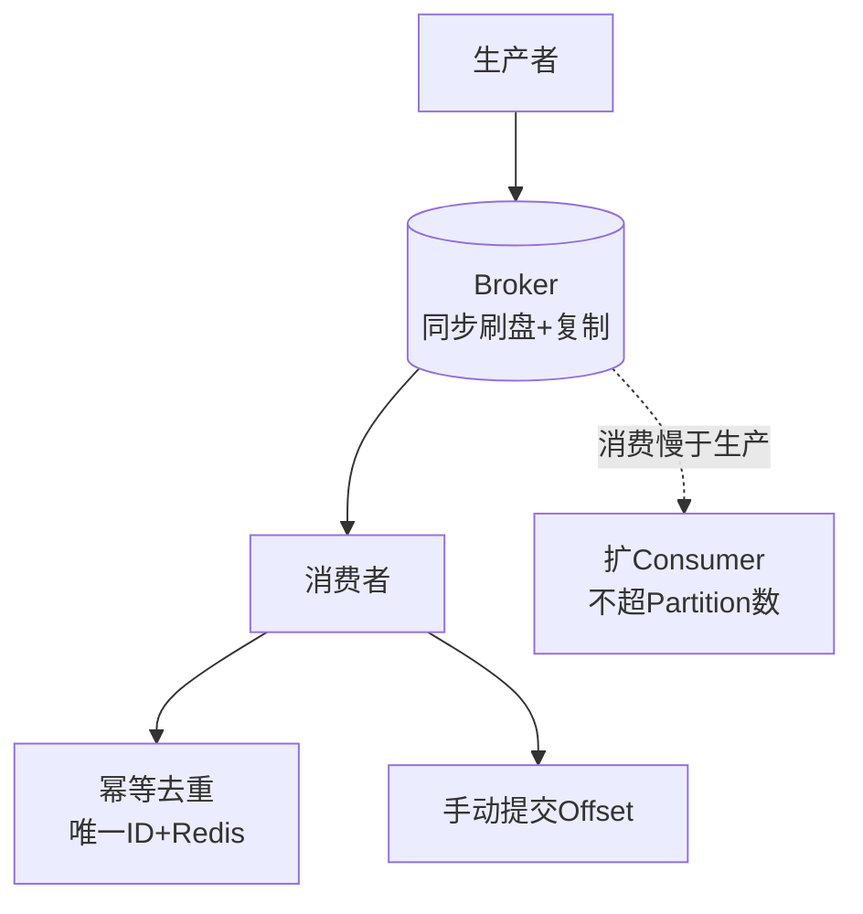
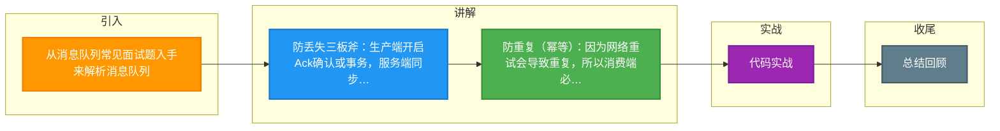

# 从消息队列常见面试题入手来解析消息队列

【消息队列核心作用】消息队列（MQ）主要用于异步处理、服务解耦、流量削峰填谷。

【核心面试问题】
1.  **如何保证消息不丢失？**
    *   **生产者端**：
        *   **Ack 机制**：发送消息后，等待 Broker 返回确认（如 RocketMQ 的 `SendResult`，Kafka 的 `acks` 参数）。
        *   **事务消息**：使用半消息机制确保本地事务与消息发送的原子性（如 RocketMQ 事务消息）。
        *   **异常重试**：网络异常触发自动重试，且需保证重试不导致重复（业务幂等）。
    *   **服务端**：
        *   **刷盘策略**：配置同步刷盘保证断电不丢，或异步刷盘换取性能。
        *   **集群复制**：采用同步复制或多副本机制，确保 Master 挂掉后 Slave 有数据。
        *   **参数细节**：Kafka 中 `acks=all` (或 `-1`) 代表主从都写入成功；`min.insync.replicas` 控制最少同步副本数。
    *   **消费者端**：
        *   **手动提交 Offset**：业务逻辑执行成功后，再向 Broker 提交消费进度，避免“消费了但未提交”导致的丢消息。

2.  **如何保证消息不重复（幂等性）？**
    *   **幂等设计原则**：无论消息消费多少次，结果与消费一次一致。
    *   **唯一 ID 判重**：生产者生成全局唯一 ID（如 UUID、雪花算法）。消费者在 Redis（`SETNX`）或 DB（唯一索引）中校验是否已处理。
    *   **状态机检查**：基于业务状态判断（如订单状态“已支付”，重复支付请求直接拒绝）。

3.  **如何保证消息的顺序性？**
    *   **单分区有序**：在发送端，将有序消息发送到同一个 Queue/Partition 中。
    *   **单线程消费**：消费者端同一 Partition 只能由一个消费者线程处理，内部采用单线程顺序处理，或加内存队列进行多线程有序分发（较复杂）。
    *   **注意事项**：如果发生消费失败重试，可能打乱后续消息顺序，需要额外处理（如缓存失败消息，后续恢复）。

4.  **如何处理消息堆积？**
    *   **排查原因**：通常是下游消费速度低于生产速度，或消费者挂掉、数据库瓶颈。
    *   **扩容消费者**：在 Queue 数量充足的情况下，增加 Consumer 实例数（注意需小于等于 Queue 数）。
    *   **批量消费**：调整客户端参数，一次性拉取多条消息批量处理，减少网络开销。
    *   **丢弃/降级**：对于非核心数据，可临时新建 Topic 直接丢弃积压数据，或只保留最新数据。
    *   **临时扩容方案**：如果 Queue 数不足，可新建 Topic（扩容 Partition），将积压消息通过自定义程序转发进去，再增加消费者进行紧急消费。

【常见MQ对比】
*   **RocketMQ**：事务消息支持好，适合金融业务、订单一致性要求高的场景。延迟消息、死信队列功能丰富。
*   **Kafka**：吞吐量极高，依赖 Page Cache 和 SendFile 零拷贝，适合大数据日志处理、用户行为流分析。

## 常见考点
1.  **消息队列的可靠性 vs 吞吐量权衡**：同步刷盘/同步复制可靠性高但吞吐量低，如何根据业务场景（如支付 vs 日志）选择配置？
2.  **消息积压的线上排查与恢复**：如果积压了上千万条数据，如何设计恢复方案（如扩容 Partition、转发消息等）？
3.  **零拷贝原理**：Kafka/RocketMQ 如何利用 `sendfile` 或 `mmap` 提高文件读取和网络发送的效率？
4.  **事务消息的实现流程**：RocketMQ 事务消息的“半消息”机制是如何协调本地事务和消息发送的（提交/回滚/回查）？

**实战案例**：
在某次大促中，由于下游支付服务降级，订单库产生数千万积压。由于 Partition 数固定无法横向扩容，我们采取“临时方案”：编写一个临时的转发消费者，将积压 Topic 中的消息按业务 ID Hash 后转发到一个拥有 10 倍 Partition 数量的新 Topic，然后部署 10 倍数量的消费者进行紧急消费，仅用 30 分钟消化完积压。

**代码示例**：
```java
// Redis + 唯一ID 实现幂等性消费示例
public void consumeMessage(Message msg) {
    String msgId = msg.getMsgId();
    // SETNX: 如果 key 不存在则设置，返回 1；存在则返回 0
    Boolean isSuccess = redisTemplate.opsForValue().setIfAbsent("msg_processed:" + msgId, "1", 24, TimeUnit.HOURS);
    if (Boolean.TRUE.equals(isSuccess)) {
        // 真正的业务处理逻辑（如插入数据库）
        saveToDb(msg.getBody());
    } else {
        // 消息已处理，直接忽略或记录日志
        log.info("Duplicate message ignored: {}", msgId);
    }
}
```

**消息可靠性机制对比**：

| 场景 | RocketMQ | Kafka |
| :--- | :--- | :--- |
| **同步刷盘** | `flushDiskType=SYNC_FLUSH` (性能损耗大) | 需依赖配置 `log.flush.interval.messages` (一般不强制配置，依赖 OS PageCache) |
| **同步复制** | `brokerRole=SYNC_MASTER` | `acks=all` 且 `min.insync.replicas>1` |
| **事务消息** | 原生支持事务消息 | 仅支持幂等生产者，不支持跨 DB 分布式事务 |
| **消息顺序** | 单分区 (FIFO) 严格有序 | 单分区有序，但受消费者 Session 超时影响可能乱序 |




## 记忆要点

- 防丢失三板斧：生产端开启Ack确认或事务，服务端同步刷盘与复制，消费端手动提交Offset
- 防重复（幂等）：因为网络重试会导致重复，所以消费端必须基于唯一ID结合Redis或DB索引去重
- 防积压策略：若消费慢于生产，需横向扩容Consumer（不能超Partition数），或临时批量消费

## 结构化回答


**30 秒电梯演讲：** 像餐厅传菜口：厨师（生产者）做好菜放窗口，服务员（消费者）按需取，互不干扰。

**展开框架：**
1. **三大核心** — 解耦、异步、削峰
2. **Ack** — 可靠性需防丢失（Ack/持久化）、防重复（幂等）
3. **高吞吐量与顺序性** — 高吞吐量与顺序性、一致性需权衡

**收尾：** 这是我实战中的理解，您想深入哪一段？


## 视频脚本

> 预计时长：3 分钟 | 由浅入深

| 时间 | 画面/字幕 | 口播台词 | 讲解要点 |
|------|----------|----------|----------|
| 0:00 | 标题卡：从消息队列常见面试题入手来解析消息队… | "从消息队列常见面试题入手来解析消息队列？一句话——像餐厅传菜口：厨师（生产者）做好菜放窗口，服务员（消费者）按需取，互不干扰。" | 开场钩子 |
| 0:45 | 概念动画/示意图 | "MQ是异步通信中间件，核心解决解耦、异步和缓冲问题——像餐厅传菜口：厨师（生产者）做好菜放窗口，服务员（消费者）按需取，互不干扰" | 核心定义 |
| 1:30 | 防丢失三板斧示意 | "生产端开启Ack确认或事务，服务端同步刷盘与复制，消费端手动提交Offset" | 要点1 |
| 2:15 | 防重复（幂等）示意 | "因为网络重试会导致重复，所以消费端必须基于唯一ID结合Redis或DB索引去重" | 要点2 |
| 3:00 | 总结卡 | "记住这几条，面试不慌。下期讲进阶追问。" | 收尾 |

---

### 视频流程图




## 延伸：什么是消息队列

> 合并自 `mq-002`（相似度 75%）

【定义】消息队列（Message Queue，简称MQ）是一种跨进程的通信机制，用于在消息生产者和消费者之间传递消息。它通常采用队列（FIFO）结构，保证消息的先进先出。

【核心作用】
1. **异步处理**：将非实时流程剥离，主流程快速返回。例如：下单后发消息通知积分/短信服务异步处理。
2. **服务解耦**：生产者无需知道消费者的存在，降低系统耦合度。例如：订单服务只需发消息，谁订阅谁处理。
3. **流量控制（削峰填谷）**：缓冲突发流量，保护后端服务不被压垮。例如：秒杀场景下，请求先入MQ，后端服务按能力消费。

【常见术语】
- Topic（主题）：消息的逻辑分类。
- Queue（队列）：消息的物理存储单元。
- Producer（生产者）：发送消息的应用。
- Consumer（消费者）：接收消息的应用。
- Broker（代理）：MQ的服务端节点。

**实战案例**：
在某电商大促秒杀活动中，瞬间涌入 50万 QPS 的下单请求，直接打到数据库会导致数据库死锁。通过在网关层将请求直接写入 Kafka，订单服务仅以 2000 QPS 的速度匀速拉取并扣减库存，成功将数据库负载控制在安全水位以下，实现了“削峰”保护。

**代码示例 (伪代码)**：
```java
// 生产者：秒杀下单请求直接入队，不等待扣库存完成
public String seckill(Long userId, Long productId) {
    // 快速校验用户资质
    if (!checkUser(userId)) return "Failed";
    // 构造消息
    OrderMessage msg = new OrderMessage(userId, productId);
    // 发送 MQ，设置超时时间短，快速响应前端
    mqProducer.send("ORDER_TOPIC", msg); 
    return "Queueing..."; // 立即返回，避免前端超时
}

// 消费者：异步处理真正的扣库存逻辑
@MQListener(topic = "ORDER_TOPIC")
public void handleOrder(OrderMessage msg) {
    // 慢速、稳健的数据库操作
    inventoryService.deductStock(msg.getProductId());
}
```

**模式对比**：

| 维度 | 同步调用 (RPC/HTTP) | 消息队列 (MQ) 异步调用 |
| :--- | :--- | :--- |
| **耦合度** | 高 (需知道下游服务地址、接口定义) | 低 (只管发 Topic，不关心谁消费) |
| **性能** | 低 (总耗时 = Sum(所有下游耗时)) | 高 (总耗时 = 发送耗时，取决于最慢环节) |
| **吞吐量** | 受限于最慢的下游服务 | 极高 (缓存于 Broker 缓冲区) |
| **可靠性** | 下游挂了，请求直接失败 | 下游挂了，消息暂存 Broker，恢复后可重试 |
| **适用场景** | 强一致性场景 (如前端查询) | 弱一致性、高并发、异步通知场景 |

## 记忆要点

- 三大核心作用：异步处理提速、服务解耦、流量控制（削峰填谷）
- 削峰对比：同步调用受限于最慢节点易崩溃，而MQ通过Broker缓冲突发流量保护下游
- 典型场景：秒杀大促等高并发场景，利用MQ将50万QPS请求缓存，下游按自身能力匀速消费

## 结构化回答

**30 秒电梯演讲：** MQ是异步通信中间件，用于解耦、缓冲和异步处理。打个比方，像邮局：寄信人（生产者）把信投邮箱，邮局（MQ）分拣，收信人（消费者）收信。

**展开框架：**
1. **三大核心作用** — 异步处理提速、服务解耦、流量控制（削峰填谷）
2. **削峰对比** — 同步调用受限于最慢节点易崩溃，而MQ通过Broker缓冲突发流量保护下游
3. **典型场景** — 秒杀大促等高并发场景，利用MQ将50万QPS请求缓存，下游按自身能力匀速消费

**收尾：** 我在项目里踩过坑——在某电商大促秒杀活动中，瞬间涌入 50万 QPS 的下单请求，直接打到数据库会导致数据库死锁。您想深入聊哪一段：原理、避坑还是对比选型？

## 视频脚本

> 预计时长：3 分钟 | 由浅入深

| 时间 | 画面/字幕 | 口播台词 | 讲解要点 |
|------|----------|----------|----------|
| 0:00 | 标题卡：什么是消息队列 | "什么是消息队列？一句话——像邮局：寄信人（生产者）把信投邮箱，邮局（MQ）分拣，收信人（消费者）收信。" | 开场钩子 |
| 0:45 | 概念动画/示意图 | "MQ是异步通信中间件，用于解耦、缓冲和异步处理——像邮局：寄信人（生产者）把信投邮箱，邮局（MQ）分拣，收信人（消费者）收信" | 核心定义 |
| 1:30 | 三大核心作用示意 | "异步处理提速、服务解耦、流量控制（削峰填谷）" | 要点1 |
| 2:15 | 削峰对比示意 | "同步调用受限于最慢节点易崩溃，而MQ通过Broker缓冲突发流量保护下游" | 要点2 |
| 3:00 | 总结卡 | "记住这几条，面试不慌。下期讲进阶追问。" | 收尾 |

### 视频流程图


