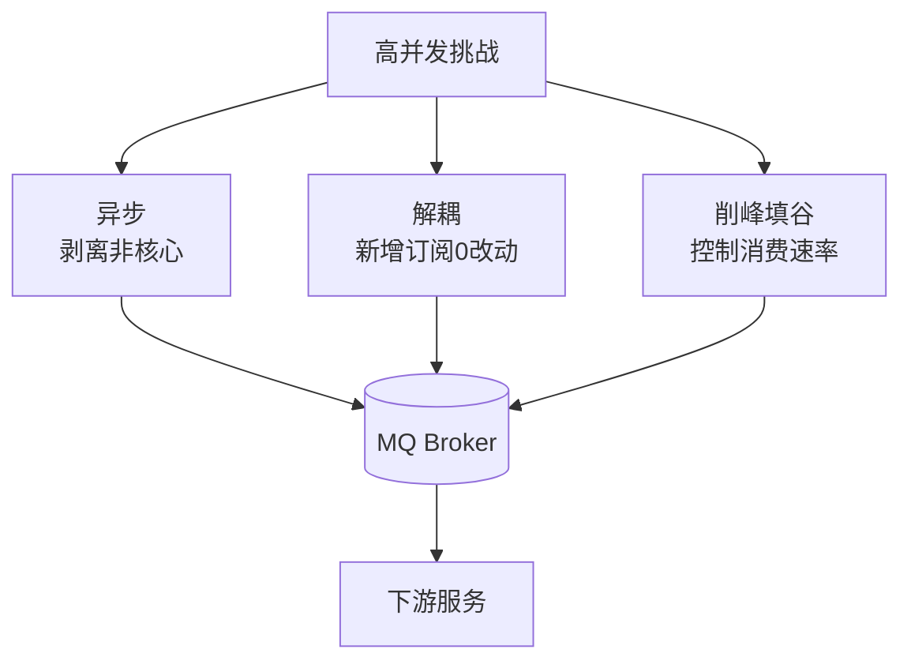

# 为什么需要消息队列

### 为什么需要消息队列

主要为了应对互联网高并发、复杂业务场景下的三大技术挑战：

#### 1. 异步处理
- **场景**：业务链路变长，同步调用导致响应缓慢。
- **解决**：将非核心逻辑（如发短信、积分）剥离，通过MQ异步通知。主线程无需等待，响应时间显著降低，系统吞吐量提升。
- **🔥 实战案例**：在某电商订单创建流程中，将**耗时2秒的物流下发**与**积分写入**异步化，使主接口RT从2.5s降至200ms，避免了上游网关超时熔断。

#### 2. 服务解耦
- **场景**：下游系统（如营销、数据分析）不断增加，核心业务（如订单）需频繁修改接口适配。
- **解决**：订单服务只需将状态变更发到MQ，下游系统自主订阅。新增业务只需增加订阅者，无需改动订单代码。
- **🔥 实战案例**：大数据团队新增一个“实时BI分析”需求，因架构已通过MQ解耦，仅需订阅Topic `order_paid` 即获取数据，**0改动**订单服务代码，上线风险降为0。

#### 3. 流量控制（削峰填谷）
- **场景**：秒杀、大促等流量洪峰瞬间涌入，后端服务因资源有限崩溃。
- **解决**：请求先进入MQ，后端服务按照最大处理能力平滑消费。超过能力的请求可暂存或丢弃，保证系统存活。
- **🔥 实战案例**：在“双11”零点，瞬时QPS达5万，通过RabbitMQ设置prefetch_count=10限制消费者速率，成功将下游数据库写入速率控制在安全阈值（2k TPS），**防止了数据库死锁**。

#### 代码示例
```java
// Spring Boot 实现异步发送订单消息
// 核心：使用CompletableFuture或直接调用MQTemplate实现非阻塞
public void createOrder(OrderDTO order) {
    // 1. 核心逻辑：落库
    orderService.saveToDb(order);
    
    // 2. 异步通知：不阻塞主线程
    rocketMQTemplate.asyncSend("order-topic", order, new SendCallback() {
        @Override
        public void onSuccess(SendResult sendResult) {
            log.info("消息发送成功", sendResult.getMsgId());
        }
        @Override
        public void onException(Throwable e) {
            log.error("消息发送失败，需记录重试", e);
        }
    });
}
```

## 技术原理

MQ 的三大核心价值——异步、解耦、削峰——本质上都是**通过引入"中间缓冲层"切断请求的同步强依赖**，把"实时强一致"转化为"最终一致 + 高吞吐"。每一项价值背后都对应一种系统痛点。

- **异步提速的本质——把串行改并行、把用户等待改后台处理**：同步调用链路里，用户必须等所有下游（支付、库存、积分、短信、风控）都完成才返回，RT 是各服务耗时之和。MQ 把"必须做的核心"（落库订单）和"可后做的非核心"（积分、短信、统计）切开，核心同步、非核心丢进 MQ 异步处理。用户 RT 从 N 个服务之和降到 1-2 个核心服务。**关键：异步不省总工作量，但省用户感知的等待时间**。
- **解耦的本质——用 Topic 替代接口契约**：同步调用下，订单服务要知道"积分服务、营销服务、BI 服务的接口"，下游任何变更（加字段、改 URL、加新业务）都要改订单代码 + 联调 + 发版。MQ 模式下订单只往 `order_paid` topic 发消息，下游各自订阅，互不感知。新增 BI 分析只需订阅 topic，**0 改动上游**。这把"星型强耦合"（订单→所有下游）变成了"总线松耦合"。
- **削峰的本质——用 MQ 作为流量蓄水池**：秒杀 5 万 QPS 瞬时流量，DB 只能扛 2K TPS。同步架构下 DB 直接被压垮（连接池耗尽、死锁、主从延迟）。MQ 把请求先落盘排队，消费者按 DB 能力（2K TPS）匀速消费。洪峰被"削平"成持续 2K 的流量，DB 平稳运行。代价是用户感知到延迟（从毫秒到秒级），但避免了系统崩溃——**保活 > 体验**是削峰的核心权衡。
- **可靠性的基础——持久化 + ACK 机制**：MQ 不是 in-memory 队列，消息落盘后才回 ACK 给生产者；消费者处理完业务再回 ACK 给 MQ，MQ 才删消息。这保证了 MQ 宕机不丢消息、消费者宕机消息会重投。这是 MQ 能用于"事务性业务"（订单、支付）的前提。

## 代码示例

```java
// 1. 异步处理：核心同步 + 非核心 MQ 通知
@Service
public class OrderService {

    @Autowired
    private RocketMQTemplate mqTemplate;

    @Transactional
    public OrderResult createOrder(OrderDTO order) {
        // 1. 核心逻辑（同步）：订单落库 + 扣库存（事务保护）
        Order order = saveOrderToDb(order);
        inventoryService.deduct(order.getSkus());

        // 2. 非核心逻辑（异步）：发 MQ，下游各自消费
        OrderMessage msg = new OrderMessage(order.getId(), order.getUserId(),
                                             order.getAmount());
        // 异步发送，不阻塞主线程
        mqTemplate.asyncSend("order-paid", msg, new SendCallback() {
            @Override
            public void onSuccess(SendResult r) { log.info("order msg sent"); }
            @Override
            public void onException(Throwable e) {
                // 失败进本地重试表，定时任务补偿
                log.error("MQ 发送失败，记录重试表", e);
                retryTableDao.save(new RetryRecord(msg));
            }
        });

        return OrderResult.success(order);   // 用户立即返回，不等下游
    }
}

// 消费者：积分服务独立部署，订阅 topic
@RocketMQMessageListener(topic = "order-paid", consumerGroup = "points-service")
public class PointsConsumer implements RocketMQListener<OrderMessage> {
    @Override
    public void onMessage(OrderMessage msg) {
        pointsService.addPoints(msg.getUserId(), msg.getAmount());   // 失败会自动重投
    }
}
```

```java
// 2. 削峰填谷：限流消费，保护下游 DB
@RocketMQMessageListener(topic = "seckill-request",
        consumerGroup = "seckill-consumer",
        consumeMode = ConsumeMode.CONCURRENTLY,
        consumeThreadMax = 20,           // 限制并发消费线程数
        maxReconsumeTimes = 3)           // 失败重试 3 次后进死信队列
public class SeckillConsumer implements RocketMQListener<SeckillRequest> {

    @Override
    public void onMessage(SeckillRequest req) {
        // RateLimiter 控制：即使 MQ 堆积 10 万消息，消费速率恒定
        if (!rateLimiter.tryAcquire(1, TimeUnit.SECONDS)) {
            throw new RuntimeException("消费过快，触发限流");  // 抛异常让 MQ 重投
        }
        orderService.processSeckill(req);   // 按 DB 能力匀速消费
    }
}

// 生产端：秒杀请求先入 MQ，不入 DB
@PostMapping("/seckill")
public Result seckill(@RequestBody SeckillRequest req) {
    // 关键：不直接下单，先入 MQ 排队
    mqTemplate.syncSend("seckill-request", req);
    return Result.success("排队中，请稍候");   // 用户立即返回
}
```

```java
// 3. 解耦：多业务订阅同一 Topic，互不影响
// BI 分析服务
@RocketMQMessageListener(topic = "order-paid", consumerGroup = "bi-analytics")
public class BiConsumer implements RocketMQListener<OrderMessage> { ... }

// 营销服务（送优惠券）
@RocketMQMessageListener(topic = "order-paid", consumerGroup = "marketing-coupon")
public class MarketingConsumer implements RocketMQListener<OrderMessage> { ... }

// 推荐服务（更新用户画像）
@RocketMQMessageListener(topic = "order-paid", consumerGroup = "recommend-profile")
public class RecommendConsumer implements RocketMQListener<OrderMessage> { ... }
// 新增业务只需新增一个 Consumer，订单服务 0 改动
```

## 对比选型

| 维度 | 同步 RPC | 消息队列 MQ | 异步线程池 |
| :--- | :--- | :--- | :--- |
| **响应时间** | 长（所有下游之和） | 短（仅核心） | 短（仅核心） |
| **耦合度** | 强（接口契约） | 弱（Topic 订阅） | 中（同进程） |
| **削峰能力** | 无 | 强（持久化排队） | 弱（内存有限） |
| **可靠性** | 强一致 | 最终一致 | 进程崩溃即丢 |
| **跨进程/服务** | 是 | 是 | 否（同 JVM） |
| **运维复杂度** | 低 | 中（需运维 MQ 集群） | 低 |
| **典型场景** | 实时强一致业务 | 高并发解耦/削峰 | 进程内异步任务 |

## 常见坑

- **MQ 引入降低了可用性**：MQ 宕机所有异步业务停滞。MQ 必须集群部署 + 监控告警，关键业务要有降级方案（MQ 不可用时降级为同步调用）。
- **消息丢失的三个环节**：（1）生产者发送失败不入库；（2）MQ 持久化前宕机（用同步刷盘）；（3）消费者 ACK 前宕机但业务已执行（幂等设计）。每个环节都要确认。
- **消费幂等是必须的**：网络重投、消费者宕机重启都会导致重复消费。消费者必须用业务唯一键（订单号、事件 ID）做幂等检查，否则积分翻倍、库存扣多次。
- **消息堆积的爆炸**：消费者跟不上生产速率，消息堆积在 MQ。超过磁盘阈值 MQ 拒收，生产者报错。必须监控堆积量，超阈值告警 + 临时扩消费者。
- **顺序消息陷阱**：默认消费是并发的，同订单的"创建→支付→发货"消息可能乱序。需要用顺序消息（同一 key 路由到同一队列 + 单线程消费），代价是吞吐下降。
- **事务消息不是分布式事务**：RocketMQ 事务消息只保证"本地事务 + 消息发送"的原子性，不保证下游消费成功。下游失败要靠重试 + 人工兜底。
- **异步 ≠ 免成本**：MQ 把延迟从用户感知转移到后台，但总耗时不变甚至略增（多了 MQ 中转）。实时性要求高的场景（支付、风控）仍需同步。



## 记忆要点

- 口诀：异步、解耦、削峰。这是MQ解决高并发三大挑战的核心价值。
- 因为同步链路长耗时高，所以用异步剥离非核心（如积分），提升系统吞吐。
- 因为下游系统经常变更，所以用MQ解耦，新增业务仅需订阅Topic，老代码0改动。
- 因为秒杀洪峰易冲垮DB，所以用MQ削峰填谷，控制消费速率保护后端。

## 结构化回答

**30 秒电梯演讲：** 通过缓冲和解耦，解决高并发下的性能瓶颈与复杂依赖问题。打个比方，像水库（MQ）：雨季（高并发）蓄水防洪，旱季（空闲）放水灌溉，保证下游平稳。

**展开框架：**
1. **口诀** — 异步、解耦、削峰。这是MQ解决高并发三大挑战的核心价值。
2. **用异步剥离非核心（如积分）** — 因为同步链路长耗时高，所以用异步剥离非核心（如积分），提升系统吞吐。
3. **用MQ解耦** — 因为下游系统经常变更，所以用MQ解耦，新增业务仅需订阅Topic，老代码0改动。

**收尾：** 我在项目里踩过坑——在某电商订单创建流程中，将耗时2秒的物流下发与积分写入异步化，使主接口RT从2.5s降至200ms，避免了上游网关超时熔断。您想深入聊哪一段：原理、避坑还是对比选型？

## 视频脚本

> 预计时长：3 分钟 | 由浅入深

| 时间 | 画面/字幕 | 口播台词 | 讲解要点 |
|------|----------|----------|----------|
| 0:00 | 标题卡：为什么需要消息队列 | "为什么需要消息队列？一句话——像水库（MQ）：雨季（高并发）蓄水防洪，旱季（空闲）放水灌溉，保证下游平稳。" | 开场钩子 |
| 0:45 | 概念动画/示意图 | "通过缓冲和解耦，解决高并发下的性能瓶颈与复杂依赖问题——像水库（MQ）：雨季（高并发）蓄水防洪，旱季（空闲）放水灌溉，保证下游平稳" | 核心定义 |
| 1:30 | 口诀示意 | "异步、解耦、削峰。这是MQ解决高并发三大挑战的核心价值。" | 要点1 |
| 2:15 | 要点2图解示意 | "因为同步链路长耗时高，所以用异步剥离非核心（如积分），提升系统吞吐。" | 要点2 |
| 3:00 | 总结卡 | "记住这几条，面试不慌。下期讲进阶追问。" | 收尾 |
