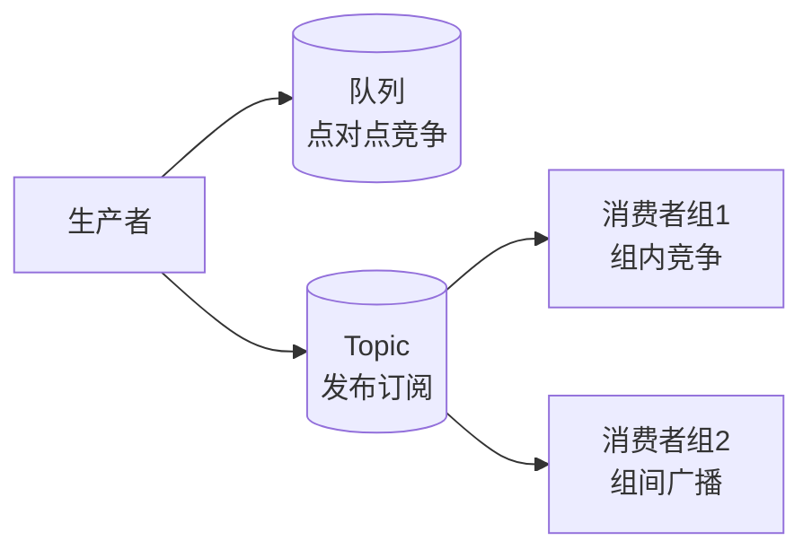

# 消息队列基本概念

【消息队列模型】
1.  **队列模型（点对点）**
    *   **机制**：生产者发送消息到特定队列，多个消费者竞争消费。每条消息仅被一个消费者处理。
    *   **特点**：独占消费，适合任务分发。

2.  **发布/订阅模型**
    *   **机制**：生产者发送消息到 Topic，多个订阅者（消费者组）均可接收消息。通常每个消费者组内消费一次，组间广播。
    *   **特点**：一对多广播，适合数据通知（如日志同步、配置更新）。

**【架构模型示意图】**

```text
  [队列模型 - 点对点]              [发布订阅模型 - 广播]

    Producer                    Producer
       |                           |
       v                           v
  +---------+                 +--------------+
  |  Queue  |                 |    Topic     |
  +---------+                 +--------------+
    |   |   |                    |      |      |
    |   |   +----> Consumer A    |      |      +---> Consumer Group A
    |   |                        |      |      |       (C1, C2 竞争)
    |   +------> Consumer B      |      +-----> Consumer Group B
    |                            |              (C3, C4 竞争)
    +-----> Consumer C           +--------------+
```

**【引入风险】**
*   **复杂性**：增加了系统架构的复杂度（消息投递、顺序性、一致性难以保障）。
*   **可用性降低**：MQ 本身成为故障点，需集群保障高可用。
*   **数据一致性**：分布式事务难以处理，可能存在数据不一致。

---

### 深化补充

**【实战案例】**
*   **场景**：在电商大促场景下，曾错误使用“广播消费”来处理“订单创建”消息。原本意图是通知风控、积分、物流三个系统，结果导致三个系统各自消费同一笔订单，且由于其中一个系统处理变慢，拖累了整个链路，后来改为使用三个独立的“集群消费”消费者组分别订阅，实现了业务解耦与故障隔离。

**【模型对比表格】**

| 特性 | 队列模型 | 发布/订阅模型 |
| :--- | :--- | :--- |
| **耦合度** | 强耦合（生产者需明确知道队列名） | 松耦合（生产者只需关注 Topic）
| **消费模式** | 独占消费（一条消息仅一人得） | 独占（组内）/ 广播（组间）
| **典型应用** | 任务分发、异步处理 | 数据同步、通知广播 |
| **代表实现** | RabbitMQ (工作队列), ActiveMQ | Kafka, RocketMQ (Topic 模式) |

**【关键代码示例 (RabbitMQ Java Client - 声明交换机与队列绑定)】**
```java
// 发布订阅模式示例：Fanout 交换机
channel.exchangeDeclare("logs_exchange", "fanout");
String queueName = channel.queueDeclare().getQueue();
// 绑定队列到交换机，实现广播
channel.queueBind(queueName, "logs_exchange", "");

// 发送消息
String message = "Info: Hello World!";
channel.basicPublish("logs_exchange", "", null, message.getBytes());
```

## 常见考点
1.  **集群消费与广播消费的区别**：在同一消费者组内，消息是负载均衡（集群）还是全量投递（广播）？不同场景如何选择？
2.  **Rebalance（重平衡）机制**：当消费者数量发生变化时，MQ（如 Kafka 或 RocketMQ）如何重新分配 Partition？这期间可能会造成什么问题（如消息重复消费或消费暂停）？
3.  **消息堆积的排查**：如果是队列模型，如何快速排查是哪个消费者处理慢？如果是 Pub/Sub 模式，如何监控某个订阅者的延迟？




## 核心知识点图


## 记忆要点

- 队列模型是点对点：多消费者竞争瓜分，一条消息只被一个消费者处理。
- 发布订阅模型是广播：Topic组间广播，组内竞争，一条消息可被多组消费。
- 引入MQ必然增加复杂性：系统可用性降低且存在数据一致性等分布式挑战。

## 结构化回答

**30 秒电梯演讲：** MQ模型分点对点（独占）和发布订阅（广播），各有适用场景。打个比方，点对点像打电话（一对一通话），发布订阅像广播（所有人听同一频道）。

**展开框架：**
1. **队列模型是点对点** — 多消费者竞争瓜分，一条消息只被一个消费者处理。
2. **发布订阅模型是广播** — Topic组间广播，组内竞争，一条消息可被多组消费。
3. **引入MQ必然增加复杂性** — 系统可用性降低且存在数据一致性等分布式挑战。

**收尾：** 我在项目里踩过坑——场景：在电商大促场景下，曾错误使用“广播消费”来处理“订单创建”消息。您想深入聊哪一段：原理、避坑还是对比选型？

## 视频脚本

> 预计时长：2 分钟 | 由浅入深

| 时间 | 画面/字幕 | 口播台词 | 讲解要点 |
|------|----------|----------|----------|
| 0:00 | 标题卡：消息队列基本概念 | "消息队列基本概念？一句话——点对点像打电话（一对一通话），发布订阅像广播（所有人听同一频道）。" | 开场钩子 |
| 0:40 | 概念动画/示意图 | "MQ模型分点对点（独占）和发布订阅（广播），各有适用场景——点对点像打电话（一对一通话），发布订阅像广播（所有人听同一频道）" | 核心定义 |
| 1:20 | 队列模型是点对点示意 | "多消费者竞争瓜分，一条消息只被一个消费者处理。" | 要点1 |
| 2:00 | 总结卡 | "记住这几条，面试不慌。下期讲进阶追问。" | 收尾 |
