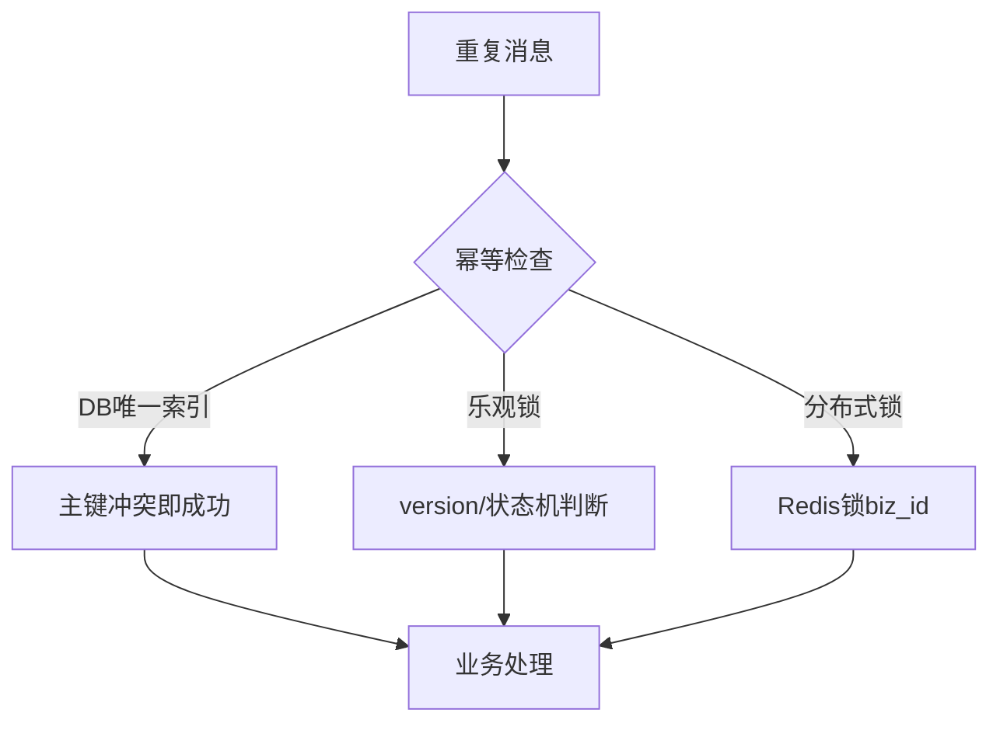

# 如果处理重复消息

在分布式系统中，网络抖动、故障恢复等都会导致消息重复（At-Least-Once 语义）。因此，**消费端的幂等性设计**是处理重复消息的唯一正确途径。

### 一、为什么消息会重复？

1.  **生产者发送重复**：
    *   生产者发送消息，Broker成功写入并持久化，但在返回ACK时网络超时。
    *   生产者未收到ACK，触发重试机制，导致Broker收到两条相同的消息。
2.  **消费者重复消费**：
    *   消费者消费消息成功，业务逻辑执行完毕，但在提交Offset（消费进度）之前宕机或网络断开。
    *   Broker认为消费未成功，重新将消息分配给其他消费者（或重连后）再次消费。

### 二、幂等性设计方案
幂等性指：**无论对同一条消息执行多少次操作，其结果与执行一次是一样的。**

#### 1. 利用数据库唯一约束
适用场景：业务数据涉及数据库插入（如订单、用户流水）。
*   **方案**：为业务表设计唯一索引（Unique Key），如 `order_id`。
*   **原理**：当重复消息到来触发插入操作时，数据库会因违反唯一约束而抛出异常，捕获该异常并直接忽略即可。
*   **SQL示例**：
    ```sql
    INSERT INTO t_order (order_id, amount) VALUES ('001', 100);
    -- 重复插入时报错，业务代码捕获该错误视为成功
    ```

#### 2. 乐观锁/版本号机制
适用场景：更新操作。
*   **方案**：在数据库表中增加 `version` 字段。
*   **原理**：更新时检查并更新版本号，确保只有当前版本匹配时才执行成功。
*   **SQL示例**：
    ```sql
    UPDATE t_account 
    SET balance = balance - 100, version = version + 1 
    WHERE id = 1 AND version = 100;
    ```
    *   如果第一条消息执行成功，version变为101。重复消息到来时，`version = 100` 条件不满足，影响行数为0，不执行扣减。

#### 3. 状态机前置判断
适用场景：业务有明确的状态流转（如：待支付 -> 已支付）。
*   **原理**：执行更新时带上当前状态作为条件。
*   **SQL示例**：
    ```sql
    UPDATE t_order SET status = 'PAID' WHERE id = 1 AND status = 'UNPAID';
    ```

#### 4. 去重表
适用场景：业务逻辑复杂，无法直接修改原表结构。
*   **方案**：建立一张独立的去重表（如 `t_mq_transaction_log`），包含唯一标识（如消息唯一ID `msg_id` 或业务ID `biz_id`）。
*   **流程**：
    1.  在业务操作所在的本地事务中，先插入去重表。
    2.  如果插入成功，继续执行业务。
    3.  如果插入失败（主键冲突），说明消息已处理，直接返回成功。

#### 5. 分布式锁
适用场景：高并发、处理时间短的逻辑。
*   **方案**：使用 Redis 的 `SETNX` 或 Redisson 锁。
*   **流程**：以 `biz_id` 为 Key 加锁。如果加锁成功，执行业务；如果锁已存在，说明已处理，跳过。
*   *注意*：锁要设置合理的过期时间，防止死锁。且需保证业务执行时间小于锁过期时间。

---

### 深化补充

**【实战案例】**
*   **场景**：在优惠券领取业务中，曾使用简单的 Redis `SETNX` 实现幂等。某次 Redis 发生主从切换，加锁成功的指令还未同步到从节点，导致从节点升级为主后 Key 丢失。第二次重复请求进来时，Redis 认为是首请求，导致用户重复领取优惠券。后续优化为结合数据库唯一约束作为兜底，形成了“Redis 限流 + DB 唯一键保底”的双重保障。

**【幂等方案对比表格】**

| 方案 | 优点 | 缺点 | 适用场景 |
| :--- | :--- | :--- | :--- |
| **数据库唯一约束** | 简单可靠，无额外组件 | 依赖数据库，高并发时 DB 压力大 | 低并发写、强一致性要求 (订单) |
| **乐观锁** | 防并发冲突，无需加锁 | 高并发下大量失败重试，浪费 CPU | 库存扣减、余额更新 |
| **独立去重表** | 业务侵入性小，通用性强 | 需维护额外表，增加存储成本 | 复杂业务逻辑、事务一致性 |
| **分布式锁** | 性能高，不阻塞 DB | 架构复杂，存在锁失效风险 | 高并发、耗时短的操作 |

**【关键代码示例 (Java + Redisson 实现幂等)]**
```java
public void processOrder(String orderId) {
    String lockKey = "lock_order:" + orderId;
    RLock lock = redissonClient.getLock(lockKey);
    try {
        // tryLock 尝试获取锁，waitTime=0, leaseTime=10s
        if (lock.tryLock(0, 10, TimeUnit.SECONDS)) {
            // 查询订单状态，双重检查
            Order order = orderMapper.selectById(orderId);
            if (order.getStatus() == Status.UNPAID) {
                order.setStatus(Status.PAID);
                orderMapper.updateById(order);
            }
        }
    } catch (InterruptedException e) {
        Thread.currentThread().interrupt();
    } finally {
        if (lock.isHeldByCurrentThread()) {
            lock.unlock();
        }
    }
}
```

## 常见考点

1.  **如何生成全局唯一ID？**
    *   可以使用 UUID、数据库自增ID（不推荐分布式）、雪花算法、Redis INCR 等。
    *   在幂等设计中，通常使用业务ID（如订单号）作为去重键，无需额外生成全局ID。
2.  **Redis 分布式锁做幂等，如果业务执行时间超过了锁过期时间怎么办？**
    *   这是一个常见的坑。解决方案包括：使用 Redisson 的看门狗机制自动续期；或者将锁 Value 设为唯一标识，解锁时校验是否持有锁；或者设计较长的过期时间并监控业务耗时。
3.  **消息如果既丢了又重复了，应该优先解决哪个？**
    *   优先保证**不丢失**（可靠性），通过重试机制解决。
    *   在此基础上，通过**幂等性**解决重复问题。



## 记忆要点

- 因为网络抖动和重试必然导致消息重复，所以消费端必须实现幂等性。
- 数据库唯一索引：插入操作遇到主键冲突即视为成功，简单最可靠。
- 乐观锁/状态机：更新操作带version或前置状态判断，防并发与重复。
- 分布式锁：高并发下以biz_id为Key加Redis锁，处理完直接丢弃重复请求。

## 结构化回答

**30 秒电梯演讲：** 通过业务幂等性设计，保证重复操作结果一致。打个比方，支付按钮点多次，只扣一笔钱，因为后台做了查重。

**展开框架：**
1. **消费端必须实现幂等性** — 因为网络抖动和重试必然导致消息重复，所以消费端必须实现幂等性。
2. **数据库唯一索引** — 插入操作遇到主键冲突即视为成功，简单最可靠。
3. **乐观锁/状态机** — 更新操作带version或前置状态判断，防并发与重复。

**收尾：** 我在项目里踩过坑——场景：在优惠券领取业务中，曾使用简单的 Redis `SETNX` 实现幂等。您想深入聊哪一段：原理、避坑还是对比选型？

## 视频脚本

> 预计时长：3 分钟 | 由浅入深

| 时间 | 画面/字幕 | 口播台词 | 讲解要点 |
|------|----------|----------|----------|
| 0:00 | 标题卡：如果处理重复消息 | "如果处理重复消息？一句话——支付按钮点多次，只扣一笔钱，因为后台做了查重。" | 开场钩子 |
| 0:45 | 概念动画/示意图 | "通过业务幂等性设计，保证重复操作结果一致——支付按钮点多次，只扣一笔钱，因为后台做了查重" | 核心定义 |
| 1:30 | 消费端必须实现幂等性。示意 | "因为网络抖动和重试必然导致消息重复，所以消费端必须实现幂等性。" | 要点1 |
| 2:15 | 数据库唯一索引示意 | "插入操作遇到主键冲突即视为成功，简单最可靠。" | 要点2 |
| 3:00 | 总结卡 | "记住这几条，面试不慌。下期讲进阶追问。" | 收尾 |
