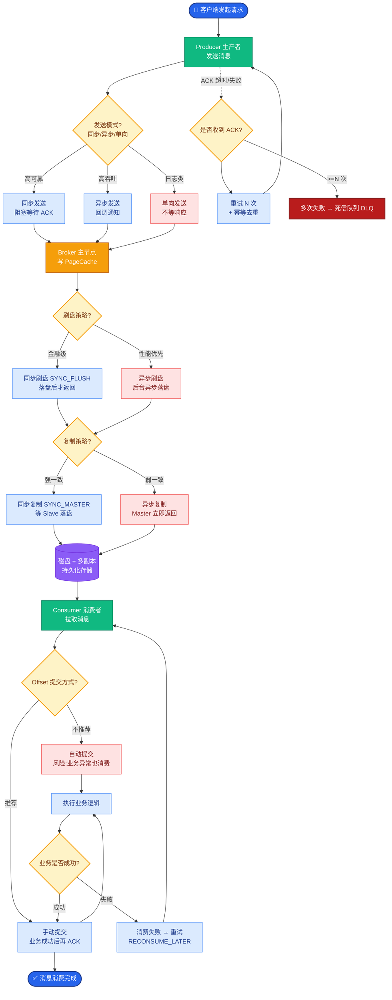
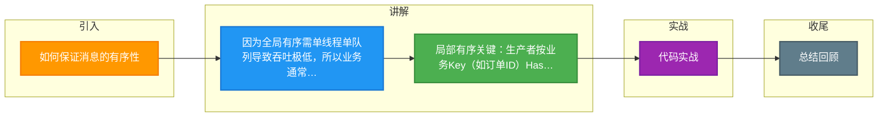

# 如何保证消息的有序性

消息队列的有序性分为**全局有序**和**局部（分区）有序**。在设计时，必须明确业务场景真正需要哪种有序性，因为有序性往往是以牺牲并发度为代价的。

### 一、全局有序

**定义**：Topic 中的所有消息严格按照先进先出（FIFO）的顺序被消费。

**实现条件**：
1.  **单分区**：Topic 只能有一个队列（Partition/Queue）。
2.  **单生产者**：只能由一个生产者发送消息（多生产者无法保证发送到Broker的顺序）。
3.  **单消费者**：只能由一个消费者消费（多消费者无法保证消费顺序）。

**架构图**：
```text
┌──────────────┐
│   Producer   │ (单线程发送)
└──────┬───────┘
       │
       ▼
┌──────────────────┐
│ Topic (Queue: 1) │ ───> 必须只有一个分区
└──────┬───────────┘
       │
       ▼
┌──────────────┐
│   Consumer   │ (单线程消费)
└──────────────┘
```
*   **结论**：全局有序吞吐量极低，一般仅用于特殊场景（如严格的银行流水同步）。大多数业务只需要局部有序。

### 二、局部有序

**定义**：只要同一业务键（如同一订单ID、同一用户ID）的消息是有序的即可，不同键的消息可以并发乱序。

**实现条件**：
1.  **多分区**：Topic 设置多个队列。
2.  **路由策略**：生产者发送消息时，根据业务 Key（如 `orderId`）计算 Hash，将相同 Key 的消息发送到**同一个**固定的队列中。
3.  **单线程消费者**：一个队列只能被同一个消费组中的一个消费者消费（MQ本身保证），且消费者内部对该队列的处理必须是单线程的（或有序线程池）。

**架构图**：
```text
                    ┌─── Queue 0 (Key A) ────> Consumer A (单线程)
┌──────────────┐    │
│   Producer   │───>┼─── Queue 1 (Key B) ────> Consumer B (单线程)
│ (Hash 路由)  │    │
└──────────────┘    └─── Queue 2 (Key C) ────> Consumer C (单线程)
```
*   **关键点**：Key A 的消息永远进 Queue 0，由 Consumer A 处理，保证了顺序性。同时 Queue 0, 1, 2 并行处理，提高了吞吐量。

### 三、特殊情况的处理

如果一定要在消费端使用多线程提高处理速度，又要保证顺序，可以使用“多线程有序消费”模型：

1.  消费者拉取消息后，根据 Key 将消息分发到内存中不同的 `BlockingQueue`。
2.  每个 `BlockingQueue` 绑定唯一的一个 Worker 线程。
3.  这样相同 Key 的消息在内存队列中依然是串行处理的。

---

### 深化补充

**【实战案例】**
*   **踩坑**：在实现“订单状态流转”的局部有序时，曾错误地将 Order ID 的 Hash 计算放在了 Producer 发送之后由 Broker 处理，导致部分相同订单的消息被路由到了不同的 Partition，造成状态机乱序（如“已发货”消息先于“已支付”被消费）。修复方案是将 Partition Key 的计算逻辑下沉到 Producer 发送端，显式指定 Partitioner。

**【有序性对比表格】**

| 特性 | 全局有序 | 局部有序 |
| :--- | :--- | :--- |
| **吞吐量** | 极低（受限于单线程） | 高（取决于分区数）
| **分区数** | 1 | N (可根据业务量横向扩展)
| **消费者数** | <= 1 | <= 分区数
| **适用场景** | 金融流水、严格时序控制 | 订单状态、用户行为记录 |
| **实现难点** | 性能瓶颈 | 路由策略设计、消费端并发控制 |

**【关键代码示例 (Kafka Producer 指定 Key 发送)]**
```java
// 构建消息时，指定 orderId 作为 Key
// Kafka 默认的 DefaultPartitioner 会对 Key 进行 Hash 计算，确保相同 Key 去同一分区
ProducerRecord<String, String> record = new ProducerRecord<>(
    "order_topic", 
    "ORDER_12345", // Key (订单号)
    "Payment Success" // Value
);
producer.send(record, new Callback() {
    @Override
    public void onCompletion(RecordMetadata metadata, Exception exception) {
        // 处理回调
    }
});
```

## 常见考点

1.  **Kafka 如何保证消息有序？**
    *   在生产者端配置 `max.in.flight.requests.per.connection = 1`，确保前一条消息没收到响应时不发下一条（防止重试导致的乱序），或者开启幂等性（5.0版本后允许>1但依然有序）。
    *   发送时指定 Partition Key（或自定义 Partitioner），确保同一 Key 去同一 Partition。
2.  **为什么说一个分区只能被消费组中的一个消费者消费？**
    *   这是 MQ 负载均衡的基本原则。如果同一个分区被两个消费者同时拉取，就会导致消息重复消费且无法控制顺序。
3.  **RabbitMQ 如何保证有序？**
    *   RabbitMQ 的 Queue 本身就是 FIFO 的。要保证有序，需确保只有一个消费者消费该 Queue，且消费者开启 `手动ACK` 并处理完一条再下一条。


## 核心流程图



## 记忆要点

- 因为全局有序需单线程单队列导致吞吐极低，所以业务通常只用局部有序。
- 局部有序关键：生产者按业务Key(如订单ID)Hash路由至同一固定分区。
- 消费端保障：单个分区只能被同一消费组内的一个单线程消费者串行处理。
- 防乱序坑：Kafka发送需设max.in.flight=1或开启幂等，防重试引发乱序。

## 结构化回答

**30 秒电梯演讲：** 利用分区内有序特性，单线程处理特定队列。打个比方，排队办事，同一个窗口的人按顺序来，不同窗口互不影响。

**展开框架：**
1. **业务通常只用局部有序** — 因为全局有序需单线程单队列导致吞吐极低，所以业务通常只用局部有序。
2. **局部有序关键** — 生产者按业务Key(如订单ID)Hash路由至同一固定分区。
3. **消费端保障** — 单个分区只能被同一消费组内的一个单线程消费者串行处理。

**收尾：** 我在项目里踩过坑——踩坑：在实现“订单状态流转”的局部有序时，曾错误地将 Order ID 的 Hash 计算放在了 Producer 发送之后由 Broker 处理，导致部分相同订单的消息被路由到了不同的 Partition，造成状态机乱序（如“已发货”消息先于“已支付”被消费）。您想深入聊哪一段：原理、避坑还是对比选型？

## 视频脚本

> 预计时长：2 分钟 | 由浅入深

| 时间 | 画面/字幕 | 口播台词 | 讲解要点 |
|------|----------|----------|----------|
| 0:00 | 标题卡：如何保证消息的有序性 | "如何保证消息的有序性？一句话——排队办事，同一个窗口的人按顺序来，不同窗口互不影响。" | 开场钩子 |
| 0:40 | 概念动画/示意图 | "利用分区内有序特性，单线程处理特定队列——排队办事，同一个窗口的人按顺序来，不同窗口互不影响" | 核心定义 |
| 1:20 | 业务通常只用局部有序。示意 | "因为全局有序需单线程单队列导致吞吐极低，所以业务通常只用局部有序。" | 要点1 |
| 2:00 | 总结卡 | "记住这几条，面试不慌。下期讲进阶追问。" | 收尾 |

### 视频流程图



