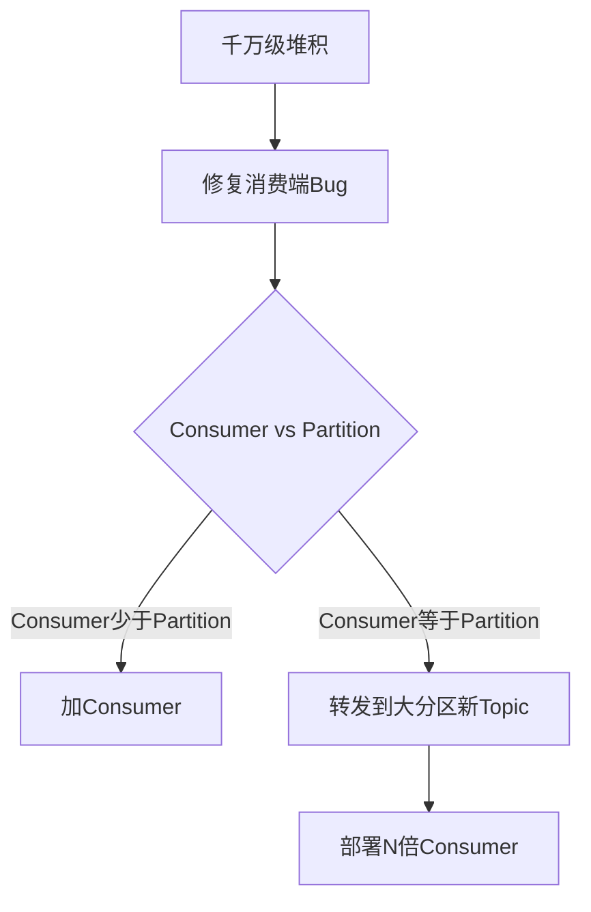

# 如果处理消息堆积

修正后的答案：消息堆积的处理主要分为排查和扩容两步。首先排查消费慢的原因（如Bug、依赖第三方接口超时），如果是Bug则修复，如果是逻辑慢则优化（如批量处理）。如果优化后仍慢，则进行水平扩容：增加Topic的分区数，同时增加消费者数量，注意消费者数量不能大于分区数。此外，还可以建立临时消费者队列，只负责快速将积压消息转运到新的Topic中，再通过扩容后的新消费者群进行正常消费。

---

### 深化补充

**【实战案例】**
*   **场景**：某日志服务在凌晨因下游 ES（Elasticsearch）集群进行 GC（垃圾回收）导致写入能力骤降，引发 Kafka 消费堆积数亿条。由于堆积量太大，直接恢复下游会导致雪崩。解决方案是：临时将消费者逻辑修改为“只转发不处理”，快速将积压消息转发到一个拥有 10 倍分区数的临时 Topic，再启动 10 倍的消费者进行“降级处理”（如只存入 HDFS 而不入 ES），待积压消化完毕后再逐步恢复原有链路。

**【解决方案对比表格】**

| 策略 | 适用阶段 | 具体措施 | 优点 | 缺点 |
| :--- | :--- | :--- | :--- | :--- |
| **排查与优化** | 堆积初期 (<100万) | 排查死锁、SQL慢查询、增加批量处理 | 根治问题，无需资源变更 | 治标不治本，耗时可能较长 |
| **横向扩容** | 堆积中期 (百万级) | 增加分区数 + 增加消费者实例 | 线性提升吞吐量 | 需停机或支持动态分区扩容 |
| **临时转发方案** | 堆积严重 (千万/亿级) | 将积压消息转运到新 Topic，大促消费 | 隔离旧逻辑，快速清空积压 | 实现复杂，数据一致性需额外保证 |

**【关键代码示例 (Java - 消息转发降级逻辑伪代码)]**
```java
// 临时消费者：只转发，不做耗时业务逻辑
consumer.subscribe("original_topic", "*");
while (true) {
    ConsumerRecords<String, String> records = consumer.poll(Duration.ofMillis(100));
    List<Future<?>> futures = new ArrayList<>();
    for (ConsumerRecord<String, String> record : records) {
        // 异步快速转发到扩容后的临时 Topic
        futures.add(executor.submit(() -> {
            producer.send(new ProducerRecord<>("temp_expanded_topic", record.value()));
        }));
    }
    // 快速提交 offset，允许丢弃少量重复数据以换取速度
    consumer.commitSync();
}
```

## 技术原理

- **堆积的根因——生产消费失衡**：消息堆积本质是"生产速率 > 消费速率"持续一段时间。要解决必须**要么降低生产、要么提升消费**。降低生产：限流、降级非核心 producer；提升消费：①修复消费端 bug、②优化消费逻辑、③增加并发（消费者数）、④降低单消息成本（批量）。诊断顺序：先看监控确认是消费慢还是 producer 突增，再针对性处理。
- **Kafka 分区数 = 消费并发的硬上限**：Kafka 单分区只能被消费组内**一个消费者**消费（保证分区内顺序），因此消费者实例数 > 分区数时，多出的消费者空闲。扩容消费者前必须先扩分区。但 Kafka **分区数只能增不能减**，且增加分区会破坏 key 分区语义（同 key 消息可能落到不同分区），需谨慎。
- **临时转发方案的精髓——降级 + 分区扩容**：当原 Topic 分区数固定且堆积严重时，新建一个分区数 N 倍的临时 Topic，写一个"只转发不处理"的消费者把消息快速搬运过去（消费逻辑极简，吞吐高），再在新 Topic 上启动 N 倍消费者做"降级处理"（如只存 HDFS 不入 ES）。这绕过了原 Topic 分区数限制，用空间换时间。
- **消费优化的工程手段**：①**批量处理**——一次 poll 100 条而非 1 条，DB 操作改 batch insert；②**异步化**——IO 操作（HTTP/DB）用 CompletableFuture 并发，主线程只 poll；③**业务降级**——堆积时关闭非核心逻辑（如日志记录、统计上报），只保核心写入；④**跳过毒丸消息**——某条消息导致消费失败无限重试，建立死信队列（DLQ）隔离。

## 命令演示

```bash
# 1. 查看 Kafka 堆积情况（lag = 最新 offset - 已消费 offset）
kafka-consumer-groups.sh --bootstrap-server localhost:9092 \
  --describe --group order-consumer-group
# 输出：
# TOPIC    PARTITION  CURRENT-OFFSET  LOG-END-OFFSET  LAG  CONSUMER-ID
# orders   0          1500000         2000000         500000  consumer-1
# ↑ LAG 50 万，说明该分区堆积

# 2. 扩容 Topic 分区数（注意：只能增不能减，且会破坏 key 分区）
kafka-topics.sh --bootstrap-server localhost:9092 \
  --alter --topic orders --partitions 32      # 从 12 扩到 32

# 3. 消费者配置：批量拉取
# application.properties
spring.kafka.consumer.max-poll-records=500              # 单次 poll 500 条
spring.kafka.consumer.fetch-max-wait=500ms              # 等 broker 攒够
spring.kafka.listener.concurrency=8                     # 8 个消费线程

# 4. RocketMQ 查看堆积
mqadmin consumerProgress -g order_consumer_group -n 127.0.0.1:9876
# 输出每个 queue 的 lag

# 5. Prometheus 监控告警（堆积超 10 万告警）
# ALERT kafka_consumer_lag > 100000 for 5m
```

## 代码示例

```java
// ===== 1. 临时转发消费者（千万级堆积保命招）=====
@Component
public class ForwardOnlyConsumer {
    @KafkaListener(topics = "orders_backlog", groupId = "forwarder")
    public void forward(List<ConsumerRecord<String, String>> records,
                       Acknowledgment ack) {
        // 不做任何业务处理，只批量转发到扩容后的新 Topic
        List<ProducerRecord<String, String>> forwarded = records.stream()
            .map(r -> new ProducerRecord<>("orders_expanded", r.key(), r.value()))
            .collect(Collectors.toList());
        // 批量异步发送，不等 ACK（容忍少量丢失，求速度）
        forwarded.forEach(producer::send);
        ack.acknowledge();   // 立即提交 offset
    }
}

// ===== 2. 批量消费优化（正常消费者）=====
@KafkaListener(topics = "orders", groupId = "order-consumer")
public void batchConsume(List<ConsumerRecord<String, String>> records) {
    // 批量转 DTO
    List<OrderDTO> orders = records.stream()
        .map(r -> JSON.parseObject(r.value(), OrderDTO.class))
        .collect(Collectors.toList());

    // 批量 DB 写入（一次 SQL，而非 N 次）
    orderMapper.batchInsert(orders);

    // 批量发后续 MQ（而非逐条）
    List<Future<?>> futures = orders.stream()
        .map(o -> CompletableFuture.runAsync(
            () -> mqProducer.send(o.getUserId(), o), executor))
        .collect(Collectors.toList());
    CompletableFuture.allOf(futures.toArray(new Future[0])).join();
}

// ===== 3. 死信队列处理毒丸消息 =====
@KafkaListener(topics = "orders", groupId = "order-consumer")
public void consume(ConsumerRecord<String, String> record) {
    try {
        process(record.value());
    } catch (Exception e) {
        // 重试 N 次后进死信队列，避免无限阻塞
        if (getRetryCount(record) >= 3) {
            deadLetterProducer.send(new ProducerRecord<>("orders_DLT", record.value()));
        } else {
            throw e;  // 触发 Spring Kafka 重试
        }
    }
}
```

## 常见坑/注意事项

- **盲目加消费者无效**：分区数固定时，加消费者是浪费——多出的消费者空闲。必须先确认 `消费者数 ≤ 分区数`，否则先扩分区。
- **扩分区破坏 key 顺序**：Kafka 按 key 哈希到分区，扩分区后同 key 消息可能落不同分区，破坏顺序语义。若业务依赖 key 顺序（如同订单的事件序列），不要扩分区，只能优化消费逻辑。
- **offset 提交策略**：自动提交（`enable.auto.commit=true`）可能在消费未完成时就提交，导致消息丢失；手动提交要在**业务完成后**提交，否则重启后重复消费。堆积场景优先保证"消费完成才提交"。
- **下游雪崩保护**：堆积恢复时不要全速打满下游——若下游因过载才导致堆积，全速消费会二次打垮下游。先用限流（如 Guava RateLimiter）逐步提升消费速率。
- **重试导致的"放大效应"**：消费失败重试会让同一条消息占用更多 CPU。务必设置最大重试次数 + 死信队列，避免毒丸消息无限阻塞消费线程。




## 记忆要点

- 千万级堆积保命招：临时写个空消费者只做转发，快速搬运到扩容N倍的新Topic。
- 千万级堆积保命招：临时写个空消费者只做转发，快速搬运到扩容N倍的新Topic再消费。
- 扩容硬限制：增加消费者实例数绝对不能超过Topic的分区数，多出的会空闲。
- 扩容硬限制：增加消费者实例数绝对不能超过Topic的分区数，多出的会空闲。
- 初期排查：优先修复消费端Bug、慢SQL或依赖超时，而不是盲目加机器。
- 初期排查：优先修复消费端Bug、慢SQL或依赖超时，而不是盲目加机器。

## 结构化回答

**30 秒电梯演讲：** 定位瓶颈并提升消费吞吐量，通常依赖水平扩容。打个比方，堵车了先找事故原因，然后多开几条车道并加派交警疏导。

**展开框架：**
1. **千万级堆积保命招** — 临时写个空消费者只做转发，快速搬运到扩容N倍的新Topic。
2. **扩容硬限制** — 增加消费者实例数绝对不能超过Topic的分区数，多出的会空闲。
3. **初期排查** — 优先修复消费端Bug、慢SQL或依赖超时，而不是盲目加机器。

**收尾：** 这三点都能配合实战聊。您想深入聊原理、对比还是避坑？

## 视频脚本

> 预计时长：2 分钟 | 由浅入深

| 时间 | 画面/字幕 | 口播台词 | 讲解要点 |
|------|----------|----------|----------|
| 0:00 | 标题卡：如果处理消息堆积 | "如果处理消息堆积？一句话——堵车了先找事故原因，然后多开几条车道并加派交警疏导。" | 开场钩子 |
| 0:40 | 概念动画/示意图 | "定位瓶颈并提升消费吞吐量，通常依赖水平扩容——堵车了先找事故原因，然后多开几条车道并加派交警疏导" | 核心定义 |
| 1:20 | 千万级堆积保命招示意 | "临时写个空消费者只做转发，快速搬运到扩容N倍的新Topic。" | 要点1 |
| 2:00 | 总结卡 | "记住这几条，面试不慌。下期讲进阶追问。" | 收尾 |
