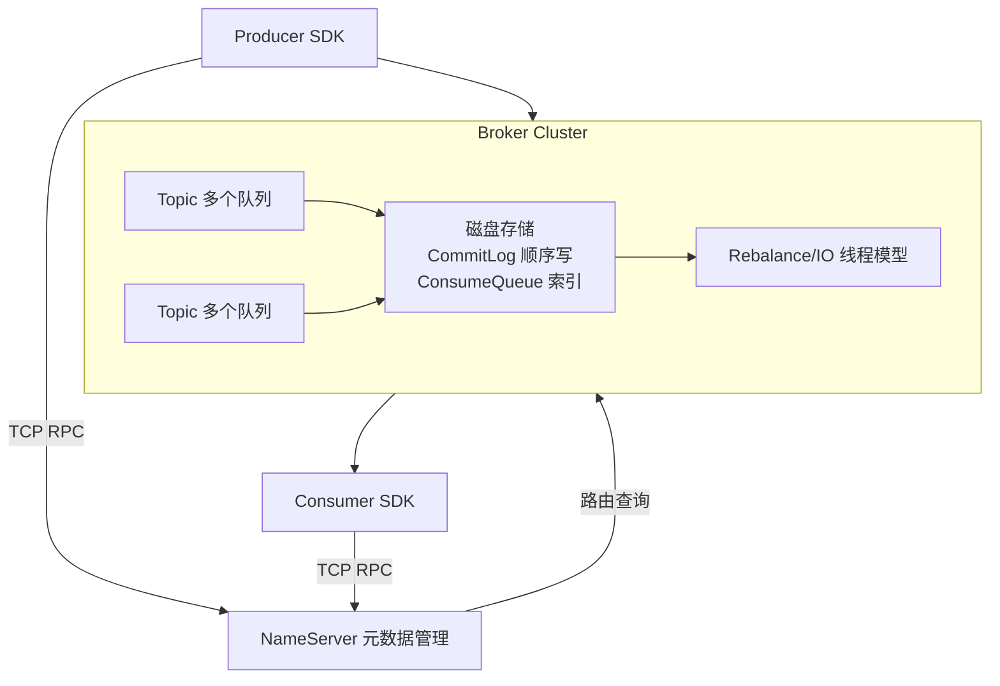
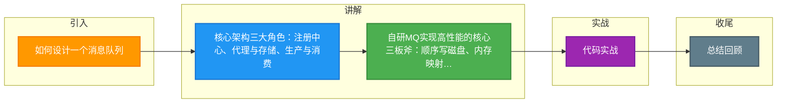

# 如何设计一个消息队列

设计一个消息队列是一个考察系统架构能力的综合性问题。面试官主要关注你是否了解中间件的核心组件、权衡取舍以及设计思路。以下是完整的设计框架：

### 一、核心架构设计

设计目标通常包括：解耦、异步、削峰填谷。核心组件如下：



### 二、实战案例
在大促流量洪峰期间，曾遇到因磁盘写满导致消息入队阻塞进而拖垮业务应用的惨痛教训。后续设计必须引入**磁盘水位监控**与**消息过期策略**（如 RocketMQ 的 `fileReservedTime`），在磁盘使用率达到阈值（如 85%）时自动拒绝写入或降级处理，以保护系统稳定性。

### 三、关键代码实现（顺序写核心逻辑）
高性能的核心在于将随机写转为顺序写，以下模拟 Broker 将消息追加到 CommitLog 的 Java 伪代码：

```java
// MappedFile 对应一个物理文件，利用 MappedByteBuffer 实现内存映射
public class MappedFile {
    private MappedByteBuffer mappedByteBuffer;
    private long wrotePosition = 0;

    // 获取写入位置并追加消息（原子操作）
    public AppendMessageResult appendMessage(final byte[] data) {
        int currentPos = (int) this.wrotePosition;
        if (currentPos + data.length > this.fileSize) {
            return AppendMessageResult.END_OF_FILE;
        }
        // 内存映射写入，由 OS 异步刷盘
        this.mappedByteBuffer.put(data);
        this.wrotePosition += data.length;
        return new AppendMessageResult(currentPos, data.length);
    }
}
```

### 四、核心组件对比

| 组件 | 职责 | 技术选型考量 | 容灾机制 |
| :--- | :--- | :--- | :---
| **NameServer** | 路由注册与发现 | 无状态，轻量级 | 集群部署，互不通信，Broker 长轮询保持心跳
| **Broker** | 消息存储与转发 | 顺序写、PageCache、零拷贝 | Master-Slave 同步复制，Dledger 自动切换主节点
| **Producer** | 消息发送 | 压缩、批量发送、异步重试 | 本地故障转移，向其他 Broker 发送
| **Consumer** | 消息消费 | Rebalance 负载均衡、消息幂等 | 消费重试、死信队列 (DLQ) 处理


## 记忆要点

- 核心架构三大角色：注册中心、代理与存储、生产与消费。
- 核心架构三大角色：注册中心、代理与存储、生产与消费。
- 自研MQ实现高性能的核心三板斧：顺序写磁盘、内存映射与零拷贝技术。
- 自研MQ实现高性能的核心三板斧：顺序写磁盘、内存映射与零拷贝技术。
- 高可用基石：通过Raft/ZAB等算法实现Leader选举与主从切换，保障故障转移。
- 高可用基石：通过Raft/ZAB等算法实现Leader选举与主从切换，保障故障转移。

## 结构化回答

**30 秒电梯演讲：** 考察核心架构设计与面试中的沟通表达能力。打个比方，画房子蓝图，先搭骨架再谈装修细节，避免一上来就钻牛角尖。

**展开框架：**
1. **核心架构三大角色** — 注册中心、代理与存储、生产与消费。
2. **自研MQ实现高性能的核心三板斧** — 顺序写磁盘、内存映射与零拷贝技术。
3. **高可用基石** — 通过Raft/ZAB等算法实现Leader选举与主从切换，保障故障转移。

**收尾：** 我在项目里踩过坑——在大促流量洪峰期间，曾遇到因磁盘写满导致消息入队阻塞进而拖垮业务应用的惨痛教训。您想深入聊哪一段：原理、避坑还是对比选型？

## 视频脚本

> 预计时长：2 分钟 | 由浅入深

| 时间 | 画面/字幕 | 口播台词 | 讲解要点 |
|------|----------|----------|----------|
| 0:00 | 标题卡：如何设计一个消息队列 | "如何设计一个消息队列？一句话——画房子蓝图，先搭骨架再谈装修细节，避免一上来就钻牛角尖。" | 开场钩子 |
| 0:40 | 概念动画/示意图 | "考察核心架构设计与面试中的沟通表达能力——画房子蓝图，先搭骨架再谈装修细节，避免一上来就钻牛角尖" | 核心定义 |
| 1:20 | 核心架构三大角色示意 | "注册中心、代理与存储、生产与消费。" | 要点1 |
| 2:00 | 总结卡 | "记住这几条，面试不慌。下期讲进阶追问。" | 收尾 |

### 视频流程图



