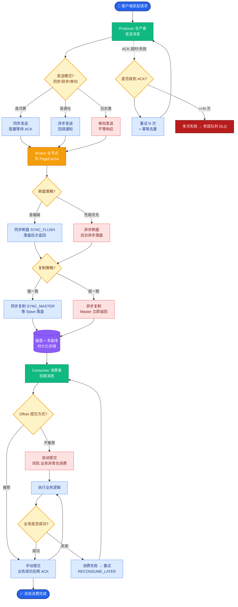

# 如何写个消息中间件

要设计一个消息中间件，首先需要明确核心架构角色，包括**Producer（生产者）**、**Consumer（消费者）**、**Broker（代理节点）**以及**Registry（注册中心）**。

### 1. 核心架构与数据流转
消息从生产者发出，经由网络传输到达 Broker 进行持久化存储，消费者再从 Broker 拉取消息进行处理。注册中心（如 ZooKeeper、Nacos 或 RocketMQ 的 Namesrv）负责服务发现，管理 Broker、生产者和消费者的元数据，维护集群的可用性。

```text
┌─────────────┐     1.发送消息      ┌───────────────┐
│  Producer   │ ───────────────────> │    Broker     │
└─────────────┘                     └───────┬───────┘
     │   ▲                                    │   │ 2.持久化
     │   │                                    │   ▼
     │ 4.回调/ACK                          ┌───┴────┐
     │   │                                │Storage │ (磁盘/内存)
     │   │                                └────────┘
     │   │                                    │
┌─────┴───┴─────┐     3.拉取消息      ┌───────┴───────┐
│  Consumer    │ <────────────────── │    Broker     │
└───────────────┘                     └───────────────┘
       │                                      │
       └────────────── 5.注册/发现 ───────────┘
                    ┌───────────┐
                    │ Registry  │
                    └───────────┘
```

### 2. 通信协议与注册中心
*   **通信层**：各模块间的高性能通信通常基于 **Netty** 实现，需自定义私有协议（包含魔数、版本号、长度、指令类型、Body 等字段）以解决 TCP 粘包/拆包问题。
*   **注册中心**：可选 ZooKeeper（CP）、Eureka（AP）或 Nacos（CP/AP 切换），也可像 RocketMQ 一样实现轻量级的 Namesrv，负责管理 Topic 路由信息。

### 3. 存储与性能优化
为了应对海量数据和高吞吐，需采用分布式架构：
*   **分区与副本**：引入 Topic 和 Partition 概念（如 Kafka），一个 Topic 拆分为多个 Partition 分布在不同 Broker。为保证可靠性，采用 **Leader-Follower** 副本机制，支持同步/异步刷盘。
*   **高性能写入**：利用 **顺序写**（Append Only）极大提升磁盘 I/O 速度。
*   **零拷贝与内存映射**：采用 **sendfile**（零拷贝）和 **mmap**（内存映射）技术，减少数据在内核态与用户态之间的拷贝次数，降低 CPU 消耗。
*   **批处理**：支持多条消息批量发送和批量写入，提高网络和磁盘利用率。

### 4. 高可用（HA）与容错
*   **故障转移**：利用 **Raft** 或 **ZAB** 等选举算法，当 Leader 挂掉时，从 Follower 中选举出新 Leader，保证服务不中断。
*   **消息可靠性**：同步刷盘确保数据不丢失，同步复制确保主备一致。

### 5. 实战案例
在开发自研 MQ 时，曾遇到 Netty ByteBuf 没有及时释放导致的**内存泄漏**问题。在高并发压测下，JVM Old 区迅速填满导致频繁 Full GC。排查后发现是异常分支中未调用 `ReferenceCountUtil.release(msg)`。因此建议在 Netty Handler 的 `finally` 块中统一释放资源，或使用 `SimpleChannelInboundHandler` 自动管理。

### 6. 关键代码实现（零拷贝 TransferTo）
Linux 下 `transferTo` 方法实现零拷贝传输文件数据到网络，避免了数据从内核缓冲区拷贝到用户缓冲区再拷回内核的开销：

```java
// Java NIO FileChannel.transferTo 实现 RocketMQ 的零拷贝读取
public long transferTo(FileChannel fileChannel, SocketChannel socketChannel) throws IOException {
    long position = 0;
    long count = fileChannel.size();
    // 直接将文件数据传输到 Socket 通道，无需经过应用内存
    return fileChannel.transferTo(position, count, socketChannel);
}
```

### 7. 存储与同步机制对比

| 特性 | RocketMQ | Kafka | RabbitMQ |
| :--- | :--- | :--- | :--- |
| **存储模型** | CommitLog + ConsumeQueue (物理分离) | 分段日志 + 稀疏索引 | 内存 + 磁盘 (Exchange/Queue)
| **零拷贝技术** | mmap (写入) + sendfile (读取) | sendfile (主要) | 可能用到，非极致优化
| **文件结构** | 逻辑队列独立，物理文件共用 | Partition 独立 Log 文件 | Queue 独立目录
| **可靠性写入** | 同步/异步刷盘，同步/异步复制 | 多副本同步 (ISR) | 镜像队列 / 仲裁队列

## 常见考点
1.  **如何保证消息不丢失？**
    *   发送端：Ack 机制 + 重试。
    *   Broker 端：同步刷盘 + 同步复制（多副本）。
    *   消费端：手动提交 Offset。
2.  **为什么要顺序写？**
    *   磁盘随机读写需要频繁移动磁头，耗时远大于顺序读写，顺序写性能接近内存。
3.  **零拷贝**
    *   传统：磁盘 -> 内核缓冲区 -> 用户缓冲区 -> Socket 缓冲区 -> 网卡。
    *   零拷贝：磁盘 -> 内核缓冲区 -> 网卡（减少 CPU 上下文切换和数据拷贝）。


## 核心流程图



## 记忆要点

- 自研MQ实现高性能的核心三板斧：顺序写磁盘、内存映射与零拷贝技术。
- 自研MQ实现高性能的核心三板斧：顺序写磁盘、内存映射与零拷贝技术。
- 高可用基石：通过Raft/ZAB等算法实现Leader选举与主从切换，保障故障转移。
- 高可用基石：通过Raft/ZAB等算法实现Leader选举与主从切换，保障故障转移。
- 通信基石：基于Netty实现高性能RPC，并自定义私有协议解决TCP粘包拆包。
- 通信基石：基于Netty实现高性能RPC，并自定义私有协议解决TCP粘包拆包。

## 结构化回答

**30 秒电梯演讲：** 整合高性能网络通信、存储与分布式协调技术。打个比方，搭建一个超级快递站，有调度室（注册中心）、仓库和快递员。

**展开框架：**
1. **自研MQ实现高性能的核心三板斧** — 顺序写磁盘、内存映射与零拷贝技术。
2. **高可用基石** — 通过Raft/ZAB等算法实现Leader选举与主从切换，保障故障转移。
3. **通信基石** — 基于Netty实现高性能RPC，并自定义私有协议解决TCP粘包拆包。

**收尾：** 我在项目里踩过坑——Linux 下 `transferTo` 方法实现零拷贝传输文件数据到网络，避免了数据从内核缓冲区拷贝到用户缓冲区再拷回内核的开销：。您想深入聊哪一段：原理、避坑还是对比选型？

## 视频脚本

> 预计时长：2 分钟 | 由浅入深

| 时间 | 画面/字幕 | 口播台词 | 讲解要点 |
|------|----------|----------|----------|
| 0:00 | 标题卡：如何写个消息中间件 | "如何写个消息中间件？一句话——搭建一个超级快递站，有调度室（注册中心）、仓库和快递员。" | 开场钩子 |
| 0:40 | 概念动画/示意图 | "整合高性能网络通信、存储与分布式协调技术——搭建一个超级快递站，有调度室（注册中心）、仓库和快递员" | 核心定义 |
| 1:20 | 要点1图解示意 | "顺序写磁盘、内存映射与零拷贝技术。" | 要点1 |
| 2:00 | 总结卡 | "记住这几条，面试不慌。下期讲进阶追问。" | 收尾 |
