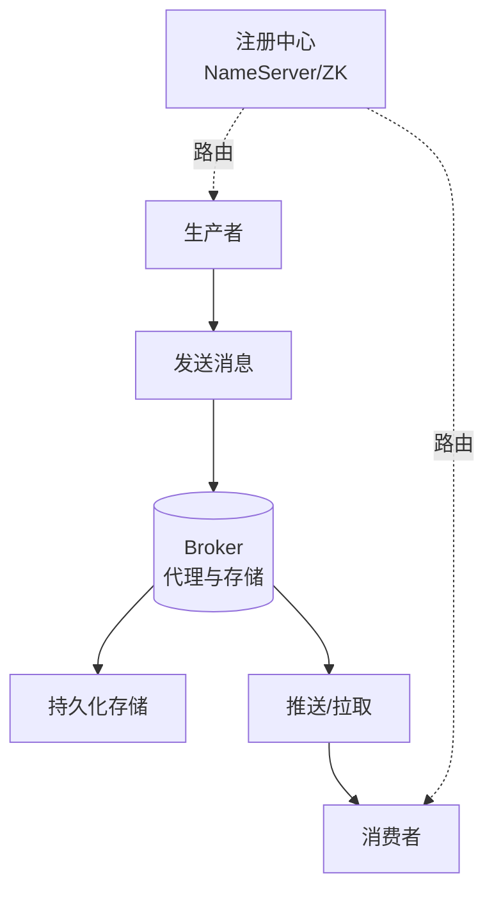

# 面试官想问的是什么

之后可以深挖的点就很多了，比如提到的 Netty，各种注册中心就能问很多，比如各注册中心之间的选
型对比等。
你还提到了选举算法，所以可能会问 Bully 算法、Raft 算法、ZAB 算法等等。
你还提到了分区，可能会问这个分区和 RocketMQ 的队列有什么不同啊？具体分区要怎么实现？
然后你提到顺序写，可能会问为什么要顺序写啊？你说的内存映射和零拷贝又是什么啊？那你知道 
RocketMQ 和 Kafka 用了哪个吗?
当然还有可能问各种细节，比如消息的写入如何存储、消息的索引如何生成等等，来深挖看你有没有看
过消息中间件的源码。
可以问的还很多，这篇文章我也不可能每个点都延伸开说，这些知识点还是得靠大家日积月累和平日的
多加思考。
当然日后的文章可以写一写今天提到的一些点，比如 Netty、选举算法啊，多种注册中心对比啊啥的。
面试官想问的是什么
 
再回到这个面试题，其实面试官想问的就是大方向上的设计，包括整体的架构、数据的流转和一些特性
的把握，所以对于这个问题他想听到的就是那些重点，而不是那些细节。
而继续的深挖取决于你回答这个问题时提出的各个关键词，对于面试官自身而言熟悉的词一抓到，他就
已经知道下一步要问你什么了。
所以在回答面试官的时候不仅要 get 到他的点，还得为之后的回答铺路，不会说的点不要提，擅长的点
多提提。
最后
 
之前我已经提到了，这篇文章的重点其实不在于如何回答写一个消息中间件，而在于面试的技巧。
因为面试题千千万，而技巧掌握了那么千千万的面试题都适用。

## 技术原理

这道题表面考消息中间件设计，实质考系统架构的「宏观视野 + 关键词博弈」：

- **消息中间件的核心架构三要素**：(1) **注册中心 / 协调服务**（如 ZooKeeper、KRaft、NameServer）——管理 Broker 注册、Topic/Partition 路由、Leader 选举；(2) **代理与存储层**（Broker）——接收生产者消息、持久化（CommitLog/Segment）、副本同步、推送给消费者；(3) **生产与消费客户端**（Producer/Consumer）——发送语义（同步/异步/OneWay）、消费模型（Push/Pull、广播/集群）。回答时先勾勒这三层，展示整体把控能力。
- **关键词埋点策略**：每提一个关键词（如 Netty、Raft、顺序写、零拷贝），都是在为面试官提供追问入口。**擅长的多埋、不熟的不埋**，把话题引导到自己的优势区。例如深入读过 RocketMQ 源码就主动提「CommitLog 的刷盘策略」和「ConsumeQueue 的索引结构」，没读过源码就避免提「MappedByteBuffer 的内存映射细节」。
- **架构 vs 细节的分层**：宏观问题（如「设计一个消息队列」）答架构与权衡（CAP 取舍、存储选型、一致性级别）；细节问题（如「RocketMQ 如何实现事务消息」）答实现机制（half message + 回查）。混淆这两个层次是大忌——宏观问题答细节显得格局小，细节问题答架构显得空洞。
- **深挖方向预判**：注册中心 → CAP（ZK 是 CP，Eureka 是 AP）；选举算法 → Bully（简单但依赖 ID）、Raft（Term + 日志）、ZAB（ZXID）；存储 → 顺序写（磁盘特性）、零拷贝（sendfile/mmap）、PageCache（OS 缓存）。提前准备这些深挖点的答案。

## 代码示例

```java
// 消息中间件核心架构的伪代码骨架（展示设计思路）

// 1. 注册中心接口（协调层）
interface Registry {
    void registerBroker(BrokerInfo info);          // Broker 上线
    TopicRoute lookupTopic(String topic);          // 路由查询
    void electLeader(Partition partition);         // Leader 选举（可用 Raft）
}

// 2. Broker 核心（存储 + 转发）
class Broker {
    CommitLog commitLog;        // 顺序写的消息日志（核心性能保障）
    ConsumeQueue[] indexes;     // 每个队列的索引（offset -> 物理位置）
    void receive(Message msg) {
        commitLog.append(msg);              // 顺序写磁盘 + PageCache
        indexes[msg.queueId].append(msg);   // 异步构建索引
    }
    void pushToConsumer(ConsumerGroup group) { /* Pull 长轮询 */ }
}

// 3. 生产者（客户端）
class Producer {
    void send(String topic, Message msg) {
        TopicRoute route = registry.lookupTopic(topic);  // 先查路由
        Broker target = selectBroker(route);             // 负载均衡
        target.receive(msg);                             // 网络发送（Netty）
    }
}
```

## 注意事项

- **不要假装懂**：提到的关键词必然被深挖。如果不熟悉源码，回答时说「这部分我了解原理但没读过源码」，比硬编一个错误答案好得多。面试官能识别真假，诚实是加分项。
- **答案的结构化呈现**：用「先架构后细节、先宏观后微观」的顺序，配合「存储层、网络层、协调层」的分类，比流水账式罗列更有说服力。
- **对比视角展现深度**：主动对比 RocketMQ vs Kafka vs Pulsar 的差异（如 RocketMQ 用 NameServer 而 Kafka 用 ZooKeeper/KRaft），展示对生态的全局理解。
- **承认不确定性**：被问到盲区时，可以说「这块我不熟，但基于架构原理我推测是 XX，回头我会验证」——展示推理能力比硬答更受认可。




## 记忆要点

- 核心架构三大角色：注册中心、代理与存储、生产与消费。
- 核心架构三大角色：注册中心、代理与存储、生产与消费。
- 防坑指南：提到的关键词必定会被深挖，不熟悉的技术点（如底层源码）绝不要主动提。
- 防坑指南：提到的关键词必定会被深挖，不熟悉的技术点（如底层源码）绝不要主动提。

## 结构化回答

**30 秒电梯演讲：** 考察对系统整体架构的把控及知识广度。打个比方，面试官像探照灯，你说出的关键词就是他照射的方向。

**展开框架：**
1. **核心架构三大角色** — 注册中心、代理与存储、生产与消费。
2. **防坑指南** — 提到的关键词必定会被深挖，不熟悉的技术点（如底层源码）绝不要主动提。
3. **回答策略** — 抓大放小，宏观架构先行

**收尾：** 这三点都能配合实战聊。您想深入聊原理、对比还是避坑？

## 视频脚本

> 预计时长：2 分钟 | 由浅入深

| 时间 | 画面/字幕 | 口播台词 | 讲解要点 |
|------|----------|----------|----------|
| 0:00 | 标题卡：面试官想问的是什么 | "面试官想问的是什么？一句话——面试官像探照灯，你说出的关键词就是他照射的方向。" | 开场钩子 |
| 0:40 | 概念动画/示意图 | "考察对系统整体架构的把控及知识广度——面试官像探照灯，你说出的关键词就是他照射的方向" | 核心定义 |
| 1:20 | 核心架构三大角色示意 | "注册中心、代理与存储、生产与消费。" | 要点1 |
| 2:00 | 总结卡 | "记住这几条，面试不慌。下期讲进阶追问。" | 收尾 |
