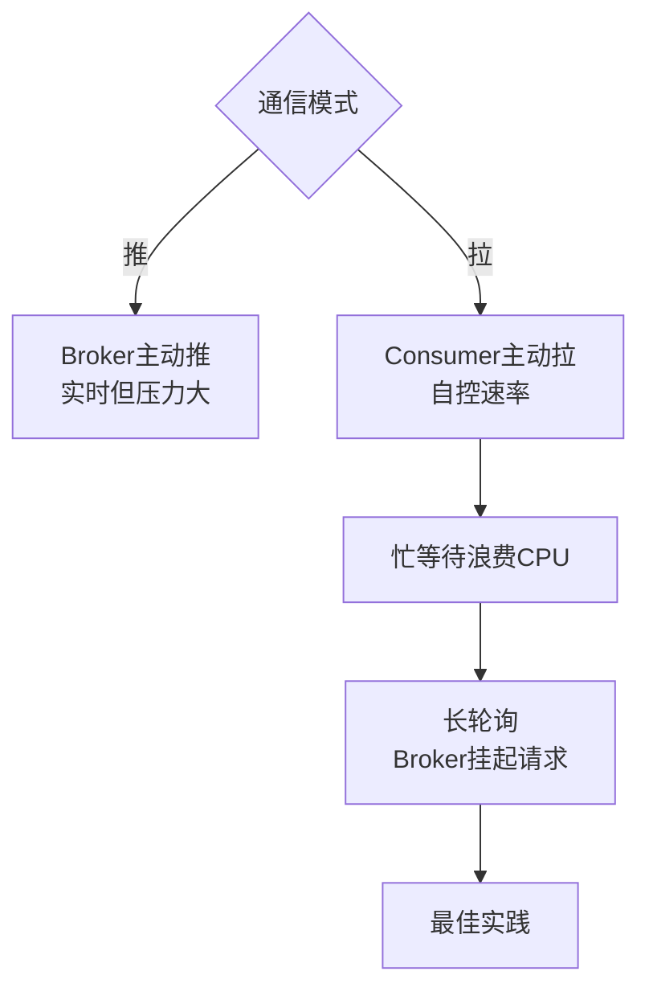
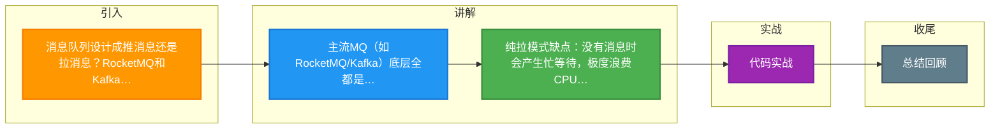

# 消息队列设计成推消息还是拉消息？RocketMQ和Kafka是怎么做的

在讨论消息队列的推拉模式时，我们主要关注的是 **Consumer（消费者）** 与 **Broker** 之间的交互方式。Producer 到 Broker 通常默认为推模式，由 Producer 主动发送，否则 Broker 需维护大量连接去拉取，且消息可靠性难以保证（依赖 Producer 本地存储）。

### 1. 推模式
指 Broker 主动将消息推送给 Consumer。

**优点**：
*   **实时性高**：消息到达后立即推送，延迟极低。
*   **编程简单**：Consumer 被动接收，像监听器一样处理回调。

**缺点**：
*   **难以处理消费积压**：若生产速率 > 消费速率，Broker 发送太快会导致 Consumer 内存溢出或“被击垮”。
*   ** Broker 负载重**：Broker 需维护每个 Consumer 的状态（是否在线、消费能力），并实现复杂的流控机制（如 Credit-based 限流），增加系统复杂度。
*   **状态管理复杂**：Broker 需记录 Consumer 的消费进度，推错了还需要重推。

### 2. 拉模式
指 Consumer 主动向 Broker 请求拉取消息。

**优点**：
*   **自主可控**：Consumer 根据自身处理能力决定何时拉取、拉取多少，不易过载。
*   **Broker 轻量化**：Broker 只负责存储，无需维护复杂的消费者状态，是无状态的工具人。
*   **批量处理友好**：Consumer 可一次性拉取一批消息处理，提高吞吐。

**缺点**：
*   **实时性差**：取决于 Consumer 的轮询间隔。
*   **消息空轮询**：若没有新消息，Consumer 的频繁请求是无效的，浪费 CPU 和网络资源（忙等待）。
*   **延迟波动**：如何在没有消息时及时通知 Consumer 是一个难点。

### 3. 实战案例
在电商订单场景中，如果使用传统的短轮询拉模式，订单积压时 Consumer 频繁空转，导致 Broker CPU 飙升至 90% 以上且无效。优化方案是引入 **长轮询**：Consumer 请求若无消息，Broker 挂起请求 5 秒（期间若有新消息立即响应），期间不返回结果且不释放连接。这使得实时性接近推模式，同时极大降低了无效请求开销。

### 4. 关键代码实现（长轮询逻辑）
RocketMQ 的 `PullRequestHoldService` 实现长轮询的核心逻辑示意（Java）：

```java
// Broker 端处理拉取请求
public RemotingCommand processRequest(Channel channel, PullMessageRequestHeader requestHeader) {
    // 1. 尝试从本地获取消息
    GetMessageResult getMessageResult = messageStore.getMessage(...);
    if (getMessageResult != null && !getMessageResult.isEmpty()) {
        return response(getMessageResult); // 有消息直接返回
    }
    
    // 2. 无消息，开启长轮询
    long suspendTimeoutMillis = requestHeader.getSuspendTimeoutMillis(); // 如 5000ms
    PullRequest pullRequest = new PullRequest(requestHeader, channel, suspendTimeoutMillis);
    pullRequestHoldService.suspendPullRequest(pullRequest); // 挂起请求
    
    return null; // 不立即响应，等待超时或有新消息时唤醒
}
```

### 5. 模式对比

| 维度 | 推模式 | 拉模式 | 长轮询 (Pull 进阶) |
| :--- | :--- | :--- | :---
| **实时性** | 极高 (微秒级) | 低 (秒级，取决于间隔) | 高 (毫秒级，类似推) |
| **Broker 状态** | 有状态 (需维护消费进度) | 无状态 (或仅存偏移量) | 轻有状态 (需挂起请求) |
| **流量控制** | 复杂 | 简单 | 简单
| **资源消耗** | Broker 负载高 | Consumer 忙等待浪费 CPU | Broker 维护连接，但无无效请求 |
| **适用场景** | IM、实时通知 | 离线日志、批处理 | 通用互联网业务 (主流 MQ 首选) |

## 常见考点
1.  **为什么主流 MQ（如 Kafka）都选拉模式？**
    *   主要原因是**消费者处理能力参差不齐**，拉模式能更好地实现流量控制，避免 Broker 被慢消费者拖垮。
2.  **推模式在什么场景下适用？**
    *   消息量小、对实时性要求极高、且消费者处理能力可控的场景（如即时通讯）。
3.  **推模式如何实现流控？**
    *   消费者向 Broker 反馈 Credit（令牌），Broker 根据 Credit 决定推送速度（如 RabbitMQ 的 Basic.Qos）。
4.  **RocketMQ 的 PushConsumer 是推模式吗？**
    *   名字叫 Push，但底层实现是 Pull，是对拉模式的封装，在客户端内部开启线程拉取并回调监听器。




## 记忆要点

- 主流MQ(如RocketMQ/Kafka)底层全都是拉模式，以保护Broker防止击垮慢消费者。
- 主流MQ(如RocketMQ/Kafka)底层全都是拉模式，以保护Broker防止击垮慢消费者。
- 纯拉模式缺点：没有消息时会产生忙等待，极度浪费CPU与网络资源。
- 纯拉模式缺点：没有消息时会产生忙等待，极度浪费CPU与网络资源。
- 终极方案长轮询：Broker挂起请求一段时间，兼顾推模式的高实时性与拉模式的流控。
- 终极方案长轮询：Broker挂起请求一段时间，兼顾推模式的高实时性与拉模式的流控。

## 结构化回答

**30 秒电梯演讲：** 推模式重实时但易拥堵，拉模式重均衡但有延迟。打个比方，推是送餐上门（怕你吃不完），拉是自己去食堂打饭（想打多少打多少）。

**展开框架：**
1. **主流MQ(如RocketMQ/Kafka)底层全** — 都是拉模式，以保护Broker防止击垮慢消费者。
2. **纯拉模式缺点** — 没有消息时会产生忙等待，极度浪费CPU与网络资源。
3. **终极方案长轮询** — Broker挂起请求一段时间，兼顾推模式的高实时性与拉模式的流控。

**收尾：** 我在项目里踩过坑——在电商订单场景中，如果使用传统的短轮询拉模式，订单积压时 Consumer 频繁空转，导致 Broker CPU 飙升至 90% 以上且无效。您想深入聊哪一段：原理、避坑还是对比选型？

## 视频脚本

> 预计时长：3 分钟 | 由浅入深

| 时间 | 画面/字幕 | 口播台词 | 讲解要点 |
|------|----------|----------|----------|
| 0:00 | 标题卡：消息队列设计成推消息还是拉消息？Ro… | "消息队列设计成推消息还是拉消息？RocketMQ和Kafka是怎么做的？一句话——推是送餐上门（怕你吃不完），拉是自己去食堂打饭（想打多少打多少）。" | 开场钩子 |
| 0:45 | 概念动画/示意图 | "推模式重实时但易拥堵，拉模式重均衡但有延迟——推是送餐上门（怕你吃不完），拉是自己去食堂打饭（想打多少打多少）" | 核心定义 |
| 1:30 | 主流MQ拉模式示意 | "主流MQ(如RocketMQ/Kafka)底层全都是拉模式，以保护Broker防止击垮慢消费者" | 要点1 |
| 2:15 | 纯拉模式缺点示意 | "没有消息时会产生忙等待，极度浪费CPU与网络资源。" | 要点2 |
| 3:00 | 总结卡 | "记住这几条，面试不慌。下期讲进阶追问。" | 收尾 |

### 视频流程图



