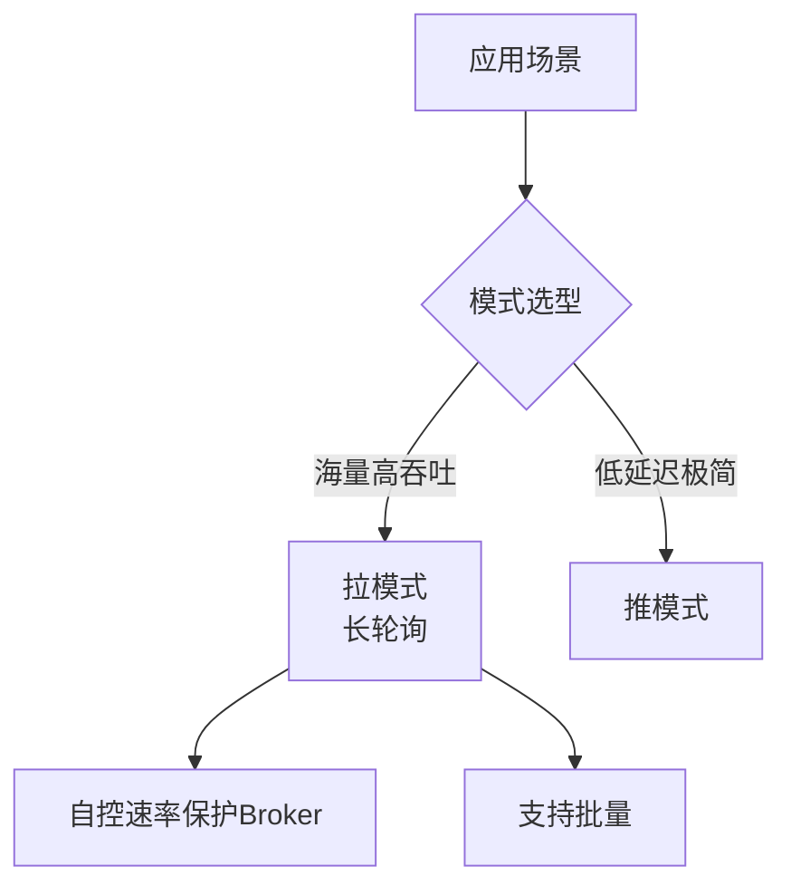

# 那到底是推还是拉

并且不同的消费者的消费速率还不一样，身为 Broker 很难平衡每个消费者的推送速率，如果要实现自适应的推送速率那就需要在推送的时候消费者告诉 Broker ，我不行了你推慢点吧，然后 Broker 需要维护每个消费者的状态进行推送速率的变更。
这其实就增加了 Broker 自身的复杂度。
所以说推模式难以根据消费者的状态控制推送速率，适用于消息量不大、消费能力强要求实时性高的情况下。

### 拉模式
拉模式指的是 Consumer 主动向 Broker 请求拉取消息，即 Broker 被动的发送消息给 Consumer。
我们来想一下拉模式有什么好处？
拉模式主动权就在消费者身上了，消费者可以根据自身的情况来发起拉取消息的请求。假设当前消费者觉得自己消费不过来了，它可以根据一定的策略停止拉取，或者间隔拉取都行。
拉模式下 Broker 就相对轻松了，它只管存生产者发来的消息，至于消费的时候自然由消费者主动发起，来一个请求就给它消息呗，从哪开始拿消息，拿多少消费者都告诉它，它就是一个没有感情的工具人，消费者要是没来取也不关它的事。
拉模式可以更合适的进行消息的批量发送，基于推模式可以来一个消息就推送，也可以缓存一些消息之后再推送，但是推送的时候其实不知道消费者到底能不能一次性处理这么多消息。而拉模式就更加合理，它可以参考消费者请求的信息来决定缓存多少消息之后批量发送。

拉模式有什么缺点？
消息延迟，毕竟是消费者去拉取消息，但是消费者怎么知道消息到了呢？所以它只能不断地拉取，但是又不能很频繁地请求，太频繁了就变成消费者在攻击 Broker 了。因此需要降低请求的频率，比如隔个 2 秒请求一次，你看着消息就很有可能延迟 2 秒了。
消息忙请求，忙请求就是比如消息隔了几个小时才有，那么在几个小时之内消费者的请求都是无效的，在做无用功。

### 那到底是推还是拉
可以看到推模式和拉模式各有优缺点，到底该如何选择呢？

在大型分布式系统中，**推荐选择「拉模式」或「长轮询（Pull 的改进版）」**。

1.  **拒绝纯推模式**：除非是在客户端极少、流量极低且对延迟极其敏感的即时通讯场景（如 WebSocket 推送），否则在业务系统中使用纯推模式无异于给自己埋雷。一旦消费者消费失败或变慢，Broker 会被堆积的缓冲区和重试队列拖垮。

2.  **首选长轮询**：RocketMQ 的 `Long Polling` 是目前的最佳实践之一。它结合了推的实时性和拉的自主性。当 Broker 没有消息时，不立即返回空，而是挂起请求（Hold 住）一段时间（如 5s），期间若有新消息立刻返回。这解决了“空轮询”和“高延迟”的问题。

### 实战案例
在接入某物流监控数据流时，曾遇到纯 Pull 模式的**短连接开销**问题。由于频繁建立/断开 TCP 连接导致 Broker 端 `TIME_WAIT` 状态过多，耗尽了服务器端口资源。解决方案是客户端开启**长连接**配合 Pull 模式，连接复用后端口压力骤降，且网络握手延迟消失。

### 核心决策建议

| 场景特征 | 推荐模式 | 理由 |
| :--- | :--- | :---
| **高吞吐、流量不均** (电商、日志) | **拉模式 (长轮询)** | Consumer 自控速率，保护 Broker，支持批量消费
| **超低延迟、极低并发** (即时指令) | **推模式** | 省去轮询开销，毫秒级触达
| **海量连接、弱网环境** (IoT 设备) | **推模式 (MQTT)** | 设备端维持长连接困难，由服务端下发更省电
| **通用业务系统** (订单、通知) | **拉模式 (封装为 Push)** | 兼顾性能与开发效率，RocketMQ PushConsumer 即为此例 |

## 技术原理

- **推模式（Push）的本质与代价**：Broker 主动把消息推给 Consumer。优点是**实时性好**——消息一到立刻推送，延迟低。代价是 Broker 要**为每个 Consumer 维护推送速率状态**——如果 Consumer 处理慢，Broker 要么阻塞等待（占缓冲区），要么缓冲堆积（内存压力），要么丢弃（不可接受）。当 Consumer 处理能力不一，Broker 难以"自适应"地给每个 Consumer 调推送速率，复杂度爆炸。
- **拉模式（Pull）的控制权转移**：Consumer 主动向 Broker 请求"给我 offset X 之后的 N 条消息"。主动权在 Consumer——它根据自己的处理能力决定**何时拉、拉多少**。Broker 退化为"无状态存储"——只存消息，不关心 Consumer 速率。这让 Broker 可以服务海量 Consumer 而不被拖垮。缺点：①**消息延迟**（Consumer 不知道新消息何时到，要轮询）；②**空轮询浪费**（没消息时反复请求浪费网络）。
- **长轮询（Long Polling）的折中**：Broker 收到 Pull 请求时，若**没有新消息不立即返回**，而是挂起请求 5~30 秒；期间有新消息立刻返回，或超时后返回空。这消除了空轮询（一次请求能等很久），又保持了实时性（消息一到就返回）。RocketMQ、Kafka 的 fetch 都用长轮询。本质是"推模式的实时 + 拉模式的可控"。
- **批量拉取的吞吐优势**：拉模式天然适合批量——Consumer 一次请求"给我 500 条"，Broker 一次返回大批，网络 RTT 摊薄到每条消息上极低。推模式要攒批就得在 Broker 端缓冲（增加复杂度和延迟），拉模式 Consumer 自己决定攒多少。这是高吞吐场景选拉的核心原因。

## 命令演示

```bash
# Kafka 消费者配置（拉模式 + 长轮询 + 批量）
# client.properties
bootstrap.servers=kafka:9092
group.id=order-consumer
# 批量拉取
fetch.min.bytes=1024                # 至少攒 1KB 才返回（避免小包）
fetch.max.wait.ms=500               # 最多等 500ms（长轮询超时）
max.poll.records=500                # 单次 poll 最多 500 条
# 消费者自主控速
max.poll.interval.ms=300000         # 5min 内必须 poll，否则被踢出组

# RocketMQ PushConsumer（本质是长轮询封装）
# 注意：RocketMQ 的 "Push" API 底层是 Pull + 长轮询
consumer.setConsumeThreadMin(20);
consumer.setConsumeThreadMax(64);
consumer.setPullBatchSize(32);       # 单次拉 32 条
consumer.setConsumeMessageBatchMaxSize(1);  # 业务每次处理 1 条（保顺序）

# 查看消费者的拉取速率
kafka-consumer-groups.sh --describe --group order-consumer
# 看 CURRENT-OFFSET 增长速率 = 消费速率
```

## 代码示例

```java
// ===== 1. Kafka 原生 Pull 消费者（最底层，可控速）=====
KafkaConsumer<String, String> consumer = new KafkaConsumer<>(props);
consumer.subscribe(Collections.singletonList("orders"));

while (running) {
    // 长轮询：最多等 500ms，攒一批返回
    ConsumerRecords<String, String> records = consumer.poll(Duration.ofMillis(500));

    for (ConsumerRecord<String, String> record : records) {
        try {
            process(record.value());      // 业务处理
        } catch (Exception e) {
            log.error("处理失败，进死信", e);
        }
    }
    // 手动提交 offset（确保处理完才提交）
    consumer.commitAsync();
}

// ===== 2. RocketMQ PushConsumer（封装了长轮询，看似 Push 实为 Pull）=====
@RocketMQMessageListener(
    topic = "orders",
    consumerGroup = "order-consumer",
    consumeMode = ConsumeMode.CONCURRENTLY,
    consumeThreadMax = 64
)
public class OrderConsumer implements RocketMQListener<String> {
    @Override
    public void onMessage(String message) {
        // 这是回调式 API，看起来像 Push
        // 但底层是 Pull 长轮询 + 线程池派发
        process(message);
    }
}

// ===== 3. 推模式示例（ActiveMQ Classic，真正 Push）=====
// 不推荐用于高吞吐，仅低延迟场景
connectionFactory.setDispatchAsync(true);   // 异步推
consumer.setMessageListener(message -> {    // Broker 主动回调
    process(((TextMessage) message).getText());
});
```

## 对比/选型

| 维度 | 纯推（Push） | 纯拉（Pull） | 长轮询（Pull 改进） |
|------|-------------|-------------|---------------------|
| 实时性 | 最好（毫秒） | 差（轮询间隔） | 好（接近推） |
| Broker 压力 | 高（维护状态） | 低（无状态） | 低（挂起请求） |
| Consumer 控速 | 难（Broker 决定） | 强（自主决定） | 强（自主决定） |
| 空轮询浪费 | 无 | 严重 | 极少 |
| 批量友好 | 差（Broker 缓冲） | 好（Consumer 攒） | 好 |
| 典型 MQ | ActiveMQ Classic | Kafka raw API | RocketMQ/Kafka |

## 常见坑/注意事项

- **"Push" API 可能底层是 Pull**：RocketMQ 的 PushConsumer 看起来像推，实际是 Pull + 长轮询 + 回调派发。不要被 API 命名误导。判断标准：看 Consumer 是否需要主动 poll（拉）还是被动接收回调（推）。
- **长轮询的超时调优**：超时太短（如 100ms）退化为短轮询，浪费网络；太长（如 60s）可能触发 LB/网关的 idle timeout 断连。一般 5~30s，且要小于网络中间件的 idle timeout。
- **拉模式的 Rebalance 问题**：消费者组内实例变化（扩容/宕机）触发 rebalance，期间所有消费者暂停拉取。频繁 rebalance 会导致消费停顿。调大 `session.timeout.ms` 和 `max.poll.interval.ms` 减少 false rebalance。
- **推模式的背压（Backpressure）**：若必须用推模式（如 WebSocket），一定要实现背压——Consumer 处理不过来时告知 Broker 减速，否则 Broker 缓冲爆炸。RxJava/Reactor 提供背压原语。
- **短连接 vs 长连接**：拉模式若每次 poll 建新 TCP 连接，`TIME_WAIT` 会耗尽端口。务必用长连接（连接池），Kafka/RocketMQ SDK 默认长连接。




## 核心知识点图


## 记忆要点

- 推模式保实时但 Broker 压力大，拉模式 Broker 轻松但存延迟与空轮询
- 分布式首选拉模式，核心因消费者能自控速率保护 Broker，支持批量
- 长轮询是最佳实践，Broker 挂起请求，有新消息或超时再返回
- 实战对比：海量高吞吐用拉(长轮询)，低延迟极简通讯用推

## 结构化回答

**30 秒电梯演讲：** 根据场景权衡，持久化场景拉模式更优。打个比方，自来水厂（推）和打井水（拉），存水供大家打水更灵活。

**展开框架：**
1. **推模式保实时但 Broker 压力大** — 拉模式 Broker 轻松但存延迟与空轮询
2. **分布式首选拉模式** — 核心因消费者能自控速率保护 Broker，支持批量
3. **长轮询是最佳实践** — Broker 挂起请求，有新消息或超时再返回

**收尾：** 我在项目里踩过坑——在接入某物流监控数据流时，曾遇到纯 Pull 模式的短连接开销问题。您想深入聊哪一段：原理、避坑还是对比选型？

## 视频脚本

> 预计时长：2 分钟 | 由浅入深

| 时间 | 画面/字幕 | 口播台词 | 讲解要点 |
|------|----------|----------|----------|
| 0:00 | 标题卡：那到底是推还是拉 | "那到底是推还是拉？一句话——自来水厂（推）和打井水（拉），存水供大家打水更灵活。" | 开场钩子 |
| 0:40 | 概念动画/示意图 | "根据场景权衡，持久化场景拉模式更优——自来水厂（推）和打井水（拉），存水供大家打水更灵活" | 核心定义 |
| 1:20 | 要点1图解示意 | "拉模式 Broker 轻松但存延迟与空轮询" | 要点1 |
| 2:00 | 总结卡 | "记住这几条，面试不慌。下期讲进阶追问。" | 收尾 |
