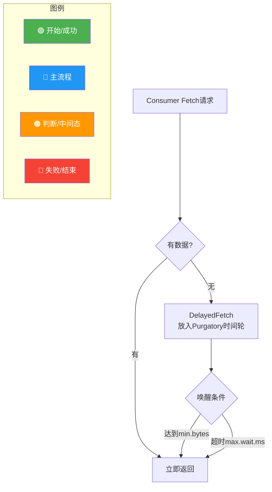

# Kafka 中的长轮询

### Kafka 长轮询机制详解

Kafka 的长轮询是为了在消费者拉取消息时，既能保证低延迟（有消息立即返回），又能减少无效请求（无消息时等待），从而降低系统负载和 CPU 占用。

#### 核心原理
1.  **消费者端**：在调用 `poll(timeout)` 时，如果请求到达 Broker 且暂时没有新数据，消费者并不会立即收到空响应，而是会阻塞等待，直到以下两种情况发生：
    *   有数据到达，Broker 立即返回。
    *   达到指定的最大等待时间，超时返回空数据。

2.  **Broker 端**：
    *   **请求入口**：`KafkaApis.handleFetchRequest`。
    *   **延迟操作**：当 `FetchRequest` 到达但数据不足时，不会直接返回，而是创建一个 `DelayedFetch` 对象。该对象会被提交到 `DelayedOperationPurgatory`（炼狱/时间轮）中管理。
    *   **监听机制**：`DelayedFetch` 会监听对应分区（Partition）的“追加数据”事件。
    *   **数据写入触发**：当 Broker 的 `Log` 对象写入新消息时，会触发 `tryComplete` 方法，检查是否有等待该分区的 `DelayedFetch` 请求，如果有则唤醒并立即返回数据。

#### 架构流程图
```text
+----------------+         FetchRequest          +-------------------+
|  Kafka Consumer| ------------------------->  |  KafkaApis (Broker)|
+----------------+                               +-------------------+
     |   ^  | 1. 检查是否有数据                       |
     |   |  |                                      |
     |   |  +------------------+ No Data           | 2. 创建 DelayedFetch
     |   |                     v                   |    并放入 Purgatory
     |   |             +----------------+           |
     |   |             | DelayedFetch   |           |
     |   |             +----------------+           |
     |   |                     |                   |
     |   |                     |                   |
     |   |                     | 3. 监听 Log 添加事件|
     |   |                     |                   |
     |   |                     v                   v
     |   |             +----------------+   +---------------+
     |   |             | Purgatory     |   |   ReplicaMgr  |
     |   |             | (Time Wheel)  |<--| (appendRecords)|
     |   |             +----------------+   +---------------+
     |   |                     | 4. 唤醒                 |
     |   |                     | (消息写入/超时)         |
     |   |                     v                   |
     |   +----------
```

### 实战深化

**实战案例**：
**“僵尸消费”与连接泄漏**。在使用 Kafka 早期版本时，如果客户端设置了极长的 `max.poll.interval.ms`（如 30 分钟），同时 `fetch.max.wait.ms` 设置较短，在高并发下可能导致 Follower 获取数据极其缓慢，甚至触发 Rebalance。另一个常见的坑是 `fetch.min.bytes` 设置过大（例如 1MB），在低峰期流量很少时，消费者会因为凑不齐 1MB 数据而一直阻塞直到超时（默认 500ms），导致监控显示“消费延迟”忽高忽低，实则是在“攒批”，业务侧误判为消费积压。

**代码示例**：
Java Consumer 端长轮询配置优化
```java
Properties props = new Properties();
props.put("bootstrap.servers", "localhost:9092");
// 关键参数1：控制每次 Fetch 最小等待数据量，默认1。增大此值可提高吞吐但增加延迟
props.put("fetch.min.bytes", "1024"); 
// 关键参数2：控制长轮询最大等待时间，默认500ms。在此时间内若未达到min.bytes也会返回
props.put("fetch.max.wait.ms", "1000"); 
// 关键参数3：单次 Fetch 返回的最大字节数，防止 OOM
props.put("fetch.max.bytes", "52428800"); // 50MB
KafkaConsumer<String, String> consumer = new KafkaConsumer<>(props);
```

**对比表格**：

| 配置参数 | 含义 | 实战建议 | 影响 |
| :--- | :--- | :--- | :--- |
| `fetch.max.wait.ms` | 长轮询最大等待时长 | 低延迟业务设为 100-500ms，高吞吐日志类可设为 1000ms+ | 直接决定消息到达消费者的最大延迟天花板 |
| `fetch.min.bytes` | 触发返回的最小数据量 | 建议默认 1B，若追求高吞吐且消息体小，可设为 10KB-1MB | 过大导致低流量时延迟飙升；过小导致请求频繁 |
| `max.partition.fetch.bytes` | 单分区最大拉取量 | 默认 1MB，大消息场景需调大 | 防止单次拉取数据过大导致 Consumer 内存溢出 |
| `session.timeout.ms` | 会话超时 | 需大于 `max.poll.interval.ms` | 配合心跳机制，避免误判 Rebalance |




## 记忆要点

- 核心目的：降低无效请求与 CPU 消耗，同时兼顾低延迟
- Broker 无数据时不返回空，而是封装 DelayedFetch 放入时间轮(Purgatory)
- 唤醒条件：数据累积达 fetch.min.bytes 或达到 fetch.max.wait.ms 超时
- 避坑：低峰期 min.bytes 设置过大会导致长时间攒批，造成假性消费积压

## 结构化回答

**30 秒电梯演讲：** 客户端阻塞等待，Broker条件满足或超时后响应。打个比方，像去餐馆点菜，没做好就坐着等，做好了立刻上菜，等太久就走人。

**展开框架：**
1. **核心目的** — 降低无效请求与 CPU 消耗，同时兼顾低延迟
2. **Broker 无数据时不返回空** — 而是封装 DelayedFetch 放入时间轮(Purgatory)
3. **唤醒条件** — 数据累积达 fetch.min.bytes 或达到 fetch.max.wait.ms 超时

**收尾：** 这三点都能配合实战聊。您想深入聊原理、对比还是避坑？

## 视频脚本

> 预计时长：3 分钟 | 由浅入深

| 时间 | 画面/字幕 | 口播台词 | 讲解要点 |
|------|----------|----------|----------|
| 0:00 | 标题卡：Kafka 中的长轮询 | "Kafka 中的长轮询？一句话——像去餐馆点菜，没做好就坐着等，做好了立刻上菜，等太久就走人。" | 开场钩子 |
| 0:45 | 概念动画/示意图 | "客户端阻塞等待，Broker条件满足或超时后响应——像去餐馆点菜，没做好就坐着等，做好了立刻上菜，等太久就走人" | 核心定义 |
| 1:30 | 核心目的示意 | "降低无效请求与 CPU 消耗，同时兼顾低延迟" | 要点1 |
| 2:15 | 要点2图解示意 | "而是封装 DelayedFetch 放入时间轮(Purgatory)" | 要点2 |
| 3:00 | 总结卡 | "记住这几条，面试不慌。下期讲进阶追问。" | 收尾 |
