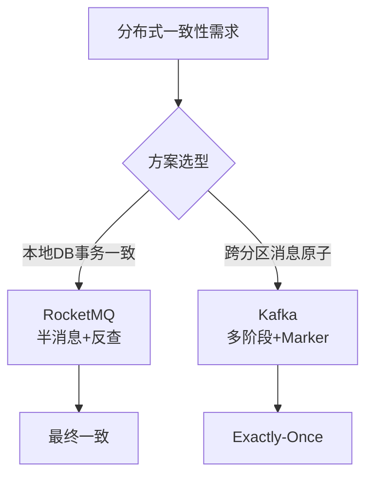

# 消息队列之事务消息？RocketMQ和Kafka是怎么做的

### 消息队列中的事务消息概念

在分布式系统中，事务消息主要用于解决**本地事务执行**与**消息发送**之间的原子性问题，或者保证**多条消息**之间的原子性。

#### 核心背景
*   **ACID 的局限**：传统的 ACID（原子性、一致性、隔离性、持久性）在单机数据库中容易实现。但在分布式系统中，为了保证高可用性和高性能，严格遵循 ACID（特别是强一致性和隔离性）会导致严重的资源锁争用和性能瓶颈。
*   **最终一致性**：分布式系统通常通过 BASE 理论（基本可用、软状态、最终一致性）来设计。事务消息旨在保证“本地事务操作”与“发送消息通知”这两个动作最终一致，即要么都成功，要么都失败。

#### 解决的问题场景
假设业务场景：**下单成功后，需通知积分系统加积分，同时通知物流系统发货。**
1.  **直接发送消息**：如果本地事务（扣款、生成订单）成功，但发送消息失败，则数据不一致。
2.  **先发消息后事务**：如果消息发送成功，本地事务回滚，其他系统消费了错误消息，数据不一致。
3.  **事务消息**：确保“下单事务”与“消息发送”绑定，要么都生效，要么都失效。

#### 实现流派：RocketMQ vs Kafka
虽然都叫“事务消息”，但解决的侧重点略有不同：

1.  **RocketMQ 事务消息**：
    *   **目标**：解决**本地事务**与**发消息**的原子性。
    *   **核心**：采用“半消息”机制 + 本地事务反查。确保消息发送与本地 DB 事务的最终一致性。

2.  **Kafka 事务消息**：
    *   **目标**：解决**跨分区/跨 Topic 的多条消息写入**的原子性。
    *   **核心**：基于幂等性机制和多阶段提交。确保在一个事务内，向多个 Partition 发送的多条消息要么全部写入成功，对外部可见，要么全部不可见。这主要是为了配合 Kafka Streams 实现“Exactly-Once”语义。

```text
+------------------------+     +--------------------------+
|     业务系统 (DB)       |     |      消息队列 (MQ)        |
+------------------------+     +--------------------------+
|                        |     |                          |
| 1. 执行本地事务 (如下单)| --> | (RocketMQ: 先存半消息)   |
|                        |     |                          |
| 2. 事务成功/失败       | --> | (RocketMQ: 提交/回滚)    |
|                        |     |                          |
| 3. 异常情况 (网络中断) | <--| (RocketMQ: 反查事务状态) |
+------------------------+     +--------------------------+
```

### 实战深化

**实战案例**：
**积分发放“幽灵订单”问题**。某电商系统使用 RocketMQ 事务消息，本地事务是创建订单，消息是加积分。曾出现订单创建成功，但数据库主从同步延迟导致回查事务状态时，查询从库发现“订单不存在”，从而回滚了消息，导致用户有订单却没积分。**教训**：事务消息的回查接口必须查询主库，或者确保回查逻辑能容忍短暂的数据不一致，否则会造成严重的数据错乱。

**代码示例**：
Kafka 事务消息发送（实现流处理中的 Exactly-Once）
```java
Properties props = new Properties();
props.put("bootstrap.servers", "localhost:9092");
// 必须设置事务ID，Kafka利用它实现幂等和控制事务状态
props.put("transactional.id", "my-transactional-id-1");

KafkaProducer<String, String> producer = new KafkaProducer<>(props, new StringSerializer(), new StringSerializer());

// 1. 初始化事务
producer.initTransactions();

try {
    // 2. 开启事务
    producer.beginTransaction();
    
    // 3. 发送多条消息到不同分区（原子性）
    producer.send(new ProducerRecord<>("topic1", "key1", "value1"));
    producer.send(new ProducerRecord<>("topic2", "key2", "value2"));
    
    // 4. 消费-处理-生产的场景中，需手动提交消费偏移量作为事务的一部分
    // producer.sendOffsetsToTransaction(...);
    
    // 5. 提交事务
    producer.commitTransaction();
} catch (ProducerFencedException | OutOfOrderSequenceException | AuthorizationException e) {
    // 不可恢复异常，需关闭 producer
    producer.close();
} catch (KafkaException e) {
    // 可恢复异常，回滚事务
    producer.abortTransaction();
}
```

**对比表格**：

| 维度 | RocketMQ 事务消息 | Kafka 事务消息 |
| :--- | :--- | :--- |
| **核心目的** | 解耦业务与MQ，保证**本地DB**与**MQ发送**一致性 | 保证 **跨分区/Topic 写入**的原子性，支撑流处理 Exactly-Once |
| **实现机制** | 半消息 + 二阶段提交 + 定时反查 | 两阶段提交 + 事务日志 + 幂等性生产者 |
| **适用场景** | 业务解耦（如：下单->发券->积分），涉及DB交互 | 流式计算、数据同步，确保多条数据同时可见或不可见 |
| **一致性保证** | 最终一致性 | 强一致性（事务内），对外部也是原子性 |
| **性能影响** | 反查机制会轻微影响 Broker 性能，但可接受 | 事务写入性能低于普通写入，需协调者记录日志 |

## 常见考点
1.  **为什么不能直接使用 DB 事务？**
    跨服务调用涉及不同的数据库实例，无法直接通过本地 ACID 事务覆盖。
2.  **事务消息会造成消息积压吗？**
    RocketMQ 的半消息对消费者不可见，不会影响正常业务消费；反查机制是异步低频执行的，不会阻塞主流程。
3.  **Kafka 的 Exactly-Once 是指消费端只处理一次吗？**
    不是。Kafka 的 Exactly-Once 是指“从 Topic 消费 -> 处理 -> 写入 Topic”这一端的精确一次处理，通常是内部流处理场景，对于普通业务消费端，依然需要配合幂等性来保证不重复消费。




## 记忆要点

- 核心解决本地事务与发消息的原子性，保证分布式最终一致性
- RocketMQ 重解决本地DB事务与发消息一致：半消息机制 + 事务反查
- Kafka 重解决多条跨分区消息原子性：多阶段提交 + 事务标记(Marker)
- 反查避坑：RocketMQ回查务必查主库，避免主从延迟导致误判回滚

## 结构化回答

**30 秒电梯演讲：** 分布式场景下牺牲强一致性换取高可用的妥协。打个比方，就像转账，以前必须实时对账（强一致），现在允许晚上再对账（最终一致）。

**展开框架：**
1. **核心解决本地事务与发消息的原子性** — 保证分布式最终一致性
2. **RocketMQ 重解决本地DB事务与发消息一致** — 半消息机制 + 事务反查
3. **Kafka 重解决多条跨分区消息原子性** — 多阶段提交 + 事务标记(Marker)

**收尾：** 这三点都能配合实战聊。您想深入聊原理、对比还是避坑？

## 视频脚本

> 预计时长：2 分钟 | 由浅入深

| 时间 | 画面/字幕 | 口播台词 | 讲解要点 |
|------|----------|----------|----------|
| 0:00 | 标题卡：消息队列之事务消息？RocketMQ… | "消息队列之事务消息？RocketMQ和Kafka是怎么做的？一句话——就像转账，以前必须实时对账（强一致），现在允许晚上再对账（最终一致）。" | 开场钩子 |
| 0:40 | 概念动画/示意图 | "分布式场景下牺牲强一致性换取高可用的妥协——就像转账，以前必须实时对账（强一致），现在允许晚上再对账（最终一致）" | 核心定义 |
| 1:20 | 要点1图解示意 | "保证分布式最终一致性" | 要点1 |
| 2:00 | 总结卡 | "记住这几条，面试不慌。下期讲进阶追问。" | 收尾 |
