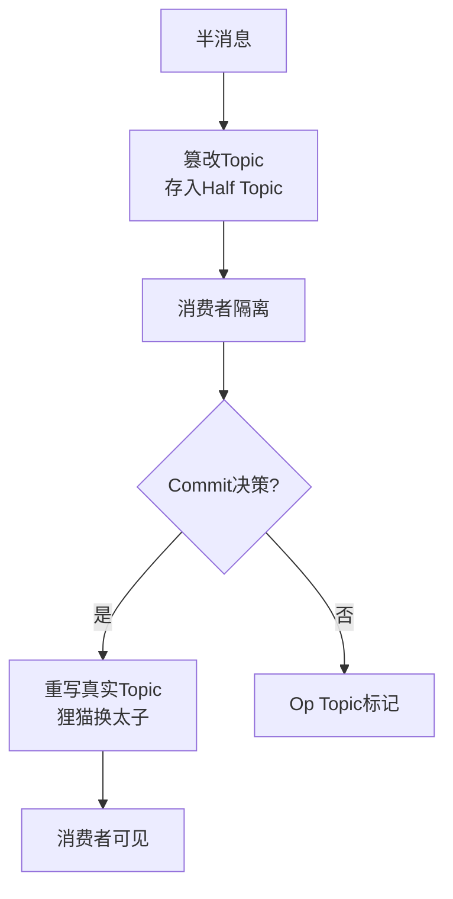

# RocketMQ 事务消息源码分析

### RocketMQ 事务消息源码深度解析

基于前文的概念，我们深入 RocketMQ 源码（以 4.x 版本为例），分析其落地细节，特别是“狸猫换太子”的主题切换机制和 Op 消息的作用。

#### 1. 发送半消息
入口：`sendMessageInTransaction` 方法。
*   **标记属性**：在消息属性中设置 `TRANSACTION_MSG_TYPE = true`（或 `PROPERTY_TRANSACTION_PREPARED`）。
*   **主题切换**：在发送前，会将原始 Topic 和 QueueId 存入消息属性中，然后将消息的 Topic 设置为 `RMQ_SYS_TRANS_HALF_TOPIC`，QueueId 设置为 0。
*   **结果处理**：发送成功后，执行本地事务 `executeLocalTransaction`。

#### 2. Broker 处理半消息
入口：`SendMessageProcessor.sendMessage`。
*   **识别**：检测到属性 `PROPERTY_TRANSACTION_PREPARED` 为 true。
*   **持久化**：虽然是系统 Topic，但依然写入 `CommitLog`，然后构建 `ConsumeQueue` 索引。
*   **关键细节**：由于修改了 Topic，消费者无法订阅该 Topic，因此无法消费，保证了隔离性。

#### 3. 处理 Commit/Rollback
入口：`EndTransactionProcessor.processRequest`。
*   **Commit 提交**：
    1.  从消息属性中读出原始 Topic 和 QueueId。
    2.  构建一条新消息（内容与半消息一致）。
    3.  写入原始 Topic 的 `CommitLog`。
    4.  这条新消息对消费者可见，完成投递。
*   **Rollback 回滚**：
    1.  不会向原始 Topic 写入消息。
    2.  **关键补充**：向 `RMQ_SYS_TRANS_OP_HALF_TOPIC` 写入一条“Op 消息”。这条消息标记了对应的 Half 消息已经被处理（回滚/提交）。

#### 4. 事务反查与 Op 消息机制
入口：`TransactionalMessageCheckService`。

**为什么需要 Op 消息 (`RMQ_SYS_TRANS_OP_HALF_TOPIC`)？**
这是 RocketMQ 设计的精妙之处。`CommitLog` 是顺序写，不支持物理删除。如果事务反查发现一个半消息需要“再次”检查（因为上次没查出结果），我们不能原地修改半消息，只能写入一条新的 Op 消息来记录状态。

**反查流程源码逻辑**：
1.  **读取 Half 队列**：从 `RMQ_SYS_TRANS_HALF_TOPIC` 读取消息。
2.  **过滤已处理消息**：利用 `RMQ_SYS_TRANS_OP_HALF_TOPIC` 中的记录。如果某条 Half 消息已经在 Op 队列中存在记录（说明已经 Commit 或 Rollback 过了），则跳过该半消息，不再反查。
3.  **处理未知消息**：对于没有 Op 记录的半消息，发送 RPC 请求给 Producer 进行反查。
4.  **推进进度**：
    *   如果反查成功（Commit/Rollback），写入 Op 消息记录，并推进 Half 队列的消费 Offset。
    *   如果反查结果依然是 UNKNOWN，为了保证下次还能查到它，**会将该半消息重新写入** Half 队列的末尾（并更新 Offset），但这会无限循环吗？
    *   **限制**：RocketMQ 会记录事务的检查次数，超过阈值（默认 15 次）后，若依然 UNKNOWN，则默认丢弃（写入 Rollback Op 消息），防止死循环。

---

#### 💡 深化拓展

**1. 实战案例**
在金融支付场景中，订单创建后发送半消息。若本地事务执行成功但网络中断导致 `EndTransaction` 请求丢失，Broker 会发起反查。如果反查接口设计不当（如响应超时），消息会被反复重试，可能导致数据库压力飙升甚至重复扣款。因此，本地事务方法的**幂等性**设计至关重要。

**2. 代码示例 (Java - 发送事务消息核心逻辑)**
```java
// 构建 Half 消息
Message msg = new Message("TopicTest", "TagA", "OrderID123", "Hello RocketMQ".getBytes());

// 发送并指定事务监听器
TransactionSendResult sendResult = producer.sendMessageInTransaction(msg, new TransactionListener() {
    // 执行本地事务
    @Override
    public LocalTransactionState executeLocalTransaction(Message msg, Object arg) {
        // 核心业务：插入订单记录
        boolean success = orderService.insertOrder((Order) arg);
        return success ? LocalTransactionState.COMMIT_MESSAGE : LocalTransactionState.ROLLBACK_MESSAGE;
    }

    // Broker 反查接口
    @Override
    public LocalTransactionState checkLocalTransaction(MessageExt msg) {
        // 核心逻辑：查询订单状态，必须支持幂等
        Order order = orderService.queryOrderByTxId(msg.getTransactionId());
        if (order == null) return LocalTransactionState.UNKNOW;
        return order.getStatus() == 1 ? LocalTransactionState.COMMIT_MESSAGE : LocalTransactionState.ROLLBACK_MESSAGE;
    }
}, orderObj);
```

**3. 核心机制对比**

| 特性 | 半消息 (Half Message) | Op 消息 (Operation Message) |
| :--- | :--- | :--- |
| **Topic** | `RMQ_SYS_TRANS_HALF_TOPIC` | `RMQ_SYS_TRANS_OP_HALF_TOPIC` |
| **作用** | 暂存事务数据，对下游不可见 | 标记半消息的处理状态（已提交/已回滚） |
| **可见性** | 仅 Broker 内部可见，用于反查 | 仅 Broker 内部可见，用于过滤脏数据 |
| **生命周期** | 直到被 Commit（转正）或 Rollback（标记删除） | 与半消息生命周期绑定，用于加速反查时的过滤 |
| **物理存储** | 写入 CommitLog | 写入 CommitLog |

#### 核心数据流转图
```text
+-----------------+         Commit         +----------------+
| Producer        | -------------------> | Broker (Normal) |
| (Local Tx)      | <------------------- |    Topic       |
+-----------------+    (EndTransaction)  +----------------+
       |




## 记忆要点

- 存储奥秘：半消息篡改主题存入 Half Topic，实现消费者隔离
- Commit 并非修改原消息，而是狸猫换太子重新写回真实 Topic
- Op Topic 标记作用：因CommitLog不支持删，用Op消息标记半消息已处理
- 防死循环：反查 UNKNOWN 超过 15 次默认丢弃，防止无限重试

## 结构化回答

**30 秒电梯演讲：** 狸猫换太子存半消息，回查确认后恢复真身。打个比方，把包裹（消息）先暂存在仓库特殊区域，确认收货后再放到货架上让买家拿。

**展开框架：**
1. **存储奥秘** — 半消息篡改主题存入 Half Topic，实现消费者隔离
2. **Commit 并非修改原消息** — 而是狸猫换太子重新写回真实 Topic
3. **Op Topic 标记作用** — 因CommitLog不支持删，用Op消息标记半消息已处理

**收尾：** 我在项目里踩过坑——在金融支付场景中，订单创建后发送半消息。您想深入聊哪一段：原理、避坑还是对比选型？

## 视频脚本

> 预计时长：4 分钟 | 由浅入深

| 时间 | 画面/字幕 | 口播台词 | 讲解要点 |
|------|----------|----------|----------|
| 0:00 | 标题卡：RocketMQ 事务消息源码分析 | "RocketMQ 事务消息源码分析？一句话——把包裹（消息）先暂存在仓库特殊区域，确认收货后再放到货架上让买家拿。" | 开场钩子 |
| 0:48 | 概念动画/示意图 | "狸猫换太子存半消息，回查确认后恢复真身——把包裹（消息）先暂存在仓库特殊区域，确认收货后再放到货架上让买家拿" | 核心定义 |
| 1:36 | 存储奥秘示意 | "半消息篡改主题存入 Half Topic，实现消费者隔离" | 要点1 |
| 2:24 | 要点2图解示意 | "而是狸猫换太子重新写回真实 Topic" | 要点2 |
| 3:12 | 要点3图解示意 | "因CommitLog不支持删，用Op消息标记半消息已处理" | 要点3 |
| 4:00 | 总结卡 | "记住这几条，面试不慌。下期讲进阶追问。" | 收尾 |
