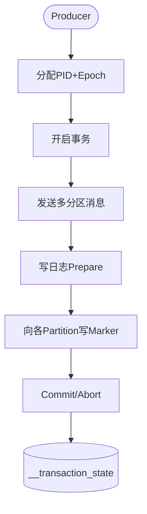

# Kafka 事务消息

### Kafka 事务消息与 Exactly-Once 语义

Kafka 的事务消息设计初衷与 RocketMQ 不同，它主要是为了解决**流处理**场景下的**Exactly-Once（精确一次）**语义问题，即“从 Topic 消费 -> 处理 -> 写入 Topic”的过程中，数据既不丢失也不重复。

#### 核心组件
1.  **TransactionCoordinator (事务协调器)**：
    *   运行在 Broker 端，负责管理事务的生命周期（开始、提交、回滚）。
    *   每个 Producer 会被分配一个特定的 Coordinator（通常通过 PID 的哈希计算）。
2.  **__transaction_state Topic (事务日志)**：
    *   内部 Topic，用于持久化存储事务的状态（如 Preparing, Committing, Complete）。这保证了即使 Coordinator 宕机，事务状态也能恢复。
3.  **__consumer_offsets (位移主题)**：
    *   事务提交时，Consumer 的 Offset 提交也会包含在事务中，保证“消息处理”和“Offset 更新”是原子性的。

#### 事务流程 (两阶段提交 + 幂等)

1.  **查找协调器**：Producer 向集群查找负责自己的 TransactionCoordinator。
2.  **获取 PID (Producer ID) 和 Epoch**：
    *   Producer 初始化时向 Coordinator 申请 PID。
    *   PID 用于唯一标识生产者；Epoch 用于防止僵尸实例（同一个 PID 的旧 Producer 实例会被拒绝）。
3.  **开启事务**：发送 `InitProducerId` 请求。
4.  **发送消息**：
    *   Producer 发送消息到多个 Partition。
    *   Broker 端并不会立刻将这些消息对 Consumer 可见，而是暂存，等待事务结束指令。
    *   **关键点**：利用幂等性机制，为每条消息分配 Sequence Number，Broker 去重。
5.  **发送 Offset (如果是消费-生产模式)**：将处理过的消息 Offset 发送给 Coordinator，加入事务。
6.  **提交或回滚 (Commit/Rollback)**：
    *   Producer 发送 `EndTxn` 请求给 Coordinator。
    *   Coordinator 采用 **2PC (Two Phase Commit)** 协议：
        *   **Phase 1**: 在 `__transaction_state` 中写入 `PREPARE_COMMIT`。
        *   **Phase 2**: 向涉及的所有 Partition 写入 **Transaction Marker (事务标记)**。

#### 事务标记
这是 Kafka 实现事务可见性的核心：
*   **Commit Marker**: 告诉 Broker 该事务内的所有消息对 Consumer **可见**（可读取）。
*   **Abort Marker**: 告诉 Broker 该事务内的所有消息**不可见**（丢弃）。
*   Consumer 在读取消息时，会根据这些 Marker 来过滤或确认消息的有效性。

#### 实战案例：流处理中的数据一致性
在实时数仓场景中，使用 Kafka Streams 进行“点击流Topic -> 聚合计算 -> 结果Topic”处理。如果未开启事务，计算程序重启可能导致结果数据重复。开启 `isolation.level=read_committed` 后，即使 Flink/Kafka Streams 任务重启，也能保证结果精确一次，不会出现重复销售额的情况。

#### 代码示例（Java）
```java
Properties props = new Properties();
props.put("bootstrap.servers", "localhost:9092");
props.put("transactional.id", "my-transactional-id"); // 必须设置且唯一

Producer<String, String> producer = new KafkaProducer<>(props, new StringSerializer(), new StringSerializer());

// 1. 初始化事务
producer.initTransactions();

try {
    // 2. 开启事务
    producer.beginTransaction();
    
    // 3. 发送消息（消费偏移量也可在此通过 sendOffsetsToTransaction 提交）
    producer.send(new ProducerRecord<>("topic1", "key1", "value1"));
    producer.send(new ProducerRecord<>("topic2", "key2", "value2"));
    
    // 4. 提交事务（若异常则调用 abortTransaction）
    producer.commitTransaction();
} catch (ProducerFencedException | OutOfOrderSequenceException | AuthorizationException e) {
    producer.close();
} catch (KafkaException e) {
    producer.abortTransaction();
}
```

#### 架构流程图
```text
+--------------+                                   +-------------------+
|   Producer   |                                   | TransactionCoordinator|
| (PID, Epoch) |                                   | (Broker)          |
+--------------+                                   +-------------------+
       |                                                   |
       | 1. InitProducerId (获取 PID)                       |
       |-------------------------------------------------->|
       |                                                   |
       | 2. BeginTxn                                       |
       |-------------------------------------------------->|
       |                                                   |
       | 3. AddPartitionsToTxn (指定要写入的分区)           |
       |-------------------------------------------------->|
       |                                                   |
       | 4. Produce (发送数据，暂存于Broker)               |
       |-------------------------> [Partitions]            |
       |                                                   |
       | 5. EndTxn (Commit)                                |
       |-------------------------------------------------->|
       |                                                   |
       | 6. Write Transaction Markers (写入标记)            |
       |<--------------------------------------------------|
       |                         |                         |
       |                         v                         |
       |                   [Partitions] (Consumer可见)     |
```




## 记忆要点

- 设计初衷截然不同：Kafka 为流处理 Exactly-Once，非本地DB一致
- 核心组件：协调器管理生命周期，__transaction_state 持久化事务状态
- 防僵尸与去重：依靠 PID 唯一标识，Epoch 防旧实例，序列号去重
- 两阶段提交：先写日志 Prepare，再向各 Partition 写 Marker 控制可见性

## 结构化回答

**30 秒电梯演讲：** 利用事务协调器和日志实现多条消息的原子写入。打个比方，就像发快递打包，要么全发走，要么全不发，不会只发一半。

**展开框架：**
1. **设计初衷截然不同** — Kafka 为流处理 Exactly-Once，非本地DB一致
2. **核心组件** — 协调器管理生命周期，__transaction_state 持久化事务状态
3. **防僵尸与去重** — 依靠 PID 唯一标识，Epoch 防旧实例，序列号去重

**收尾：** 我在项目里踩过坑——在实时数仓场景中，使用 Kafka Streams 进行“点击流Topic -> 聚合计算 -> 结果Topic”处理。您想深入聊哪一段：原理、避坑还是对比选型？

## 视频脚本

> 预计时长：3 分钟 | 由浅入深

| 时间 | 画面/字幕 | 口播台词 | 讲解要点 |
|------|----------|----------|----------|
| 0:00 | 标题卡：Kafka 事务消息 | "Kafka 事务消息？一句话——就像发快递打包，要么全发走，要么全不发，不会只发一半。" | 开场钩子 |
| 0:45 | 概念动画/示意图 | "利用事务协调器和日志实现多条消息的原子写入——就像发快递打包，要么全发走，要么全不发，不会只发一半" | 核心定义 |
| 1:30 | 设计初衷截然不同示意 | "Kafka 为流处理 Exactly-Once，非本地DB一致" | 要点1 |
| 2:15 | 核心组件示意 | "协调器管理生命周期，__transaction_state 持久化事务状态" | 要点2 |
| 3:00 | 总结卡 | "记住这几条，面试不慌。下期讲进阶追问。" | 收尾 |
