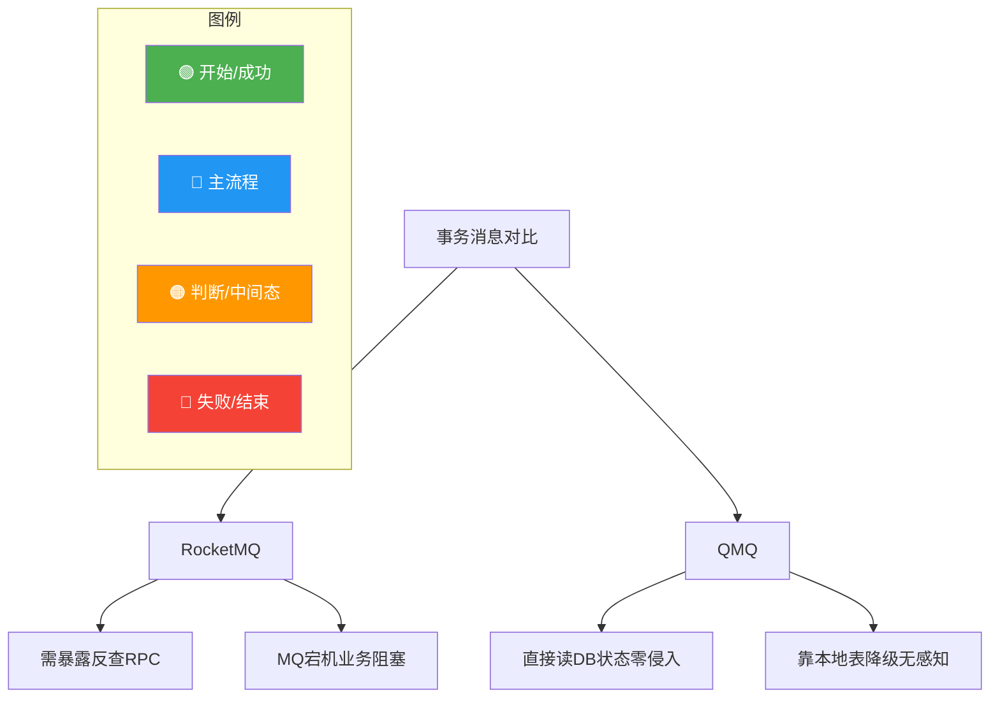
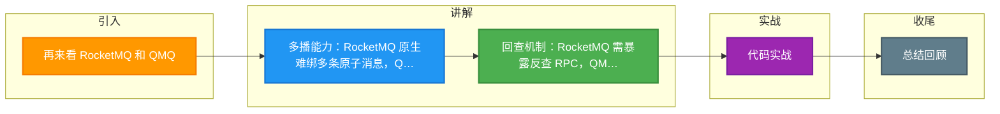

# 再来看 RocketMQ 和 QMQ

对比 RocketMQ 和 QMQ 的事务消息实现，两者在架构灵活性、运维复杂度和故障处理策略上有显著差异。

**1. 灵活性对比：单消息 vs 多消息**
*   **RocketMQ**：原生事务消息仅支持**单条消息**与本地事务的绑定。如果一个业务操作需要发送多条通知消息（如订单创建、积分增加、发券），RocketMQ 原生 API 无法在一个事务内原子性地发送多条，除非发送一条包含所有信息的“大消息”或者使用非事务方式。
*   **QMQ**：由于基于本地消息表，可以在一个 DB 事务中插入多条消息记录，从而实现**一次事务发送多条消息**。

```text
// QMQ 支持在一个事务中发送多条消息
@Transactional
public void orderProcess() {
    db.insert(order);
    msgTable.insert(msgA); // 消息 A
    msgTable.insert(msgB); // 消息 B
    msgTable.insert(msgC); // 消息 C
}
```

**2. 运维与实现复杂度对比**
*   **RocketMQ**：
    *   **反查接口**：因为半消息的 Commit 是 OneWay（单向调用），可能丢失。Broker 需要回查 Producer 的事务状态。因此 Producer 必须维护一个 `TransactionId` 到事务状态的映射（通常在内存或 Redis），并暴露反查接口。
    *   **HA 问题**：如果 Producer 挂了，Broker 需要找到同组的其他 Producer 反查，增加了架构复杂度。
*   **QMQ**：
    *   **建表成本**：需要业务方在 DB 中建表。虽然 QMQ 声称可以自动化，但客观上增加了 DB 的 Schema 管理成本。
    *   **无反查接口**：因为状态就在 DB 的消息表中，QMQ 自身的定时任务直接读取 DB 即可，不需要业务方暴露额外的 RPC 接口。

#### 实战案例：复杂业务场景的多播需求
在一个支付成功后的业务场景中，需要同时触发“短信通知”、“积分变更”、“大数据埋点”三个下游服务。使用 RocketMQ 事务消息时，需要将这三个事件打包成一条大消息发给“通用分发 Topic”，再由消费者拆分，逻辑耦合严重。而使用 QMQ，可以在支付事务中直接插入三条不同的消息记录，独立发往各自的 Topic，业务逻辑清晰解耦。

#### 代码示例（RocketMQ vs QMQ）

| 特性 | RocketMQ 事务消息 | QMQ 事务消息 |
| :--- | :--- | :--- |
| **发送多条消息** | 困难（需打包或循环发，非原子） | **简单**（循环 insert msgTable） |
| **反查接口** | 必须实现 `checkLocalTransaction` | **无需实现** (DB 自带状态) |
| **代码侵入性** | 发送逻辑需要特殊处理 | 利用注解/AOP，侵入性低 |

```java
// RocketMQ 发送多条消息的痛点：
// 无法保证 send(msg1) 和 send(msg2) 在同一个事务上下文中被 Commit
// 若中途挂机，可能出现 msg1 投递 msg2 丢失的情况
```

**3. 故障场景总结**
| 场景 | RocketMQ (先 MQ) | QMQ (先 DB) |
| :--- | :--- | :--- |
| **MQ 挂了** | **业务阻塞** (半消息发不出去) | **业务正常** (消息存 DB，后续补偿) |
| **DB 挂了** | 业务无法执行 | 业务无法执行 (都挂了) |
| **消息发送失败** | 依赖反查机制解决 | 依赖定时任务扫表解决 |

## 常见考点
1.  **事务状态存储**：RocketMQ 的事务状态如果存在本地内存，Producer 重启后怎么办？（状态丢失，可能导致 Broker 无法回查到正确状态，虽然 Broker 会一直重试，但可能影响一致性时效）。
2.  **性能损耗**：QMQ 方案中，事务内多了写入消息表的操作，对数据库性能有多大影响？（增加了 IO 和锁持有时间，高并发下需关注 DB 吞吐）。
3.  **消息顺序性**：在 QMQ 一次事务发送多条消息的场景下，如何保证消费端的顺序？（如果发往不同 Partition，顺序无法保证；需依赖业务设计或单 Partition 消费）。




## 记忆要点

- 多播能力：RocketMQ 原生难绑多条原子消息，QMQ 可一事务插多条表
- 回查机制：RocketMQ 需暴露反查 RPC，QMQ 直接读 DB 状态零侵入
- 容灾对比：MQ 宕机时 RocketMQ 业务阻塞，而 QMQ 靠本地表降级无感知
- 性能取舍：QMQ 增加了 DB 的 IO 和锁耗时，高并发需关注数据库吞吐

## 结构化回答

**30 秒电梯演讲：** QMQ 基于本地消息表，业务优先，消息补发。打个比方，RocketMQ 必须等快递员接单才能做饭；QMQ 先做饭，没事的时候再叫快递。

**展开框架：**
1. **多播能力** — RocketMQ 原生难绑多条原子消息，QMQ 可一事务插多条表
2. **回查机制** — RocketMQ 需暴露反查 RPC，QMQ 直接读 DB 状态零侵入
3. **容灾对比** — MQ 宕机时 RocketMQ 业务阻塞，而 QMQ 靠本地表降级无感知

**收尾：** 我在项目里踩过坑——实战案例：复杂业务场景的多播需求。您想深入聊哪一段：原理、避坑还是对比选型？

## 视频脚本

> 预计时长：3 分钟 | 由浅入深

| 时间 | 画面/字幕 | 口播台词 | 讲解要点 |
|------|----------|----------|----------|
| 0:00 | 标题卡：再来看 RocketMQ 和 QMQ | "再来看 RocketMQ 和 QMQ？一句话——RocketMQ 必须等快递员接单才能做饭；QMQ 先做饭，没事的时候再叫快递。" | 开场钩子 |
| 0:45 | 概念动画/示意图 | "QMQ 基于本地消息表，业务优先，消息补发——RocketMQ 必须等快递员接单才能做饭；QMQ 先做饭，没事的时候再叫快递" | 核心定义 |
| 1:30 | 多播能力示意 | "RocketMQ 原生难绑多条原子消息，QMQ 可一事务插多条表" | 要点1 |
| 2:15 | 回查机制示意 | "RocketMQ 需暴露反查 RPC，QMQ 直接读 DB 状态零侵入" | 要点2 |
| 3:00 | 总结卡 | "记住这几条，面试不慌。下期讲进阶追问。" | 收尾 |

### 视频流程图



