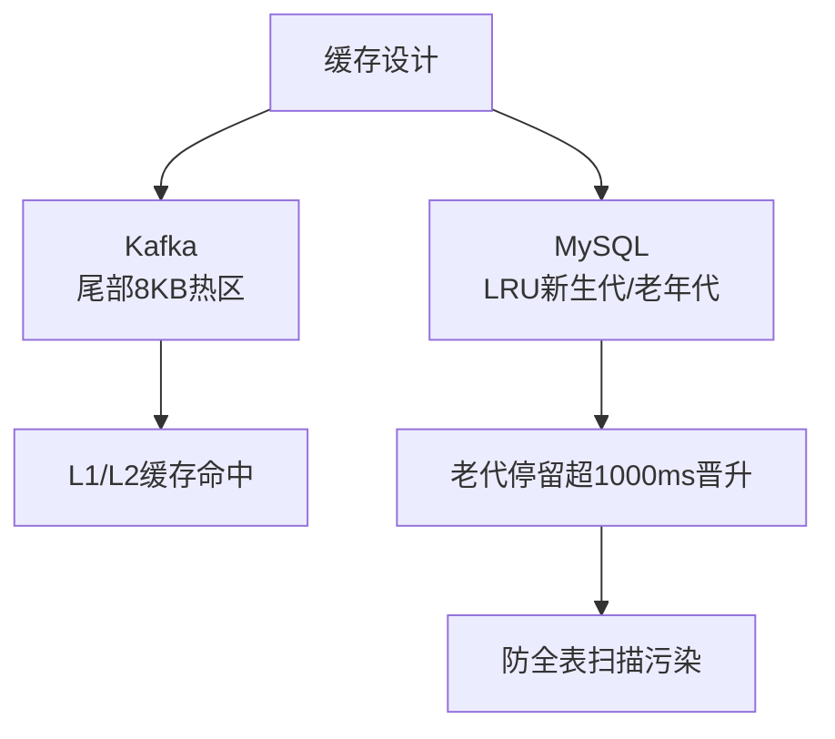

# 从Kafka的索引冷热分区到MySQL InnoDB的缓冲池管理

Kafka 和 MySQL 都针对传统 LRU 算法在特定场景下的不足进行了优化，核心思想都是**冷热数据分层**，防止缓存被非热点数据污染。

### 1. Kafka 索引的二分查找优化：Warm Sections
传统的二分查找是“跳跃式”访问内存，这可能导致 CPU 缓存行频繁失效。Kafka 索引的写入具有明显的**局部性原理**（刚写入的数据往往马上被读取，即热点在尾部）。

- **优化机制**：Kafka 将索引文件分为两部分：
  - **Warm Section**：索引文件末尾的 8KB 数据（由 `_warmEntries` 定义）。
  - **Cold Section**：索引文件其余部分。
- **查找策略**：
  - 如果目标 Offset 可能在 Warm Section（近期写入的数据），则使用一种改进的二分算法，仅访问 Warm Section 内的页。
- **实战案例**：在电商大促期间，消费者频繁拉取最新产生的订单消息（尾部数据），Kafka Broker 的 CPU 利用率显著降低。这是因为绝大部分查找操作都在 Warm Section 完成，极大地减少了对 Cold Section 的随机内存访问，提升了 CPU L1/L2 缓存的命中率。

### 2. MySQL InnoDB 缓冲池优化：LRU 算法改良
MySQL 的 Buffer Pool 使用页来存储数据，默认采用 LRU 算法管理。但标准 LRU 存在两个问题：**预读失效**和**全表扫描污染**。

- **优化结构**：将 LRU 链表分为 **Young Generation**（新生代）和 **Old Generation**（老年代）。默认比例约为 7:3（由 `innodb_old_blocks_pct` 控制）。

#### 解决问题详解
1. **预读失效**：预读的页直接插入到 **Old Generation** 头部，避免挤走热点数据。
2. **全表扫描（缓存污染）**：插入 Old Generation。数据在 Old 区域被访问后，必须停留超过 `innodb_old_blocks_time`（默认 1000ms）才能移动到 Young 区域。

- **代码示例 (伪代码)**：
  ```java
  // InnoDB Buffer Pool LRU 简化逻辑
  void accessPage(Page page) {
      if (page.inOldRegion && 
          (System.currentTimeMillis() - page.firstAccessTime) < innodb_old_blocks_time) {
          // 时间窗口内访问不晋升
          return; 
      }
      moveToListHead(page, youngGeneration); // 晋升到新生代头部
  }
  ```

### 对比表格：Kafka Warm Section vs MySQL LRU
| 特性 | Kafka Warm Section | MySQL InnoDB LRU (Young/Old) |
| :--- | :--- | :--- |
| **优化目标** | 提升 CPU 缓存命中率，减少二分查找的缺页中断 | 防止预读失效和全表扫描污染 Buffer Pool |
| **数据结构** | 索引文件的物理尾部区域 | 逻辑上的双向链表（Young + Old） |
| **判断依据** | 物理位置（是否在最近 8KB） | 访问频率 + 时间窗口 (`innodb_old_blocks_time`) |
| **适用场景** | 顺序写、尾部读的日志系统 | 通用关系型数据库，存在大量随机读 |

### 常见考点
1. **Kafka 索引为什么只对尾部 8KB 做优化？**
   - 因为 Kafka 主要是顺序写和尾部读，根据时间局部性原理，最近的数据最容易被访问，尾部的命中率最高。




## 记忆要点

- 同源思想：Kafka与MySQL均采用冷热分层，防止热点缓存被非热点数据污染。
- Kafka机制：尾部8KB为热区，针对顺序写尾部读特性，提升CPU L1/L2缓存命中率。
- MySQL机制：LRU按比例分新生代老年代，老代停留超1000ms才晋升以防全表扫描污染。

## 结构化回答

**30 秒电梯演讲：** 利用CPU缓存页大小优化索引二分查找性能。打个比方，把热书页常放在桌面上，避免每次都要起身去书架。

**展开框架：**
1. **同源思想** — Kafka与MySQL均采用冷热分层，防止热点缓存被非热点数据污染。
2. **Kafka机制** — 尾部8KB为热区，针对顺序写尾部读特性，提升CPU L1/L2缓存命中率。
3. **MySQL机制** — LRU按比例分新生代老年代，老代停留超1000ms才晋升以防全表扫描污染。

**收尾：** 我在项目里踩过坑——MySQL 的 Buffer Pool 使用页来存储数据，默认采用 LRU 算法管理。您想深入聊哪一段：原理、避坑还是对比选型？

## 视频脚本

> 预计时长：4 分钟 | 由浅入深

| 时间 | 画面/字幕 | 口播台词 | 讲解要点 |
|------|----------|----------|----------|
| 0:00 | 标题卡：从Kafka的索引冷热分区到MySQ… | "从Kafka的索引冷热分区到MySQL InnoDB的缓冲池管理？一句话——把热书页常放在桌面上，避免每次都要起身去书架。" | 开场钩子 |
| 0:48 | 概念动画/示意图 | "利用CPU缓存页大小优化索引二分查找性能——把热书页常放在桌面上，避免每次都要起身去书架" | 核心定义 |
| 1:36 | 同源思想示意 | "Kafka与MySQL均采用冷热分层，防止热点缓存被非热点数据污染。" | 要点1 |
| 2:24 | Kafka机制示意 | "尾部8KB为热区，针对顺序写尾部读特性，提升CPU L1/L2缓存命中率。" | 要点2 |
| 3:12 | MySQL机制示意 | "LRU按比例分新生代老年代，老代停留超1000ms才晋升以防全表扫描污染。" | 要点3 |
| 4:00 | 总结卡 | "记住这几条，面试不慌。下期讲进阶追问。" | 收尾 |

### 视频流程图


