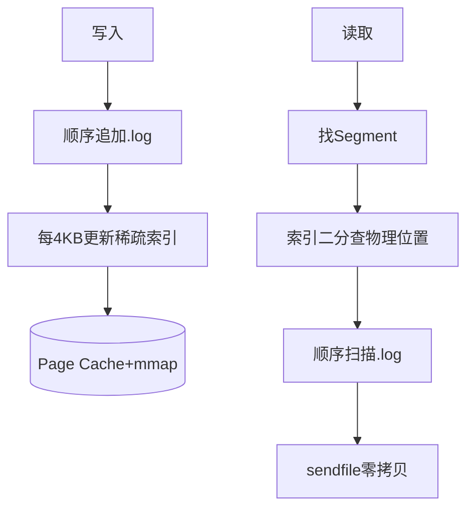

# Kafka日志段如何读写解析

Kafka 的日志读写操作是高度依赖其底层存储结构的。理解读写流程需要先掌握其物理文件布局。

### 1. 存储结构回顾
一个 Partition 对应磁盘上的一个目录。目录下包含多个 Log Segment。每个 Segment 包含以下核心文件：
- `.log`：实际存储消息数据。
- `.index`：位移索引。
- `.timeindex`：时间戳索引。

### 2. 写入流程
Kafka 采用**顺序写**（Append-Only），这是其高性能的基石。

1. **定位 Segment**：根据当前写入的 Offset，计算应该写入到哪个 Segment（通常是活跃的最后一个 Segment）。
2. **追加写入**：直接将消息字节流追加到 `.log` 文件末尾。
3. **更新索引**：检查当前写入的消息字节数是否超过 `log.index.interval.bytes`。如果超过，则在 `.index` 和 `.timeindex` 文件末尾追加对应的索引项。
4. **刷盘**：依赖 OS Page Cache，应用层通过 `mmap` 或 `filechannel` 写入后，数据先进入 Page Cache。根据 `flush.messages` 或 `flush.ms` 策略由 OS 或 Kafka 线程刷盘。

- **代码示例**：
  ```java
  // Kafka LogSegment 核心追加逻辑 (简化)
  public long append(long offset, ByteBuffer records) {
      int physicalPosition = logFile.append(records); // 1. 写日志
      if (bytesSinceLastIndexEntry > indexIntervalBytes) { // 2. 判断是否需建索引
          index.append(offset, physicalPosition); // 3. 写索引
          bytesSinceLastIndexEntry = 0;
      }
      return physicalPosition;
  }
  ```

- **实战案例**：在物联网设备上报场景中，每秒写入百万级小消息。曾遇到因磁盘坏道导致顺序写退化随机写，TPS 从 50W 跌至 1W。更换磁盘并确保 `filechannel` 使用 `position` 写入而非随机跳转后，性能恢复正常。

### 3. 读取流程
读取通常需要根据 Offset 或 Timestamp 定位消息。

1. **查找 Segment**：遍历 Partition 下的所有 Segment，找到包含目标 Offset 的那个 Segment。
2. **查找索引**：
   - 若指定 Offset：在 `.index` 中二分查找，获取物理位置。
   - 若指定 Timestamp：在 `.timeindex` 中二分查找，找到 <= 目标时间的最大时间戳对应的 Offset。
3. **读取数据**：从物理位置开始，从 `.log` 文件读取数据。
   - **重要细节**：索引是稀疏的，找到物理位置后，可能需要读取多条消息并进行比对，直到精确匹配到目标 Offset 的消息。
4. **零拷贝传输**：如果消费者拉取数据，Kafka 利用 `sendfile` 系统调用，直接将数据从 Page Cache 传输到网卡，跳过用户态内存拷贝，极大提高吞吐量。

## 技术原理

Kafka 日志段读写设计的核心是**"顺序写 + 稀疏索引 + 零拷贝"三件套**，每件都对应磁盘和操作系统的物理特性优化。

- **顺序写的物理优势**：机械磁盘顺序写比随机写快 100-1000 倍（磁头不寻道），SSD 顺序写也比随机写快 5-10 倍（FTL 映射友好、GC 压力小）。Kafka 把所有写入都追加到 `.log` 末尾，永远不修改已写内容，这是高吞吐的基石。配合 OS Page Cache，写入先到内存再异步刷盘，应用感知的写入速度接近内存速度。
- **稀疏索引的设计权衡**：如果每条消息都建索引，索引本身会很大且写入慢。Kafka 每 4KB（`log.index.interval.bytes`）建一个索引项，是个"抽样索引"。读取时二分找到最近的索引点，再顺序扫描小范围 `.log` 找到目标 offset。索引项少（稀疏）让索引文件小到能常驻 Page Cache，二分查找全在内存完成。
- **二分查找的细节**：`.index` 文件每项固定 8 字节（4 字节 offset + 4 字节物理位置），二分时把整个索引文件 mmap 到内存，按相对位移排序。注意 Kafka 的索引存的是"相对 offset"（节省 4 字节），二分时要加上 base offset 转绝对 offset。
- **sendfile 零拷贝的原理**：传统读文件→网络发送要 4 次拷贝（磁盘→内核 Page Cache→用户态 buffer→内核 Socket buffer→网卡）+ 4 次上下文切换。`sendfile` 让内核直接把 Page Cache 的数据 DMA 传到网卡，2 次拷贝（磁盘→Page Cache→网卡）+ 2 次上下文切换。Kafka 消费者拉数据时走 sendfile，吞吐提升数倍且不占用户态内存。
- **Segment 切分的目的**：单个 `.log` 无限增长会让查找变慢、删除过期数据变难（删除要 copy）。Kafka 按 size 或 time 切 Segment，旧 Segment 可以整体删除（保留策略），查找时先用 offset 二分定位 Segment 再查内部索引，复杂度 O(log N) 而非 O(N)。

## 代码示例

```java
// 1. LogSegment 核心写入逻辑（Kafka 源码简化版）
public class LogSegment {
    private final FileRecords log;          // .log 文件（ mmap 或 FileChannel）
    private final OffsetIndex index;        // .index 偏移量索引
    private final TimeIndex timeIndex;      // .timeindex 时间索引
    private final int indexIntervalBytes;   // 每隔多少字节建一个索引项
    private int bytesSinceLastIndexEntry;

    public long append(long offset, long timestamp, ByteBuffer records) {
        // 1. 顺序追加到 .log
        int physicalPos = log.append(records);

        // 2. 每隔 indexIntervalBytes 建一个索引项（稀疏索引）
        if (bytesSinceLastIndexEntry >= indexIntervalBytes) {
            index.append(offset, physicalPos);        // offset → 物理位置
            timeIndex.append(lastTimestamp, physicalPos);
            bytesSinceLastIndexEntry = 0;
        }
        bytesSinceLastIndexEntry += records.remaining();
        return physicalPos;
    }
}
```

```java
// 2. 读取流程：offset → Segment → 索引二分 → 顺序扫描
public class LogSegment {
    public FetchDataInfo read(long startOffset, int maxSize) {
        // 1. 在 .index 中二分查找，找到 <= startOffset 的最大索引项
        OffsetPosition position = index.lookup(startOffset);
        // position.physicalPosition 是 .log 文件的字节偏移

        // 2. 从该物理位置开始顺序扫描 .log，直到找到精确匹配的 offset
        // （稀疏索引只能定位到附近，要小范围扫描）
        FileChannel.LogInputStream channel = log.openChannel(position.physicalPosition);
        while (channel.hasNext()) {
            RecordBatch batch = channel.readBatch();
            if (batch.lastOffset() >= startOffset) {
                return new FetchDataInfo(batch);   // 找到目标消息
            }
        }
    }
}

// OffsetIndex 的 lookup 是二分查找
public OffsetPosition lookup(long targetOffset) {
    // 二分找到 <= targetOffset 的最大索引项
    int slot = largestLowerBoundSlotFor(entries, targetOffset);
    return entries[slot];   // (relativeOffset, physicalPosition)
}
```

```java
// 3. 零拷贝：消费者拉取数据时用 sendfile
// Kafka 的 FileMessageSet 用 FileChannel.transferTo（底层 sendfile）
public long writeTo(GatheringByteChannel channel, long offset, int maxSize) {
    // FileChannel.transferTo 直接把文件数据 DMA 到 channel（Socket）
    // 跳过用户态 buffer，吞吐极高
    return fileChannel.transferTo(offset, maxSize, channel);
}

// 对比传统方式：read() → 用户 buffer → write()
// 4 次拷贝 + 4 次上下文切换
// sendfile：2 次拷贝（Page Cache → 网卡）+ 2 次上下文切换
```

```bash
# 4. 查看 Partition 的物理文件结构
ls -lh /var/lib/kafka/data/my-topic-0/
# 输出：
# 00000000000000000000.index     # 第一个 Segment 的 offset 索引
# 00000000000000000000.log       # 第一个 Segment 的数据
# 00000000000000000000.timeindex # 时间索引
# 00000000000005367890.index     # 第二个 Segment（滚动后）
# 00000000000005367890.log
# 00000000000005367890.timeindex
# leader-epoch-checkpoint

# 查看索引内容（验证稀疏索引）
kafka-dump-log.sh --files 00000000000000000000.index | head
# Offset: 0  Position: 0
# Offset: 100  Position: 4096     # 每隔 4KB 一个索引项
# Offset: 200  Position: 8192
```

## 对比选型

| 特性 | Kafka（稀疏索引+顺序写） | RabbitMQ（基于 Mnesia/消息索引） | Pulsar（分层存储） |
| :--- | :--- | :--- | :--- |
| **写入方式** | 顺序追加 `.log` | 内存/磁盘队列 | BookKeeper 分布式日志 |
| **索引** | 稀疏（每 4KB 一项） | 每条消息索引 | Ledger 级索引 |
| **零拷贝** | sendfile | 不支持 | 支持（分层） |
| **Page Cache 利用** | 重度依赖 | 弱 | 中（基于 Bookie） |
| **吞吐** | 极高（百万 TPS） | 中（万级 TPS） | 高 |
| **存储扩展** | 单机磁盘受限 | 弱 | 可扩展到对象存储 |

## 常见坑

- **磁盘满会让 Kafka 写入卡死**：Page Cache 用尽后会退化为同步刷盘，TPS 暴跌。监控 `iostat` 的 `%util` 和 `await`，磁盘使用率超 70% 告警。
- **磁盘坏道让顺序写退化为随机写**：HDD 坏道导致磁头反复寻道，TPS 从 50W 跌到 1W。SSD 也有类似问题（坏块重映射）。定期 SMART 检查。
- **稀疏索引的扫描代价**：如果 `log.index.interval.bytes` 设得太大（如 100KB），每次读取要扫描 100KB 数据找精确 offset，延迟上升。默认 4KB 是甜区，长消息场景可适当调大。
- **sendfile 在加密传输时失效**：TLS/SSL 需要在用户态加解密，无法用 sendfile（内核态直传）。Kafka 启用 SSL 后吞吐降 30-50%，这是安全/性能的权衡。
- **Page Cache 被其他进程挤占**：Kafka 依赖 Page Cache 做缓存，同机部署其他内存密集服务会让 Kafka 性能剧烈抖动。Kafka 应独占机器。
- **Segment 过多导致打开文件句柄超限**：每个 Segment 占 3 个文件句柄（.log/.index/.timeindex），多 Partition × 多 Segment 容易撑爆 `ulimit -n`。调大文件句柄上限到 100万+。
- **消费者 seek 到历史 offset 触发磁盘读**：Page Cache 只缓存最近数据，seek 到几天前的 offset 会冷读磁盘，延迟从毫秒到秒级。冷数据场景考虑分层存储（如 Pulsar/Tiered Storage）。




## 记忆要点

- 写高效：依赖顺序写，每隔4KB更新稀疏索引，借Page Cache与mmap提速。
- 读高效：找Segment->索引二分查物理位置->顺序扫描.log，精准定位目标消息。
- 零拷贝：消费端拉取数据时，利用sendfile实现内核态直达网卡，大幅提升吞吐。

## 结构化回答

**30 秒电梯演讲：** 分区是存储和读写的最小单元，由多段日志组成。打个比方，像大档案柜分成多个抽屉，每个抽屉里按顺序放一叠文件。

**展开框架：**
1. **写高效** — 依赖顺序写，每隔4KB更新稀疏索引，借Page Cache与mmap提速。
2. **读高效** — 找Segment->索引二分查物理位置->顺序扫描.log，精准定位目标消息。
3. **零拷贝** — 消费端拉取数据时，利用sendfile实现内核态直达网卡，大幅提升吞吐。

**收尾：** 我在项目里踩过坑——读取通常需要根据 Offset 或 Timestamp 定位消息。您想深入聊哪一段：原理、避坑还是对比选型？

## 视频脚本

> 预计时长：2 分钟 | 由浅入深

| 时间 | 画面/字幕 | 口播台词 | 讲解要点 |
|------|----------|----------|----------|
| 0:00 | 标题卡：Kafka日志段如何读写解析 | "Kafka日志段如何读写解析？一句话——像大档案柜分成多个抽屉，每个抽屉里按顺序放一叠文件。" | 开场钩子 |
| 0:40 | 概念动画/示意图 | "分区是存储和读写的最小单元，由多段日志组成——像大档案柜分成多个抽屉，每个抽屉里按顺序放一叠文件" | 核心定义 |
| 1:20 | 写高效示意 | "依赖顺序写，每隔4KB更新稀疏索引，借Page Cache与mmap提速。" | 要点1 |
| 2:00 | 总结卡 | "记住这几条，面试不慌。下期讲进阶追问。" | 收尾 |
