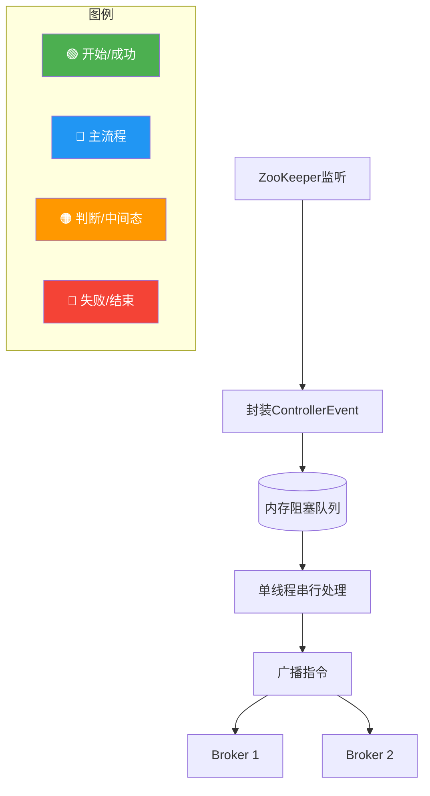
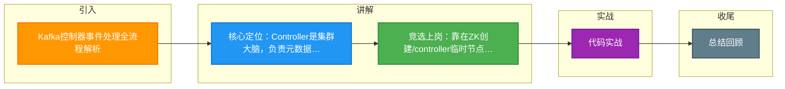

# Kafka控制器事件处理全流程解析

Kafka Controller 是集群的“大脑”，负责集群元数据的维护、分区的 Leader 选举以及 Topic 的创建与删除等管理操作。它通过**单点写入、多点同步**的机制来保证一致性。

### 1. Controller 的核心职责
- **分区状态管理**：负责分区 Leader 的选举（如 Broker 宕机时）。
- **Topic/Partition 管理**：创建、删除 Topic，调整 Partition 数量。
- **集群成员管理**：监听 Broker 的上下线。
- **副本重分配**：处理 Preferred Replica Election 等。

### 2. Controller 选举机制
- **触发时机**：集群启动时，或旧 Controller 宕机时。
- **选举过程**：
  1. Broker 尝试向 ZooKeeper 的临时节点 `/controller` 创建数据。
  2. 成功创建该节点的 Broker 成为 Controller。
  3. 其他 Broker 监听该节点，一旦节点消失，触发新一轮选举。

### 3. 事件处理线程模型：ControllerEventThread
为了避免阻塞，Controller 内部维护了一个**事件队列**和一个**处理线程**。
- 所有外部请求（如 ZK 监听器触发、API 请求）都封装成 `ControllerEvent` 放入队列。
- `ControllerEventThread` 单线程串行处理队列中的事件，保证元数据变更的有序性。

#### 架构图：Controller 事件处理全流程
```
+----------------+      ZK Watch / API      +----------------------+
|    Broker      | <----------------------> |   Controller Context  |
+----------------+                           +----------------------+
        ^                                           |
        |                                           | 1. Listen/Receive
        |                                           v
+----------------+                           +----------------------+
|   ZooKeeper    |                           |  Event Queue (Linked |
|   (Metadata)   |                           |  BlockingQueue)      |
+----------------+                           +----------------------+
                                                        |
                                                        | 2. Enqueue Event
                                                        v
+--------------------------------------------------------------+
|                 ControllerEventThread (Single)               |
+--------------------------------------------------------------+
        |
        | 3. Process (Serial Execution)
        v
+--------------------------------------------------------------+
|  State Machine / Leader Election / Partition Reassignment   |
+--------------------------------

### 4. 实战深化与案例

#### 4.1 实战案例：Controller 迁移引发的“风暴”
在生产环境中，曾遇到过 Controller 所在的 Broker 因为 Full GC 导致长时间 STW（Stop The World），ZooKeeper 会话超时导致 Controller 节点被删除。集群立即触发选举，但新 Controller 上任后需要向集群所有 Broker 广播 `LeaderAndIsrRequest`。此时如果副本数量多（如数千个分区），会导致新 Controller 瞬间网络出流量打满，甚至触发 OOM，导致集群短暂不可用。**优化思路**：通常需要调大 `controller.queued.requests.max` 并增加 Controller 的堆内存。

#### 4.2 关键代码逻辑（Scala 伪代码）
```scala
// Kafka Controller 核心事件处理循环
class ControllerEventThread(controller: KafkaController) extends Thread("controller-event-thread") {
  override def run(): Unit = {
    try {
      while (!isInterrupted) {
        // 1. 阻塞获取事件，保证串行执行
        val event = controller.eventQueue.take()
        try {
          // 2. 处理事件（更新元数据、写ZK、发送RPC）
          event.process()
        } catch {
          case e: Throwable => controller.eventQueue.put(event) // 失败重试入队
        }
      }
    }
  }
}
```

#### 4.3 事件类型对比

| 事件类型 | 触发来源 | 典型处理动作 | 是否写 ZK |
| :--- | :--- | :--- | :--- |
| **BrokerChange** | ZK Watcher (/brokers/ids) | 触发 Leader 选举、更新集群拓扑 | 否 (仅读) |
| **TopicChange** | ZK Watcher (/brokers/topics) | 加载新 Partition 元数据 | 否 (仅读) |
| **IsrChangeNotification** | ZK Watcher (/isr_change) | 更新 ISR 缓存、通知 Broker | 是 (清理通知节点) |
| **AutoPreferredReplicaLeaderElection** | 定时任务 | 执行副本均衡逻辑 | 是 (写 ZK 状态) |
| **ControlledShutdown** | Broker API 请求 | 优雅下线、迁移 Leader | 是 (更新 ZK) |




## 记忆要点

- 核心定位：Controller是集群大脑，负责元数据维护、分区Leader选举与上下线管理。
- 竞选上岗：靠在ZK创建/controller临时节点当选，单点写入防脑裂，多点同步。
- 事件模型：外部触发全封装为ControllerEvent，由专属单线程串行处理保一致性。

## 结构化回答

**30 秒电梯演讲：** Controller是集群的中央大脑，负责协调管理。打个比方，像乐团指挥家，统一指挥所有乐手（Broker）演奏。

**展开框架：**
1. **核心定位** — Controller是集群大脑，负责元数据维护、分区Leader选举与上下线管理。
2. **竞选上岗** — 靠在ZK创建/controller临时节点当选，单点写入防脑裂，多点同步。
3. **事件模型** — 外部触发全封装为ControllerEvent，由专属单线程串行处理保一致性。

**收尾：** 我在项目里踩过坑——实战案例：Controller 迁移引发的“风暴”。您想深入聊哪一段：原理、避坑还是对比选型？

## 视频脚本

> 预计时长：2 分钟 | 由浅入深

| 时间 | 画面/字幕 | 口播台词 | 讲解要点 |
|------|----------|----------|----------|
| 0:00 | 标题卡：Kafka控制器事件处理全流程解析 | "Kafka控制器事件处理全流程解析？一句话——像乐团指挥家，统一指挥所有乐手（Broker）演奏。" | 开场钩子 |
| 0:40 | 概念动画/示意图 | "Controller是集群的中央大脑，负责协调管理——像乐团指挥家，统一指挥所有乐手（Broker）演奏" | 核心定义 |
| 1:20 | 核心定位示意 | "Controller是集群大脑，负责元数据维护、分区Leader选举与上下线管理。" | 要点1 |
| 2:00 | 总结卡 | "记住这几条，面试不慌。下期讲进阶追问。" | 收尾 |

### 视频流程图



