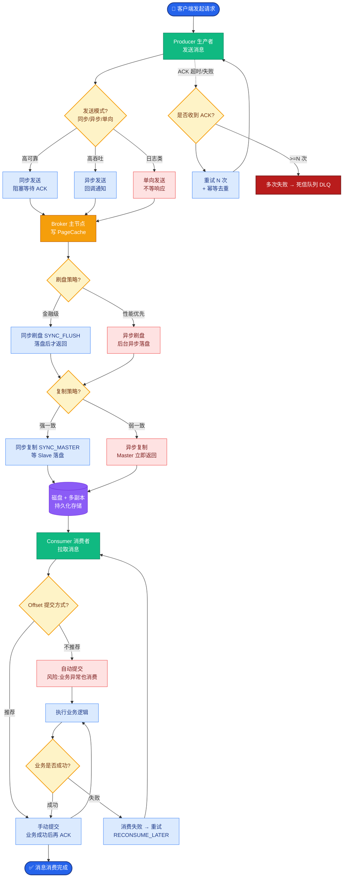

# Controller是如何依赖ZooKeeper的

Kafka Controller 是集群的“大脑”，它的选举、状态监控和故障转移都高度依赖 ZooKeeper。这种依赖主要体现在以下几个方面：

### 1. Controller 选举
- **机制**：利用 ZooKeeper 的**临时节点**。
- **流程**：所有 Broker 启动时会尝试创建 `/controller` 临时节点。
  - 成功创建的 Broker 成为 Controller。
  - 未成功的 Broker 会对 `/controller` 节点注册 **Watcher**。
- **故障转移**：当 Controller 宕机时，其与 ZooKeeper 的会话断开，临时节点被删除。Watcher 触发，剩余的 Broker 收到通知，立即发起新一轮竞选。

### 2. 元数据监听与变更通知
Controller 是唯一需要全面监听 ZooKeeper 状态变化的组件（为了防止“羊群效应”）。主要监听路径包括：
- `/brokers/ids`：Broker 上下线。
- `/brokers/topics`：Topic 的增删改。
- `/admin/reassign_partitions`：分区重分配。
- `/isr_change_notification`：ISR 列表变更。

一旦这些节点发生变化，ZooKeeper 会通过 Watcher 机制通知 Controller，触发相应的集群状态更新。

### 3. 初始化与元数据缓存
新选出的 Controller 会从 ZooKeeper 读取全量的集群元数据（Topic 列表、分区状态、ISR 等）并加载到内存缓存中。

### 4. 版本号管理
为了避免脑裂和状态不一致，Controller 在 ZooKeeper 中存储一个 **Controller Epoch**（控制器纪元，一个单调递增的数字）。
- 每个 Controller 发起操作时都会携带 Epoch。
- Follower Broker 收到请求时，会比对 Epoch。
- **边界条件**：如果请求的 Epoch 小于或等于当前记录的 Epoch，Broker 会拒绝该请求（证明这是过期的 Controller 发出的）。

### 依赖关系流程图

```text
        ZooKeeper
    ┌─────────────────────────────┐
    │  /controller (临时节点)      │◄─── 1. 竞选创建 (选主)
    │  /controller_epoch          │◄─── 2. 写入版本号 (防脑裂)
    │  /brokers/ids/*             │◄─── 3. 注册 Watcher (监控 Broker)
    │  /brokers/topics/*          │◄─── 4. 注册 Watcher (监控 Topic)
    └─────────────┬───────────────┘
                  │ Watcher Event
                  │ (通知变更)
                  ▼
    ┌─────────────────────────────┐
    │   Kafka Controller          │
    │  (活跃 Broker 之一)         │
    │                             │
    │ ┌─────────────────────────┐ │
    │ │ In-Metadata Cache       │ │
    │ │ (Context/ControllerState)││
    │ └─────────────────────────┘ │
    └─────────────┬───────────────┘
                  │ 发送指令
      ┌───────────┼───────────┐
      ▼           ▼           ▼
   Broker 1    Broker 2    Broker 3
   (Leader)    (Follower)  (Follower)
```

### 常见考点
1.  **如果 ZooKeeper 挂了，Kafka 还能工作吗？**
    - 对于 ZK 模式的 Kafka：如果 ZK 集群挂了，现有的 Controller 和 Broker 仍可以基于内存中的元数据继续处理读写请求（即存取服务不中断），但无法进行元数据变更（如创建 Topic、Broker 上下线感知）。

### 5. 实战深化与案例

#### 5.1 实战案例：Controller Epoch 冲突导致的小概率 Bug
在网络抖动或旧 Controller 恢复的情况下，可能出现“脑裂”残余。如果旧的 Controller（假定为 epoch 5）宕机后并未完全销毁，ZK 选举出新 Controller（epoch 6）。若旧 Controller 突然恢复并发送 `LeaderAndIsrRequest`，其他 Broker 会检查 epoch。如果旧请求携带 epoch 5，而 Broker 当前记录是 6，Broker 会直接拒绝并抛出 `ControllerMovedException`。这是 Kafka 防止脏写的最后一道防线。

#### 5.2 关键代码片段（Controller Epoch 校验）
```scala
// KafkaController.scala 中校验 Epoch 的简化逻辑
def maybeUpdateControllerEpoch(newEpoch: Int): Boolean = {
  val activeControllerEpoch = zkClient.getControllerEpoch
  // 如果请求的 epoch 比当前记录的小或相等，拒绝处理
  if (newEpoch <= activeControllerEpoch) {
    throw new ControllerMovedException(s"Expected epoch $activeControllerEpoch, but received $newEpoch")
  }
  // 否则更新本地缓存
  updateControllerEpoch(newEpoch)
  true
}
```

#### 5.3 ZK 路径与功能对照表

| ZooKeeper 路径 | 节点类型 | 作用描述 | Controller 操作行为 |
| :--- | :--- | :--- | :--- |
| **/controller** | Ephemeral | 当前 Controller 所在 Broker ID | 竞争创建，创建成功即为 Leader |
| **/controller_epoch** | Persistent | Controller 版本号（防脑裂） | 初始化时读取并递增写入 |
| **/brokers/ids/[id]** | Ephemeral | Broker 存活注册 | 监听列表变化，触发 Broker 变更事件 |
| **/isr_change_notification** | Persistent Sequential | ISR 变更通知 | 监听子节点变化，处理 ISR 收缩/扩张 |
| **/admin/preferred_replica_election** | Persistent | 优先副本选举任务 | 监听数据变化，执行均衡逻辑 |
| **/admin/reassign_partitions** | Persistent | 分区重分配任务 | 监听数据变化，执行副本迁移逻辑 |


## 核心流程图



## 记忆要点

- 选主依赖：各Broker抢创ZK的/controller临时节点，成功者即为集群大脑。
- 防脑裂：Controller发起操作必携带单调递增的Epoch，旧主复活发指令必被拒。
- 元数据中枢：是唯一全面监听ZK节点变更的组件，防羊群效应并加载缓存全量元数据。

## 结构化回答

**30 秒电梯演讲：** ZooKeeper是分布式协调服务，维护集群元数据。打个比方，像集群的“通讯录”，记录谁在谁下线了。

**展开框架：**
1. **选主依赖** — 各Broker抢创ZK的/controller临时节点，成功者即为集群大脑。
2. **防脑裂** — Controller发起操作必携带单调递增的Epoch，旧主复活发指令必被拒。
3. **元数据中枢** — 是唯一全面监听ZK节点变更的组件，防羊群效应并加载缓存全量元数据。

**收尾：** 我在项目里踩过坑——实战案例：Controller Epoch 冲突导致的小概率 Bug。您想深入聊哪一段：原理、避坑还是对比选型？

## 视频脚本

> 预计时长：3 分钟 | 由浅入深

| 时间 | 画面/字幕 | 口播台词 | 讲解要点 |
|------|----------|----------|----------|
| 0:00 | 标题卡：Controller是如何依赖Zoo… | "Controller是如何依赖ZooKeeper的？一句话——像集群的“通讯录”，记录谁在谁下线了。" | 开场钩子 |
| 0:45 | 概念动画/示意图 | "ZooKeeper是分布式协调服务，维护集群元数据——像集群的“通讯录”，记录谁在谁下线了" | 核心定义 |
| 1:30 | 选主依赖示意 | "各Broker抢创ZK的/controller临时节点，成功者即为集群大脑。" | 要点1 |
| 2:15 | 防脑裂示意 | "Controller发起操作必携带单调递增的Epoch，旧主复活发指令必被拒。" | 要点2 |
| 3:00 | 总结卡 | "记住这几条，面试不慌。下期讲进阶追问。" | 收尾 |

---

## 延伸：简单说下ZooKeeper

> 合并自 `mq-031`（相似度 80%）

ZooKeeper 是一个开源的分布式协调服务框架，常用于配置管理、命名服务、分布式锁和集群管理等。在 Kafka 架构中（KRaft 模式之前），它扮演着“元数据存储中心”和“集群协调中心”的关键角色。

### 核心数据模型
ZooKeeper 的数据模型类似于 Linux 文件系统，层级结构以根目录 "/" 开始。数据存储在节点（称为 **znode**）中。
- **持久节点**：节点创建后一直存在，直到显式删除。
- **临时节点**：生命周期依赖于客户端会话，会话结束节点自动删除（常用于 Broker 注册和 Controller 选举）。
- **顺序节点**：在创建时自动追加递增序号（常用于实现分布式锁）。

### Watcher（监听器）机制
客户端可以在节点上注册 Watcher，监听以下事件：
1. **节点数据变化**
2. **节点本身创建/删除**
3. **子节点列表变化**

> **注意**：Watcher 事件是**一次性**的。触发后，如果想继续监听，必须重新注册。

### Kafka 中的应用场景
1. **Broker 注册**：每台 Broker 启动时，会在 `/brokers/ids` 下创建一个临时节点。
2. **Controller 选举**：所有 Broker 竞争创建 `/controller` 临时节点，创建成功者即为 Leader。
3. **元数据存储**：Topic、分区、副本状态、ISR 列表、配置信息等存储在 ZK 中。
4. **消费位管理**：旧版本中 Consumer 的 Offset 存储在 ZK 中（新版本已移至内部 Topic `__consumer_offsets`）。

### 架构示意图

```text
    ZooKeeper 集群
    ┌─────────────────────────────────────────┐
    │  /controller (临时节点) -> Broker_100    │
    │  /brokers/ids/                          │
    │      ├── [0] (临时) -> Broker_0:9092     │
    │      ├── [1] (临时) -> Broker_1:9092     │
    │      └── [2] (临时) -> Broker_2:9092     │
    │  /brokers/topics/test                   │
    │      └── partitions/0 -> {...state...}   │
    └─────────────────────────────────────────┘
                ▲           ▲           ▲
               Watch       Watch       Watch
                │           │           │
        ┌───────┴───┐   ┌───┴───┐   ┌───┴───────┐
        │  Broker 0 │   │Broker1│   │  Broker 2 │
        │ (Follower)│   │(Leader)│   │ (Follower)│
        └───────────┘   └───────┘   └────────────┘
```

### 常见考点
1.  **ZooKeeper 的读写性能特点是什么？**
    - 读操作：性能高，可从任意 Follower 节点读取。
    - 写操作：性能较低，所有写请求必须通过 Leader 进行，且需要过半节点（Majority）确认（ZAB 协议）。
2.  **Kafka 为什么依赖 ZooKeeper？现在去除了吗？**
    - 主要利用其强一致性的通知机制和临时节点特性来做集群管理和选主。
    - Kafka 2.8 版本引入了 KRaft 模式（元数据自管理），目前正在逐步移除对 ZooKeeper 的依赖，实现轻量化和去中心化。
3.  **ZooKeeper 的数据一致性如何保证？**
    - 通过 ZAB 协议保证。包括崩溃恢复和消息广播两个阶段，确保所有节点数据最终一致。
4.  **什么是“羊群效应”？**
    - 如果大量客户端监听同一个节点，当该节点变化时，所有客户端同时被唤醒并竞争处理，可能导致 ZK 压力骤增。Kafka 早期版本曾受此困扰，后通过优化监听结构（如只让 Controller 监听）来解决。

### 5. 实战深化与案例

#### 5.1 实战案例：Session Timeout 导致的“假死”
在高流量场景下，如果 Kafka Broker 进行长时间的 Full GC（> `zookeeper.session.timeout.ms`，默认 18s），ZooKeeper 会认为 Broker 会话超时并删除其临时节点。此时 Controller 会立即触发 Leader 选举（将 Leader 切换到其他副本）。然而，当 GC 结束后，Broker“复活”发现自己既不是 Leader 也没被在 ISR 中，但它磁盘上还有旧数据，这会导致数据不一致或日志截断。**解决**：GC 优化是关键，同时可适当调大 session timeout。

#### 5.2 关键代码片段（Java 实现 ZK 连接）
```java
// 使用 Apache Curator 创建临时节点（模拟 Broker 注册）
public void registerBroker(String brokerId, String hostPort) throws Exception {
    String path = "/brokers/ids/" + brokerId;
    // CreatingMode.EPHEMERAL：临时节点，断开连接自动删除
    client.create()
          .creatingParentsIfNeeded()
          .withMode(CreateMode.EPHEMERAL)
          .forPath(path, hostPort.getBytes());
}
```

#### 5.3 ZK 节点类型与适用场景对比

| 节点类型 | 特点 | Kafka 典型使用场景 | 生命周期 |
| :--- | :--- | :--- | :--- |
| **持久节点** | 永久保存，需显式删除 | Topic 配置、Quota 配置、ACL 权限 | 手动删除或集群关闭 |
| **临时节点** | 绑定 Session，Session 断开即删 | Broker 注册 (`/ids`)、Controller 选举 | Broker 下线或 Controller 故障 |
| **持久顺序节点** | 自动追加序号 (000000001) | 消费者 ID 生成 (早期版本) | 永久，除非手动删除 |
| **临时顺序节点** | 绑定 Session + 自动序号 | 分布式锁、Leader 锁 | Session 结束即消失 |

## 记忆要点

- 节点类型：临时节点生命周期绑定会话（用于选主与Broker注册），持久节点存元数据。
- 监听机制：Watcher是一次性的，触发后需重新注册才能继续监听节点变化。
- 演进：Kafka 2.8+引入KRaft模式，逐步移除ZooKeeper依赖，实现元数据自管理。

## 结构化回答

**30 秒电梯演讲：** ZooKeeper是分布式协调服务，维护集群元数据。打个比方，像集群的“通讯录”，记录谁在谁下线了。

**展开框架：**
1. **节点类型** — 临时节点生命周期绑定会话（用于选主与Broker注册），持久节点存元数据。
2. **监听机制** — Watcher是一次性的，触发后需重新注册才能继续监听节点变化。
3. **演进** — Kafka 2.8+引入KRaft模式，逐步移除ZooKeeper依赖，实现元数据自管理。

**收尾：** 我在项目里踩过坑——实战案例：Session Timeout 导致的“假死”。您想深入聊哪一段：原理、避坑还是对比选型？

## 视频脚本

> 预计时长：3 分钟 | 由浅入深

| 时间 | 画面/字幕 | 口播台词 | 讲解要点 |
|------|----------|----------|----------|
| 0:00 | 标题卡：简单说下ZooKeeper | "简单说下ZooKeeper？一句话——像集群的“通讯录”，记录谁在谁下线了。" | 开场钩子 |
| 0:45 | 概念动画/示意图 | "ZooKeeper是分布式协调服务，维护集群元数据——像集群的“通讯录”，记录谁在谁下线了" | 核心定义 |
| 1:30 | 节点类型示意 | "临时节点生命周期绑定会话（用于选主与Broker注册），持久节点存元数据。" | 要点1 |
| 2:15 | 监听机制示意 | "Watcher是一次性的，触发后需重新注册才能继续监听节点变化。" | 要点2 |
| 3:00 | 总结卡 | "记住这几条，面试不慌。下期讲进阶追问。" | 收尾 |
