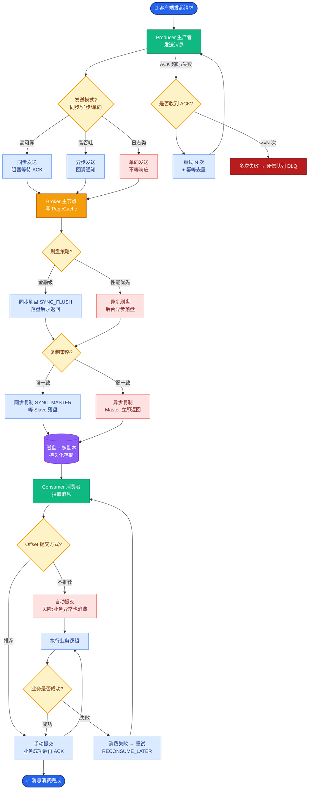
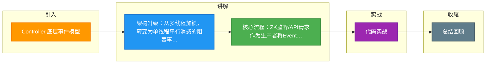

# Controller 底层事件模型

Kafka Controller 底层事件模型的设计，是为了解决高并发场景下的线程安全问题和状态一致性问题。其核心演变是从“多线程+锁”转变为“单线程+事件队列”的生产者-消费者模式。

### 演变历史：从多线程锁到事件队列
在 Kafka 0.11 版本之前，Controller 内部有多个线程（如 ZooKeeper 客户端事件线程、定时任务线程）并发访问和修改元数据缓存。这导致了以下问题：
1. **死锁风险**：复杂的锁依赖关系容易导致死锁。
2. **状态不一致**：多线程修改同一块缓存，极易出现脏读或并发修改异常。
3. **难以调试**：并发 Bug 极难复现和修复。

### 当前架构：事件队列模型
Kafka 引入了一个专属的事件处理线程（**ControllerEventThread**），采用了**单线程串行化**的处理思路：

1. **事件生产**：
   - **ZooKeeper 监听线程**：监听到 ZK 节点变化（如 Broker 上线）。
   - **定时任务**：如检测分区是否需要重新平衡。
   - **API 请求**：如 AdminClient 发起的创建 Topic 请求。
   这些线程不直接操作元数据，而是将对应的操作封装成一个 `Event` 对象。

2. **事件队列**：
   - 使用一个**阻塞队列** (`LinkedBlockingQueue`) 作为缓冲区，所有生产者线程将 `Event` 放入队列。

3. **事件消费**：
   - `ControllerEventThread` 从队列中取出事件，**串行**执行所有逻辑（包括更新缓存、向 ZooKeeper 写数据、向 Broker 发送指令）。
   - 由于是单线程执行，天然**无需加锁**，且保证了状态变更的顺序性。

### 事件处理流程图

```text

   ZooKeeper                           Kafka Controller
  ┌──────────┐                       ┌──────────────────────┐
  │  Watcher │──────────────────────>│  Event Processor     │
  └──────────┘                       │  (Controller Thread) │
      变更通知          ┌─────────┐   └──────────▲───────────┘
                       │ Put     │              │
                       │ Event   │              │ Take & Process
    ┌──────────────┐   │         │              │
    │  Timer       │──>│         │              │
    └──────────────┘   └────┬────┘              │
                          │                    │
                    ┌─────▼──────────┐        │
                    │ Event Queue    │◄───────┘
                    │ (BlockingQueue)│
                    └────────────────┘
                          ▲
                          │ Put Event
                          │
                    ┌─────┴──────────┐
                    │  Admin Client  │
                    │  / API Calls   │
                    └────────────────┘
```

### 关键细节
- **批处理机制**：为了提高吞吐量，Controller 在处理事件时，可能会对某些类型的事件（如多个分区Leader变更）进行合并或批处理，减少网络 I/O。
- **防抖动**：对于 ZooKeeper 连接不稳定导致的频繁事件，可能会有相应的机制进行过滤或去重。

### 4. 实战深化与案例

#### 4.1 实战案例：事件队列阻塞导致的“僵尸”Controller
在某次故障排查中，发现某个 Topic 分区重分配卡住长达数小时。经排查，是因为 `ControllerEventThread` 在处理一个 `IsrChangeNotification` 事件时，向 ZooKeeper 写入元数据发生异常（ZK 磁盘满），代码中虽然有重试逻辑，但由于异常处理不当，线程陷入了死循环或长时间阻塞。这导致后续队列中积压了上千个事件（包括新的 Broker 上线事件），整个集群元数据更新停滞，表现为“运维指令无响应”。**教训**：Controller 事件处理逻辑必须保证幂等性和超时控制。

#### 4.2 关键代码片段（Java 事件入队）
```java
// ControllerContext.java
private final BlockingQueue<ControllerEvent> eventQueue = new LinkedBlockingQueue<>();

public void enqueue(ControllerEvent event) {
    // 简单的入队操作，如果队列满会阻塞
    // 实际生产中需监控队列大小
    eventQueue.put(event);
}

// ControllerEventThread.java
public void run() {
    while (active) {
        try {
            // 串行取出执行
            ControllerEvent event = eventQueue.take();
            event.process();
        } catch (InterruptedException e) {
            // 处理中断
        }
    }
}
```

#### 4.3 线程模型对比

| 特性 | 旧模型 (0.11 前) | 新模型 (当前) |
| :--- | :--- | :--- |
| **线程数量** | 多线程并发 | 单线程 + 阻塞队列 |
| **锁机制** | 重入锁 | 无锁 (Lock-free) |
| **状态一致性** | 易出现竞态条件 | 强一致性 (串行) |
| **吞吐瓶颈** | 锁竞争严重 | 单线程 CPU 处理能力 |
| **可维护性** | 低 | 高 |
| **典型异常** | `java.util.concurrent.ConcurrentModificationException` | 队列积压 |


## 核心流程图



## 记忆要点

- 架构升级：从多线程加锁，转变为单线程串行消费的阻塞事件队列模型。
- 核心流程：ZK监听/API请求作为生产者将Event入队，ControllerThread单线程消费。
- 单线程优势：天然无需加锁，彻底解决并发修改元数据导致的死锁与状态不一致。

## 结构化回答

**30 秒电梯演讲：** 将并发加锁改为单线程事件队列处理，保证安全。打个比方，把多人抢着记的账本改为一人专职记账，其他人递条子。

**展开框架：**
1. **架构升级** — 从多线程加锁，转变为单线程串行消费的阻塞事件队列模型。
2. **核心流程** — ZK监听/API请求作为生产者将Event入队，ControllerThread单线程消费。
3. **单线程优势** — 天然无需加锁，彻底解决并发修改元数据导致的死锁与状态不一致。

**收尾：** 我在项目里踩过坑——实战案例：事件队列阻塞导致的“僵尸”Controller。您想深入聊哪一段：原理、避坑还是对比选型？

## 视频脚本

> 预计时长：3 分钟 | 由浅入深

| 时间 | 画面/字幕 | 口播台词 | 讲解要点 |
|------|----------|----------|----------|
| 0:00 | 标题卡：Controller 底层事件模型 | "Controller 底层事件模型？一句话——把多人抢着记的账本改为一人专职记账，其他人递条子。" | 开场钩子 |
| 0:45 | 概念动画/示意图 | "将并发加锁改为单线程事件队列处理，保证安全——把多人抢着记的账本改为一人专职记账，其他人递条子" | 核心定义 |
| 1:30 | 架构升级示意 | "从多线程加锁，转变为单线程串行消费的阻塞事件队列模型。" | 要点1 |
| 2:15 | 核心流程示意 | "ZK监听/API请求作为生产者将Event入队，ControllerThread单线程消费。" | 要点2 |
| 3:00 | 总结卡 | "记住这几条，面试不慌。下期讲进阶追问。" | 收尾 |

### 视频流程图



