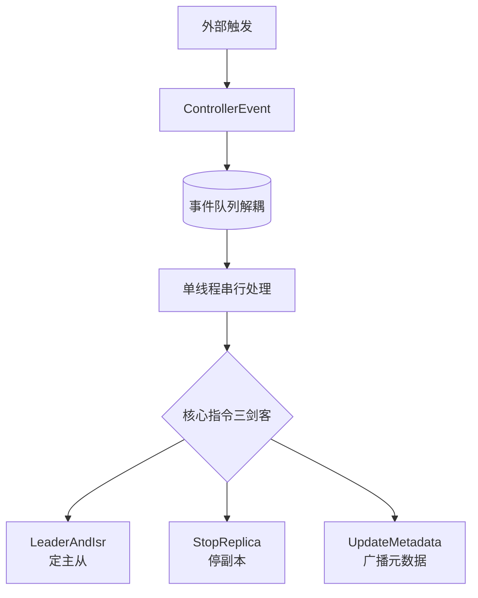

# 先小结一下

我们可以将 Kafka Controller 的核心工作机制总结为：**“ZK 监听触发、事件队列解耦、单线程串行处理、指令广播分发”**。这一整套流程保证了在分布式环境下，集群元数据的一致性和高可用性。

### 核心流程总结
1.  **感知变化**：
    - Controller 通过 ZooKeeper Watcher 监听集群状态（Broker 上下线、Topic 变更）。
    - 或通过内部定时任务触发（如周期性检测）。

2.  **封装事件**：
    - 将检测到的变化封装为 `ControllerEvent`，放入内存阻塞队列。

3.  **串行处理**：
    - `ControllerEventThread` 串行取出事件执行：
        - 更新内存元数据缓存。
        - 写入 ZooKeeper（如更新 `/brokers/topics` 下的状态）。
        - 决定需要向哪些 Broker 发送指令。

4.  **分发指令**：
    - Controller 通过网络向相关的 Broker 发送特定的控制请求。

### 控制请求类型
Controller 发出的请求非常专用，主要包含以下三种：

1.  **LeaderAndIsrRequest**：
    - **作用**：通知 Broker 它成为了某个分区的 Leader 或 Follower，并给出 ISR 列表。
    - **内容**：Leader Epoch（纪元）、ISR 集合、Controller Epoch 等。

2.  **StopReplicaRequest**：
    - **作用**：通知 Broker 停止某些副本的拉取和提供服务（通常发生在副本下线、分区被删除或重分配时）。

3.  **UpdateMetadataRequest**：
    - **作用**：更新 Broker 缓存的元数据（如 Topic 的分区分布、 Leader 信息、ISR 信息）。
    - **广播**：该请求通常是发往**集群内所有 Broker**（包括自身），确保大家看到的元数据视图一致。

### 整体数据流架构图

```text

   ZooKeeper                      Controller                        Broker Cluster
  ┌─────────┐                  ┌──────────────┐                ┌──────────────────┐
  │   ZNode │ Watcher Event    │ Event Queue  │                │   Metadata Cache │
  │  Change │─────────────────>│  (FIFO)      │                │                  │
  └─────────┘                  └──────┬───────┘                └────────┬─────────┘
                                       │ 1. Dequeue & Process             │
                                       │ - Update Cache                  │
                                       │ - Write to ZK                   │
                                       │ - Build Requests                │
                                       │                                 │
                                       │ 2. Send Requests                │
                              ┌────────┴────────────┐               │
                              │                     │               │
                    ┌──────




## 记忆要点

- 口诀定框架：ZK监听触发、事件队列解耦、单线程串行、指令广播分发
- 因为事件放入内存阻塞队列，由单线程串行处理，所以保证元数据一致性
- 核心指令三剑客：LeaderAndIsr定主从、StopReplica停副本、UpdateMetadata广播元数据

## 结构化回答

**30 秒电梯演讲：** Controller基于ZooKeeper监听并通过事件队列管理集群。打个比方，秘书监听老板指令，排队记在待办本上逐条处理。

**展开框架：**
1. **口诀定框架** — ZK监听触发、事件队列解耦、单线程串行、指令广播分发
2. **保证元数据一致性** — 因为事件放入内存阻塞队列，由单线程串行处理，所以保证元数据一致性。
3. **核心指令三剑客** — LeaderAndIsr定主从、StopReplica停副本、UpdateMetadata广播元数据

**收尾：** 这三点都能配合实战聊。您想深入聊原理、对比还是避坑？

## 视频脚本

> 预计时长：3 分钟 | 由浅入深

| 时间 | 画面/字幕 | 口播台词 | 讲解要点 |
|------|----------|----------|----------|
| 0:00 | 标题卡：先小结一下 | "先小结一下？一句话——秘书监听老板指令，排队记在待办本上逐条处理。" | 开场钩子 |
| 0:45 | 概念动画/示意图 | "Controller基于ZooKeeper监听并通过事件队列管理集群——秘书监听老板指令，排队记在待办本上逐条处理" | 核心定义 |
| 1:30 | 口诀定框架示意 | "ZK监听触发、事件队列解耦、单线程串行、指令广播分发" | 要点1 |
| 2:15 | 保证元数据一致性示意 | "因为事件放入内存阻塞队列，由单线程串行处理，所以保证元数据一致性。" | 要点2 |
| 3:00 | 总结卡 | "记住这几条，面试不慌。下期讲进阶追问。" | 收尾 |
