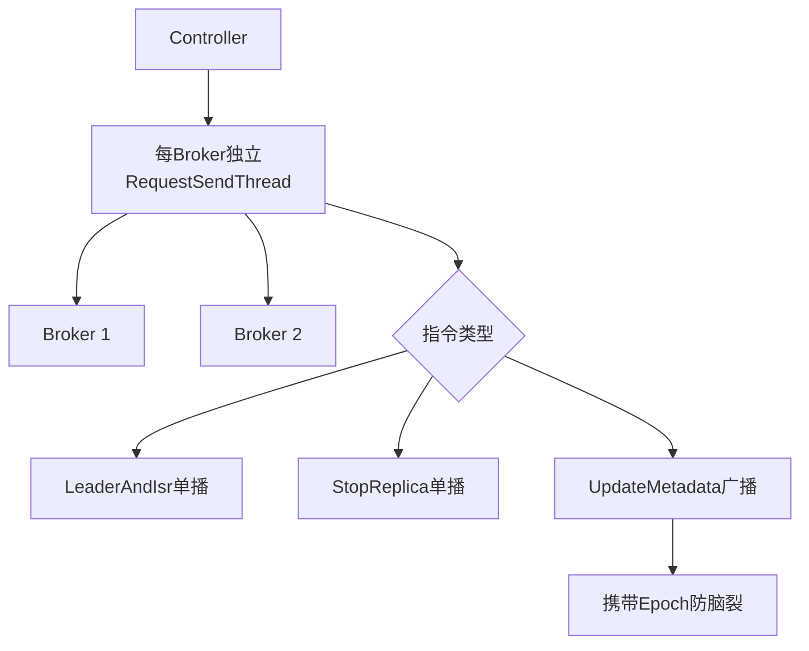

# 再小结一下

### Controller 通信机制与请求类型小结

Kafka Controller 与集群中 Broker 的通信主要依赖三种核心控制请求，并通过特定的线程模型进行分发和发送。

#### 1. 核心控制请求

- **LeaderAndIsrRequest**
  - **作用**：告知 Broker 主题相关分区的 Leader 副本和 ISR（In-Sync Replicas）副本所在的 Broker ID 列表。
  - **场景**：Leader 选举、ISR 变动、Controller 初始化等。
  - **关键细节**：包含 Leader epoch 信息，用于防止陈旧 Leader（Zombie Leader）干扰。

- **StopReplicaRequest**
  - **作用**：告知 Broker 停止指定副本的拉取线程，并删除磁盘上的日志文件。
  - **场景**：删除主题、分区副本迁移、下线 Broker。
  - **关键细节**：包含两个布尔标志：`deletePartitions`（是否删除分区目录）和 `deleteOnDisk`（是否物理删除日志文件）。

- **UpdateMetadataRequest**
  - **作用**：更新 Broker 上的元数据缓存（Metadata Cache），包括集群拓扑、Alive Brokers、AR/ISR/Leader 信息。
  - **场景**：新 Broker 启动、Topic 创建、分区状态变更。
  - **关键细节**：这是一个广播请求，通常会发送给集群中的所有存活的 Broker，以确保元数据视图的一致性。

#### 2. 底层通信架构与数据流转

Controller 事件处理线程将逻辑事件（如 `LeaderChange`）封装成上述请求，写入目标 Broker 对应的阻塞队列，由专用的发送线程异步发送。

##### 核心组件解析

- **controllerBrokerStateInfo**：一个 POJO 类，对应集群中每一个 Broker。内部维护了该 Broker 的网络连接、消息阻塞队列 以及 `RequestSendThread` 的引用。

- **ControllerChannelManager**：管理 Controller 与所有 Broker 的底层网络连接。它持有 `Map<Broker, controllerBrokerStateInfo>`，负责为每个 Broker 初始化连接通道和发送线程。

- **RequestSendThread**：每个 Broker 对应一个独立的发送线程。负责从阻塞队列中不断获取待发送的请求，并通过底层 Socket 通道发送给目标 Broker。由于发送是同步阻塞的，使用独立线程可以防止单个 Broker 网络慢或故障阻塞 Controller 的其他操作。

##### 架构流程图

```text
+----------------------+         +-----------------------------+
|  Controller Event    |         | ControllerChannelManager    |
|   Processing Thread  |         |                             |
+----------+-----------+         |  Map<BrokerId, BrokerState>  |
           |                     |  +-----------+--------------+|
           | 1. Process Event    |  | Broker 1  | Broker 2     ||
           | & Create Req       |  | (Queue 1) | (Queue 2)    ||
           v                    |  |     |     |    |         ||
+-------------------+           |  |  Thread 1| Thread 2    ||
|  Control Request  |           |  |     v     |    v         ||
| (LeaderAndIsr /   |  2. Put    |  +-----+-----+----+--------+||
|  UpdateMetadata) |------------>+      |        |           ||
+-------------------+           +-----------------------------+
```

---

#### 💡 实战案例
在“脑裂”修复或 Controller 切换瞬间，旧的 Controller 可能仍在发送请求。Kafka 通过 Epoch 校验机制拒绝旧 Controller 的请求，但 `RequestSendThread` 的队列积压可能导致新 Controller 发送延迟，造成短暂的“元数据不一致”现象。

#### 💻 代码片段 (Java)
```java
// ControllerChannelManager.java 简化逻辑
public void sendRequest(int brokerId, AbstractRequest request, AbstractControllerRequestSendListener listener) {
    ControllerBrokerStateInfo brokerState = brokerStateInfoMap.get(brokerId);
    if (brokerState == null) {
        // Broker 可能已下线
        return;
    }
    // 将请求放入该 Broker 专用的阻塞队列
    brokerState.messageQueue.put(new RequestAndCallback(request, listener));
}
```

#### 📊 组件职责对比

| 组件 | 职责范围 | 线程模型 | 隔离性 |
| :--- | :--- | :--- | :--- |
| **ControllerEventManager** | 处理逻辑事件（ZK回调、周期任务） | 单线程 | 串行处理，保证逻辑顺序 |
| **ControllerChannelManager** | 管理所有 Broker 的物理连接 | 单线程 (管理器) + 多线程 (发送器) | 每个 Broker 独立连接 |
| **RequestSendThread** | 实际执行网络 I/O | 每个 Broker 1 个线程 | 物理隔离，互不影响 |




## 记忆要点

- 请求类型：LeaderAndIsr定主从、StopReplica停副本、UpdateMetadata全集群广播
- 防脑裂设计：通过携带Epoch版本号，拒绝陈旧Controller发送的过期请求
- 架构特征：每个Broker对应独立RequestSendThread，隔离慢节点防全局阻塞
- 广播与单播对比：UpdateMetadata是广播给所有Broker，其他指令仅发给相关Broker

## 结构化回答

**30 秒电梯演讲：** Controller通过专属线程将状态变更请求同步给各Broker。打个比方，老板（Controller）把任务条塞进每个员工（Broker）专属的收件箱，员工助理线程取件执行。

**展开框架：**
1. **请求类型** — LeaderAndIsr定主从、StopReplica停副本、UpdateMetadata全集群广播
2. **防脑裂设计** — 通过携带Epoch版本号，拒绝陈旧Controller发送的过期请求
3. **架构特征** — 每个Broker对应独立RequestSendThread，隔离慢节点防全局阻塞

**收尾：** 我在项目里踩过坑——在“脑裂”修复或 Controller 切换瞬间，旧的 Controller 可能仍在发送请求。您想深入聊哪一段：原理、避坑还是对比选型？

## 视频脚本

> 预计时长：2 分钟 | 由浅入深

| 时间 | 画面/字幕 | 口播台词 | 讲解要点 |
|------|----------|----------|----------|
| 0:00 | 标题卡：再小结一下 | "再小结一下？一句话——老板（Controller）把任务条塞进每个员工（Broker）专属的收件箱，员工助理线程取件执行。" | 开场钩子 |
| 0:40 | 概念动画/示意图 | "Controller通过专属线程将状态变更请求同步给各Broker——老板（Controller）把任务条塞进每个员工（Broker）专属的收件箱，员工助理线程取件执行" | 核心定义 |
| 1:20 | 请求类型示意 | "LeaderAndIsr定主从、StopReplica停副本、UpdateMetadata全集群广播" | 要点1 |
| 2:00 | 总结卡 | "记住这几条，面试不慌。下期讲进阶追问。" | 收尾 |
