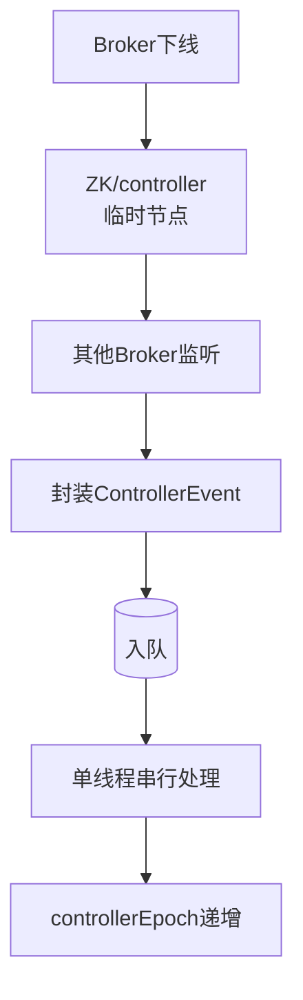

# Controller选举流程源码分析

### Controller 选举流程源码分析

Kafka Controller 的选举是基于 ZooKeeper 的临时节点实现的，其事件处理流程遵循标准的“监听-入队-处理”模型。

#### 1. 触发机制：ControllerChangeHandler

在 Kafka 启动或运行期间，会监听 ZooKeeper 上的 `/controller` 临时节点。
- 当 `/controller` 节点消失（旧 Controller 宕机）或被创建时，ZooKeeper 的 Watcher 会触发 `ControllerChangeHandler`。
- 该 Handler 的核心逻辑非常简单：构造 `ControllerChange` 事件，直接放入 `ControllerEventManager` 的事件队列。

#### 2. 核心组件交互

- **ControllerEvent**：所有 Controller 事件的顶层接口（如 `AutoLeaderBalance`, `ControllerChange`, `TopicChange`）。
- **ControllerEventProcessor**：事件处理器接口，唯一实现类为 `KafkaController`。真正的业务逻辑都在 `KafkaController` 中。
- **ControllerEventManager**：管理事件的生命周期，包含一个阻塞队列 `eventQueue` 和一个处理线程 `ControllerEventThread`。
- **QueuedEvent**：对 `ControllerEvent` 的封装，记录了事件入队时间等元数据，用于监控事件处理延迟。

#### 3. 选举处理流程

##### 线程模型图

```text
+----------------+      Watch      +-----------------------+
|   ZooKeeper    | <------------>  | ControllerChangeListener|
|  /controller   |  (Node Change)  +-----------+-----------+
+----------------+                             |
                                                | 1. Fire Event
                                                v
                                   +--------------------------+
                                   |  ControllerEventManager   |
                                   |  (Blocking Queue)         |
                                   +------------+-------------+
                                                | 2. Enqueue
                                                v
                                   +--------------------------+
                                   | ControllerEventThread     |
                                   | (Event Processor)         |
                                   +------------+-------------+
                                                | 3. process(event)
                                                v
                                   +--------------------------+
                                   |    KafkaController       |
                                   | (elect: /controller create)|
                                   +--------------------------+
```

---

#### 💡 实战案例
在 Kafka 版本升级（如 0.10.x 升级至 2.x）过程中，若 Controller 节点的 `controllerEpoch` 版本号未正确升级，会导致集群陷入“无限选举循环”。需检查 ZK 中 `/controller_epoch` 节点数据是否正确持久化。

#### 💻 代码片段 (Scala)
```scala
// KafkaController.scala 中的选举核心逻辑
def elect(): Unit = {
  activeControllerId = zkUtils.getControllerId.getOrElse(-1)
  // 尝试创建临时节点 /controller
  val (controllerEpoch, epochZkVersion) = zkUtils.registerController(brokerId)
  
  onControllerFailover()
}

// ZooKeeperUtils.registerController
def registerController(brokerId: Int) = {
  // 创建临时节点，成功则当选，失败说明已被其他节点抢注
  zkClient.createEphemeral(ControllerZNode.path, brokerId.toString)
  // 增加 controllerEpoch
  incrementControllerEpoch()
}
```

#### 📊 选举状态流转

| 状态 | ZK 节点状态 | 操作 | 结果 |
| :--- | :--- | :--- | :--- |
| **启动中** | /controller 不存在 | 尝试 Create Node | 成功 -> 成为 Controller / 失败 -> 成为 Follower |
| **运行中** | /controller 存在 | 监听 Node Deleted | Watcher 触发，进入竞选流程 |
| **故障切换** | /controller 消失 (Session超时) | 多个 Broker 同时尝试 Create | ZK 保证只有一个 Create 成功 |




## 记忆要点

- 核心机制：基于ZooKeeper的/controller临时节点进行抢占式选举
- 标准流程：监听节点变化 -> 封装ControllerEvent入队 -> 单线程串行处理
- 防脑裂关键：依赖controllerEpoch版本号递增，拒绝旧Controller的非法指令
- 对比记忆：Broker下线靠ZK的Session失效删临时节点，Controller切换同理

## 结构化回答

**30 秒电梯演讲：** 利用ZooKeeper临时节点实现多Broker竞争Controller。打个比方，多人争抢唯一工牌，谁先挂在胸前（创建节点）谁就是领导，其他人围观等待。

**展开框架：**
1. **核心机制** — 基于ZooKeeper的/controller临时节点进行抢占式选举
2. **标准流程** — 监听节点变化 -> 封装ControllerEvent入队 -> 单线程串行处理
3. **防脑裂关键** — 依赖controllerEpoch版本号递增，拒绝旧Controller的非法指令

**收尾：** 我在项目里踩过坑——在 Kafka 版本升级（如 0.10.x 升级至 2.x）过程中，若 Controller 节点的 `controllerEpoch` 版本号未正确升级，会导致集群陷入“无限选举循环”。您想深入聊哪一段：原理、避坑还是对比选型？

## 视频脚本

> 预计时长：2 分钟 | 由浅入深

| 时间 | 画面/字幕 | 口播台词 | 讲解要点 |
|------|----------|----------|----------|
| 0:00 | 标题卡：Controller选举流程源码分析 | "Controller选举流程源码分析？一句话——多人争抢唯一工牌，谁先挂在胸前（创建节点）谁就是领导，其他人围观等待。" | 开场钩子 |
| 0:40 | 概念动画/示意图 | "利用ZooKeeper临时节点实现多Broker竞争Controller——多人争抢唯一工牌，谁先挂在胸前（创建节点）谁就是领导，其他人围观等待" | 核心定义 |
| 1:20 | 核心机制示意 | "基于ZooKeeper的/controller临时节点进行抢占式选举" | 要点1 |
| 2:00 | 总结卡 | "记住这几条，面试不慌。下期讲进阶追问。" | 收尾 |
