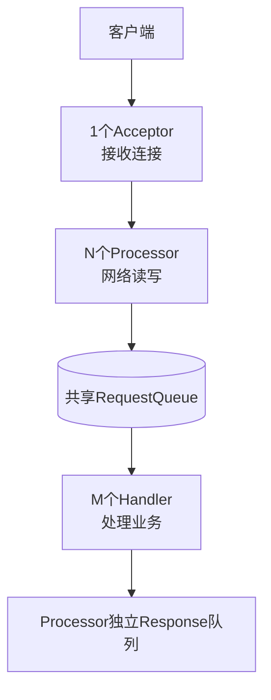

# Kafka请求处理全流程解析

### Kafka 请求处理全流程解析

Kafka 的请求处理机制经历了从强依赖 ZooKeeper 到去 ZooKeeper（KRaft 模式）的演进。Broker 端的请求处理采用了经典的 Reactor 多线程模型，以应对高并发网络 IO。

#### 1. 架构演进：ZooKeeper vs KRaft

- **ZooKeeper 模式（传统）**：
  - Controller 强依赖 ZK 存储元数据。
  - **缺点**：ZK 不适合频繁写（元数据变更多），且 ZK 是 CP 系统可用性受限，同时增加了运维复杂度。
  - **现状**：部分元数据（如消费者位移 __consumer_offsets）已迁移到内部 Topic，绕开 ZK。

- **KRaft 模式（Kafka Raft）**：
  - **目标**：完全移除 ZK，利用内部主题（`__cluster_metadata`）基于 Raft 算法存储元数据。
  - **优势**：简化架构，提升元数据写入性能和系统稳定性。

#### 2. Broker 端请求处理模型

Broker 处理请求采用了 **Reactor 多线程模式**，将网络 IO 与业务逻辑计算分离。

##### 处理全流程图

```text
+------------+       Accept       +------------+
|   Client   | <----------------> |  Acceptor  | (1 Thread, MainReactor)
+------------+                     +-----+------+
                                          |
                                          | 2. Round Robin Assign
                                          v
+------------+   Read/Write (NIO)  +------------------+
|   Client   | <----------------> |   Processors    | (Network Threads)
+------------+                     +--------+---------+
                                             |
                                   3. Enqueue Request (Shared Queue)
                                             v
                                   +------------------+
                                   | RequestChannel   |
                                   |  (RequestQueue)  |
                                   +--------+---------+
                                             |
                                   4. Dequeue & Process
+------------+                             |
|   Client   | <----------------+  v
+------------+   Send Response   +------------------+
                                   |  RequestHandlers | (IO Threads)
                                   +--------+---------+
```

#### 3. 细节补充

- **Acceptor (Main Reactor)**：
  - 每个 Broker 默认只有 1 个 Acceptor 线程（参数 `listeners` 配置）。
  - 职责：负责监听 TCP 端口，建立新连接。连接建立后，通过 Round-Robin 轮询方式转交给 Processor 线程。
  - 轻量级：只处理连接建立，不处理数据读写。

---

#### 💡 实战案例
生产环境曾出现 `ProduceRequest` 处理延迟飙升，排查发现是 `IO Thread`（Handler）在打印大消息日志时发生阻塞，导致 `RequestChannel` 队列积压。解决方案是将日志级别调整为 WARN 或异步化，确保 I/O 线程只做核心业务。

#### 💻 代码片段 (Java)
```java
// SocketServer.scala 中的 Processor 逻辑简化
public void run() {
  while (running) {
    // 1. 轮询读取网络数据
    configureNewConnections();
    processNewResponses();
    poll(); // NIO Selector.select()
    
    // 2. 封装为 Request 并发送到 RequestChannel
    for (NetworkReceive receive : channel.completedReceives()) {
      RequestChannel.Request req = new RequestChannel.Request(..., receive.payload());
      requestChannel.sendRequest(req); // 入队
    }
  }
}
```

#### 📊 线程模型参数配置

| 参数 | 默认值 | 作用 | 调优建议 |
| :--- | :--- | :--- | :--- |
| `num.network.threads` | 3 | Processor 线程数 (网络读写) | 磁盘带宽高时适当增加 (4-8) |
| `num.io.threads` | 8 | Handler 线程数 (业务逻辑) | CPU 密集型业务建议设为 磁盘数 * 2 |
| `queued.max.requests` | 500 | RequestChannel 队列长度 | 内存允许时可调大以应对突发流量 |




## 记忆要点

- 架构演进：从强依赖外部ZK的CP系统，演进到基于KRaft内部Topic去ZK架构
- 分层模型：1个Acceptor接收 -> N个Processor读写 -> M个Handler处理业务
- 队列解耦：Processor网络层与Handler业务层，通过共享的RequestQueue异步解耦
- 实战避坑：Handler(IO线程)切勿执行阻塞操作(如大日志打印)，否则队列积压致假死

## 结构化回答

**30 秒电梯演讲：** Controller将操作封装为事件串行处理，通过独立线程池发送请求避免阻塞。打个比方，接待员（事件线程）按顺序安排工作，邮递员（发送线程）专人专送，互不干扰。

**展开框架：**
1. **架构演进** — 从强依赖外部ZK的CP系统，演进到基于KRaft内部Topic去ZK架构
2. **分层模型** — 1个Acceptor接收 -> N个Processor读写 -> M个Handler处理业务
3. **队列解耦** — Processor网络层与Handler业务层，通过共享的RequestQueue异步解耦

**收尾：** 我在项目里踩过坑——生产环境曾出现 `ProduceRequest` 处理延迟飙升，排查发现是 `IO Thread`（Handler）在打印大消息日志时发生阻塞，导致 `RequestChannel` 队列积压。您想深入聊哪一段：原理、避坑还是对比选型？

## 视频脚本

> 预计时长：2 分钟 | 由浅入深

| 时间 | 画面/字幕 | 口播台词 | 讲解要点 |
|------|----------|----------|----------|
| 0:00 | 标题卡：Kafka请求处理全流程解析 | "Kafka请求处理全流程解析？一句话——接待员（事件线程）按顺序安排工作，邮递员（发送线程）专人专送，互不干扰。" | 开场钩子 |
| 0:40 | 概念动画/示意图 | "Controller将操作封装为事件串行处理，通过独立线程池发送请求避免阻塞——接待员（事件线程）按顺序安排工作，邮递员（发送线程）专人专送，互不干扰" | 核心定义 |
| 1:20 | 架构演进示意 | "从强依赖外部ZK的CP系统，演进到基于KRaft内部Topic去ZK架构" | 要点1 |
| 2:00 | 总结卡 | "记住这几条，面试不慌。下期讲进阶追问。" | 收尾 |
