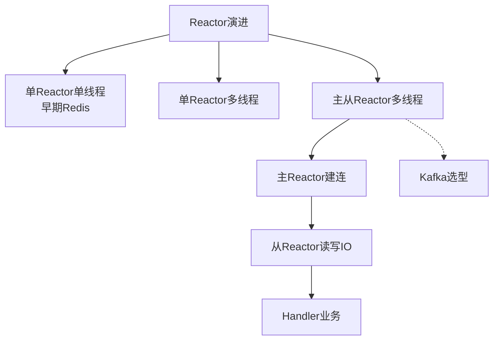

# Reactor模式

### Reactor 模式详解

Reactor 模式是高性能网络编程的基石，Kafka、Netty、Redis、Nginx 等均采用该模式。它解决了传统阻塞 IO 在高并发场景下的资源瓶颈问题。

#### 1. 网络编程模型的演进

为了理解 Reactor，我们回顾一下网络模型的发展历程：

1.  **传统阻塞 IO（BIO）**：
    -   每个连接新起一个线程处理。
    -   **缺点**：线程上下文切换开销大，无法应对 C10K（1万并发），资源耗尽。
2.  **线程池优化**：
    -   使用池化技术复用线程。
    -   **缺点**：连接数受限于线程池大小，且线程在无数据时仍阻塞等待，资源利用率低。
3.  **IO 多路复用 + Reactor**：
    -   **核心思想**：单线程（或少量线程）利用 OS 提供的 `select/poll/epoll` 系统调用，同时监控多个连接的 IO 事件。
    -   **优势**：无需为每个连接创建线程，线程只在 IO 事件发生时才处理，极大提升了资源利用率。

#### 2. Reactor 模式核心组件

Reactor 模式主要包含以下几个角色：

-   **Handle（句柄）**：表示操作系统资源，如 Socket 连接。
-   **Synchronous Event Demultiplexer（同步事件分离器）**：即 Linux 的 `epoll`，阻塞等待并返回一组就绪的 Handle。
-   **Event Handler（事件处理器）**：处理具体业务逻辑的接口。
-   **Reactor（反应器）**：核心调度器。循环调用分离器，一旦有事件就绪，将对应的 Handle 分发给对应的 EventHandler。

##### Reactor 模型结构图

```text
+---------------------+
|     Client 1        |
+----------+----------+
           |
           v
+---------------------+
|     Client 2        |         +--------------------------+
+----------+----------+         |      Reactor Loop        |
           |                    | (Event Demultiplexer)     |
           v                    +------------+-------------+
+---------------------+                     |
|     Client 3        |                     | 1. Select (Wait for events)
+----------+----------+                     v
           |                    +------------+-------------+
           |                    |    Dispatcher            |
           |                    +------------+-------------+
           |                                 |
           |                                 | 2. Dispatch
           |                                 v
           |                    +------------+-------------+
           +-------------------|   Event Handlers         |
                               | (Read/Write/Compute)     |
                               +--------------------------+
```

#### 3. Reactor 模式的变种

-   **单 Reactor 单线程**：Reactor 和 Handler 都在同一线程（如 Redis 6.0 之前）。简单，但无法利用多核，处理耗时业务会导致阻塞。
-   **单 Reactor 多线程**：Reactor 在单线程，Handler 在线程池。解决了计算耗时问题，但 Reactor 仍可能成为瓶颈。
-   **主从 Reactor 多线程**（Kafka 采用）：Main Reactor 负责连接，Sub Reactor 负责读写。性能最强，Netty、Kafka、Nginx 均是此模式。

---

#### 💡 实战案例
早期使用 Java BIO 编写服务端时，当并发连接数超过 2000，服务器因线程上下文切换 CPU 飙升至 100% 且响应超时。重构为 Netty（主从 Reactor 模式）后，单机轻松支持 5w+ 长连接，CPU 占用率降至 20%。

#### 💻 代码片段 (Java - 模拟单 Reactor)
```java
// 简易 Reactor 模式逻辑
Selector selector = Selector.open();
ServerSocketChannel serverChannel = ServerSocketChannel.open();
serverChannel.bind(new InetSocketAddress(8080));
serverChannel.configureBlocking(false);
serverChannel.register(selector, SelectionKey.OP_ACCEPT);

while (true) {
    selector.select(); // 阻塞等待事件
    Iterator<SelectionKey> iter = selector.selectedKeys().iterator();
    while (iter.hasNext()) {
        SelectionKey key = iter.next();
        if (key.isAcceptable()) {
            // 处理连接
        } else if (key.isReadable()) {
            // 处理读取 (分发到 Handler)
            processRequest((SocketChannel) key.channel());
        }
        iter.remove();
    }
}
```

#### 📊 三种 Reactor 模式对比

| 模式 | 线程结构 | 优点 | 缺点 | 适用场景 |
| :--- | :--- | :--- | :--- | :--- |
| **单 Reactor 单线程** | 1 线程 | 简单，无锁 | 无法利用多核；业务阻塞导致全网卡顿 | 小规模应用，Redis(旧版) |
| **单 Reactor 多线程** | 1 Reactor + N Handler | 业务解耦，多核处理 | Reactor 仍可能成为 I/O 瓶颈 | 读写混合场景 |
| **主从 Reactor 多线程** | M Main Reactor + N Sub Reactor + K Handler | 完全解耦，极致性能 | 实现复杂度高 | 高性能中间件 |




## 记忆要点

- 核心思想：基于IO多路复用(epoll)，单线程监控多连接，事件驱动避免无效阻塞
- 组件分工：Reactor负责监听分发，Handler负责处理具体业务读写
- 三大演进：单Reactor单线程(如早期Redis)、单Reactor多线程、主从Reactor多线程
- Kafka选型：采用主从Reactor模式，主Reactor建连，从Reactor负责读写IO

## 结构化回答

**30 秒电梯演讲：** 利用IO多路复用单线程监听多连接，事件分发处理。打个比方，一个服务员盯着所有桌子，谁举手（事件）就去服务谁，不用每人配一服务员。

**展开框架：**
1. **核心思想** — 基于IO多路复用(epoll)，单线程监控多连接，事件驱动避免无效阻塞
2. **组件分工** — Reactor负责监听分发，Handler负责处理具体业务读写
3. **三大演进** — 单Reactor单线程(如早期Redis)、单Reactor多线程、主从Reactor多线程

**收尾：** 我在项目里踩过坑——早期使用 Java BIO 编写服务端时，当并发连接数超过 2000，服务器因线程上下文切换 CPU 飙升至 100% 且响应超时。您想深入聊哪一段：原理、避坑还是对比选型？

## 视频脚本

> 预计时长：2 分钟 | 由浅入深

| 时间 | 画面/字幕 | 口播台词 | 讲解要点 |
|------|----------|----------|----------|
| 0:00 | 标题卡：Reactor模式 | "Reactor模式？一句话——一个服务员盯着所有桌子，谁举手（事件）就去服务谁，不用每人配一服务员。" | 开场钩子 |
| 0:40 | 概念动画/示意图 | "利用IO多路复用单线程监听多连接，事件分发处理——一个服务员盯着所有桌子，谁举手（事件）就去服务谁，不用每人配一服务员" | 核心定义 |
| 1:20 | 核心思想示意 | "基于IO多路复用(epoll)，单线程监控多连接，事件驱动避免无效阻塞" | 要点1 |
| 2:00 | 总结卡 | "记住这几条，面试不慌。下期讲进阶追问。" | 收尾 |
