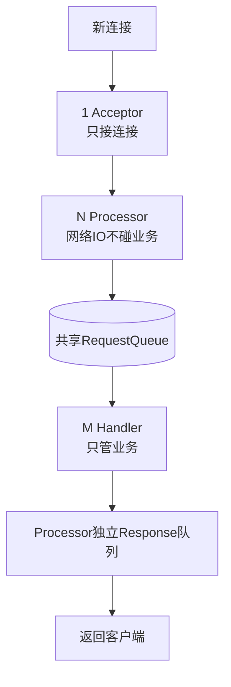

# Kafka Broker 网络通信模型

### Kafka Broker 网络通信模型

Kafka 为了实现高吞吐、低延迟的消息处理，设计了基于 **Acceptor + Processor + RequestHandler** 的多层网络架构。该架构充分利用了多线程和队列解耦的优势。

#### 1. 整体架构概览

Kafka 的网络层由三个主要部分组成：
1. **Acceptor（Main Reactor）**：1 个线程，处理新连接。
2. **Processor（Sub Reactor / Network Thread）**：N 个线程，处理网络读写。
3. **HandlerPool（IO Thread）**：M 个线程，处理业务逻辑。

#### 2. 详细工作流程与组件

##### 1. Acceptor 线程
- **数量**：每个 Listener 端口对应 1 个线程（通常 Broker 只有一个监听端口）。
- **职责**：
  - 调用 Java NIO `ServerSocketChannel.accept()` 接收客户端连接。
  - 轮询方式（Round-Robin）将接收到的 `SocketChannel` 分配给一个 Processor 线程。
- **关键点**：Acceptor 纯粹做连接分发，不涉及数据读取，极其轻量。

##### 2. Processor 线程
- **数量**：由 `num.network.threads` 配置，默认 3。可根据负载动态调整。
- **职责**：
  - **读**：从 Acceptor 获取连接，注册 OP_READ 事件。当数据可读时，读取字节流，解析成 `RequestChannel.Request` 对象，放入 **共享请求队列**。
  - **写**：处理完业务后，IO 线程会将 Response 放入 Processor 自身的 **响应队列**，Processor 监听到可写事件时，将数据回写给客户端。
- **优化**：每个 Processor 维护独立的连接列表和响应队列，避免锁竞争。

##### 3. KafkaRequestHandler (IO 线程池)
- **数量**：由 `num.io.threads` 配置，默认 8。
- **职责**：
  - 从 **共享请求队列** (`RequestChannel`) 中取出 Request。
  - 执行业务逻辑：如解析消息、写入磁盘日志、从磁盘读取数据、构建响应等。
  - 将处理好的 Response 放入 Request 携带的 Processor 的响应队列中。

#### 3. 完整数据流转架构图

```text
   Clients                Acceptor               Processors (N)             Handlers (M)
     |                        |                        |                         |
     | 1. Connect             |                        |                         |
     +----------------------->|                        |                         |
     |                        | 2. Assign (RoundRobin) |                         |
     |                        +----------------------->|                         |
     |                        |                        |                         |
     | 3. Send Data           |                        | 4. Read & Parse         |
     +---------------------------------------------->|                         |
     |                        |                        |                         |
```

#### 4. 实战深化

##### 实战案例：连接数突增导致的 CPU 飙升排查
某次双11大促，监控发现 Broker CPU 飙升至 100% 且网络吞吐量骤降。排查发现是大量客户端瞬时重连，导致 Acceptor 线程在处理 `accept()` 和分配 Processor 时频繁竞争锁。**解决方案**：调整 `num.network.threads` 增加Processor线程数以分摊连接压力，并客户端侧优化重连退避策略。

##### 关键代码
```scala
// SocketServer.scala (Acceptor 核心逻辑简化)
def run() {
  val serverChannel = ServerSocketChannel.open()
  serverChannel.configureBlocking(false)
  serverChannel.register(selector, SelectionKey.OP_ACCEPT)
  while (isRunning) {
    val ready = selector.select(500) // 非阻塞等待
    if (ready > 0) {
      val keys = selector.selectedKeys()
      val iter = keys.iterator()
      while (iter.hasNext) {
        val key = iter.next()
        if (key.isAcceptable) {
          val channel = serverChannel.accept()
          // 轮询分配给 Processor
          processors(currentProcessorIndex.getAndIncrement % processors.length).accept(channel)
        }
        iter.remove()
      }
    }
  }
}
```

##### 组件职责对比表

| 组件 | 角色 | 线程模型 | 核心职责 | 阻塞风险点 |
| :--- | :--- | :--- | :--- | :--- |
| **Acceptor** | Main Reactor | 单线程 | 接收连接、TCP握手 | 极低(纯CPU/内存操作) |
| **Processor** | Sub Reactor | 多线程 (默认3) | 读写解析、序列化 | 网络IO、Selector轮询 |
| **HandlerPool** | Worker Pool | 多线程 (默认8) | 磁盘读写、业务逻辑 | 磁盘IO、PageCache锁 |




## 记忆要点

- 三层架构：1个Acceptor建连 -> N个Processor网络读写(num.network.threads) -> M个Handler处理业务(num.io.threads)
- 分工边界：Acceptor只接连接不读写，Processor只做网络IO不碰业务，Handler只管业务
- 队列解耦：Handler从共享RequestQueue取请求，处理后放入Processor独立ResponseQueue
- 优化要点：每个Processor拥有独立响应队列，避免多线程共享锁竞争

## 结构化回答

**30 秒电梯演讲：** Acceptor接收连接，Processor读写IO，IO线程池处理业务。打个比方，门卫（Acceptor）指引客人到窗口（Processor），窗口员记录需求后，交给后台（IO线程）办理。

**展开框架：**
1. **三层架构** — 1个Acceptor建连 -> N个Processor网络读写(num.network.threads) -> M个Handler处理业务(num.io.threads)
2. **分工边界** — Acceptor只接连接不读写，Processor只做网络IO不碰业务，Handler只管业务
3. **队列解耦** — Handler从共享RequestQueue取请求，处理后放入Processor独立ResponseQueue

**收尾：** 我在项目里踩过坑——实战案例：连接数突增导致的 CPU 飙升排查。您想深入聊哪一段：原理、避坑还是对比选型？

## 视频脚本

> 预计时长：2 分钟 | 由浅入深

| 时间 | 画面/字幕 | 口播台词 | 讲解要点 |
|------|----------|----------|----------|
| 0:00 | 标题卡：Kafka Broker 网络通信模… | "Kafka Broker 网络通信模型？一句话——门卫（Acceptor）指引客人到窗口（Processor），窗口员记录需求后，交给后台（IO线程）办理。" | 开场钩子 |
| 0:40 | 概念动画/示意图 | "Acceptor接收连接，Processor读写IO，IO线程池处理业务——门卫（Acceptor）指引客人到窗口（Processor），窗口员记录需求后，交给后台（IO线程）办理" | 核心定义 |
| 1:20 | 三层架构示意 | "1个Acceptor建连 -> N个Processor网络读写(num.network.threads) -> M个Handler处理业务(num.io.t…" | 要点1 |
| 2:00 | 总结卡 | "记住这几条，面试不慌。下期讲进阶追问。" | 收尾 |
