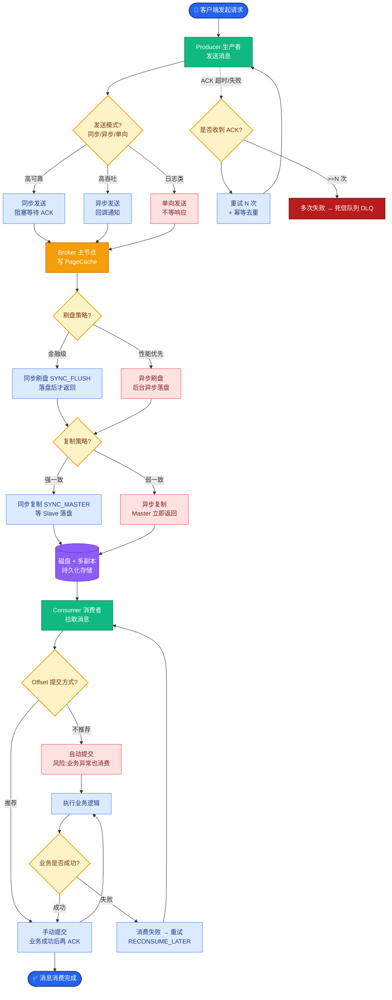
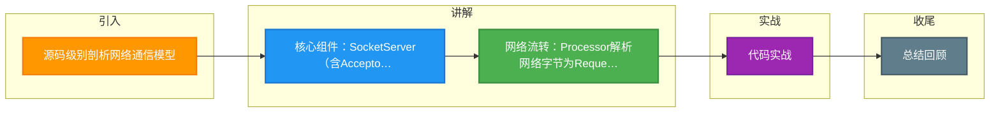

# 源码级别剖析网络通信模型

### 源码级别剖析网络通信模型

Kafka 网络通信组件主要由两大部分构成：SocketServer 和 KafkaRequestHandlerPool。整个架构采用经典的 Reactor 多线程模式，将 accept、IO 读/写、业务逻辑处理分离。

## 1. 核心组件架构

### SocketServer
SocketServer 是网络通信的核心，内部管理了 Acceptor 线程、Processor 线程和 RequestChannel。

#### Acceptor (接收器)
- **职责**：传统的 1-N Reactor 模式中的 Main Reactor。只负责监听 ServerSocketChannel，处理客户端连接建立。
- **实现原理**：维护一个 Java NIO Selector。循环处理 SelectionKey.OP_ACCEPT 事件。
- **关键流程**：
  1. `serverSocketChannel.accept()` 获取 SocketChannel。
  2. 配置 Socket 参数（如 TCP NoDelay, SendBufferSize）。
  3. **轮询分配**：将 SocketChannel 分配给一个 Processor 线程。为了负载均衡，这里采用简单的 Round-Robin 轮询策略。

#### Processor (处理器)
- **职责**：Sub Reactor。负责已连接 Socket 的读写 IO 操作。
- **核心机制**：
  - 每个 Processor 拥有独立的 Selector 和 IO 队列。
  - **请求流程**：读取 Socket 字节流 -> 解析成 `RequestChannel.Request` -> 放入 `RequestChannel` 的全局请求队列。
  - **响应流程**：从 `RequestChannel` 的响应队列获取 `RequestChannel.Response` -> 序列化字节流 -> 写回 Socket。
- **优化细节**：
  - **Connection Quotas**：连接数配额管理。
  - **Flow Control**：基于内存缓冲区的流量控制（当网络发送缓冲区满时进行限流）。

#### RequestChannel (请求通道)
- **职责**：连接 IO 线程和业务处理线程的缓冲区/中转站。
- **核心数据结构**：
  - `requestQueue`：阻塞队列，存放 Processor 解析好的请求。
  - `responseQueues`：数组，每个 Processor 对应一个响应队列，避免锁竞争。

### KafkaRequestHandlerPool (业务线程池)
- **职责**：实际处理业务逻辑的线程池。
- **工作流程**：
  1. 若干个 KafkaRequestHandler 线程死循环从 `RequestChannel.requestQueue` 获取 Request。
  2. 调用 `KafkaApis.handle()` 进行业务逻辑处理（如生产、拉取、元数据更新）。
  3. 处理完成后生成 Response，放入对应 Processor 的 `responseQueue`。

## 2. 通信流程架构图

```text
客户端          Broker (SocketServer + HandlerPool)
  │                 │
  │  1. Connect     │
  ├────────────────>│
  │                 │     ┌──────────────┐
  │                 │     │  Acceptor    │ (Main Reactor)
  │                 │     └──────┬───────┘
  │                 │            │ 轮询分配
  │                 │            ▼
  │                 │     ┌──────────────┐
  │  2. Send Req    │────>│  Processor N │ (Sub Reactor IO)
  ├────────────────>│     └──────┬───────┘
  │                 │            │ 解析
  │                 │            ▼
  │           
```

#### 3. 实战深化

##### 实战案例：RequestChannel OOM 导致的假死
在高并发压测场景下，Broker 进程存活但无响应。Dump 内存分析发现 `RequestChannel.requestQueue` 占用堆内存过大。原因在于**IO 处理线程池满**，导致网络解析出的请求在队列中堆积，最终引发 Full GC (Stop-The-World)，进一步加剧处理延迟。**优化**：合理调整 `queued.max.requests` 参数，并在监控中增加队列长度告警。

##### 关键代码
```scala
// Processor.scala (接收请求并存入队列的核心逻辑)
private def receiveRequest(): Unit = {
  val request = channel.readRequest() // 从网络读取字节并反序列化
  if (request != null) {
    // 将解析好的 Request 放入 RequestChannel 的全局队列
    // 注意：这里可能因为 Handler 消费不及而阻塞
    requestChannel.sendRequest(request)
  }
}

// KafkaRequestHandler.scala (Handler 消费逻辑)
def run() {
  while (isRunning) {
    var req: RequestChannel.Request = null
    // 从队列阻塞获取请求
    req = requestChannel.receiveRequest(300) 
    if (req != null) {
      // 核心：调用 KafkaApis 处理业务
      apis.handle(req)
    }
  }
}
```

##### 线程模型与队列交互对比表

| 维度 | Acceptor 线程 | Processor 线程 | Handler 线程 |
| :--- | :--- | :--- | :--- |
| **输入源** | OS TCP 三次握手 | SocketChannel (NIO Selector) | `RequestChannel.requestQueue` (BlockingQueue) |
| **输出目标** | Processor 的 `newConnections` 队列 | `RequestChannel.requestQueue` (入队) / `responseQueues` (出队) | Processor 的 `responseQueue` |
| **阻塞策略** | 非阻塞轮询 | 非阻塞 IO (Selector) + 内存缓冲 | 阻塞获取请求 (可能限流) |
| **瓶颈体现** | CPU (accept 开销) | 网络带宽/内存拷贝 | 磁盘 IO / 锁竞争 (LogAppend) |


## 核心流程图



## 记忆要点

- 核心组件：SocketServer(含Acceptor与Processor) 与 KafkaRequestHandlerPool(IO线程池)
- 网络流转：Processor解析网络字节为Request，丢入共享RequestQueue供Handler消费
- 响应回写：Handler处理完生成Response，放入对应Processor的专属ResponseQueue
- 并发优化：响应队列按Processor隔离（一管一），避免多线程锁竞争
- 防积压配置：通过queued.max.requests限制请求队列长度，防止IO阻塞致OOM假死

## 结构化回答

**30 秒电梯演讲：** SocketServer负责网络层，HandlerPool负责逻辑层，通过RequestChannel解耦。打个比方，餐厅前台收单（SocketServer），传菜口递单（RequestChannel），后厨做菜（HandlerPool）。

**展开框架：**
1. **核心组件** — SocketServer(含Acceptor与Processor) 与 KafkaRequestHandlerPool(IO线程池)
2. **网络流转** — Processor解析网络字节为Request，丢入共享RequestQueue供Handler消费
3. **响应回写** — Handler处理完生成Response，放入对应Processor的专属ResponseQueue

**收尾：** 我在项目里踩过坑——实战案例：RequestChannel OOM 导致的假死。您想深入聊哪一段：原理、避坑还是对比选型？

## 视频脚本

> 预计时长：3 分钟 | 由浅入深

| 时间 | 画面/字幕 | 口播台词 | 讲解要点 |
|------|----------|----------|----------|
| 0:00 | 标题卡：源码级别剖析网络通信模型 | "源码级别剖析网络通信模型？一句话——餐厅前台收单（SocketServer），传菜口递单（RequestChannel），后厨做菜（HandlerPool）。" | 开场钩子 |
| 0:45 | 概念动画/示意图 | "SocketServer负责网络层，HandlerPool负责逻辑层，通过RequestChannel解耦——餐厅前台收单（SocketServer），传菜口递单（RequestChannel），后厨做菜（HandlerPool）" | 核心定义 |
| 1:30 | 核心组件示意 | "SocketServer(含Acceptor与Processor) 与 KafkaRequestHandlerPool(IO线程池)" | 要点1 |
| 2:15 | 网络流转示意 | "Processor解析网络字节为Request，丢入共享RequestQueue供Handler消费" | 要点2 |
| 3:00 | 总结卡 | "记住这几条，面试不慌。下期讲进阶追问。" | 收尾 |

### 视频流程图



