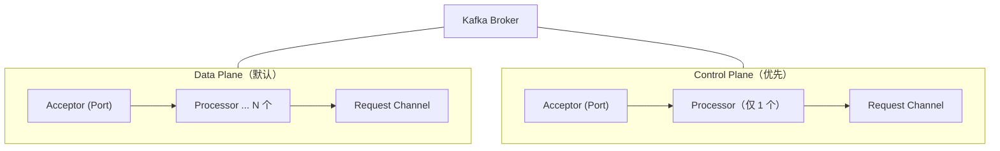

# 请求处理优先级

### 请求处理优先级

Kafka 将请求分为 **Data Plane（数据平面）** 和 **Control Plane（控制平面）**，本质上是为了解决高负载下控制类请求（如 Leader 选举、停止分区）被数据类请求（如 Produce/Fetch）饿死的问题。

## 1. 为什么需要区分优先级？

在 Kafka 早期，所有请求共享同一个网络线程池和处理队列。这会导致以下严重问题：

- **控制操作滞后**：例如执行“Preferred Leader 选举”时，Producer 正在大量发送数据。如果删除 Topic 或选举 Leader 的请求排在数百万个 Produce 请求之后，那么：
  - 资源浪费：Producer 向即将下线的旧 Leader 写入数据是无用功，因为最终会被丢弃或重放。
  - 状态不一致：Follower 可能已经选为新 Leader，但通知变更的 Control Request 被堵在路上，导致旧 Leader 仍在傻傻等待 Follower 的 ACK（当 request.required.acks=all 时），直至超时。

## 2. 解决方案：双监听器

社区并没有引入复杂的“优先级队列”算法（这会导致在锁竞争严重的单队列中进行排序，性能更差），而是采取了物理隔离的策略：**两套独立的 Acceptor 和 Processor 线程**。

- **Data Plane**：处理常规的数据读写。连接数多，流量大，延迟要求相对较低（毫秒级）。
- **Control Plane**：处理管控指令。连接数极少，但要求极高优先级。

### 架构对比图



#### 3. 实战深化

##### 实战案例：集群扩容时的元数据更新延迟
在数据洪峰期对集群进行 Rebalance（增加 Broker 分流），由于 Data Plane 队列积压，LeaderAndIsr 请求被延迟数秒。这导致部分 Producer 收到 `NotLeaderForPartitionException` 异常，引发业务层重试风暴。**解决方案**：启用 KIP-291，配置 `control.plane.listener.name` 确保管控指令走独立通道，并在客户端配置正确的监听器。

##### 关键代码
```properties
# server.properties 配置示例
# 普通数据端口，数量多
listeners=PLAINTEXT://broker1:9092,CONTROLLER://broker1:9093
listener.security.protocol.map=PLAINTEXT:PLAINTEXT,CONTROLLER:PLAINTEXT
control.plane.listener.name=CONTROLLER

num.network.threads=8  # 仅影响 Data Plane
# Control Plane 默认固定使用 1 个 Processor 线程，硬编码优先级
```

##### 请求处理优先级对比表

| 特性 | Data Plane (数据平面) | Control Plane (控制平面) |
| :--- | :--- | :--- |
| **监听端口** | `listeners` (默认 9092) | `control.plane.listener.name` (默认 9093) |
| **Processor 数量** | 由 `num.network.threads` 控制 (通常 3+) | **固定为 1** (避免多线程锁竞争，够用即可) |
| **请求类型** | Produce, Fetch, ListOffsets | LeaderAndIsr, StopReplica, UpdateMetadata |
| **队列隔离** | 独立的 RequestChannel | 独享的 RequestChannel (物理隔离) |
| **业务优先级** | 普通 | **极高** (可插队，不受数据流量影响) |


## 核心知识点图


## 记忆要点

- 核心目的：物理隔离，防止高负载下控制请求(如Leader选举)被数据请求饿死
- 双平面设计：Data Plane处理数据(多线程)，Control Plane处理管控(仅1线程)
- 隔离机制：不走优先级队列排序，而是配置独立监听器和专属线程通道
- 避坑指南：务必配置control.plane.listener.name，确保高并发下元数据变更秒级生效

## 结构化回答

**30 秒电梯演讲：** 通过物理隔离的监听端口和线程池确保控制请求优先于数据请求。打个比方，VIP通道（控制请求）和普通通道（数据请求）分开，VIP通道即使人多也比普通通道快。

**展开框架：**
1. **核心目的** — 物理隔离，防止高负载下控制请求(如Leader选举)被数据请求饿死
2. **双平面设计** — Data Plane处理数据(多线程)，Control Plane处理管控(仅1线程)
3. **隔离机制** — 不走优先级队列排序，而是配置独立监听器和专属线程通道

**收尾：** 我在项目里踩过坑——实战案例：集群扩容时的元数据更新延迟。您想深入聊哪一段：原理、避坑还是对比选型？

## 视频脚本

> 预计时长：2 分钟 | 由浅入深

| 时间 | 画面/字幕 | 口播台词 | 讲解要点 |
|------|----------|----------|----------|
| 0:00 | 标题卡：请求处理优先级 | "请求处理优先级？一句话——VIP通道（控制请求）和普通通道（数据请求）分开，VIP通道即使人多也比普通通道快。" | 开场钩子 |
| 0:40 | 概念动画/示意图 | "通过物理隔离的监听端口和线程池确保控制请求优先于数据请求——VIP通道（控制请求）和普通通道（数据请求）分开，VIP通道即使人多也比普通通道快" | 核心定义 |
| 1:20 | 核心目的示意 | "物理隔离，防止高负载下控制请求(如Leader选举)被数据请求饿死" | 要点1 |
| 2:00 | 总结卡 | "记住这几条，面试不慌。下期讲进阶追问。" | 收尾 |
