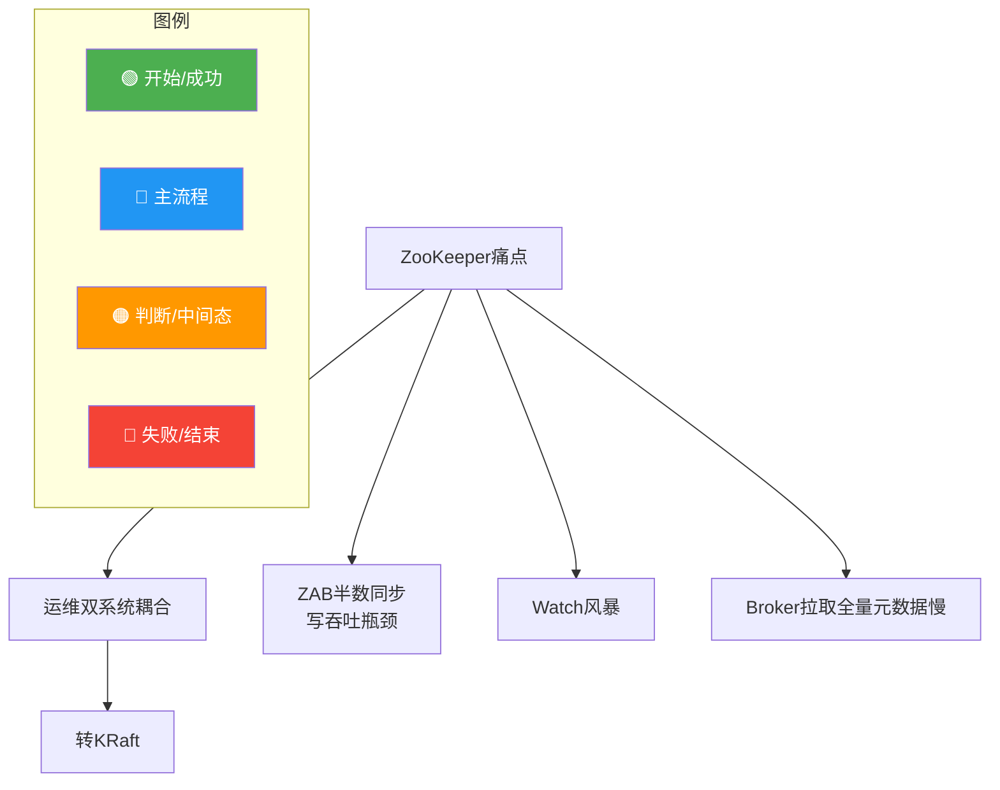
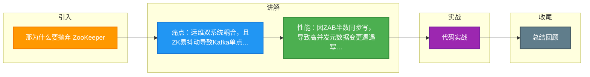

# 那为什么要抛弃 ZooKeeper

### 那为什么要抛弃 ZooKeeper

虽然 ZooKeeper 提供了强大的协调能力，但随着 Kafka 规模的扩大，这种强耦合架构逐渐暴露出运维成本高和性能瓶颈两大问题。

## 1. 运维复杂度

- **组件依赖冗余**：部署一个 Kafka 集群必须同时部署一个 ZK 集群。对于运维人员来说，这意味着需要同时监控、扩容、打补丁两套系统。
- **运维风险耦合**：ZK 集群如果不稳定（如 Full GC 导致 Session 超时），会直接导致 Kafka 集群 Controller 频繁选举，进而引发分区抖动，导致整个集群不可用。

## 2. 性能瓶颈

ZooKeeper 的设计初衷是“协调”而非“高吞吐存储”，其特性限制了 Kafka 的扩展性：

### A. 写入性能差（强一致性代价）
- **原理**：ZK 的写操作需要通过 ZAB 协议在集群间达成一致。Leader 必须等待超过半数节点（Follower）持久化日志成功后，才能向客户端返回“写成功”。
- **后果**：当 Kafka 集群非常大（如数万个分区）时，元数据变更（如创建 Topic、ISR 变动、Controller 重新计算分区分配）变得频繁，ZK 的写吞吐量无法跟上，导致元数据更新延迟。

### B. 无法支持大规模分区

在大规模场景下（例如百万级分区），ZK 存储的元数据量巨大：
- 每个 Partition 都有 ISR、AR、Leader 等状态。
- 每个 Broker 启动都需要从 ZK 拉取全量元数据。
- **Watch 风暴**：大量 Broker 对 ZK 节点注册 Watcher。当元数据变动时，ZK 需要向所有 Broker 推送通知，容易导致 ZK 网络带宽被打满或处理线程阻塞。

## 3. 具体痛点案例

- **Controller 成为瓶颈**：在旧架构中，Controller 是单点的，所有元数据变更请求（如 Leader Epoch 递增）都需要 Controller 同步写入 ZK。ZK 的延迟直接限制了 Controller 的处理吞吐。
- **频繁的 Session 超时**：在大流量或 Full GC 时，Broker 与 ZK 的心跳可能超时，导致 Broker 临时“假死”触发不必要的 Leader 选举，引发集群风暴。

#### 4. 实战深化

##### 实战案例：元数据变更导致的雪崩
在一次大规模 Topic 批扩容操作中，运维脚本瞬间向 ZK 提交了数万个元数据变更请求。ZK 写队列瞬间堵塞，导致 Broker 无法及时更新 ISR。此时恰好某个 Follower 宕机，Leader 无法将 Follower 移出 ISR（因为写 ZK 失败），导致 Produce 请求持续等待 `min.insync.replicas` 满足，最终阻塞了整个生产链路。**启示**：ZK 无法作为高频元数据变更的持久化层。

##### 关键代码
```java
// ZkPartitionStateStore.java (旧版元数据持久化逻辑)
public void updateLeaderAndIsr(...) {
  // 构造 ZNode 数据
  byte[] data = Json.encode(partitionState);
  // 同步写入 ZK，这里会阻塞直到 ZK Quorum 确认
  zkClient.setDataAndWatch(getTopicPartitionPath(), data, expectedVersion);
  // 如果 ZK 响应慢，Controller 线程在此阻塞，后续请求堆积
}
```

##### ZK 架构痛点 VS KRaft 优势对比表

| 痛点维度 | 基于 ZooKeeper 的痛点 | KRaft (移除 ZK 后的解决) |
| :--- | :--- | :--- |
| **元数据写入性能** | 受限于 ZK ZAB 协议，写 TPS < 5万 | 基于 Log 结构，写 TPS 达百万级 (复用 Kafka 机制) |
| **元数据分发** | Watcher 推送，容易触发“风暴” | 基于 Quorum Controller 的 RPC 推送 + Follower Fetch |
| **系统复杂度** | 两套系统 (ZK + Kafka) | 单一系统，部署难度降低 50%+ |
| **故障域隔离** | ZK 故障导致 Kafka 不可用 | Controller 故障仅需在 Kafka 内部重选 |
| **水平扩展** | ZK 写性能无法线性扩展 | Metadata Topic 支持增加分区 (虽当前仅用单分区) |
| **一致性保证** | 依赖外部系统，边界情况复杂 | 内部 Raft 协议，与 Log 存储一致性统一 |




## 记忆要点

- 痛点：运维双系统耦合，且ZK易抖动导致Kafka单点Controller频繁选举
- 性能：因ZAB半数同步写，导致高并发元数据变更遭遇写吞吐瓶颈
- 故障：大规模集群易发Watch风暴，且Broker拉取全量元数据太慢

## 结构化回答

**30 秒电梯演讲：** ZooKeeper运维复杂且写入性能瓶颈，不适合Kafka大规模场景。打个比方，买衣服被强制配鞋子（运维负担），且服务员动作慢（性能差）。

**展开框架：**
1. **痛点** — 运维双系统耦合，且ZK易抖动导致Kafka单点Controller频繁选举
2. **性能** — 因ZAB半数同步写，导致高并发元数据变更遭遇写吞吐瓶颈
3. **故障** — 大规模集群易发Watch风暴，且Broker拉取全量元数据太慢

**收尾：** 我在项目里踩过坑——// ZkPartitionStateStore.java (旧版元数据持久化逻辑)。您想深入聊哪一段：原理、避坑还是对比选型？

## 视频脚本

> 预计时长：2 分钟 | 由浅入深

| 时间 | 画面/字幕 | 口播台词 | 讲解要点 |
|------|----------|----------|----------|
| 0:00 | 标题卡：那为什么要抛弃 ZooKeeper | "那为什么要抛弃 ZooKeeper？一句话——买衣服被强制配鞋子（运维负担），且服务员动作慢（性能差）。" | 开场钩子 |
| 0:40 | 概念动画/示意图 | "ZooKeeper运维复杂且写入性能瓶颈，不适合Kafka大规模场景——买衣服被强制配鞋子（运维负担），且服务员动作慢（性能差）" | 核心定义 |
| 1:20 | 痛点示意 | "运维双系统耦合，且ZK易抖动导致Kafka单点Controller频繁选举" | 要点1 |
| 2:00 | 总结卡 | "记住这几条，面试不慌。下期讲进阶追问。" | 收尾 |

### 视频流程图



