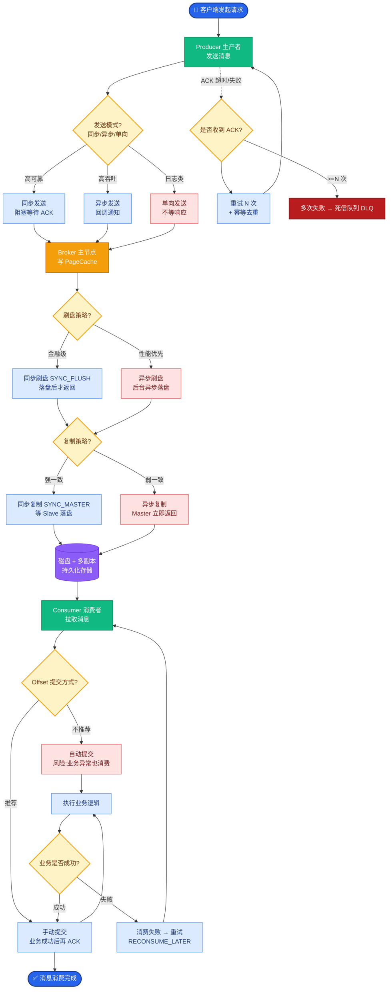

# 所以没了 Zookeeper 之后的 Kafka 的怎样的

为了摆脱 ZooKeeper 的束缚，Kafka 引入了 **KRaft (Kafka Raft)** 模式，实现了元数据的自我管理，不再依赖外部协调服务。

## 1. 架构变革：从外置 ZK 到内置 KRaft

在 KRaft 模式下，Kafka 集群的角色被重新定义：

- **Broker（传统角色）**：负责处理客户端的 Produce/Fetch 请求，存储数据日志。
- **Controller（新角色）**：不再是从 Broker 中选举出来的“打工人”，而是**元数据管理专用节点**。它运行在 Raft 共识算法上，管理集群元数据。

> 注意：在某些部署模式下，一个节点可以**同时**扮演 Broker 和 Controller 角色（称为 Active Controller），但元数据处理路径是解耦的。

## 2. 元数据存储：__cluster_metadata Topic

Kafka 没有重新发明一个新的存储引擎，而是复用了自己最擅长的高吞吐日志机制：

- **元数据日志化**：集群的所有元数据（Topic 分配、ACL、Leader Epoch、Broker 列表等）被封装成“消息”，写入一个内部 Topic，名为 `__cluster_metadata`。
- **复制机制**：这个 Topic 的副本分布在一组专门作为 Controller 的节点上。利用 Kafka 原有的 ISR 机制和日志复制机制，结合 Raft 算法，保证元数据的一致性和持久化。

### 架构对比图

```text
旧架构 (ZK Mode):
┌─────────────┐         ┌──────────────────────┐
│   Client    │         │      ZooKeeper       │
└──────┬──────┘         │  (外部元数据中心)     │
       │               └──────────┬───────────┘
       │                          │
       ▼                          ▼
┌─────────────┐   Watch/Write   ┌──────────────┐
│  Broker 1   │ <──────────────> │   Broker 2   │
└─────────────┘   (控制平面元数据) └──────────────┘

新架构 (KRaft Mode):
┌─────────────┐                 ┌──────────────┐
│   Client    │                 │ __cluster_   │
└──────┬──────┘                 │   metadata   │
       │                        │ (内部元数据)  │
       ▼                        └──────┬───────┘
┌─────────────┐                        │
│  Broker 1   │   Raft Quorum (Meta)   │
│  (Data)     │ <─────────────────────>│
└─────────────┘                        │
                                       │
                            ┌──────────┴───────────┐
                            │  Controller Quorum    │
                            │  (Broker 2 is part)   │
                            └───────────────────────┘
```

## 3. KRaft 的优势

1. **简化部署**：不再需要维护 ZK 集群，只需启动 Kafka 进程即可。
2. **性能提升**：
   - 元数据更新不再受 ZK 写吞吐限制。
   - Controller 成为集群的一部分，元数据更新在 Kafka 内部网络完成，延迟更低。
3. **支持百万分区**：由于元数据存储在可扩展的日志中，理论上支持的分区数大幅提升（去除了 ZK 的内存和 Watcher 限制）。

### 实战案例
在某次大促活动前的压测中，旧版 Kafka（ZK 模式）因 ZK 节点 Full GC 导致元数据操作卡顿，引发了集群 Controller 选举风暴，导致整个集群约 30s 无法提供服务。迁移至 KRaft 模式后，元数据管理路径完全内化，彻底消除了因外部依赖（ZK）抖动导致的全集群不可用风险。

### 核心配置示例
开启 KRaft 模式通常需要格式化存储目录并指定角色：

```bash
# 生成 cluster ID (第一次部署时)
kafka-storage.sh random-uuid

# 格式化存储目录 (Controller 角色或 Broekr+Controller 角色)
kafka-storage.sh format -t <uuid> -c /path/to/kafka/config/kraft/server.properties

# server.properties 关键配置
process.roles=broker,controller  # 节点角色
node.id=1                        # 节点唯一ID
controller.quorum.voters=1@localhost:9093,2@localhost:9094,5@localhost:9095
listeners=PLAINTEXT://:9092,CONTROLLER://:9093
```

### ZK 模式 vs KRaft 模式对比

| 特性 | ZooKeeper 模式 | KRaft 模式 |
| :--- | :--- | :--- |
| **元数据存储** | 外部 ZK 集群 (ZNode) | 内部 `__cluster_metadata` Topic |
| **组件数量** | Kafka + ZK (两套运维) | 仅 Kafka (统一运维) |
| **Controller 选举** | 依赖 ZK 临时节点 | 依赖内部 Raft 算法 |
| **故障恢复速度** | 慢 (需从 ZK 全量加载元数据) | 快 (Controller Quorum 已有元数据快照) |
| **分区数扩展性** | 受限于 ZK 内存与 Watcher 性能 | 理论上支持百万分区 |
| **部署复杂度** | 高 (需管理 ZK 集群网络与配置) | 低 (仅需配置 Quorum 列表) |


## 核心流程图



## 记忆要点

- 架构：引入KRaft模式，专用Controller节点取代外部ZK，实现元数据自治
- 存储：复用日志结构，将元数据作为消息写入内部Topic `__cluster_metadata`
- 优势：基于Raft算法，单系统部署更简，元数据推送改RPC，轻松支持百万分区

## 结构化回答

**30 秒电梯演讲：** Kafka利用KRaft模式和内部Log存储替代ZooKeeper管理元数据。打个比方，把外聘的管家（ZK）辞了，把账本（元数据）改成自家记账系统（Log）自己管。

**展开框架：**
1. **架构** — 引入KRaft模式，专用Controller节点取代外部ZK，实现元数据自治
2. **存储** — 复用日志结构，将元数据作为消息写入内部Topic `__cluster_metadata`
3. **优势** — 基于Raft算法，单系统部署更简，元数据推送改RPC，轻松支持百万分区

**收尾：** 我在项目里踩过坑——在某次大促活动前的压测中，旧版 Kafka（ZK 模式）因 ZK 节点 Full GC 导致元数据操作卡顿，引发了集群 Controller 选举风暴，导致整个集群约 30s 无法提供服务。您想深入聊哪一段：原理、避坑还是对比选型？

## 视频脚本

> 预计时长：2 分钟 | 由浅入深

| 时间 | 画面/字幕 | 口播台词 | 讲解要点 |
|------|----------|----------|----------|
| 0:00 | 标题卡：所以没了 Zookeeper 之后的… | "所以没了 Zookeeper 之后的 Kafka 的怎样的？一句话——把外聘的管家（ZK）辞了，把账本（元数据）改成自家记账系统（Log）自己管。" | 开场钩子 |
| 0:40 | 概念动画/示意图 | "Kafka利用KRaft模式和内部Log存储替代ZooKeeper管理元数据——把外聘的管家（ZK）辞了，把账本（元数据）改成自家记账系统（Log）自己管" | 核心定义 |
| 1:20 | 架构示意 | "引入KRaft模式，专用Controller节点取代外部ZK，实现元数据自治" | 要点1 |
| 2:00 | 总结卡 | "记住这几条，面试不慌。下期讲进阶追问。" | 收尾 |
